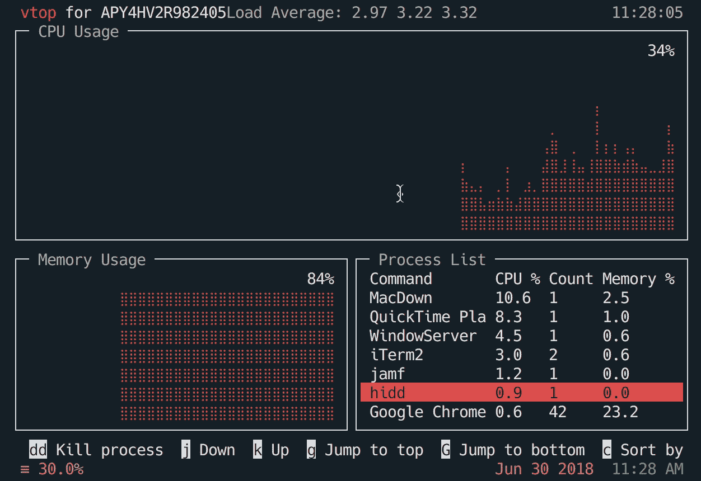
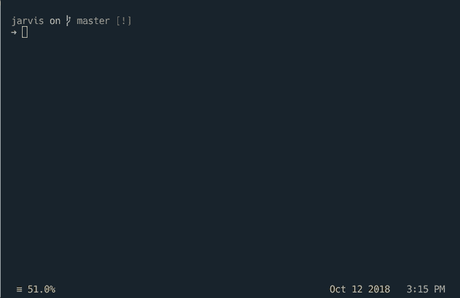
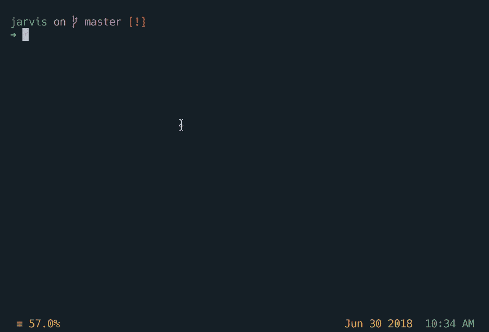
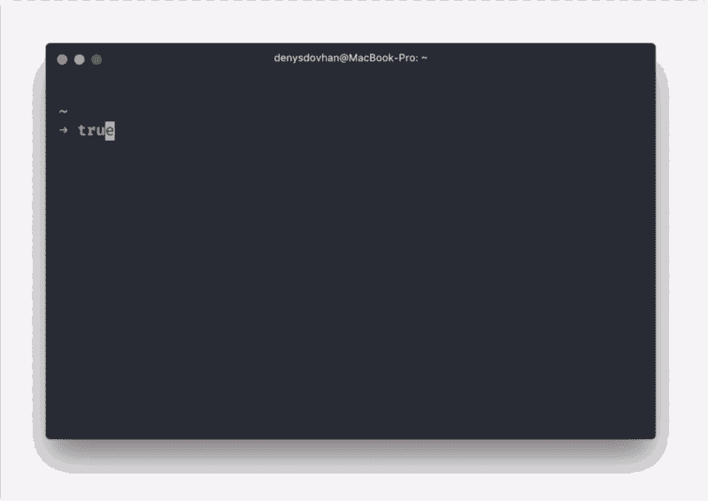
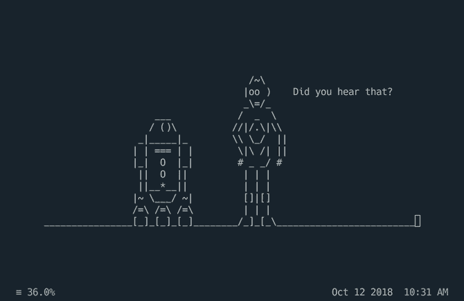
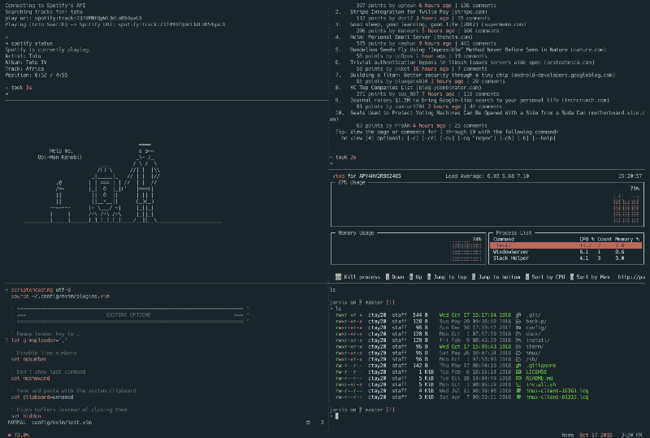

# 如何在终端中像黑客一样编码

> 原文：<https://www.freecodecamp.org/news/coding-like-a-hacker-in-the-terminal-79e22954968e/>

凯勒·泰勒

# 如何在终端中像黑客一样编码

你是黑客。你的家是终点站。你知道每一击都是有价值的。如果某件事不是 100%有效，你将花费数小时找出正确的工具来节省你的时间。因为总是值得的。


Source: [Pablo Stanley](https://www.pablostanley.com/) via [Twitter](https://twitter.com/pablostanley/status/963469081910296576)

你不断寻找更新更好的做事方法是否有损于实际做事？有些人可能会说是，但你会说不是。任何工作都不值得做，除非你能告诉你的同事为什么你能如此高效地完成它(不包括准备时间)。

以下是每个优秀黑客都应该了解的工具/特性列表。

> 这篇文章带有强烈的讽刺意味。这是对[“我，一个知识分子”迷因的扭曲。](https://knowyourmeme.com/memes/me-an-intellectual)虽然这些建议是真诚的(而且绝不完整)，但提到成为“黑客”只是为了好玩。

### **壳牌(zsh)**

> **普通开发者**:壳就是壳。我用哪一个并不重要。反正都很烂。

> **你，一个黑客**:外壳是我工作的命脉。我对效率和功能的热情是无限的。我的外壳必须配得上真正的黑客。

你生活在终端，这就是为什么你要使用一个伟大的外壳。这就是你用 [zsh](http://www.zsh.org/) 的原因。

它具有一系列功能:

*   自动更正拼错的命令
*   bash 的简易替代产品
*   使用`<t` ab >更好的`cd`完井
*   路径扩展:`cd /u/c/c/j` + `<t` ab `> =cd /user/caleb/code/`贾维斯
*   [多得多](http://zsh.sourceforge.net/Doc/Release/zsh_toc.html)

它还提供了一个很好的框架来管理您的 zsh 配置:[哦，我的 Zsh](https://github.com/robbyrussell/oh-my-zsh) 。它包括 200 多个插件和 140 多个主题，为你的终端添加各种令人敬畏的功能。一个小样本:

*   git 的大量别名和有用的函数
*   t [mux](https://github.com/robbyrussell/oh-my-zsh/blob/master/plugins/tmux/tmux.plugin.zsh) -集成 zsh 和 tmux 的别名和设置
*   [节点](https://github.com/robbyrussell/oh-my-zsh/tree/master/plugins/node) -增加`node-docs`打开网站文档的命令
*   osx -与 osx 一起工作的几个工具
*   [网络搜索](https://github.com/robbyrussell/oh-my-zsh/tree/master/plugins/web-search) -从命令行初始化网络搜索
*   [自动建议](https://github.com/zsh-users/zsh-autosuggestions) -根据历史记录，在您键入时提供快速、不唐突的建议

你可以在这里找到插件的完整列表。

### 会话管理( [tmux](https://github.com/tmux/tmux) )

> 普通开发人员:好的，我已经打开了 lame_project_1 的文件。但是我也需要在 boring_project_2 里面做工作。我还需要 ssh 到一个服务器并查看日志。我想我会在我的终端上制造一个巨大的混乱，多个项目的文件/标签以某种方式打开，我最终会失去控制，被迫关闭并重新开始。

> 你，一个黑客:我同时在做几个项目，所以我需要一个工具来帮助我保持有序。它应该跨多个平台工作，并允许我创建有组织的工作空间，并具有许多其他有助于提高生产力的功能。

你知道开发会变得混乱。有时候，你必须同时做几个项目。这就是为什么你要用 [tmux](https://github.com/tmux/tmux) 的原因。

它允许您创建会话。每个会话都可以定制为您需要的精确布局。您可以命名会话以便于切换，甚至可以在终端关闭时保存和恢复会话。此外，它有自己的可定制的状态行，允许您显示时间、日期、CPU 使用率等信息。如果你不知道在任何给定的时刻你的 CPU 使用率，你甚至是一个黑客吗？



Organize your terminal with sessions and use fzf for fuzzy create/finding/deleting of sessions

它甚至有一个[插件管理器](https://github.com/tmux-plugins/tpm)和一系列[令人敬畏的插件&功能](https://github.com/rothgar/awesome-tmux)，将把你的黑客技术带到一个新的水平。

**超级职业黑客提示:**
通过一些[牛逼脚本](https://github.com/junegunn/fzf/wiki/examples#tmux)使用 tmux 配合 fzf 快速创建/删除/导航将你的黑客水平推至 9000 以上。

### Search (ripgrep)

> 普通开发人员:我在哪里定义了这个常数？我知道它在这里的某个地方。我会努力争取的。论点又是什么？让我谷歌一下。糟糕，现在它正在搜索我的 node_modules 文件夹。这是最糟糕的。

> **你，一个黑客**:当我搜索一个东西的时候，它应该是速度极快的。此外，它应该使用合理的默认设置，比如忽略二进制文件或隐藏文件。

您知道搜索项目是一项常见的任务。要快，不要浪费你的时间。这意味着忽略你的`.gitignore`文件忽略的任何东西，跳过二进制文件和隐藏文件。这就是为什么你使用 [ripgrep](https://github.com/BurntSushi/ripgrep) 。就像打了类固醇的 grep。



ripgrep in action

用它的创造者 : *的话来说:“如果你喜欢速度，默认过滤，更少的错误和 Unicode 支持，就使用 ripgrep。”*

### 模糊发现( [fzf](https://github.com/junegunn/fzf) )

> 普通开发人员:记住我的项目中这么多文件的确切位置肯定很难。我想我会到处跌跌撞撞，直到我找到合适的。

> 你，一个黑客:我应该可以模糊查找文件。我可以键入文件名，或部分路径，或全部路径，并快速找到我要找的文件。

你知道你不应该打字超过你需要的。所以您使用了 [fzf](https://github.com/junegunn/fzf) ，一个通用的命令行模糊查找器。它还可以做比模糊查找文件更多的事情。它可以用于任何列表:“文件、命令历史、进程、主机名、书签、git 提交等”。

**超级专业黑客提示:**你知道别名是利用 fzf 特性的捷径。例如，如果您想模糊查找一个文件，然后在您的默认编辑器中打开选择，您可以将它添加到您的`zsh`配置中:



Now you can run “fo” fuzzy-find and open a file

更多的例子可以在 fzf wiki 上找到。

### 终端提示([飞船](https://github.com/denysdovhan/spaceship-prompt)

> **普通开发者**:谁在乎我的终端提示是什么样子？它不可能给我任何有用的信息。我就让它默认吧。

> **你这个黑客**:我希望我的提示很惊艳。它应该是上下文感知的。它应该给我有用的信息，是可配置的。还有，如果是和太空有关的就很甜了。



Welcome to the future… but actually the present. Hackers/astronauts only.

你知道提示应该简单明了，只提供相关信息。当人们看到它的美丽时，他们也应该感到震惊。这就是为什么你使用[飞船提示](https://github.com/denysdovhan/spaceship-prompt)。它提供了 git/mercurial 集成、电池电量指示器、巧妙的主机名和用户数据、各种库的版本号、华丽的图标等等。

### 更改目录( [z](https://github.com/rupa/z) )

> 普通开发人员:我需要将我的目录更改为我的“黑客”项目，它在我的 cool 文件夹中，在我的个人文件夹中，在我的代码文件夹中，在我的主目录中。

```
cd ~/code/personal/cool/hacker
```

> **你，一个黑客:**我需要把我的目录换成我的“黑客”项目。

```
z hacker
```

键入完整的文件路径是一般开发人员都会做的事情。你是黑客。你靠 [z](https://github.com/rupa/z) 。一旦安装，它将开始学习哪些目录你访问。然后，您可以给它一个正则表达式(或简单的文件夹名)来跳转到最可能的候选项。

### 额外的黑客工具

以下工具是真正提升你的黑客游戏的额外方法。

1.  查看天气只有一种正确的方法。


2.星球大战——酷的人喜欢星球大战。黑客在终端里看。

```
telnet towel.blinkenlights.nl
```



Pro Tip: Watch star wars in another tmux pane while working. No one will question you.

3. [haxor-news](https://github.com/donnemartin/haxor-news) -不看[黑客新闻](https://news.ycombinator.com/)你就算黑客吗？


4.Spotify——使用 shpotify，你可以从终端播放音乐(仅限 OSX……嘿，别起哄了！把椅子放下！谁扔的西红柿！？)，或者是跨平台的 [mopidy](https://www.mopidy.com/) 。


God bless the commands in the terminal

差不多结束了。这绝不是一个全面的列表。你还有其他什么神奇的黑客工具吗？留下评论让我知道。

如果你有兴趣看到更多这些工具的运行，请查看我用于开发的[点文件](https://github.com/ctaylo21/jarvis)。作为奖励，这里有一个运行中的光荣终端的截图:

