# 机器学习:均方差和回归线介绍

> 原文：<https://www.freecodecamp.org/news/machine-learning-mean-squared-error-regression-line-c7dde9a26b93/>

摩西·比涅利

# 机器学习:均方差和回归线介绍

Introduction image

### **简介**

本文将讨论统计方法**均方误差**，我将描述该方法与**回归线**的关系。

该示例由笛卡尔轴上的点组成。我们将定义一个数学函数，它将给出一条在笛卡儿轴上所有点之间通过最好的直线。

通过这种方式，我们将了解这两种方法之间的联系，以及它们联系在一起的结果是怎样的。

### 一般解释

这是来自维基百科的定义:

> 在统计学中，估计量的均方误差(MSE)衡量误差平方的平均值，即估计值和估计值之间的平均平方差。MSE 是一个风险函数，对应于平方误差损失的期望值。MSE 几乎总是严格为正(且不为零)的事实是因为随机性或者因为估计器没有考虑可以产生更精确估计的信息。

### 文章的结构

*   感受一下这个想法，图形可视化，均方差方程。
*   数学部分，包含代数运算和二元函数的导数，用于求最小值。这一节是**给那些想了解**我们后来如何得到数学公式的人的，如果你对此不感兴趣，你可以跳过。
*   解释我们收到的数学公式以及公式中每个变量的作用。
*   例子

### 感受一下这个想法

假设我们有七个点，我们的目标是找到一条线，使**最小化**到这些不同点的距离的平方。

让我们试着理解这一点。

我举一个例子，在这两点之间画一条线。当然，我的画不是最好的，但它只是为了演示的目的。

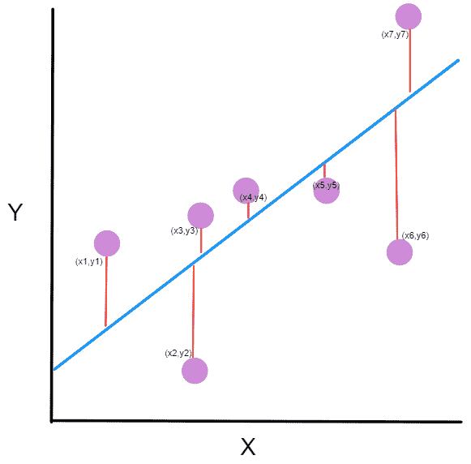

Points on a simple graph.

你可能会问自己，这个图是什么？

*   紫色的点是图表上的点。每个点都有一个 x 坐标和一个 y 坐标。
*   蓝色的线是我们的预测线。这是一条穿过所有点并以最佳方式拟合它们的线。这条线包含预测的点。
*   每个紫色点和预测线之间的**红线**是**误差。**每个误差都是该点到其预测点的距离。

你应该还记得学生时代的这个方程， ***y=Mx+B*** ，其中 **M** 是直线的[斜率](https://en.wikipedia.org/wiki/Slope)，而 **B** 是直线的 [y 截距](https://en.wikipedia.org/wiki/Y-intercept)。

我们想找到 M ( [斜率](https://en.wikipedia.org/wiki/Slope)和 B ( [y 截距](https://en.wikipedia.org/wiki/Y-intercept))使得**最小化**平方误差！

让我们定义一个数学方程，它将给出我们所有点的均方误差。

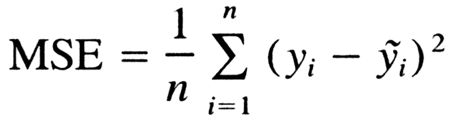

General formula for mean squared error.

我们来分析一下这个等式实际上是什么意思。

*   在数学中，看起来像怪异 E 的字符被称为求和(希腊文 sigma)。它是一系列数字的总和，从 i=1 到 n。让我们把它想象成一个点的数组，我们遍历所有的点，从第一个(i=1)到最后一个(i=n)。
*   对于每个点，我们取该点的 y 坐标和 y '-坐标。y 坐标是我们的紫点。y 点位于我们创建的线上。我们从 y '坐标值中减去 y 坐标值，并计算结果的平方。
*   第三部分是取所有(y-y’)值之和，除以 n，得出平均值。

我们的目标是最小化这个平均值，这将为我们提供通过所有点的最佳直线。

### 从概念到数学方程式

这部分是给那些想了解我们如何得到数学方程式的人的。如果你愿意，可以跳到下一部分。

大家知道，直线方程是 y=mx+b，其中 m 是[斜率](https://en.wikipedia.org/wiki/Slope)，b 是 [y 截距](https://en.wikipedia.org/wiki/Y-intercept)。

让我们取图上的每一点，然后我们来计算(y-y’)。但是什么是 y '，我们如何计算它？我们没有把它作为数据的一部分。

但是我们知道，为了计算 y '，我们需要使用我们的线方程，y=mx+b，并把 x 放入方程中。

从这里我们得到下面的等式:

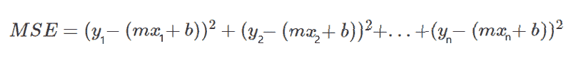

让我们重写这个表达式来简化它。

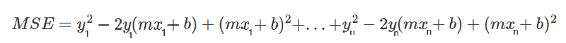

让我们从打开等式中的所有括号开始。为了更容易理解，我把等式之间的区别涂上了颜色。

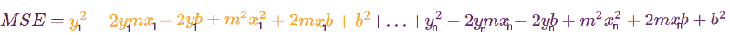

现在，让我们应用另一个操作。我们将把每一部分组装起来。我们将所有的 y，和(-2ymx)等，我们将把它们并排。

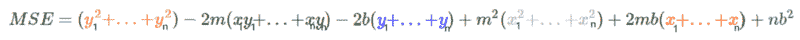

在这一点上我们开始变得混乱，所以让我们取 y，xy，x，x 所有平方值的平均值。

让我们为每一个定义一个新的字符，它将代表所有平方值的平均值。

我们来看一个例子，我们取所有的 y 值，由于是均值，所以用 n 除，称之为 y(HeadLine)。

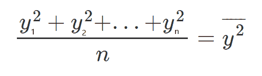

如果我们将等式两边都乘以 n，我们得到:

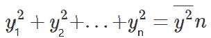

这将引导我们得出下面的等式:

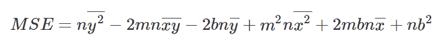

如果我们看看我们得到了什么，我们可以看到我们有一个三维表面。它看起来像一个玻璃杯，向上急剧上升。

我们想找到使函数最小的 M 和 B。我们将对 M 做偏导数，对 b 做偏导数。

因为我们在寻找一个极小点，我们将取偏导数并与 0 比较。

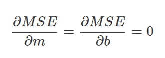

Partial derivatives formula

Partial derivatives

让我们把收到的两个方程，从两个方程中分离出变量 b，然后从下面的方程中减去上面的方程。

Different writing of the equations after the derivation by parts

让我们从第二个方程中减去第一个方程

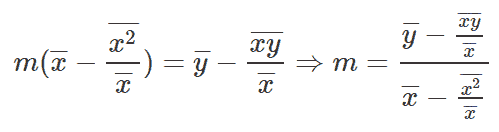

Merge two equations together

让我们从等式中去掉分母。

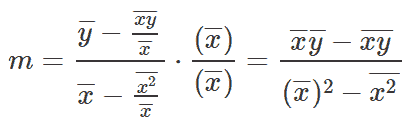

Final equation to find M.

好了，这是求 M 的方程，让我们用这个写下 B 方程。

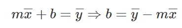

Final equation to find B.

### 斜率和 y 轴截距的公式

让我们提供数学方程式，帮助我们找到所需的[斜率](https://en.wikipedia.org/wiki/Slope)和 [y 轴截距](https://en.wikipedia.org/wiki/Y-intercept)。

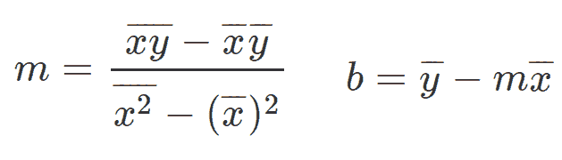

Slope and y-intercept equations

所以你可能会想，这些奇怪的方程式到底是什么？

它们实际上很容易理解，所以我们来简单介绍一下。

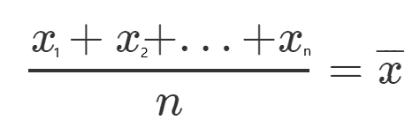

Sum of x divided by n

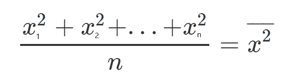

Sum of x² divided by n

Sum of xy divided by n

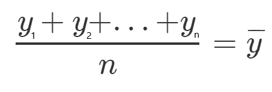

Sum of y divided by n

既然我们已经理解了我们的方程，现在是时候把所有的东西放在一起，展示一些例子了。

### 例子

非常感谢[汗学院](https://www.khanacademy.org/)提供的例子。

#### 示例#1

我们取 3 分，(1，2)，(2，1)，(4，3)。

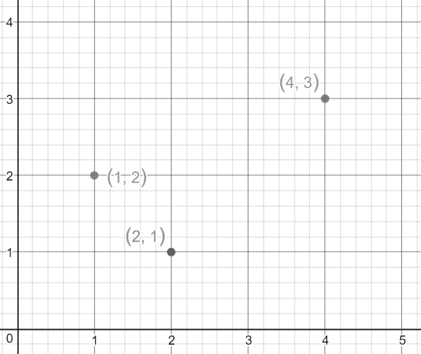

Points on graph.

让我们找出方程 y=mx+b 的 M 和 B。

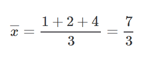

Sum the x values and divide by n

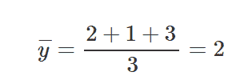

Sum the y values and divide by n

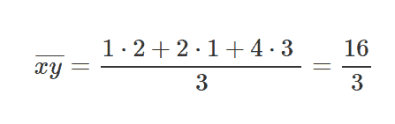

Sum the xy values and divide by n

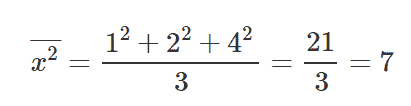

Sum the x² values and divide by n

在我们计算完 M 方程和 B 方程的相关部分后，让我们将这些值放入方程中，得到[斜率](https://en.wikipedia.org/wiki/Slope)和 [y 截距](https://en.wikipedia.org/wiki/Y-intercept)。

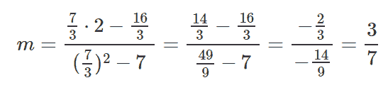

Slope calculation

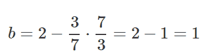

y-intercept calculation

让我们把这些结果放在线方程 y=mx+b 中。

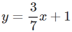

现在让我们画一条线，看看这条线是如何穿过这些线的，使得距离的平方最小。

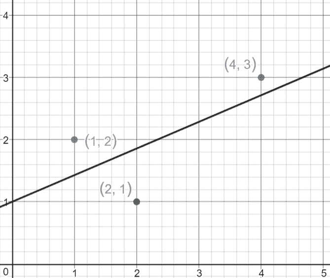

Regression line that minimizes the MSE.

#### 实施例 2

我们取 4 点，(-2，-3)，(-1，-1)，(1，2)，(4，3)。

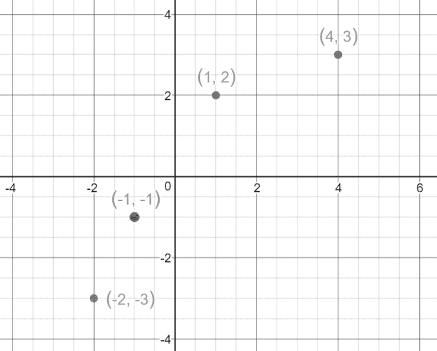

Points on graph.

让我们找出方程 y=mx+b 的 M 和 B。

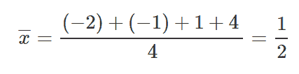

Sum the x values and divide by n

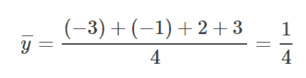

Sum the y values and divide by n

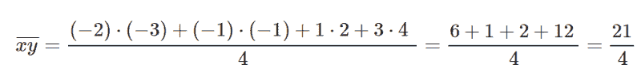

Sum the xy values and divide by n

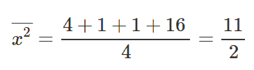

Sum the x² values and divide by n

和以前一样，让我们把这些值放入我们的方程中，找到 M 和 b。

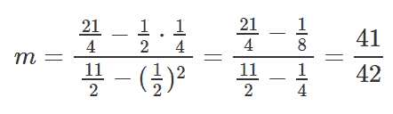

Slope calculation

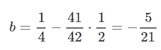

y-intercept calculation

让我们把这些结果放入方程 y=mx+b。

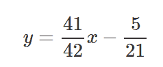

现在让我们画一条线，看看这条线是如何穿过这些线的，使得距离的平方最小。

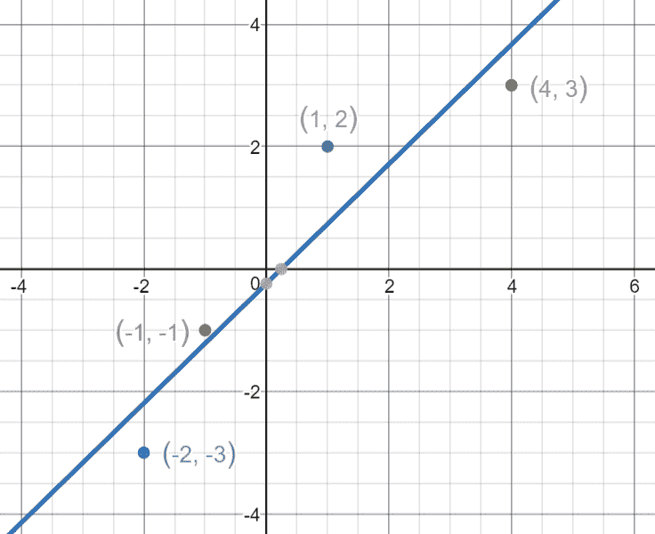

Regression line that minimizes the MSE

### 最后

如你所见，整个想法很简单。我们只需要了解主要部分以及如何使用它们。

您可以使用公式在另一个图形上找到直线，并执行简单的计算，得到[斜率](https://en.wikipedia.org/wiki/Slope)和 [y 轴截距](https://en.wikipedia.org/wiki/Y-intercept)的结果。

就这样，简单吗？？

欢迎所有评论和反馈——如果有必要，我会修改文章。

欢迎直接在 LinkedIn 上联系我— [点击这里](http://www.linkedin.com/in/moshe-binieli-22b11a137)。