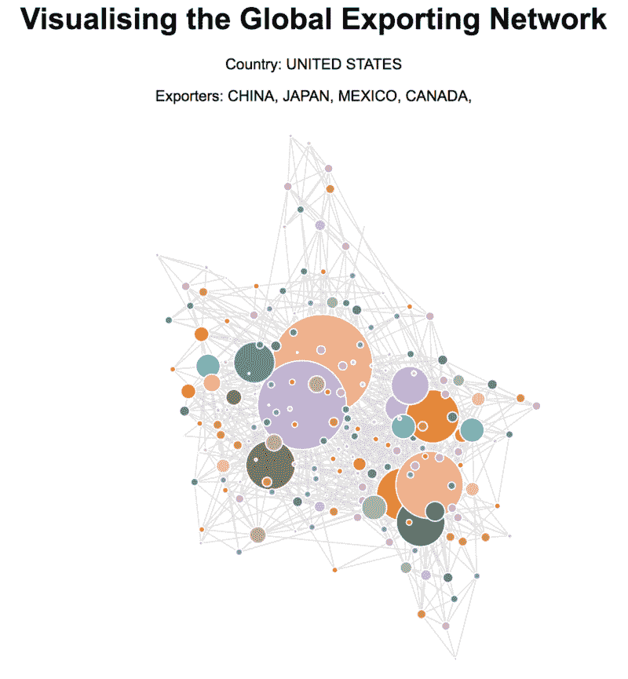

# 如何使用 NetworkX 和 D3 可视化全球出口网络

> 原文：<https://www.freecodecamp.org/news/how-to-visualise-the-global-exporting-network-using-networkx-and-d3-b85abee95ee2/>

帕特里克·费里斯

# 如何使用 NetworkX 和 D3 可视化全球出口网络

数据驱动文档(D3)是一个 JavaScript 库，用于构建强大的图形来交流数据集中的信息。公平地说，对于包括我在内的许多人来说，它有一个非标准的方法来构建图形。学习曲线通常会让人感觉很陡。

在这篇文章中，我们将看看如何使用 NetworkX——一个用于探索图形结构的 Python 库——来为我们做一些初始的数据处理。然后我们将使用 D3 在 JavaScript 中添加艺术点睛之笔。完整的代码可以在我的 [GitHub](https://github.com/patricoferris/blog-posts/tree/master/Exporting_Dependencies) 上找到，互动版本可以在[这里](https://bl.ocks.org/patricoferris/bd646b1122b087cc3ec61de0690625b8/104d0bbfd541851d99d0babdbc0a6f35a6f5a20f)找到。

### 数据

我记得当我第一次被介绍给《中情局世界概况》时，我很喜欢它。它拥有世界上所有国家的信息宝库。它只是尖叫着让数据可视化。最重要的是，它已经在 [GitHub](https://github.com/factbook) 上被转换成不同的格式，并且——对我们来说最重要的是——被转换成 JSON 格式。

数据是每个国家使用两个字符的 ISO 编码给出的。我们需要每个国家所在的洲来获取数据。首先，我们将创建字典:

当我们想要访问每个国家数据的 URL 时，字典使事情变得简单多了。

下一步是定义一个简单的`Country`类来保存数据。当我们这样做时，如果我们可以使用实际的国家名称，而不是它们的两个字符代码，这将提高可视化，这样我们就可以找到这些信息并将其存储起来供以后使用。

现在我们终于准备好添加出口商信息了——这种方法并不完美，但它获得了大部分信息。

不要太担心导出伙伴的`split()`函数。这只是清理了一些数据，所以我们只得到我们想要的名字和百分比。查看 GitHub 页面，查看我为了构建图形而添加的额外名称。

### 网络 x

[NetworkX](https://networkx.github.io/) 是一个相当复杂的 Python 库，用于构建、分析以及在一定程度上导出图形数据结构。它使用起来也非常简单。

既然我们已经将想要的数据存储在了我们的`Country`对象中，那么创建有向图的代码就非常简单了。

我们还可以向节点添加属性，比如节点的度数和名称(不是 ISO 代码)。一旦我们有了自己的数据结构，我们就可以将它导出为 JSON 格式，并将其转储到一个文件中，以备 D3 使用。

### D3 有什么不同？

从一开始，Mike bo stock(D3 的创始人)就想创建一个“可重用的图表”。在他关于这个主题的[帖子](https://bost.ocks.org/mike/chart/)中，他强调了 D3 项目的关键目标和任务。这些可以帮助我们理解它的句法结构。

第一点，也是最重要的一点，就是图表应该“作为带有 getter-setter 方法的闭包”来实现如果你是编程新手，你可能会对什么是[闭包](https://developer.mozilla.org/en-US/docs/Web/JavaScript/Closures)感到困惑。放心吧！与闭包相关的大概念是词法范围，这听起来比实际情况可怕得多。其背后的基本思想是嵌套函数以及内部函数如何访问外部函数的变量。

看看下面代码中的`EXAMPLE 1`。这里我们简单地返回内部函数，它可以访问传递给外部函数的参数。我们声明的变量`closureOne`是一个函数，当我们用`closureOne()`执行它时，我们就`console.log(config.name)`。

在`EXAMPLE 2`中，我们在外部函数的范围内声明变量，允许内部`my`函数访问它。在与`my`函数相关联的`fullName`函数——一个方法——中，我们可以**或者**设置或者获取`nameOfPerson`,取决于它是否传递了任何参数。请注意，开发人员无法访问变量`nameOfPerson`。开发人员被迫使用我们定义的方法来更新和访问它，为我们的功能提供了一定程度的安全性。

这种使用闭包的方法就是 D3 的编码方式。看一看[行](https://github.com/d3/d3-shape/blob/master/src/line.js)函数，看看它是如何工作的。这个[视频](https://www.youtube.com/watch?v=-jysK0nlz7A&t=647s)也可能对这个话题有所启发。

### D3 编程

谢天谢地，你不需要精通闭包和 D3 来创造一个可视化。事实上，只要你能复制和粘贴，你通常可以让一些东西运行在所有时间感谢[迈克博斯托克的块](https://bl.ocks.org/mbostock)。这个网站有很多用 D3 构建数据可视化的开源例子。您可以使用该代码来创建自己的数据。

为了创建本教程的网络，我使用了[这个例子](https://bl.ocks.org/mbostock/4062045)。为了让它在屏幕上运行，我只需更改。csv 文件。

让我们来看看使这种可视化工作的一些**关键代码行**，以及我已经添加的希望进一步改进它的部分。

就在我们开始之前，安德鲁·邓克曼写了一篇很棒的文章，帮助解释了 [D3 选择](https://techtime.getharvest.com/blog/understanding-d3-selection-operations)，我推荐阅读这篇文章。

要查看我们调用的函数，如`dragstarted`、`scaledSize`或`mouseOut`，请务必在这里查看完整代码[。例如，让我们看看当我们单击一个节点时会发生什么。](https://github.com/patricoferris/blog-posts/blob/master/Exporting_Dependencies/index.js)

### 结论

代码很乱，可视化也不完美，还有太多需要讨论和学习的地方。

但这是题外话。希望这篇文章能够让你接触到 NetworkX 和 D3，而不会对你有太多的困扰。我们都必须从某个地方开始，这可能是你创造有洞察力和强大的数据可视化的开始。

如果你不知道下一步该做什么，这里有一些建议:

*   Mike Bostock 的《走向可重用图表》——这是一个很好的例子，有人解释了他们的思维过程，然后解释了他们的实现。这显示了他的项目目标是如何影响他的实现的。
*   D3 和 React T1——两个库在争夺 DOM，这是我目前正在阅读的内容，看看在一个项目中利用两者的最佳方式是什么。
*   网飞高级数据可视化工程师 Elijah Meeks——Elijah Meeks 的任何帖子都是一个很好的资源，并且经常揭示数据可视化的世界。

谢谢你坚持到最后。快乐观想！