# 我如何用 1001 美元(和我 12 岁的孩子)自己动手做了一个堡垒之夜游戏机

> 原文：<https://www.freecodecamp.org/news/an-epic-fortnite-gaming-rig-for-1-001-758040ff27a1/>

作者约翰·萨丁顿(请勿出版)

因此，我 12 岁的女儿决定为她最喜欢的视频游戏[堡垒之夜](https://www.epicgames.com/fortnite/en-US/buy-now/battle-royale)需要一台更强大的电脑。几年前，我答应过她，我们会找时间为她定制一台电脑。

终于，我能够兑现我的诺言了！

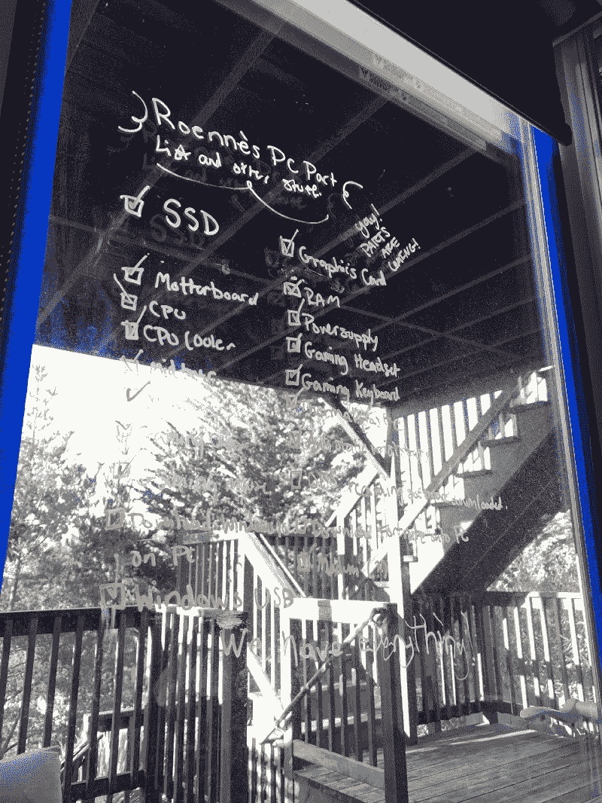

The Purchase List

我想让我的女儿全程主导这个过程，所以她不仅要负责找到合适的零件，还要负责对它们进行价格比较，并列出她的最终“采购清单”，这样我们就可以一起讨论了。

我们讨论了更大主板的利弊，以便为更小(或更强大)的组件(如 CPU 或 GPU)提供更大的扩展机会和功耗要求。

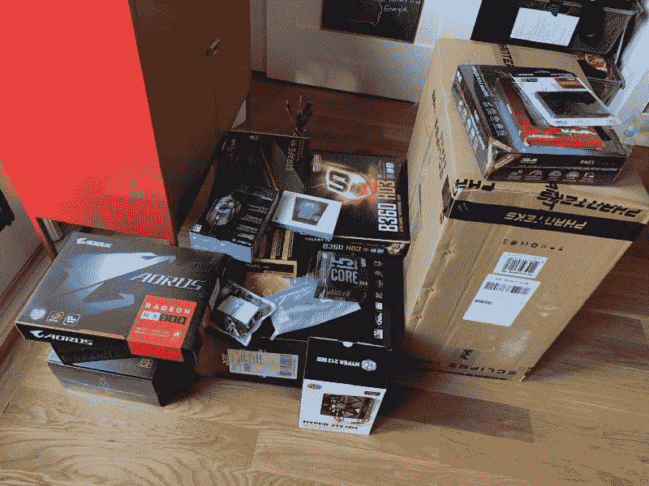

Starting to arrive!

需要一点数学知识来确保我们得到正确的 PSU(电源单元)来处理她的组件，但将主列表放在一起并不困难。最有趣的是谈论每一部分及其原因，以及试图最大化预期体验(如最终结果)和我为她概述的预算。

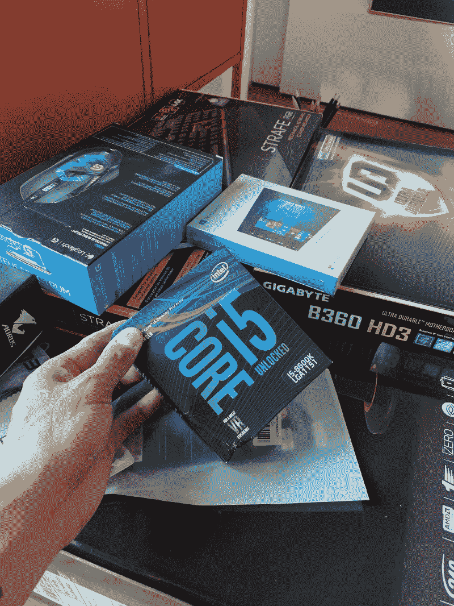

Core i5~

### 我们的目标和预算

我们想做的是专门为堡垒之夜建造一个“史诗游戏平台”，能够以低于 1000 美元的价格处理接近最高图形设置@ 60FPS。我们最终在游戏鼠标、键盘、耳机和漂亮的 24 英寸宽屏显示器等外设上多花了一些钱。但是，如果可能的话，我们希望将核心计算机(中塔)的价格控制在 1，000 美元以下。

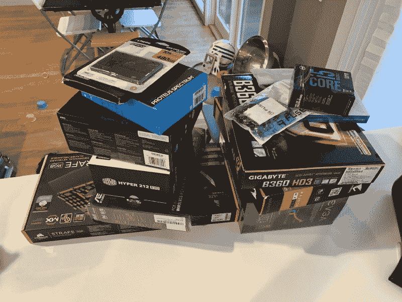

Time to build!

这是我们购买的核心组件的主列表…

1.  **CPU:** [英特尔酷睿 i5–8600k](https://amzn.to/2RShU8e)台式机处理器 6 核最高 4.3 GHz 无锁频 LGA 1151 300 系列 95W
2.  **CPU 冷却器:** [冷却器主控 Hyper 212 Evo](https://amzn.to/2CJLt7l)(RR-212 e-20PK-R2)CPU 冷却器带 PWM 风扇，四根直接接触热管
3.  **显卡:** [技嘉 AORUS 镭龙 RX 580](https://amzn.to/2RKtKkF) 8GB 显卡 GV-RX580AORUS-8GD
4.  **主板:** [技嘉 B360 HD3](https://amzn.to/2CjGV6V)(LGA 1151/Intel/B360/ATX/USB 3.1 Gen 2(USB 3.1)Type A/DDR 4/主板)
5.  **RAM:** [爱国者蝰蛇精英系列 DDR 4 16GB](https://amzn.to/2CiDjSz)(2x8GB)2666 MHz PC4–21300 双内存套件(黑色/灰色)
6.  **固态硬盘:** [金士顿 A400 固态硬盘 480GB SATA 3 2.5 英寸固态硬盘](https://amzn.to/2pUGwjV)sa 400s 37/480g——提升性能
7.  **电源:** [EVGA 超新星 650 G3](https://amzn.to/2NMZAKs) ，80 加金 650W
8.  **表壳:**[Phanteks PH-EC 416 ptg _ BW Eclipse P400 钢 ATX 中塔表壳](https://amzn.to/2NIC5Sv)黑/白，钢化玻璃版表壳

大多数构建建议获得一个硬盘，如 1TB 7200RPM 的硬盘，但我们选择首先使用 SSD 来最大化启动和加载时间。她可能会很快得到一个更典型的硬盘，因为她想开始捕捉她的游戏，甚至直播。

这 8 个组件的总成本最终为**$ 1001**！

当然，她还需要一些可爱的外围设备，这增加了总拥有成本:

1.  **键盘:** [海盗船钢鞭机械游戏键盘](https://amzn.to/2EkqTMw) —红色 LED 背光— USB 直通—线性静音—樱桃 MX 红色开关
2.  **显示器:** [Acer XF250Q Cbmiiprx 24.5 英寸全高清](https://amzn.to/2yHNrR8) (1920 x 1080)采用 AMD FREESYNC 技术的零帧 TN 游戏显示器—1 毫秒| 240Hz 刷新(显示器、HDMI 2.0、HDMI 1.4 端口)
3.  **鼠标:** [罗技 G502 Proteus Spectrum RGB 可调游戏鼠标](https://amzn.to/2CLqK3k)，12，000 DPI 动态 DPI 切换，个性化重量和平衡调节，带(5)个 3.6g 砝码，11 个可编程按钮
4.  **耳机:** [罗技 G Pro 游戏耳机](https://amzn.to/2RKvri1)带专业级话筒，适用于 Pc、PC VR、Mac、Xbox One、Playstation 4、任天堂 Switch
5.  **游戏椅:** [Homall 游戏椅](https://amzn.to/2CJFgZl)赛车风格的高背 PU 皮办公椅电脑办公椅和人体工程学风格的转椅，带头枕和腰部支撑(白色)——我们最终退回了这款椅子，因为它不适合我们目前的设置……她必须想出另一种座位系统。

哦，最后，我们买了这三样我们绝对需要的重要东西:

1.  [防静电腕带](https://amzn.to/2pV2h2P) — 3 条装——可重复使用的防静电腕带，配有接地线和鳄鱼夹——让您在操作敏感电子设备时也能接地
2.  [ARCTIC MX-4 Thermal Compound Paste](https://amzn.to/2NIFot5)，碳基高性能散热膏，用于所有冷却器的 CPU，接口材料，4 克，带工具
3.  [Windows 10 家用 USB](https://amzn.to/2NJ4Uy6) —确保您获得了 USB，这样您就可以在安装时引导到它！

很明显，你还需要一些螺丝刀和一堆其他小工具，大多数人都已经有了。

现在，是时候建造:

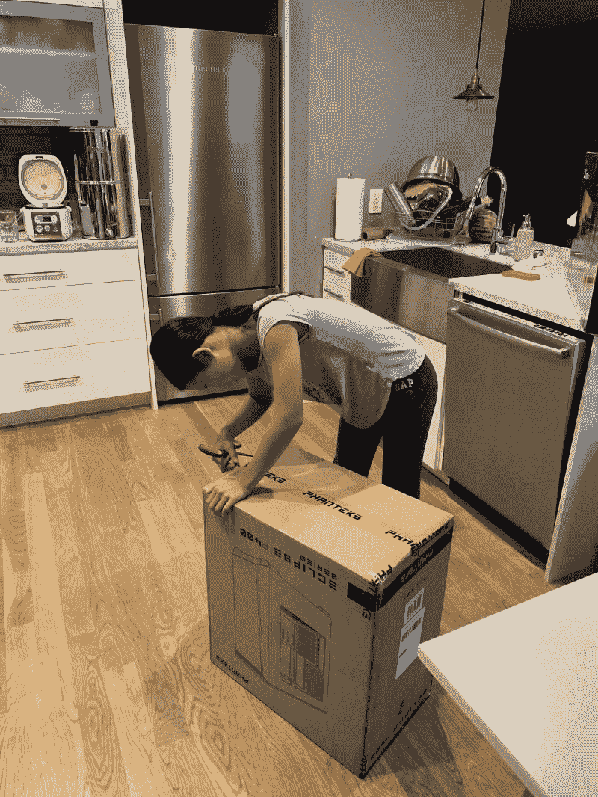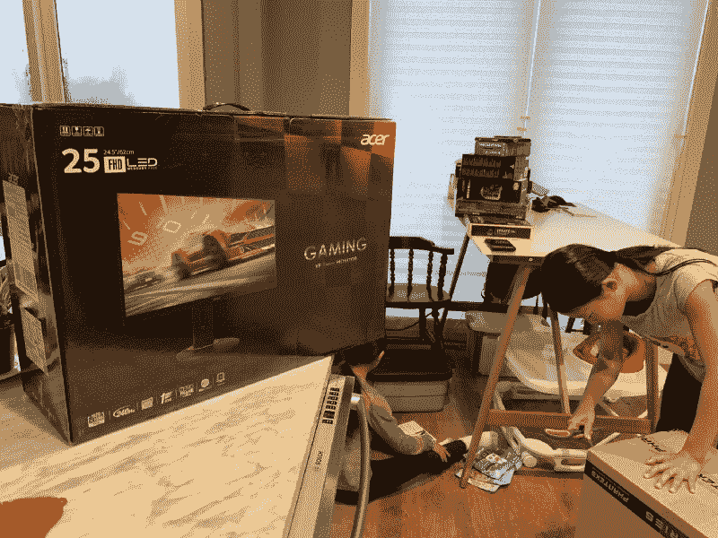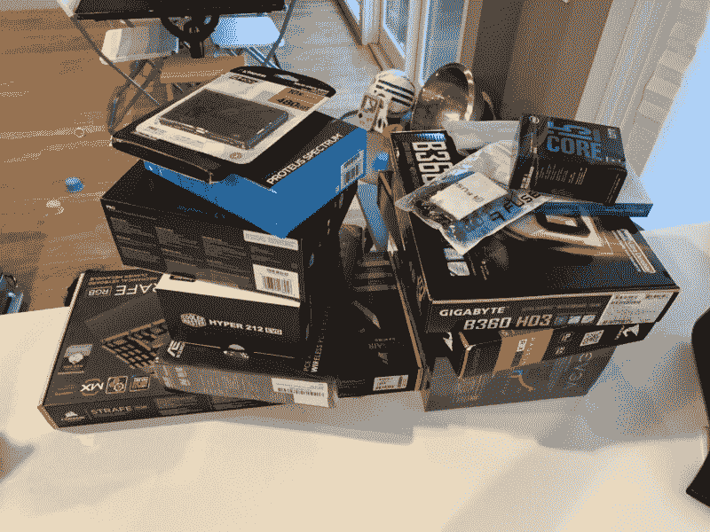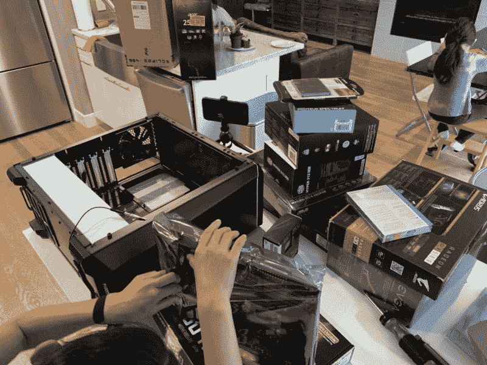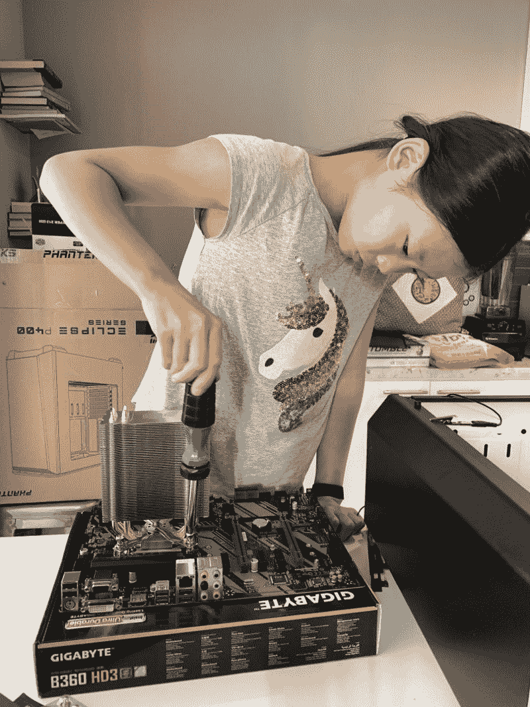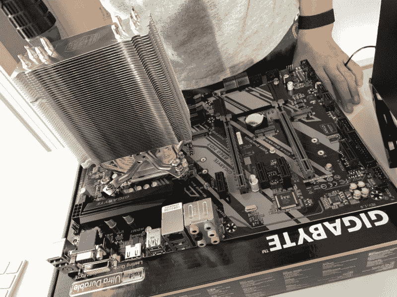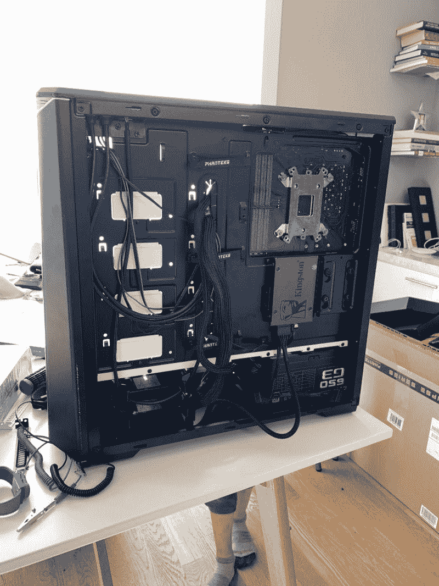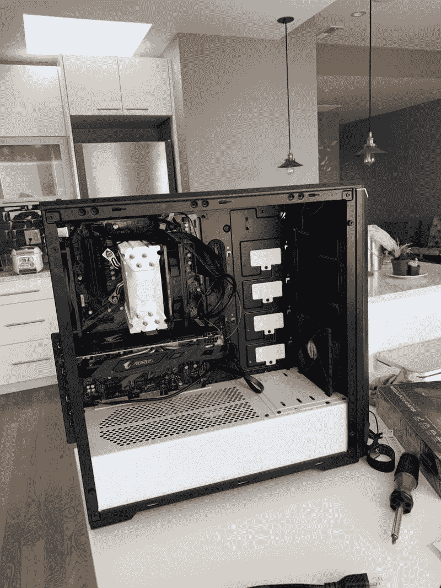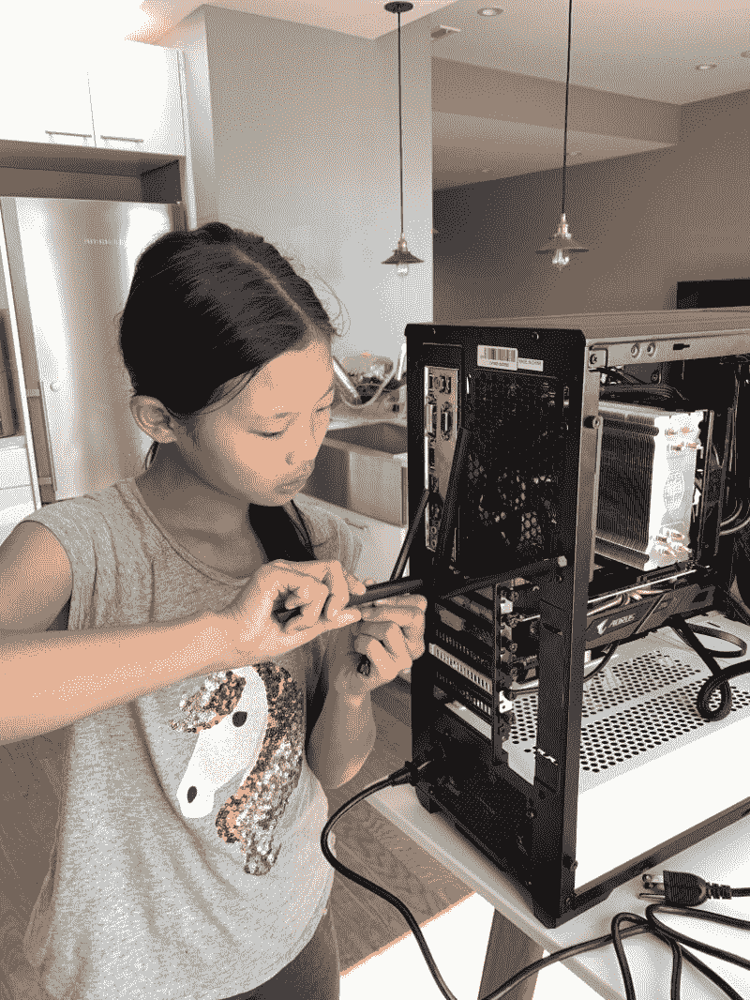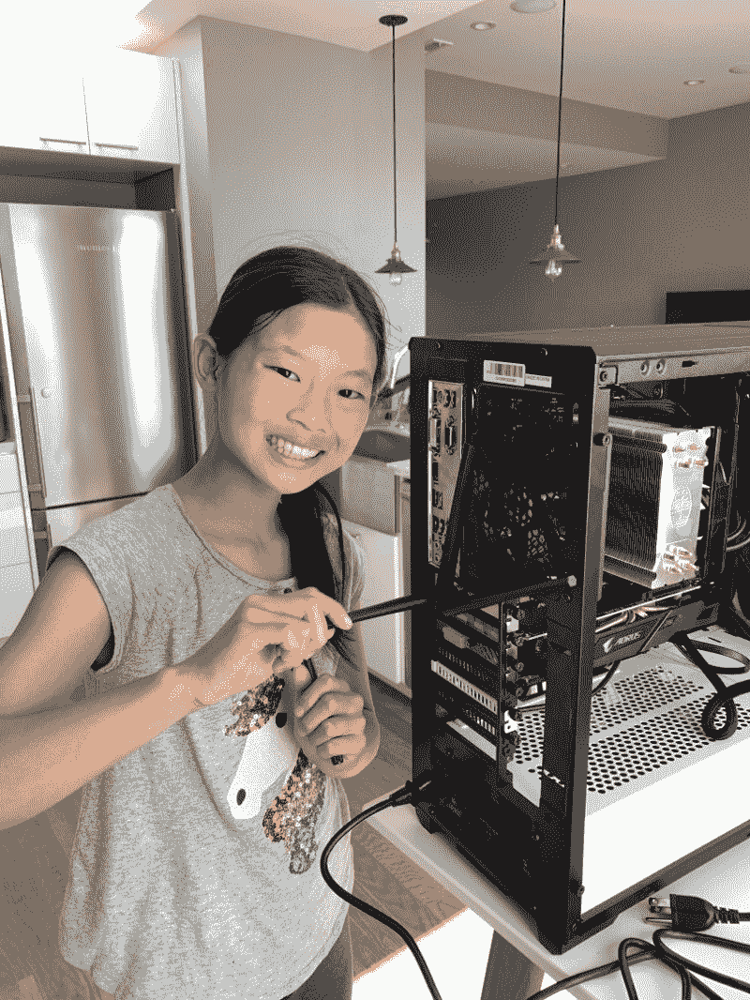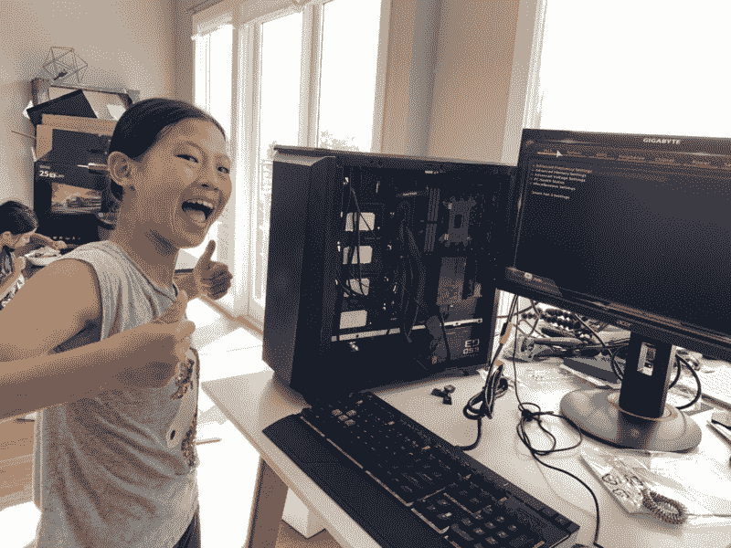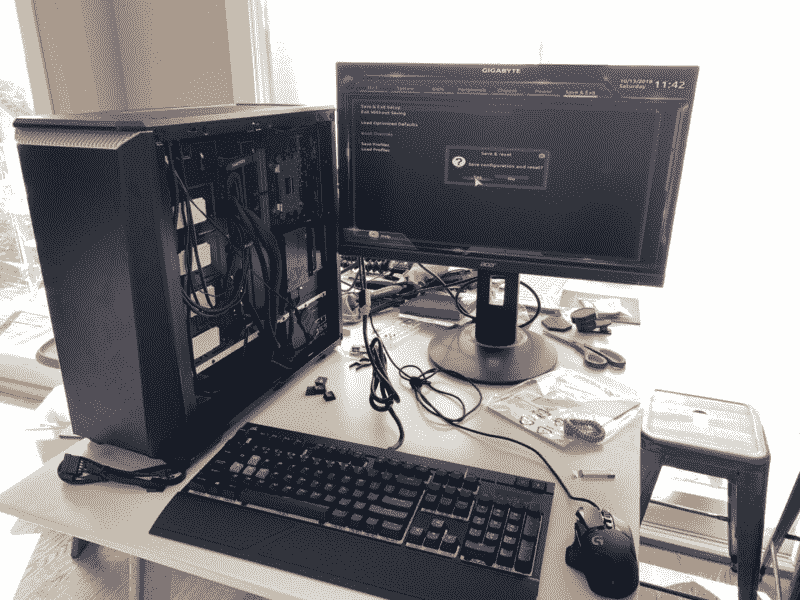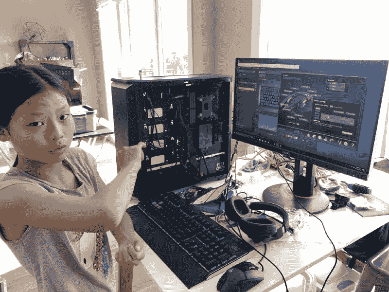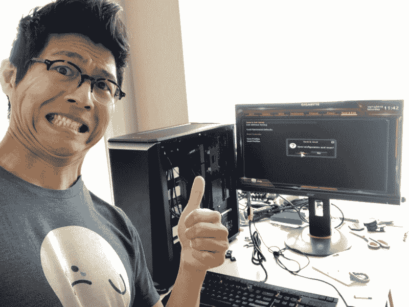

整个过程大概 6 个小时，从开始到结束，让我大吃一惊。我原计划花大部分(如果不是全部的话)时间来组装它。当然，有那么几个瞬间，我认为我们要么*缺少*一个组件，要么我认为我们可能购买了不能一起工作的部件，但是，上面的最后一个部件配置得很完美。

而且…它第一次就启动了！

我真的为她感到骄傲，她现在正以最大设置@ 60FPS 玩她最喜欢的游戏，这是她一生中最快乐的时光，我再高兴不过了，因为没有什么比构建自己的计算机，然后用它做自己喜欢的事情更好了！

是的……她学到了很多关于计算机硬件和软件的知识，我绝对认为这是她接受的黑客学校教育的一部分。多好的一场胜利…非常有趣的东西。

*PS:在 YouTube 上随意关注我的[女儿](https://www.youtube.com/channel/UCipmSm7mureyl0S6v-vZEQg)！*

约翰·萨丁顿最初发表于[。](https://john.do/fortnite-rig/)