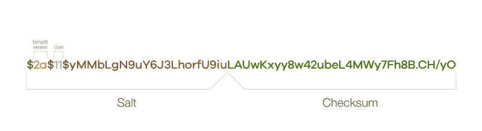
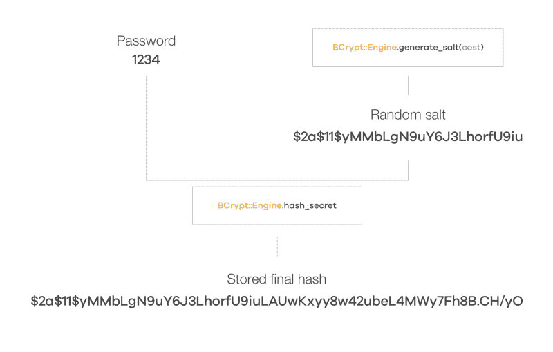
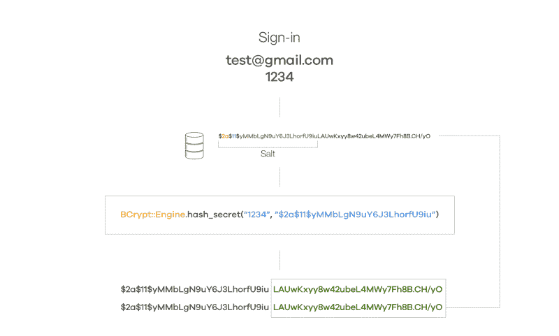

# 如何保护你的 Rails 应用密码的安全

> 原文：<https://www.freecodecamp.org/news/how-does-devise-keep-your-passwords-safe-d367f6e816eb/>

蒂亚戈·阿尔维斯

# 如何保护你的 Rails 应用密码的安全

Photo by [James Sutton](https://unsplash.com/photos/FqaybX9ZiOU?utm_source=unsplash&utm_medium=referral&utm_content=creditCopyText) on [Unsplash](https://unsplash.com/search/photos/safe?utm_source=unsplash&utm_medium=referral&utm_content=creditCopyText)

[device](https://github.com/plataformatec/devise)是一个不可思议的 Rails 认证解决方案，拥有[超过 4000 万次下载](https://rubygems.org/gems/devise)。然而，由于它抽象了大部分加密操作，理解幕后发生的事情并不总是容易的。

其中一个抽象最终直接在数据库上持久化了一个`encrypted_password`。所以我一直很好奇它到底代表了什么。这里有一个例子:

`$2a$11$yMMbLgN9uY6J3LhorfU9iuLAUwKxyy8w42ubeL4MWy7Fh8B.CH/yO`

但是那些胡言乱语是什么意思？

Devise 使用 [Bcrypt](https://github.com/codahale/bcrypt-ruby) 安全地存储信息。在其网站上，它提到它使用“ *OpenBSD bcrypt()密码哈希算法，允许您轻松存储用户密码的安全哈希*”。但是这个哈希到底是什么呢？它是如何工作的，如何保证存储的密码安全？

这就是我今天想向你们展示的。

让我们反向工作—从数据库中存储的散列到加密和解密过程。

散列值`$2a$11$yMMbLgN9uY6J3LhorfU9iuLAUwKxyy8w42ubeL4MWy7Fh8B.CH/yO`实际上由几个部分组成:

*   **Bcrypt 版本** ( `2a` ) -用于产生该散列的 Bcrypt()算法的版本(存储在第一个`$`符号之后)
*   **成本** ( `11` ) -用于创建散列的成本因子(存储在第二个`$`符号之后)
*   **Salt** ( `$2a$11$yMMbLgN9uY6J3LhorfU9iu` ) -一个随机字符串，当与您的密码组合时，它是唯一的(前 29 个字符)
*   **校验和**(`LAUwKxyy8w42ubeL4MWy7Fh8B.CH/yO`)——存储的`encrypted_password`(29 个字符后剩余的字符串)的实际哈希部分

让我们探索最后 3 个参数:

*   使用 Devise 时，`**Cost**`值由名为[的类变量设置，拉伸](https://github.com/plataformatec/devise/blob/715192a7709a4c02127afb067e66230061b82cf2/lib/devise.rb#L74)，默认值为`11`。它指定密码被散列的次数。(*在你的[device . Rb initializer](https://github.com/plataformatec/devise/blob/715192a7709a4c02127afb067e66230061b82cf2/test/rails_app/config/initializers/devise.rb#L70)上，你可以为测试环境配置一个较低的值，让你的测试套件运行得更快。* ) *
*   **salt** 是用来和原密码组合的随机字符串。这就是为什么相同的密码在加密存储时会有不同的值。(*参见下文了解为什么这很重要以及什么是彩虹表攻击*)* *
*   **校验和**是密码与随机盐结合后实际生成的哈希。

当用户在您的应用程序上注册时，他们必须设置密码。在将该密码存储在数据库中之前，通过[BCrypt::engine . generate _ salt(cost)](https://www.rubydoc.info/github/codahale/bcrypt-ruby/BCrypt%2FEngine.generate_salt)生成一个随机 salt，其中考虑了前面提到的成本因素。*(注意:如果`[pepper](https://github.com/plataformatec/devise/blob/715192a7709a4c02127afb067e66230061b82cf2/lib/devise.rb#L155)` [类变量值](https://github.com/plataformatec/devise/blob/715192a7709a4c02127afb067e66230061b82cf2/lib/devise.rb#L155)被设置，它将[在加盐之前将其值附加到密码](https://github.com/plataformatec/devise/blob/715192a7709a4c02127afb067e66230061b82cf2/lib/devise/encryptor.rb#L9)上。)*

与盐(例如`$2a$11$yMMbLgN9uY6J3LhorfU9iu`，其中包括成本因素)它将调用[BCrypt::engine . hash _ secret(password，salt)](https://www.rubydoc.info/github/codahale/bcrypt-ruby/BCrypt%2FEngine.hash_secret) ，该函数使用生成的 salt 和用户选择的密码计算要存储的最终哈希。这个最终散列(例如，`$2a$11$yMMbLgN9uY6J3LhorfU9iuLAUwKxyy8w42ubeL4MWy7Fh8B.CH/yO`)将依次存储在数据库的`encrypted_password`列中。

但是，如果这个散列是不可逆的，并且 salt 是由`BCrypt::Engine.generate_salt(cost)`、**在`BCrypt::Password.create`调用中随机生成的，那么如何使用它来登录用户呢？**

这就是那些不同的散列组件有用的地方。在找到与用户提供的用于登录的电子邮件相匹配的记录后，将检索加密的密码，并将其分解为上面提到的不同部分( **Bcrypt 版本**、**成本**、 **Salt** 和**校验和**)。

在最初的准备之后，接下来会发生以下事情:

1.  取**输入密码** ( `1234`)
2.  取存储密码(`$2a$11$yMMbLgN9uY6J3LhorfU9iu`)的**盐**
3.  使用相同的 bcrypt 版本和成本因子(`BCrypt::Engine.hash_secret(“1234”, “$2a$11$yMMbLgN9uY6J3LhorfU9iu”)`)从密码和 salt 生成**散列**
4.  检查**存储的哈希**是否与步骤 3 ( `$2a$11$yMMbLgN9uY6J3LhorfU9iuLAUwKxyy8w42ubeL4MWy7Fh8B.CH/yO`)计算的哈希相同

这就是 Devise 如何安全地存储密码，并保护您免受一系列攻击，即使您的数据库遭到破坏。

在 Twitter [@alvesjtiago](https://twitter.com/alvesjtiago) 上取得联系，让我知道你是否觉得这篇文章有趣！感谢您的阅读。

> PS:我绝不是安全或密码学专家，所以如果你发现有什么问题，请联系我。我希望通过简化一些概念，更容易理解正在发生的事情。

*感谢 [@filipepina](https://twitter.com/filipepina) ， [@ivobenedito](https://twitter.com/ivobenedito) ， [@jackveiga](https://twitter.com/jackveiga) ， [@joao_mags](https://twitter.com/joao_mags) ， [@pedrosmmoreira](https://twitter.com/pedrosmmoreira) 的点评和建议。这篇文章也可以在[http://blog . tiagoalves . me/how-do-design-keep-your-passwords-safe](http://blog.tiagoalves.me/how-does-devise-keep-your-passwords-safe/)上找到。*

关于一些主题的更多信息。

**成本系数***

*   [违约风险 bcrypt 成本因素](https://labs.clio.com/bcrypt-cost-factor-4ca0a9b03966)
*   [bcrypt 的推荐轮数](https://security.stackexchange.com/questions/17207/recommended-of-rounds-for-bcrypt)

**彩虹表攻击****

*   [彩虹表—维基百科](https://en.wikipedia.org/wiki/Rainbow_table)
*   [什么是彩虹表，如何使用？](https://security.stackexchange.com/a/440)