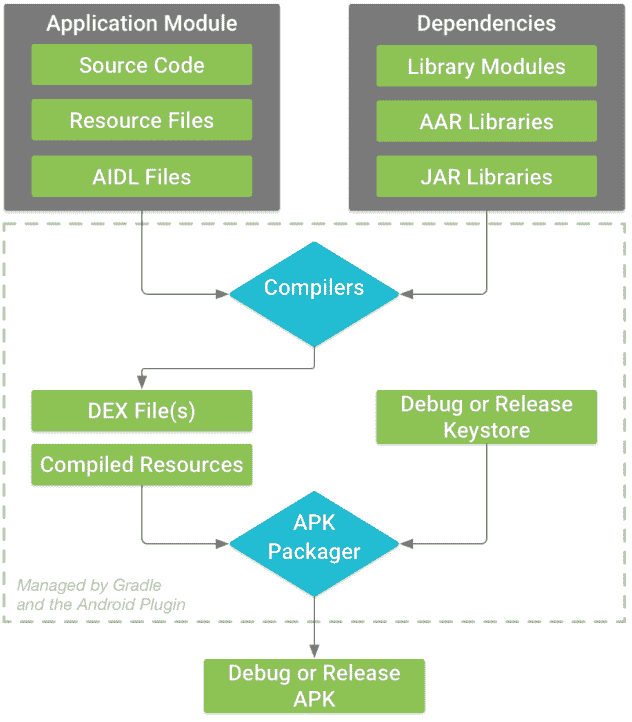
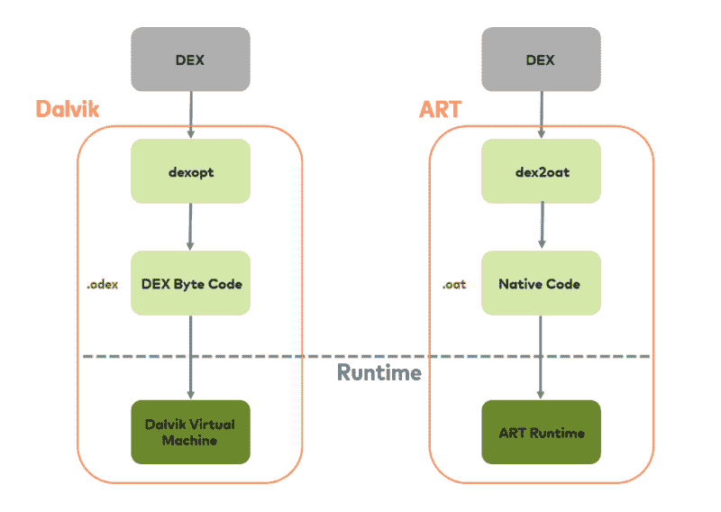
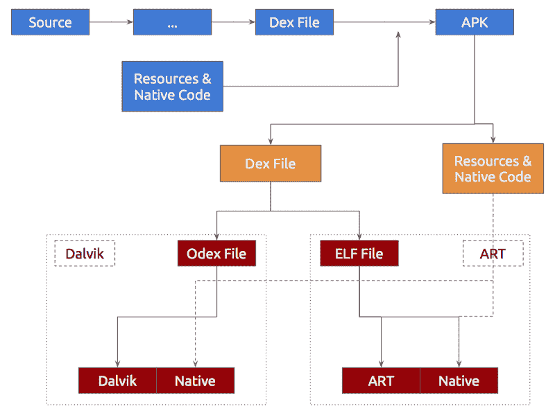
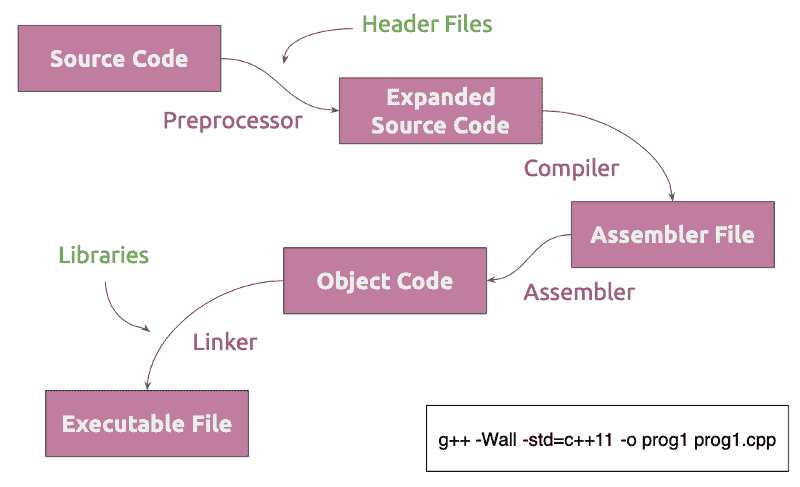
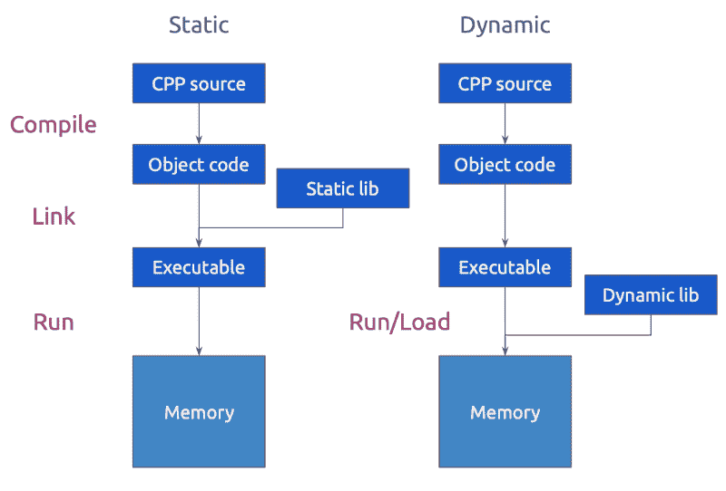
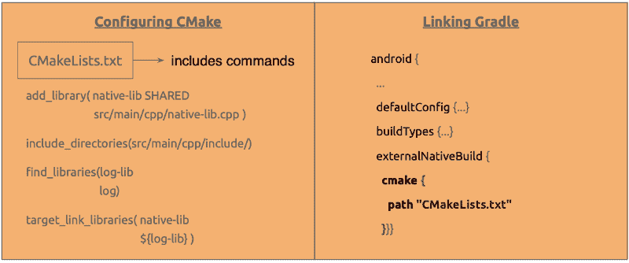
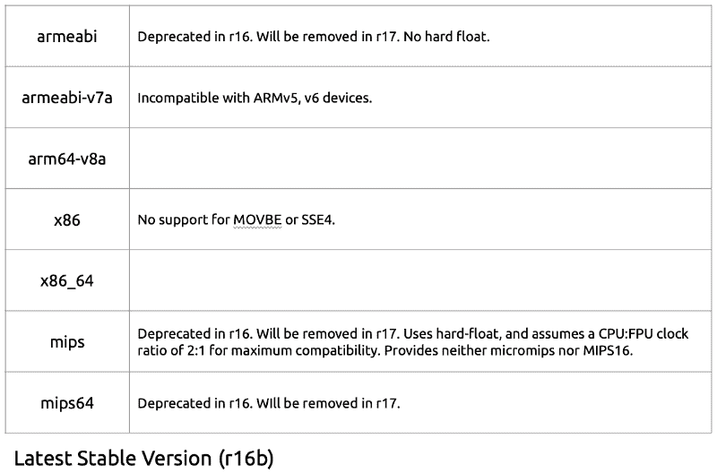
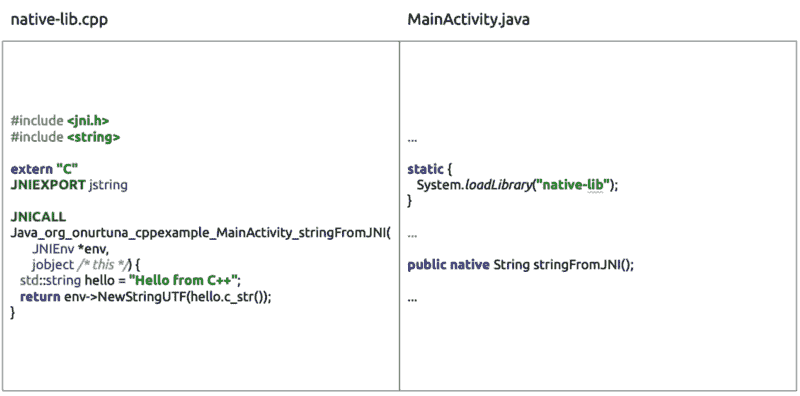
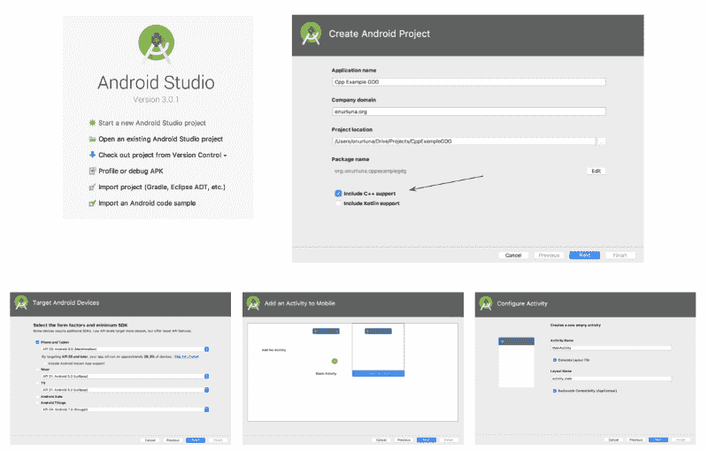
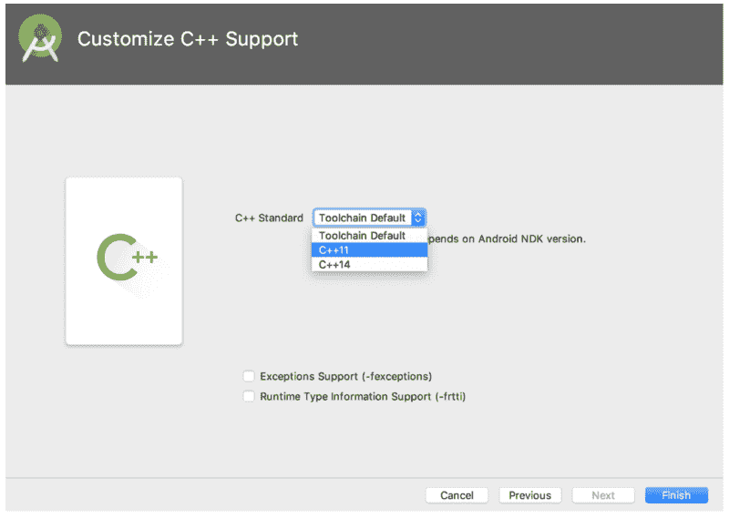

# 如何在你的 Android 项目中开始使用 C++代码

> 原文：<https://www.freecodecamp.org/news/c-usage-in-android-4b57edf84322/>

由 Onur 金枪鱼

# 如何在你的 Android 项目中开始使用 C++代码

去年，我在土耳其安卡拉的 GDG 发展节上做了一个演讲。从那以后，我一直计划在这里分享我的演讲。现在我是一名博士生，有更多的时间，我把帖子放在这里。

如果你想获取演示文稿，可以在我的[驱动器](https://docs.google.com/presentation/d/19SYg_6QuU9ZGZ7mj2xHsuO2BwT7z1Sr6XtIAMoRja84/edit?usp=sharing)上找到。

#### **热身**

我想从解释 Android 中一个应用程序的构建过程开始。因为你需要知道一些基本的内部知识，这个话题有点技术性。

你不需要知道上图中显示的一切，但这是一个很好的参考。

现在假设您使用 Java 为 Android 编写了一个应用程序。你将会有:

*   该应用程序的源代码
*   某种类型的资源文件(比如用于排列 GUI 的图像或 xml 文件)
*   也许还有一些 AIDL 文件，它们是使进程相互对话的 Java 接口。

您可能还会在项目中使用额外的库及其相关文件。

当构建一个可用的应用程序时，首先要将这些源代码编译在一起。编译器会生成一个 DEX 文件，然后由虚拟机读取。这个机器可读的文件和一些关于应用程序的附加信息将由一个包管理器打包在一起。最终的软件包——称为 APK 软件包——就是最终的应用程序。

用最简单的术语来说，这是一个 Android 包的构建过程。

#### android 运行时

现在让我们来谈谈运行时的东西。你有一个应用程序，当它开始运行时，它被机器读取。Android 有两种虚拟机来运行一个 app。我不会介绍旧的一个，称为 Dalvik，因为今天大多数 Android 设备都运行一个名为 Android Run Time，ART 的虚拟机——所以这就是我们在这里要讨论的。

艺术是超前的(AOT)虚拟机器。那是什么意思？让我解释一下。当你的应用第一次开始运行时，它的代码被编译成机器代码，然后可以被真正的机器读取。这意味着代码不是在运行时一部分一部分编译的。这增加了应用程序的安装时间，同时减少了电池的使用。

总之，你编写一个应用程序，然后将其编译成 ART 可以读取的二进制代码。然后，ART 将该代码转换成设备本身可以读取的本机代码。

#### 艺术和 C++

如果你用 Java 编写了一个 Android 应用程序，但是有一些 C++代码与 Java 接触，该怎么办？C++代码对应用程序的构建过程或运行时间有什么影响？不要太多。

C++代码由它的编译器直接编译成真实的机器码。所以，如果你用 C++代码，它会被打包成你包里的机器可读代码。当 ART 在第一次使用时将 ART 可读代码转换成机器可读代码时，它将不重新处理它。这个过程你不需要担心。你只负责编写一个接口，让 Java 和 C++对话。我们很快就会谈到这一点。

#### C++构建过程

我们现在必须谈谈 C++的构建过程。源代码(即。cpp 和。h 文件)在第一步就被预处理器转换成扩展的源代码。这个源代码包含了大量的代码。虽然您可以使用类似上面的命令获得最终的可执行文件，但是也可以使用相关的标志来减少构建步骤。给 *g++* 编译器一个 *-E* 标志就可以得到扩展的源代码。我有一个 4 行的“hello world”的 40867 行文件。cpp 源代码。

> 使用 g++ -E hello.cpp -o hello.ii 来获取扩展源代码。

第二步是实际的编译步骤。编译器编译我们的代码以获得汇编文件。因此，真正的编译产生一个汇编文件，而不是可执行文件。这个文件是由汇编程序汇编的。产生的代码称为目标代码。当我们有多个旨在相互链接的库时，我们有许多目标代码。那些目标代码通过链接器连接起来。然后我们得到一个可执行文件。

有两种链接:动态链接和静态链接。

所以现在是时候更深入地讨论纯 C++的东西了。

重要的是:您可以将静态链接库视为代码的一部分。因此，将库链接到项目时要小心。因为您使用的库可能没有合适的许可证来静态链接。大多数开源库都被限制为动态链接库。

从技术角度来看，静态链接库是在编译时由编译器链接到项目的。另一方面，动态链接库是由操作系统在运行时链接的。所以你不需要用你使用的库代码来分发你的项目。您也可以使用另一个项目的库或系统库。

由于这个事实，动态链接可能会导致项目中的漏洞。然而，安全案例不在本文的讨论范围之内。

### 一些概念

#### 麦克马克和格拉德勒

如果我们想在我们的 Android 项目中添加 C++代码，使用 CMake 来处理构建操作是很好的。还记得我刚才在上面介绍的构建过程吗？当你有一堆 C++库和源代码时，处理它们就变得更加复杂。像 CMake 这样的工具使得执行构建过程变得更加容易。

当您选择在项目开始时包含 C++支持时，CMake 将默认可用。你还需要使用 Gradle 闭包来将库打包到你的 APK 中。

#### ABI

如你所知，Android 是为各种设备分发的。每个设备可能有不同的 CPU 架构。当您开发一个包含 C++代码的 Android 应用程序时，您应该关心您的应用程序将在什么平台上运行。

还记得我上面介绍的 C++构建机制吗？C++代码应该被编译为针对每个目标平台的库。您可以为所有支持的平台编译该库，也可以选择只为一个平台编译它。

请注意，如果你想把你的应用放在谷歌 Play 商店，64 位 ABI 支持将是强制性的。

Android support table for different CPUs.

#### JNI

这是我想向你介绍的关于 Android 中 C++使用的最后一件事。正如我前面提到的，考虑到您想使用 Java 开发一个应用程序，我向您介绍这些概念。

JNI 是 Java 本地接口的缩写。它允许 C++和 Java 部分以最简单的方式相互交流。例如，如果你想用 Java 从 C++中调用一个函数，你应该为此编写一个 JNI 接口。

native-lib.cpp 是接口，它将 C++代码连接到 Java 代码。在上面的例子中，唯一的 C++代码是 JNI 本身。但是，您可以包含想要使用的库，并实现一个调用它们的函数。这个新函数可以从 Java 部分调用。所以它就像一座桥梁。

### 如果你想尝试一下，要做的事情

在这里，您已经掌握了在您的 Android 项目中使用 C++的所有必要的基础知识。如果你想试一试，这就是如何用 C++代码创建一个简单的 Android 项目。

下面的图片向你展示了开始这样一个项目的步骤。在完成它们之后，你可能想通读这篇文章来修改和更深入地理解这个机制。

这篇文章只是一个介绍。别忘了还有很多东西要学。然而，我的目的是向你介绍关于使用 C++概念的最重要的事情。

