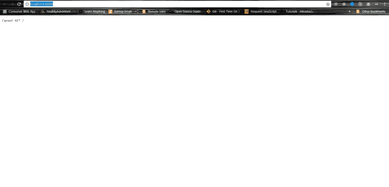
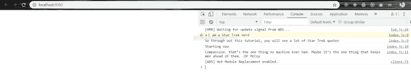
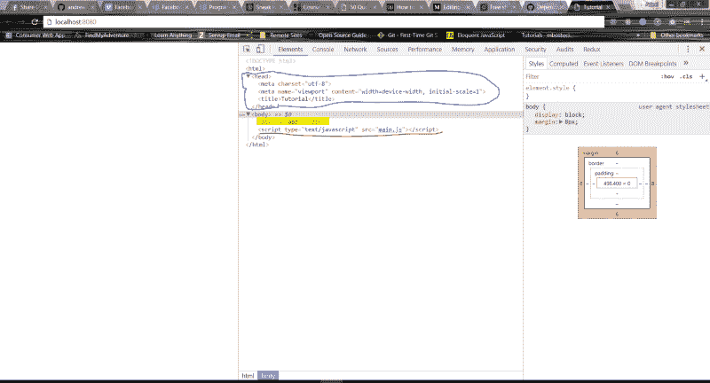
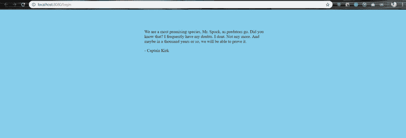
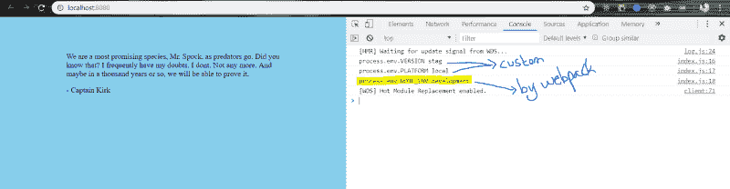
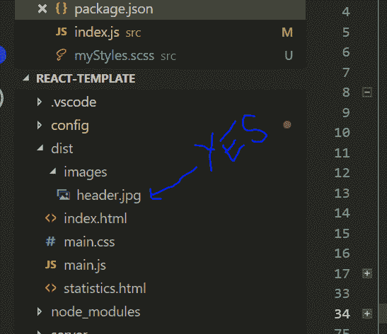
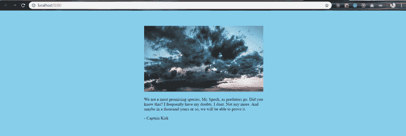
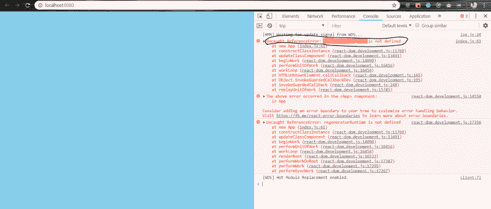
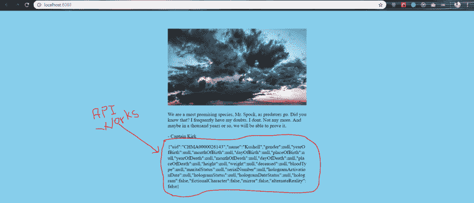
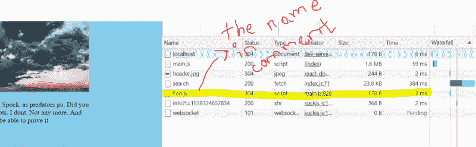

# 如何结合 Webpack 4 和 Babel 7 创建一个奇妙的 React 应用程序

> 原文：<https://www.freecodecamp.org/news/how-to-combine-webpack-4-and-babel-7-to-create-a-fantastic-react-app-845797e036ff/>


Photo by [daniel odame](https://unsplash.com/@visualsbydanny?utm_source=ghost&utm_medium=referral&utm_campaign=api-credit) / [Unsplash](https://unsplash.com/?utm_source=ghost&utm_medium=referral&utm_campaign=api-credit)

我之前写过一篇文章叫做**[如何征服 Webpack 4 并构建一个甜蜜的 React 应用](https://medium.freecodecamp.org/how-to-conquer-webpack-4-and-build-a-sweet-react-app-236d721e6745)**在我写完这篇文章后不久，babel 带来了一个重大的突破性变化，许多包都被弃用了。所以我决定写一个新的教程。

我将集中精力设置带有 r **eact** 的 **webpack** ，它将有**。scss** 支持和**代码分割**

再次写这个的目的很简单:我想让每个人都感到舒服。因为设置 webpack 可能会令人望而生畏。尤其是对于新开发人员来说。跟着做，那些看起来困难或者可怕的事情会变得像小菜一碟。

在我们开始之前，这里是 [**源代码**](https://github.com/adeelibr/react-starter-kit) 。我知道这里面有很多东西。我计划使用相同的代码库来讨论 webpack、react、SCSS、热模块替换、用 jest 和 enzyme 进行测试、林挺代码，并在以后的其他文章中添加一个类似 prettier 的代码格式化程序，因此我将继续更新这个代码库。我不会膨胀这个代码库——我保证。

注意:如果你想为[库](https://github.com/adeelibr/react-starter-kit)做一个 PR，我们非常欢迎你:)所以让我们开始吧。

为了简单起见，本文将只关注；

*   用 Babel 7 为 React 设置 Webpack 4
*   支持。SCSS
*   代码分割
*   使用 HMR 的开发环境(热模块替换)
*   生产型
*   将您的 Webpack 配置分成几个块
*   用代码处理试运行、演示、生产、测试和其他环境
*   在生产构建中生成可视化工具，以检查哪个代码块占用了多少大小以及代码块的依赖关系。超级有用。

### 先决条件

您需要安装节点才能使用 npm(节点软件包管理器)。

首先，创建一个名为`app`的文件夹，然后打开你的终端，进入那个`app`文件夹，输入:

```
npm init -y
```

这将为您创建一个`package.json`文件。

其次，在您的`app`文件夹中创建一个名为`src`的文件夹。在`app/src`内部创建一个名为`index.js`的文件，并编写以下代码。

```
console.warn('I am a Star Trek nerd');
console.log('So through out this tutorial, you will see a lot of Star Trek quotes');
console.log('Starting now');
console.log("Compassion: that’s the one thing no machine ever had. Maybe it’s the one thing that keeps men ahead of them. -Dr McCoy"); 
```

你当然可以写上面的任何东西。我选择了星际迷航。


*Change is the essential process of all existence. — Spock*

接下来，我们需要安装几个依赖项。你可以把下面`package.json`里的`dependencies` & `devDependencies`复制到你自己的里面，做一个`**npm install**` **:**

```
{
  "name": "react-boiler-plate",
  "version": "1.0.0",
  "description": "A react boiler plate",
  "main": "src/index.js",
  "author": "Adeel Imran",
  "license": "MIT",
  "scripts": {
    "start": "a script will come here"
  },
  "dependencies": {
    "react": "^16.5.2",
    "react-dom": "^16.5.2"
  },
  "devDependencies": {
    "@babel/core": "^7.0.0",
    "@babel/plugin-proposal-class-properties": "^7.0.0",
    "@babel/plugin-proposal-export-namespace-from": "^7.0.0",
    "@babel/plugin-proposal-throw-expressions": "^7.0.0",
    "@babel/plugin-syntax-dynamic-import": "^7.0.0",
    "@babel/polyfill": "^7.0.0-beta.51",
    "@babel/preset-env": "^7.0.0-beta.51",
    "@babel/preset-react": "^7.0.0-beta.51",
    "babel-loader": "^8.0.0-beta.0",
    "copy-webpack-plugin": "^4.5.1",
    "css-loader": "^0.28.11",
    "html-webpack-plugin": "^3.2.0",
    "mini-css-extract-plugin": "^0.4.3",
    "node-sass": "^4.8.3",
    "optimize-css-assets-webpack-plugin": "^4.0.0",
    "sass-loader": "^7.0.3",
    "style-loader": "^0.21.0",
    "uglifyjs-webpack-plugin": "^1.2.5",
    "webpack": "^4.12.0",
    "webpack-cli": "^3.0.8",
    "webpack-dev-server": "^3.1.4",
    "webpack-merge": "^4.1.3",
    "webpack-visualizer-plugin": "^0.1.11"
  }
} 
```

是的我知道，我知道！创建一个 hello world react 应用程序需要很多时间。但是等等，这是你所需要的。即使你想创建一个企业级的 app。(根据您的要求，可能还需要一两件东西，但这是它的主干。)

因此，在我们深入研究代码之前，让我们来讨论一下它们中的每一个。

webpack :我们需要 webpack 来捆绑我们的代码。

webpack-cli :我们将会使用 webpack 的一些 cli 特性，让我们在编写一些脚本时更加轻松。

webpack-dev-server :我将使用 webpack-dev-server 包创建一个服务器。这只能在开发环境中使用，而不能用于生产。这意味着在开发和处理我的代码时，我不需要像 NodeJS 那样单独的服务器来手动设置。

[webpack-merge](https://github.com/survivejs/webpack-merge) :将我们的配置分成块，稍后会详细介绍

webpack-visualizer-plugin :查看每个包大小的可视化表示——它们占用了多少空间以及它们的依赖关系。

[style-loader](https://github.com/webpack-contrib/style-loader) :通过在头部注入一个`<script` / >标签，将 CSS 添加到 DOM 中

[sass-loader](https://github.com/webpack-contrib/sass-loader) :用于 SCSS 支持

[node-sass](https://github.com/sass/node-sass):sass-loader 的依赖关系

css-loader :转换我们的。scss 文件到。钢性铸铁

mini-css-extract-plugin :这个插件将 css 提取到单独的文件中。它为每个包含 CSS 的 JS 文件创建一个 CSS 文件。

[uglifyjs-webpack-plugin](https://github.com/webpack-contrib/uglifyjs-webpack-plugin) :缩小 JavaScript 代码用于生产

[optimize-css-assets-web pack-plugin](https://github.com/NMFR/optimize-css-assets-webpack-plugin)为生产缩减 CSS 代码

html-webpack-plugin :这不仅仅是生成一个 html 文件，它支持随需应变。css 和。js 文件根据需要自动添加到您的 HTML 文件中

[copy-webpack-plugin](https://webpack.js.org/plugins/copy-webpack-plugin/) :将文件/文件夹复制到您的构建文件夹中。

babel-loader :这是帮助 webpack 编译的加载器。js 文件

[@babel/core](https://github.com/babel/babel/tree/master/packages/babel-core) : Babel core 编译器，这是一个让你使用 babel-loader 的依赖项

[@babel/preset-react](https://www.npmjs.com/package/@babel/preset-react) 为 react 代码预设的 babel

[@babel/preset-env](https://github.com/babel/babel/tree/master/packages/babel-preset-env) :允许你使用最新 JavaScript 的 babel 预置

[@babel/pollyfill](https://babeljs.io/docs/en/next/babel-polyfill.html) : Babel 包含一个 [polyfill](https://en.wikipedia.org/wiki/Polyfill_(programming)) ，其中包含一个自定义[再生器运行时](https://github.com/facebook/regenerator/blob/master/packages/regenerator-runtime/runtime.js)和 [core-js](https://github.com/zloirock/core-js) 。这将模拟完整的 ES2015+环境。这意味着支持`async/await`类型的酷语法糖。

> 到目前为止，这就是我在 [**如何征服 Webpack 4 并构建一个可爱的 React 应用**](https://medium.freecodecamp.org/how-to-conquer-webpack-4-and-build-a-sweet-react-app-236d721e6745) **中所写的内容。**

那么是什么改变了呢？

嗯！巴别塔引入了一个突破性的变化(为了更大的好处，相信我)，你可以在这里阅读更多: [**去除巴别塔的舞台预设**](https://babeljs.io/blog/2018/07/27/removing-babels-stage-presets) **。**这意味着以前如果你包括巴别塔-预设-第二阶段，比如说，它将包括所有与第二阶段相关的建议，这将膨胀你的代码。但是您可能只需要第二阶段的一个特定功能。

所以为了解决这个问题，babel 弃用了所有的预置插件，并推出了单独的功能。您现在必须手动设置它们。**酷吧？**所以让我们来谈谈这些独立的软件包以及它们的作用。

[@ babel/plugin-proposal-class-properties](https://babeljs.io/docs/en/next/babel-plugin-proposal-class-properties.html):为不支持`class`语法的浏览器将你的`class`语法转换成`function`

[@ babel/plugin-proposal-export-namespace-from](https://babeljs.io/docs/en/next/babel-plugin-proposal-export-namespace-from.html)支持类似`import * as ns from '../path/to/module';`的语法

[@ babel/plugin-proposal-throw-expressions](https://github.com/tc39/proposal-throw-expressions)在表达式上下文中抛出异常的新语法。**我喜欢这个功能:D**

[@ babel/plugin-syntax-dynamic-import](https://babeljs.io/docs/en/next/babel-plugin-syntax-dynamic-import.html)这有助于代码拆分。缺省情况下，Webpack 附带代码分割(从 webpack 1 开始)。但是当你想在使用**巴别塔、**的时候在 webpack 中进行代码拆分，那么你需要使用这个插件。

注意:对于本教程，你不需要`@babel/plugin-proposal-export-namsespace-from` & `@babel/plugin-proposal-throw-expressions`

> 这里也是所有巴别塔插件的列表。我是说所有人。退房单 [**这里**](https://babeljs.io/docs/en/plugins) **。**

现在您知道了为什么我们需要我们所需要的东西，而不是额外的东西，您会对实施 webpack 配置更有信心。

让我们从在 out `app`文件夹的根目录中添加一个`.babelrc`文件开始:

```
{
  "presets": [
    "@babel/preset-env",
    "@babel/preset-react"
  ],
  "plugins": [
    "@babel/plugin-syntax-dynamic-import",
    "@babel/plugin-proposal-class-properties",
    "@babel/plugin-proposal-export-namespace-from",
    "@babel/plugin-proposal-throw-expressions"
  ]
} 
```

我们有两个主要的预置`preset-env` & `preset-react`。剩下的是我们的插件，用来给代码添加“**翅膀**”。

引用《星际迷航》中柯克船长的话(为什么不呢):

> 也许人不应该去天堂。也许他注定要抓，一路抓。柯克舰长

在他的辩护中，柯克船长面对的是像将军改变，汗，博格人和许多危险的敌人。我们所面临的是美丽的**网络包**和**巴别**。所以，也许我们开发人员是去天堂的。

所以，让我们来设置我们的网络包。

在你的`app`中创建一个`config`文件夹。如果你感到失落，你可以在任何时候查阅 GitHub r [资料库](https://github.com/adeelibr/react-starter-kit/tree/master/config)来寻找答案。现在，在我们的`config` 文件夹中，让我们创建一个名为`webpack.base.config.js`的文件，我之所以称之为`base`，是因为它将用于我们的开发和生产。*因为为什么同一件事要写两遍？如果这没有多大意义，请再耐心等我几分钟。*

在你的`config/webpack.base.config.js`中写下这个:

```
module.exports = {
  module: {
    rules: [
      {
        test: /\.js$/,
        exclude: /node_modules/,
        use: {
          loader: 'babel-loader'
        }
      },
    ]
  }
} 
```

一旦准备就绪，就在根目录`app`下运行这个命令。(稍后我会用我们上面写的代码告诉你这个命令做什么，我保证。)

```
$ node_modules/.bin/webpack-dev-server --mode development --config config/webpack.base.config.js --open --hot --history-api-fallback
```

运行此命令后，您将看到以下屏幕:



Oh! A Fancy Error!

这里发生了什么？当我们运行 webpack 命令时，它确实找到了我们之前在`app/src/index.js`中写的`index.js`文件——但是它没有运行它的`.html`。所以让我们在我们的`app/src`文件夹中创建一个`index.html`文件:

```
<!DOCTYPE HTML>

<html>

<head>
  <meta http-equiv="Content-Type" content="text/html; charset=UTF-8" />
  <base href="/">
  <title>Tutorial</title>
</head>

<body>
  <div id="app"></div>
</body>

</html> 
```

让我们也更新一下我们的`webpack.base.config.js`:

```
var HtmlWebpackPlugin = require('html-webpack-plugin');

module.exports = {
  module: {
    rules: [
      {
        test: /\.js$/,
        exclude: /node_modules/,
        use: {
          loader: 'babel-loader'
        }
      }
    ]
  },
  plugins: [
    new HtmlWebpackPlugin({ 
      template: './src/index.html', 
      filename: './index.html' 
    })
  ]
} 
```

现在让我们再次运行该命令:

```
$ node_modules/.bin/webpack-dev-server --mode development --config config/webpack.base.config.js --open --hot --history-api-fallback
```

您的浏览器将会打开。如果你正在使用谷歌浏览器，按下`ctrl+shift+j`，你的浏览器控制台将会打开。您将看到类似这样的内容:



Hey look at that, this is what I wrote in my console! You should see something like this at your end as well.

那么我们来谈谈这里发生了什么。我们的`webpack.base.config.js`主要有两个东西:模块和插件。一个模块可以有多个规则，每个规则都应用于某个文件类型。我们想要应用该规则的特定文件类型在该规则的`test`中:

```
rules: [      
  {        
    test: /\.js$/,        
    exclude: /node_modules/,        
    use: {          
      loader: 'babel-loader'        
    }      
  },    
] 
```

这里通过说`test: /\.js$./,`，我们告诉 webpack 只对`.js`文件应用这个规则。另一件事是`exclude`,它也接受不包含什么的正则表达式。这是我们告诉它不要编译`node_modules`的地方，因为这会编译所有的内容，并且安装了大量的依赖项。自己检查一下`node_modules`。最后一部分是`use`。

现在 webpack 知道在哪里使用`test`应用规则，在哪里不使用`exclude`应用规则——但是规则到底是什么？这就是`use`发挥作用的地方:这里我们指定`loader: 'babel-loader'`。现在`babel-loader`所做的是寻找我们之前写的`.babelrc`文件。还有我们在那里写的所有预置&插件。它将所有这些应用到我们的`.js`文件中。

这就引出了下一个问题:T2 如何找到这些文件？Webpack 4 附带了大量已经为您设置好的默认内容。其中两个是`entry`和`output`。

默认情况下，`entry`点是我们写在`app`文件夹中的`src`目录。

`output`点是生成所有编译好的捆绑代码的地方，它将被放到`app`文件夹中的`dist`文件夹中。(你现在看不到了，因为我们还没有为生产编译代码。)

接下来我们将谈论`html-webpack-plugin`这个插件的目的就像它的名字所暗示的那样简单。它创建 HTML 文件来服务于你所有的捆绑文件。(所有的-。js，。css，。scss，。img 等)


If you have followed along up till yet. You guys are great

让我们来讨论一下当我们运行以下:

```
$ node_modules/.bin/webpack-dev-server --mode development --config config/webpack.base.config.js --open --hot --history-api-fallback
```

如果`8080`被占用，该命令将打开端口`[http://localhost:8080](http://localhost:8080)`或另一个端口。(我稍后会详细讨论这个命令的作用——现在让我们继续)。

生成的*index.html*看起来像这样:



I simply clicked **ctrl + shift + i** this opened up the inspect element in my chrome browser

蓝色部分:蓝色部分只是我放入元标签和定义应用程序标题的地方。

**黄色部分:**突出显示的黄色部分是我们写在`**index.html**`文件中的硬编码部分。这是我们未来的 React 应用程序将驻留的地方。

**红色部分:**我用红色下划线标出的部分是最有趣的部分。我们从来没有在 index.html 的档案里写过这个，那它是从哪里来的呢？

Webpack 非常智能。它将那个文件放在您的`**index.js**` 中，很好地打包，并整齐地添加到名为`**main.js**`的文件中。然后它把它注入到我们的`**index.html**`文件中。超级爽！

> *我们差不多完成了 60% **！**相信我，最困难的部分已经过去了……*

### 让我们加上 React

最酷的是，我们所有的依赖项都已经安装好了。一切都已经配置好了。因此，在您的`app/src/index.js`中，删除所有代码并替换为:

```
import React from 'react';
import ReactDOM from 'react-dom';

const App = () => {
  return (
    <div>
      <p>
        We are a most promising species, Mr. Spock, as predators go. Did you know that? I frequently
        have my doubts. I dont. Not any more. And maybe in a thousand years or so, we will be able
        to prove it.
      </p>
      <p>- Captain Kirk</p>
    </div>
  );
};

ReactDOM.render(<App />, document.getElementById('app')); 
```

现在，如果你的终端仍在运行`webpack-dev-server`脚本，只需检查浏览器。如果没有，这里是脚本。我不希望你再向上滚动。

```
$ node_modules/.bin/webpack-dev-server --mode development --config config/webpack.base.config.js --open --hot --history-api-fallback
```

这是你将会看到的:


This is our React application live.

现在确保你没有关闭终端，进入你的`app/src/index.js`，对你的`<App` / >组件做一些修改。试着改变段落中的句子。一旦改变，回到你的浏览器，内容已经更新了。多酷啊。:D

> 这总结了我们 70%的教程，只剩下 30%了。你做得很好。

### **让我们加上 SCSS 的支持**

让我们通过为`.scss`文件添加另一个规则来更新我们的`config/webpack.base.config.js`

```
var HtmlWebpackPlugin = require('html-webpack-plugin');

module.exports = {
  module: {
    rules: [
      {
        test: /\.js$/,
        exclude: /node_modules/,
        use: {
          loader: 'babel-loader'
        }
      },
      {
        test: /\.scss$/,
        use: [
          'style-loader',
          'css-loader',
          'sass-loader'
        ]
      },
    ]
  },
  plugins: [
    new HtmlWebpackPlugin({
      template: './src/index.html',
      filename: './index.html'
    }),
  ]
} 
```

所以我在这里使用的`use`接受一个数组，而不是一个对象，就像我对`.js`文件所做的那样。这是因为我们需要在这里应用一组规则:

```
use: [ 'style-loader','css-loader','sass-loader' ]
```

所以让我们从`right to left`中读取`use`数组—这一点**很重要。**我们告诉 Webpack 的是获取它找到的任何`.scss`文件，并使用 **sass-loader 对其进行解析。一旦它将其转换成 sass，我们就要求 Webpack 将 sass 转换成 CSS。为此我们应用了 **css-loader** 。**

到目前为止，我们已经将。但是我们没有办法将转换后的文件添加到我们的`.html`中。为此，我们使用最后一个名为**的加载器，它接受所有的转换。并将它注入到我们的`index.html`文件中。**

所以让我们添加一些`.scss`来测试一下。在你的`src/`文件夹中添加一个名为`myStyles.scss`的文件，如下图所示:

```
body {
  background-color: skyblue;
  color: black;
}

.app {
  width: 450px;
  margin: 0 auto;
  padding-top: 50px;
} 
```

我的`src/index.js`文件是这样的:

```
import React from 'react';
import ReactDOM from 'react-dom';

import './myStyles.scss';;

const App = () => {
  return (
    <div className="app">
      <p>
        We are a most promising species, Mr. Spock, as predators go. Did you know that? I frequently
        have my doubts. I dont. Not any more. And maybe in a thousand years or so, we will be able
        to prove it.
      </p>
      <p>- Captain Kirk</p>
    </div>
  );
};

ReactDOM.render(<App />, document.getElementById('app')); 
```

通过再次运行此命令重启您的`webpack-dev-server`:

```
$ node_modules/.bin/webpack-dev-server --mode development --config config/webpack.base.config.js --open --hot --history-api-fallback
```

> *这是我最后一次让你手动写那个脚本。之后，我们将把这个命令移到我们的`package.json`中的`scripts`部分。*

您的浏览器将会打开，现在看起来是这样的:



Nice! huh.

现在，在你的`myStyles.scss`文件中，试着做一些改变。比如让`font-size: white;`回到你的浏览器。它反映了这些变化。你不需要重新启动你的服务器——只是为了编译`.scss`。

这样，我们的大部分开发配置就完成了。我们的 React 应用程序是实时的，并且对`.js`文件和`.scss`文件进行了热模块替换

所以在我们继续之前，让我们在我们的`package.json`中添加`webpack-dev-server`脚本。在您的`**scripts**` 部分，添加以下代码:

```
"scripts": {
    "start": "webpack-dev-server --mode development --config config/webpack.base.config.js --open --hot --history-api-fallback --env.PLATFORM=local --env.VERSION=stag",
    "prebuild": "webpack --mode production --config config/webpack.prod.config.js --env.PLATFORM=production --env.VERSION=stag --progress",
    "build": "node server",
}, 
```

现在我将谈谈`start`命令。我将在稍后的产品配置部分讨论`prebuild`和`build`脚本。

那么这个命令做什么:`npm run start`

```
"start": "webpack-dev-server --mode development --config config/webpack.base.config.js --open --hot --history-api-fallback"
```

我们来分析一下。当我们运行`npm run start`时，我们告诉它运行一个名为`webpack-dev-server`的包。然后我们给它传递一些配置。

*   `webpack-dev-server`提供 webpack 应用程序，并根据变化更新浏览器。
*   `--mode development`告诉`webpack`在开发模式下编译代码。这基本上是为了让编译时间更快。
*   `--config config/webpack.base.config.js`所以默认情况下，如果你的根`app`文件夹中有`webpack.config.js`文件，你不需要给它提供`--config`标志。但是因为我想明确地将我所有的 webpack 相关配置添加到`config`文件夹中，所以我传递了`--config`选项来告诉 webpack 在哪里寻找配置
*   当 webpack 完成编译后，命令打开浏览器。
*   `--hot` flag 告诉 webpack 主动监视`src`文件夹中的代码变化。如果发生任何变化，它会重新加载浏览器。
*   `--history-api-fallback`该选项启用`webpack-dev-server`中的[历史 API 回退](https://github.com/bripkens/connect-history-api-fallback)支持，有效地要求服务器在找不到请求的资源时回退到`index.html` 。
*   `--env.PLATFORM` & `--env.VERSION`是我在配置中传递的自定义标志(稍后将详细介绍)。

现在我们已经完成了，让我们进入**生产**配置。

但在此之前，我们先来谈谈`webpack-merge`。这才是真正的赢家。它接受一种配置和另一种配置，并将它们合并在一起，得到一个配置。它的工作方式是你需要像下面这样用`merge`包装你的配置。让我们从把我们的`webpack.base.config.js`文件变成一个`webpack-merge`可用块开始:

```
const webpack = require('webpack');
const merge = require("webpack-merge");

const HtmlWebpackPlugin = require('html-webpack-plugin');

module.exports = env => {
  const { PLATFORM, VERSION } = env;
  return merge([
      {
        module: {
          rules: [
            {
              test: /\.js$/,
              exclude: /node_modules/,
              use: {
                loader: 'babel-loader'
              }
            },
            {
              test: /\.scss$/,
              use: [
                'style-loader',
                'css-loader',
                'sass-loader'
              ]
            }
          ]
        },
        plugins: [
          new HtmlWebpackPlugin({
            template: './src/index.html',
            filename: './index.html'
          }),
          new webpack.DefinePlugin({ 
            'process.env.VERSION': JSON.stringify(env.VERSION),
            'process.env.PLATFORM': JSON.stringify(env.PLATFORM)
          }),
        ],
    }
  ])
}; 
```

以前我们导出一个`object`，现在我们导出一个`function`，它返回`merge`并接受配置。

让我们来分析一下这是做什么的。我们首先谈论的是这个:

```
module.exports = function(env) {}
```

在我们的`start`命令 `— env.PLATFORM=local — env.VERSION=stag`中添加的新标志被传递给我们的 webpack 配置，我们可以用`module.exports = function (env) {}`中的`env`参数来访问它。那么我们能用这个做什么呢？

*   我们可以在我们的 webpack 配置中设置一个条件语句，如果满足某个条件，那么就做这个或那个(稍后将详细介绍)。基本上，我们将在编译时更改我们的配置，以适应运行的环境——生产环境或开发环境。
*   这里我们可以做的另一件事是在我们的代码中传递它们。那么我所说的代码中的传递是什么意思呢？我为此添加的一个新插件叫做`**new webpack.DefinePlugin**` **。**(这也是为什么我必须把 webpack 放在`webpack.base.config.js`的顶部。)它的作用是:“*`DefinePlugin`允许你创建可以在编译时配置的全局常量。*“你可以在这里 **阅读更多关于这个 [**。**](https://webpack.js.org/plugins/define-plugin/)**

接下来，我们返回函数内部的配置，如下所示:

```
return merge({ 
   // our webpack configuration here
}); 
```

这里没什么变化。我们所做的只是将我们的配置包装在`merge`中。这使我们能够将整个配置`merge`到我们将创建的另一个配置中。

增加的一件事是一个新插件叫做`DefinePlugin`，我已经谈过了。

> *如果你和我一样是个书呆子，想要更深入地了解`webpack-merge`，我建议你在 [**这里**](https://github.com/survivejs/webpack-merge)**——**这是由`[**SurviveJS**](https://survivejs.com/)` **的酷人们开发的。***

在进入`production`设置之前，让我们检查一下我们的基本配置是否正常工作。

在您的`src/index.js`文件中添加以下内容:

```
console.log('process.env.VERSION', process.env.VERSION);
```

```
console.log('process.env.PLATFORM', process.env.PLATFORM);
```

```
console.log('process.env.NODE_ENV', process.env.NODE_ENV);
```

在你的终端运行`npm run start`。等待你的浏览器加载。打开你的终端。



Click **ctrl+shift+j** to open up the console in your browser

您在控制台中看到的前两个是我们将脚本中的`--env`标志传递给 webpack 配置并用 DefinePlugin 设置它的结果。第三个是我们在脚本中传递的`--mode`标志。如果模式是开发或生产，则在我们的`process.env.NODE_ENV`旗帜中设置。

既然已经弄清楚了，我们继续吧。

在您的`config`文件夹中，创建一个名为`webpack.prod.config.js`的新文件，并将以下代码添加到其中，如下所示:

```
var merge = require('webpack-merge');

// Plugins
var OptimizeCssAssetsPlugin = require('optimize-css-assets-webpack-plugin');
var UglifyJsPlugin = require('uglifyjs-webpack-plugin');
var Visualizer = require('webpack-visualizer-plugin');

var baseConfig = require('./webpack.base.config');

const prodConfiguration = env => {
  return merge([
    {
      optimization: {
        runtimeChunk: 'single',
        splitChunks: {
          cacheGroups: {
            vendor: {
              test: /[\\/]node_modules[\\/]/,
              name: 'vendors',
              chunks: 'all'
            }
          }
        },
        minimizer: [new UglifyJsPlugin()],
      },
      plugins: [
        new OptimizeCssAssetsPlugin(),
        new Visualizer({ filename: './statistics.html' })
      ],
    },
  ]);
}

module.exports = env => {
  return merge(baseConfig(env), prodConfiguration(env));
} 
```

让我们从最下面的`module.exports = env =>` {}开始

我们合并两个配置:一个是我们的`baseConfig`，另一个是`prodConfiguration`。我们在脚本中传递的`--env`标志在函数的`env =>` {}参数中作为对象传递。然后我们将它们传递到两个图中。

> 那么什么是`prodConfig`？

它基本上是当我们的代码投入生产时，我们想要执行的优化列表。

`optimization.minimizer`接收一个`new UglifyJsPlugin`。这是丑化和缩小我们的。js 文件。

`optimization.splitChunks`实际上获取了所有的公共代码并创建了一个`vendor.bundle.js`文件。它现在不会制造一个。但是随着我们代码库的增长，我们有多条路线，并且有不同的模块被使用，如`date-fns` `moment` `lodash` `material-ui`等。它将从整个应用程序中提取所有公共代码，并生成一个名为`vendor.bundle.js`的公共文件。这样，重复的代码就不会被再次使用&。(我反对这种做法，但出于教育目的我在这里描述了一下。)

接下来，我将对`optimization.splitChunks`进行注释，但是，如果你想使用它，它将存在于代码库中。您只需取消对该部分的注释。我更喜欢根据路线来划分我的代码。将公共代码放在一个单独的模块中意味着您的整个公共代码将首先被加载。这可能是巨大的，因此用户的第一次交互将花费更长的时间(因为现在所有这些依赖项都被加载，这可能不需要在用户正在查看的相应页面中)。

接下来，我们有几个插件。其中一个恰好是`new OptimizeCssAssetsPlugin()`。它所做的就是获取所有生成的`.css`并缩小/优化它。这现在不行，因为我们使用的是`style-loader`，样式加载器直接将生成的`.css`注入到 DOM 中。

首先，我们需要告诉 webpack 将所有生成的`.css`提取到一个单独的文件中，然后应用这个插件添加的优化。(我们稍后再做这件事。)

这里添加的另一个插件叫做`new Visualizer({ filename: ‘./statistics.html’ })`。这个插件很棒:它会在`dist/`文件夹中为你生成一个`statistics.html`文件。打开文件，您会看到如下图所示的图形。


Image taken from [https://github.com/chrisbateman/webpack-visualizer](https://github.com/chrisbateman/webpack-visualizer)

现在我们只有一个叫做`main.js`的模块。但是随着时间的推移，我们添加了更多的模块，并且增加了代码分割。更多的模块将开始出现在这里，我们实际上可以看到什么模块需要什么大小。当您试图减小应用程序的规模时，这非常有用。

回到`OptimizeCssAssetsPlugin()`。为了优化。css 生成，我们需要把它移到一个单独的模块。为此，我将使用`mini-css-extract-plugin`,这将要求我们对两个 webpack 文件进行更改，即`.base`和`.prod`文件。

```
// webpack.base.config.js
const webpack = require('webpack');
const merge = require("webpack-merge");

const MiniCssExtractPlugin = require("mini-css-extract-plugin");
const HtmlWebpackPlugin = require('html-webpack-plugin');

module.exports = env => {
  const { PLATFORM, VERSION } = env;
  return merge([
      {
        module: {
          rules: [
            {
              test: /\.js$/,
              exclude: /node_modules/,
              use: {
                loader: 'babel-loader'
              }
            },
            {
              test: /\.scss$/,
              use: [
                PLATFORM === 'production' ? MiniCssExtractPlugin.loader : 'style-loader',
                'css-loader',
                'sass-loader'
              ]
            }
          ]
        },
        plugins: [
          new HtmlWebpackPlugin({
            template: './src/index.html',
            filename: './index.html'
          }),
          new webpack.DefinePlugin({ 
            'process.env.VERSION': JSON.stringify(env.VERSION),
            'process.env.PLATFORM': JSON.stringify(env.PLATFORM)
          }),
        ],
    }
  ])
};
```

webpack.base.config.js

```
// webpack.prod.config.js
/* eslint-disable */
const merge = require('webpack-merge');
// Plugins
const MiniCssExtractPlugin = require("mini-css-extract-plugin");
const OptimizeCssAssetsPlugin = require('optimize-css-assets-webpack-plugin');
const UglifyJsPlugin = require('uglifyjs-webpack-plugin');
const Visualizer = require('webpack-visualizer-plugin');
// Configs
const baseConfig = require('./webpack.base.config');

const prodConfiguration = env => {
  return merge([
    {
      optimization: {
        // runtimeChunk: 'single',
        // splitChunks: {
        //   cacheGroups: {
        //     vendor: {
        //       test: /[\\/]node_modules[\\/]/,
        //       name: 'vendors',
        //       chunks: 'all'
        //     }
        //   }
        // },
        minimizer: [new UglifyJsPlugin()],
      },
      plugins: [
        new MiniCssExtractPlugin(),
        new OptimizeCssAssetsPlugin(),
        new Visualizer({ filename: './statistics.html' })
      ],
    },
  ]);
}

module.exports = env => {
  return merge(baseConfig(env), prodConfiguration(env));
}
```

webpack.prod.config.js

来说说我在`webpack.base.config.js`里做的改动吧。只增加了一个模块叫做`const MiniCssExtractPlugin = require(“mini-css-extract-plugin”);`。然后在我们的`.scss`规则中，我们检查传递的`PLATFORM`标志是否有值`production`。如果是，我们添加`MiniCssExtractPlugin.loader`，否则我们添加`style-loader`。

`style-loader`用于在开发模式下主动查看和更改我们编译的`.css`，而`MiniCssExtractPlugin.loader`用于当我们需要将生成的 CSS 提取到单独的模块中时。这只是为了生产。

在另一个文件`webpack.prod.config.js`中，我们添加了这两个插件:

```
new MiniCssExtractPlugin(),
new OptimizeCssAssetsPlugin(),
```

第一个将把它提取到一个名为`main.css`的独立模块中，另一个将缩小/美化生成的 CSS。

做完这些，我们差不多完成了 90%。如果你能坚持到现在，那就恭喜你了。


Awesome!

在我们继续下一步之前，柯克船长有话要说

> 你知道我们面临的最大危险是我们自己，以及对未知事物的不理智的恐惧。没有未知的东西。只是事情暂时隐藏，暂时不被了解。

> -詹姆斯·t·柯克，科博米特手法

让我们在代码中添加更多的功能。现在有两种方法可以在代码中添加文件。一种是使用另一个名为`file-loader`的加载器，它可以帮助你将任何类型的文件添加到你的。js 文件，就像我们用。scss 文件。

我想在这里谈一谈另一种方法，因为我认为像字体、图像和其他资源应该并行加载，而不是在。js 文件。这有助于为用户提供更好的体验。因此，对于这个提议，我们将静态加载图像。

为此，我们将使用一个名为`copy-webpack-plugin`的插件。最棒的是你已经安装了这个。在你的`webpack.base.config.js`中添加另一个插件，如下图所示:

```
const CopyWebpackPlugin = require('copy-webpack-plugin'); // Add this in top

module.exports = env => {
  return merge([
      {
        module: {},
        plugins: [
          new CopyWebpackPlugin([ { from: 'src/static' } ]), // Add this in the plugins section
        ],
    }
  ])
};
```

If at any moment you feel lost, go have a look at the [**source code here**](https://github.com/adeelibr/react-starter-kit)

`copy-webpack-plugin`接受一个名为`from`的参数。这告诉插件静态文件的位置，然后将它们复制到`dist`文件夹中。在这里，我告诉它寻找一个名为`src/static`的文件夹，并将它的所有内容复制到`dist/`文件夹中。

一旦你添加并设置了它，你所要做的就是，在你的`app/src`文件夹中，创建一个名为`static`的新文件夹。在这个文件夹中，创建另一个名为`images`的文件夹，这样你的文件夹就会有这样一个目录:`app/src/static/images`

我将在这里放置一个名为`header.jpg`的图像，但您可以随意称呼它。这是我使用的图片:[https://unsplash.com/photos/Idi6I490p7I](https://unsplash.com/photos/Idi6I490p7I)(照片由[菲利克斯·米特迈尔](https://unsplash.com/photos/Idi6I490p7I?utm_source=unsplash&utm_medium=referral&utm_content=creditCopyText)在 [Unsplash](https://unsplash.com/?utm_source=unsplash&utm_medium=referral&utm_content=creditCopyText) 上拍摄)。

现在，为了让它工作，您需要运行`npm run prebuild`命令(稍后当我们用 ExpressJS 设置 NodeJS 服务器时，我将更多地讨论`npm run prebuild` & `npm run build`)，因为我们需要复制我们的`static`文件。`npm run start`命令不会将它复制到`dist/`文件夹，因为它不会将代码编译到`dist/`文件夹。

一旦运行了`npm run prebuild`命令，您将会看到:



As you can see we have a images folder and inside that folder we have `header.jpg` file

那么我们如何在代码中访问这个文件呢？

我将对我的`index.js`文件和`myStyles.scss`文件进行一些修改。你也可以跟着做——我们只是在 `some`的基础上增加了一个`。scss

```
import React from 'react';
import ReactDOM from 'react-dom';

import './myStyles.scss';

const App = () => {
  return (
    <div className="app">
      
      <p>
        We are a most promising species, Mr. Spock, as predators go. Did you know that? I frequently
        have my doubts. I dont. Not any more. And maybe in a thousand years or so, we will be able
        to prove it.
      </p>
      <p>- Captain Kirk</p>
    </div>
  );
};

ReactDOM.render(<App />, document.getElementById('app'));
```

index.js

```
body {
  background-color: skyblue;
  color: black;
}

.app {
  width: 450px;
  margin: 0 auto;
  padding-top: 50px;

  & .app-header {
    height: 250px;
    width: inherit;
    object-fit: cover;
  }
}
```

myStyles.scss

这里唯一需要注意的是在我添加图像的`index.js`文件中:

```

```

最主要的是我们在`src`中给出的路径。

一旦你添加了这个，让我们看看它在浏览器中是什么样子的。去运行`npm run start`命令。



Hey! Look Ma! I added an image. With this added, our webpack configuration is done.

#### 让我们回顾一下到目前为止我们所取得的成就

*   用 Babel 7 为 React 设置 Webpack 4
*   支持。SCSS
*   与 HMR 的开发环境。js &。scss]
*   生产型
*   将您的 Webpack 配置分成几个块
*   在生产版本中生成可视化工具，以检查哪个代码块有多大，代码块之间有什么依赖关系。超级有用。
*   支持静态文件

#### 我们仍然需要完成的事情

*   在我们的代码中添加对`async/await`的支持
*   使用 expresses 为我们的生产构建创建一个 nodejs 服务器
*   代码拆分

先从`async/await`说起吧。为此，我将制作一个智能`<App` / >组件。在这个组件中，我将调用一个 API 来获取 Kirk 船长的信息，因为他太棒了。所以在我们的`index.js`中添加以下代码:

```
import React from 'react';
import ReactDOM from 'react-dom';

import './myStyles.scss';

class App extends React.Component {
  state = {
    CaptainKirkBio: {},
  };

  componentDidMount() {
    this.onGetKirkBio();
  }

  onGetKirkBio = async () => {
    try {
      const URL = 'http://stapi.co/api/v1/rest/character/search';
      const result = await fetch(URL, {
        method: 'POST',
        headers: {
          'Content-Type': 'application/x-www-form-urlencoded',
        },
        body: {
          title: 'James T. Kirk',
          name: 'James T. Kirk',
        },
      });
      const resultJSON = await result.json();
      const character = resultJSON.characters[0];
      this.setState({ CaptainKirkBio: character });
    } catch (error) {
      console.log('error', error);
    }
  };

  render() {
    const { CaptainKirkBio } = this.state;
    return (
      <div className="app">
        
        <p>
          We are a most promising species, Mr. Spock, as predators go. Did you know that? I
          frequently have my doubts. I dont. Not any more. And maybe in a thousand years or so, we
          will be able to prove it.
        </p>
        <p>- Captain Kirk</p>
        <section>
          {Object.values(CaptainKirkBio).length === 0 ? (
            <p>Loading User Information</p>
          ) : (
            <p style={{ wordBreak: 'break-all' }}>{JSON.stringify(CaptainKirkBio)}</p>
          )}
        </section>
      </div>
    );
  }
}

ReactDOM.render(<App />, document.getElementById('app'));
```

index.js - Credits to [http://stapi.co/](http://stapi.co/) for giving the Star Trek API ❤

我在这里所做的只是使用`try/catch` `async/await`调用一个 API，并获取关于 Kirk 船长的信息。简单吧？这应该行得通。让我们在浏览器中启动它。

运行命令:

```
npm run start
```



Our app crashed here! Wonder why?

如果你点击`ctrl+shift+j`，你的控制台会打开，你会看到一个叫做`**regeneratorRuntime**` **的错误。**那么这个错误是什么，我们如何消除它呢？

当浏览器不支持`async/await`或`generators`时，就会抛出这个错误。

> 但是 **Adeel** ！这是我们使用巴别塔的唯一原因，对吗？

是啊！下面是什么 [**亨利朱**](https://twitter.com/left_pad) ，巴别塔背后的牛逼纨绔子弟，对此有话说:

> 如果你正在使用 generators/async，而环境本身不支持它，我们使用再生器编译，再生器**使用**作为运行时。所以你必须包括再生运行时间或者你自己或者使用巴别塔填充。

> 引用自一期 [**期**](https://github.com/babel/babel-preset-env/issues/92#issuecomment-266869180) 。

现在你知道这个为什么存在了，那就来解决吧。我们需要对我们的`webpack.base.config.js`做一些改变:

```
const path = require('path');
const webpack = require('webpack');
const merge = require("webpack-merge");

const MiniCssExtractPlugin = require("mini-css-extract-plugin");
const HtmlWebpackPlugin = require('html-webpack-plugin');
const CopyWebpackPlugin = require('copy-webpack-plugin');

const APP_DIR = path.resolve(__dirname, '../src'); // <===== new stuff added here

module.exports = env => {
  const { PLATFORM, VERSION } = env;
  return merge([
      {
        entry: ['@babel/polyfill', APP_DIR], // <===== new stuff added here
        module: {
          rules: [
            {
              test: /\.js$/,
              exclude: /node_modules/,
              use: {
                loader: 'babel-loader'
              }
            },
            {
              test: /\.scss$/,
              use: [
                PLATFORM === 'production' ? MiniCssExtractPlugin.loader : 'style-loader',
                'css-loader',
                'sass-loader'
              ]
            }
          ]
        },
        plugins: [
          new HtmlWebpackPlugin({
            template: './src/index.html',
            filename: './index.html'
          }),
          new webpack.DefinePlugin({ 
            'process.env.VERSION': JSON.stringify(env.VERSION),
            'process.env.PLATFORM': JSON.stringify(env.PLATFORM)
          }),
          new CopyWebpackPlugin([ { from: 'src/static' } ]),
        ],
    }
  ])
};
```

检查上面添加的代码片段中的`line no.8`和`line no.14`。

默认情况下，Webpack 4 接受入口点`src/`。但是如果我们想要有多个入口点，我们也可以定制`entry`点。在我的入口点，我只告诉它两件事:

```
entry: ['@babel/polyfill', APP_DIR],
```

*   `@babel/polyfill` Babel 插件，包括一个[聚合填充](https://en.wikipedia.org/wiki/Polyfill_(programming))，它包括一个定制的[再生器运行时](https://github.com/facebook/regenerator/blob/master/packages/regenerator-runtime/runtime.js)和[核心-js](https://github.com/zloirock/core-js) 。
*   我在`line no.8` `const APP_DIR = path.resolve(__dirname, ‘../src’);`上写的到我们`src/`文件夹的路径，这一行所做的就是指向我们`app/`文件夹中`src/`文件夹的路径。

所以`entry`只是接受关于编译什么的“点”。

现在这个问题已经解决了，让我们再次运行`npm run start`命令。



Our async/await method is working. Great :D

到目前为止一切顺利！

#### 现在一切都设置好了，让我们使用 ExpressJS 创建一个 NodeJS 服务器。


In the immortal words of **Khan Noonien Singh**

我们首先要安装的是 Express，所以在您的终端中写下:

```
npm install express --save 
```

或者如果你用**纱**(像我一样):

```
yarn add express
```

接下来在根`app`文件夹中创建一个名为`server`的新文件夹。在文件夹中创建一个`index.js`文件，如下所示:

```
const express = require('express');
const path = require('path');
const http = require('http');

const app = express();

// Point static path to dist
app.use('/', express.static(path.join(__dirname, '..', 'dist')));
app.use('/dist', express.static(path.join(__dirname, '..', 'dist')));

const routes = require('./routes');

app.use('/', routes);

/** Get port from environment and store in Express. */
const port = process.env.PORT || '3000';
app.set('port', port);

/** Create HTTP server. */
const server = http.createServer(app);
/** Listen on provided port, on all network interfaces. */
server.listen(port, () => console.log(`Server Running on port ${port}`));
```

index.js

在我们继续之前，让我们讨论一下这个代码。

我们用`express()`实例化我们的应用程序，然后建立一个名为`**dist**` **的静态公共文件夹。**这与我们运行生产命令时由 Webpack 创建的文件夹相同。

我们包含了我们的`**routes**`文件——我们将很快创建它——并将`**routes**`文件设置为`/`目录。

接下来，我们设置一个端口。如果没有通过节点 CLI 提供，我们使用端口`3000`。之后，我们创建一个 HTTP 服务器，并通过端口监听该服务器。最后，我们安慰我们的终端，我们正在某个端口上运行服务器。

让我们创建最后一个文件`**routes/index.js**:`

```
const path = require('path');
const router = require('express').Router();

router.get('*', (req, res) => {
  const route = path.join(__dirname, '..', '..', 'dist', 'index.html');
  res.sendFile(route);
});

module.exports = router;
```

在这里，我们检查无论用户访问什么，路径都会将用户重定向到 React 应用程序所在的`**dist/index.html**`。

仅此而已。我们完了。

现在进入您的终端并键入:

```
npm run build
```

这需要一点时间。它会在编译时显示进度。之后，如果没有提供端口，它会显示一条消息`listening to port 3000`。

现在转到你的浏览器`http:localhost:3000/`，你的应用程序就启动了。

既然说到这里，那就详细说说`npm run prebuild`和`npm run build`是做什么的吧。

基本上，如果我们为一个脚本编写单词`pre`，在这个例子中是`prebuild`，每次我们运行我们的命令`npm run build`，它将首先执行`npm run prebuild`，然后运行脚本`npm run build`。

`npm run build`所做的就是在命令中运行`node server/index.js`(你不必编写/index.js)。NodeJS 足够聪明，知道它需要运行`server`文件夹中的`index.js`。

这也总结了我们的 node.js 应用程序设置

最后一个话题。我将简要概述代码分割，以及如何实现它。

### 代码分割

在本教程的开始，我们添加了`@babel/plugin-syntax-dynamic-import`这给了我们在应用程序中延迟加载代码的能力。

在我的`src/`文件夹中，我将创建一个名为`Foo.js`的组件，看起来像这样。

```
import React from 'react';

export default () => (
  <div>
    <p>I am Foo! Pleasure to meet you.</p>
  </div>
);
```

Foo.js

这里的 Foo 没什么特别的。

当我们将这个组件包含在我们的`src/index.js`文件中时，特殊的事情就开始了。

您可能会这样想:

```
import Foo from './Foo';
class App extends React.Component {
   state = {};
   render() {
      return (
        <div>
          <p>I am App</p>
          <Foo />
        </div>
      )
   }
}
```

不，对于动态导入，我们必须这样做:

```
import React from 'react';
import ReactDOM from 'react-dom';

import './myStyles.scss';

class App extends React.Component {
  state = {
    CaptainKirkBio: {},
    Foo: null, // Foo is out component
  };

  componentDidMount() {
    this.onGetKirkBio();
    import(/* webpackChunkName: 'Foo' */ './Foo').then(Foo => {
      this.setState({ Foo: Foo.default });
    });
  }

  onGetKirkBio = async () => {
    try {
      const result = await fetch('http://stapi.co/api/v1/rest/character/search', {
        method: 'POST',
        headers: {
          'Content-Type': 'application/x-www-form-urlencoded',
        },
        body: {
          title: 'James T. Kirk',
          name: 'James T. Kirk',
        },
      });
      const resultJSON = await result.json();
      const character = resultJSON.characters[0];
      this.setState({ CaptainKirkBio: character });
    } catch (error) {
      console.log('error', error);
    }
  };

  render() {
    const { CaptainKirkBio, Foo } = this.state;
    return (
      <div className="app">
        
        <p>
          We are a most promising species, Mr. Spock, as predators go. Did you know that? I
          frequently have my doubts. I dont. Not any more. And maybe in a thousand years or so will
          be able to prove it.
        </p>
        <p>- Captain Kirk</p>
        <section>
          {Object.values(CaptainKirkBio).length === 0 ? (
            <p>Loading User Information</p>
          ) : (
            <p style={{ wordBreak: 'break-all' }}>{JSON.stringify(CaptainKirkBio)}</p>
          )}
        </section>
        {Foo ? <Foo /> : <p>Foo is loading</p>}
      </div>
    );
  }
}

ReactDOM.render(<App />, document.getElementById('app'));
```

index.js

这里要注意的事情有`line 9` `line 14, 15, 16` `line 40` `line 57`:

*   `Line 9`:我们将`Foo`设为`null`
*   一旦我们的组件安装好，我们就导入我们的`<Foo` / >组件

让我们更详细地讨论这一点:

```
import(/* webpackChunkName: 'Foo' */ './Foo').then(Foo => {     
   this.setState({Foo: Foo.default });    
})
```

让我们更深入地分析一下。

`import(/* webpackChunkName: ‘Foo’ */ ‘./Foo’)`:这有两部分，我们在`/* webpackChunkName: ‘Foo’ */`中设置了一个名为`Foo`的块名。你可以随便怎么称呼它。这是当你的应用程序加载`./Foo`文件时，它将按照`/* webpackChunkName: ‘Foo’ */`中定义的`Foo`的名字加载



`/* webpackChunkName: ‘Foo’ */ Try changing Foo to something else in the /* */` comment

这个特性在 webpack 中被称为 magic comments，因为它允许您在代码中加载文件时命名它。

`import(/* webpackChunkName: ‘Foo’ */ ‘./Foo’)`的另一部分是语句最后的`‘./Foo’`。这是我们包含文件的路径。

这回报给我们一个承诺`.then(Foo =>` {})。因为我们的出口`of <` Foo / `> was expor` t 默认当我们设置我们的`sta`te of Foo we s`et it to this.setState({Foo: Foo.de`fault })；以便将 Foo 分量赋给状态变量 Foo。

`line 57`:这是我们显示`<Foo` / >组件的地方。除非它没有被加载，也就是说，它是空的，否则我们显示一个加载消息。一旦我们有了`e the &`lt；Foo / >组件我们展示一下。

我的朋友们，这就是代码分裂。

我真的希望这对你有帮助。如果是，请让我知道，这样我就可以写更多这样的东西。你可以随时通过 [**Twitter**](https://twitter.com/adeelibr) 联系我，如果你能坚持到最后，我真的为你们感到骄傲。你们太棒了！


* * *

这篇文章最初发表在 Freecodecamp 出版物《Medium》上。[阅读此处](https://medium.com/free-code-camp/how-to-combine-webpack-4-and-babel-7-to-create-a-fantastic-react-app-845797e036ff)