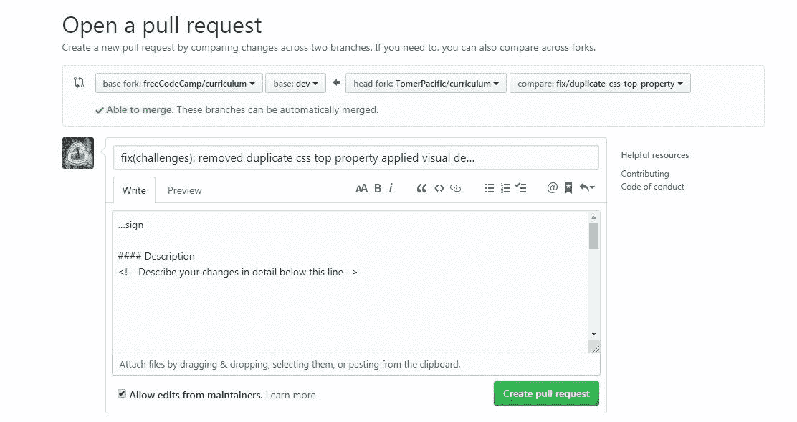

# 如何为开源存储库做贡献

> 原文：<https://www.freecodecamp.org/news/how-to-contribute-to-an-open-source-repository/>

如果您正在阅读这篇文章，可以有把握地假设您已经听说过 Git。

您已经创建了一个或两个分支，您知道如何编写合适的提交消息，并且您了解向分支提交和推送提交的基本知识。

如果所有这些行话对你来说几乎是胡言乱语，我强烈建议你去阅读一下关于 [Git](https://git-scm.com/doc) 的基础知识。

我还可以假设您阅读这篇文章有两个原因:

1.  你想帮助别人，是一个真正利他的人
2.  你想让你的简历更令人印象深刻

这两个理由都站得住脚，平心而论，如果在帮助别人的过程中，你也在造福自己，那也没什么坏处，对吧？

# 为什么要投稿？

如果你还不相信为什么你的 ****应该**** 贡献给其他库，让我给出一些支持这样做的有力证据。通过参与任何开源项目:

*   您将学习如何管理代码并与其他人交流
*   你被认为是一个对编码积极主动并充满热情的人
*   您将接触到各种技术和不同的代码方法

# 从哪里开始

跳入一个存储库看起来令人生畏，因为每个项目在规模和编码语言上都可能不同。此外，每个项目都可以有针对贡献者的特定规则和指导方针。为了让你轻松地成为一名贡献者，以下是我的一些建议:

1.  不要一头扎进一个用你不熟悉的编码语言编写的项目中。选择一个你了解编码语言的输入和输出的库
2.  大多数开源存储库缺乏文档。一个简单的切入点可以是编辑现有的文档或者帮助创建一个项目文档
3.  需要帮助的开源软件仓库在问题上有一个特殊的标签， ****【需要帮助】**** 。更重要的是，你最有可能处理的问题是那些标有 ****【欢迎第一次来】**** 的问题
4.  ****不要害怕提问**** 。如果运行项目所需的开发环境不适合您，请告知他人。如果您不确定如何解决问题，或者您的解决方法是否正确，请发表评论
5.  如果你对解决一个问题感到不舒服，你总是可以检查项目并为他们打开问题

## Git 贡献周期

一旦你选择了一个要解决的问题，并通知项目成员你正在处理这个问题，是时候完成一些工作了。首先，你将需要 ****叉**** 这个资源库。

这可以通过点击每个存储库右上角的 fork 按钮来完成。这将在您的 GitHub 帐户中创建一个存储库副本。然后，你需要将 ****中的**** 项目从你的账户克隆到你的机器上，这样你就有了项目的本地副本。

一旦你做到了这一点， ******确保完全按照项目的自述文件****** 设置开发环境。当环境准备就绪时，您可以为您正在修复的问题创建一个分支。分支名称最常见的约定可以是"****fix/issue-that-to-be-fixed****"或"****feature/issue-that-be-fixed****"的格式。接下来，进行更改以解决问题并提交它们。确保提供描述性的提交消息。一些存储库在这些方面也有指导方针，所以请确保您了解这些指导方针，否则您将来的拉取请求将会被拒绝。

剩下要做的是 ****将您的提交**** 推送到您的本地分支。然后，如果你进入你的 GitHub 账户中的存储库，你会在页面的顶部看到一个通知，详细说明你的 push 到你的分支机构，有一个标有“****compare&pull request****的按钮。

单击该按钮会将您转到一个页面，您将在该页面上为存储库的所有者打开一个拉取请求。通常会详细说明您所做的更改，并链接到该拉取请求所解决的问题。填写完所有内容后，您可以点击标记为“ ****的按钮，创建拉动式请求**** 。

一旦您的更改被批准，您就可以删除您正在处理的分支。

## 分叉→克隆→提交→重复

就是这样！整个过程有一个轻微的学习曲线，但一旦做得正确，你会得到它的窍门。

****何去何从？**** 嗯，有太多的[储存库](https://github.com/search?q=first-contributions)可以让你模拟整个循环。

一旦你感到足够自信，你就可以[搜索](https://findanissue.com/)库来为之做出贡献。

你还在等什么？开始投稿吧。