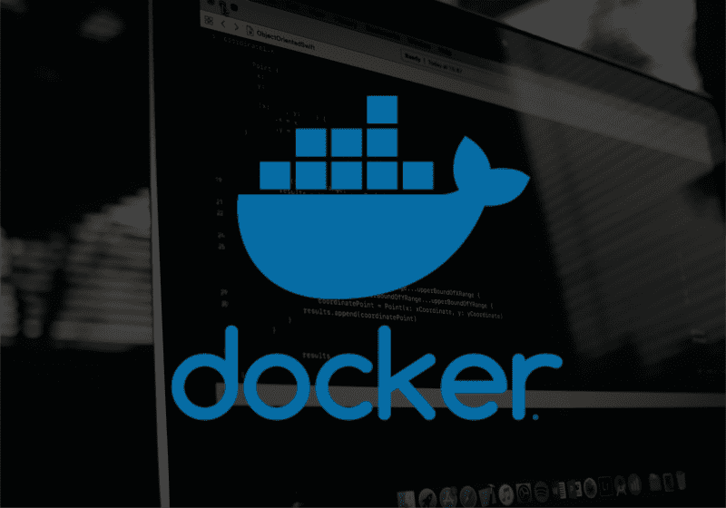
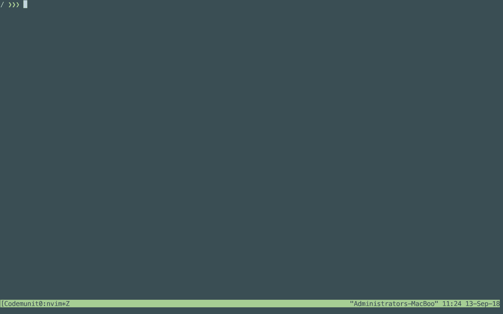

# 如何对接 Scala 和 Akka HTTP 应用——最简单的方法

> 原文：<https://www.freecodecamp.org/news/how-to-dockerise-a-scala-and-akka-http-application-the-easy-way-23310fc880fa/>

米格尔·洛佩兹

# 如何对接 Scala 和 Akka HTTP 应用——最简单的方法



如今使用 Docker 是一种必然。在本教程中，我们将学习如何 dockeriseise 我们的 Scala 和 Akka HTTP 应用程序**甚至不需要**自己创建 docker 文件。

出于本教程的目的，我们假设 Docker 已经安装在机器上。如果不是，请遵循[官方文档](https://docs.docker.com/install/)。

为了自动创建我们项目的 Dockerfile，我们将使用 [sbt-native-packager](https://sbt-native-packager.readthedocs.io/en/stable/index.html) 插件。

对于本教程，您可以使用任何 Scala 或 Akka HTTP 项目。我们将使用下面的[库](https://github.com/Codemunity/akkahttp-quickstart)，随意克隆它，并确保检查分支`6.5-testing-directives`。

### 添加插件

首先，我们需要将插件添加到项目的`project/plugins.sbt`文件中。如果文件不存在，我们需要创建它，然后添加下面一行:

```
addSbtPlugin("com.typesafe.sbt" % "sbt-native-packager" % "1.3.6")
```

然后我们需要启用我们的`build.sbt`文件中的插件。在顶部添加以下一行:

```
enablePlugins(JavaAppPackaging)
```

启用这个插件也允许我们为我们的应用程序创建一个可执行文件。在项目根目录下运行`sbt stage`。

现在我们可以通过运行`./target/universal/stage/bin/akkahttp-quickstart`来执行我们的应用程序。您应该会看到一条`Success!`消息。如果你向`localhost:9000/todos`发送一个 GET 请求，你会得到几个 todos。


### 记录我们的申请

是时候开始玩弄 Docker 了。

让我们从为应用程序生成 docker 文件开始。运行`sbt docker:stage`，然后运行`cat target/docker/stage/Dockerfile`查看其内容:

```
FROM openjdk:latestWORKDIR /opt/dockerADD --chown=daemon:daemon opt /optUSER daemonENTRYPOINT ["/opt/docker/bin/akkahttp-quickstart"]CMD []
```

很简单。它最终会运行一个类似于我们之前生成并运行的二进制文件。

我们可以手动使用 Docker 文件构建 Docker 映像，但是有一种更方便的方法。让我们运行`sbt docker:publishLocal.`,顾名思义，它会将我们的应用程序的 Docker 映像发布到我们的本地注册中心。

运行`docker images`，您应该会看到以下条目:

```
REPOSITORY            TAG     IMAGE ID       CREATED          SIZEakkahttp-quickstart   0.1     d03732dd0854   42 seconds ago   774MB
```

我们现在可以使用 Docker 运行我们的应用程序了。

运行`docker run akkahttp-quickstart:0.1`，你应该再次看到`Success!`消息。

但是这一次，如果我们试图查询我们的应用程序，我们将得到一个错误:



让我们运行`docker ps`来获得一些关于我们正在运行的 Docker 进程的信息(输出略):

```
CONTAINER ID     IMAGE                       PORTS            NAMES9746162d4723     akkahttp-quickstart:0.1                      serene_agnesi
```

正如我们所看到的，没有暴露端口，所以没有办法与我们的应用程序通信。

默认情况下，Docker 中的应用程序在其网络中运行。有多种方式允许 Docker 进程和主机之间的通信。最简单的方法是公开一个端口。

点击`Ctrl-C`或运行`docker stop $CONTAINER_ID`，停止正在运行的应用程序。

这一次当我们运行它时，我们也将公开各自的端口:

```
docker run -p 9000:9000 akkahttp-quickstart:0.1
```

我们现在能够查询我们的 dockerised 应用程序:


### 定制我们的设置

对于现有的设置，我们可能想做几件事:

*   如果我们想要一个不同的图像名称呢？
*   如果我们想使用不同的端口呢？
*   我们能有一个更亮的图像吗？

让我们来探索这些常见的用例。

#### 更改图像名称

如果我们查看[插件的官方文档](https://sbt-native-packager.readthedocs.io/en/stable/formats/docker.html)，我们会发现有很多选项我们可以改变。

读一读，看看你还能定制什么。

要更改图像名称，我们可以修改我们的`build.sbt`文件中的`packageName`属性，在`scalaVersion`属性后添加下面一行:

```
packageName in Docker := "dockerised-akka-http"
```

我们再公布一下图像。运行`sbt docker:publishLocal`。我们可以通过运行`docker images`来检查我们是否有一个新的映像:

```
REPOSITORY            TAG   IMAGE ID       CREATED          SIZE akkahttp-quickstart   0.1   d03732dd0854   42 minutes ago   774MB dockerised-akka-http  0.1   d03732dd0854   42 minutes ago   774MB
```

现在我们有两个图像，原始图像和新图像。厉害！

#### 更改端口

如果不修改代码，我们就无法改变应用程序正在监听的端口。在我们的应用程序中，端口是硬编码的。理想情况下，我们会从一个环境变量中读取它，也许有一个作为缺省值。

不过没关系。因为我们的应用程序运行在不同的网络中，所以我们可以将不同的端口映射到内部 9000 端口。

当我们指定标志`-p 9000:9000`时，我们说主机中的端口 9000 将映射到我们进程网络中的端口 9000。让我们试着改变这一点。

运行`docker run -p 5000:9000 dockerised-akka-http:0.1`用不同的端口运行我们的新映像。

我们可以查询`todos`以确保它按预期工作:


#### 让我们的形象更明亮

在我们的最后一个实验中，我们将尝试使我们的图像更亮。此时它使用了超过 700MB。

首先，让我们增加版本，这样我们可以得到一个不同的标签，并可以比较它们。然后在我们改变`packageName`的地方加上上面的`dockerBaseImage := "openjdk:8-jre-alpine"`。我们的`build.sbt`现在看起来像:

```
enablePlugins(JavaAppPackaging)
```

```
name := "akkahttp-quickstart"version := "0.2"scalaVersion := "2.12.6"
```

```
dockerBaseImage := "openjdk:8-jre-alpine"packageName in Docker := "dockerised-akka-http"
```

```
val akkaVersion = "2.5.13"val akkaHttpVersion = "10.1.3"val circeVersion = "0.9.3"
```

```
libraryDependencies ++= Seq(  "com.typesafe.akka" %% "akka-actor" % akkaVersion,  "com.typesafe.akka" %% "akka-testkit" % akkaVersion % Test,  "com.typesafe.akka" %% "akka-stream" % akkaVersion,  "com.typesafe.akka" %% "akka-stream-testkit" % akkaVersion % Test,  "com.typesafe.akka" %% "akka-http" % akkaHttpVersion,  "com.typesafe.akka" %% "akka-http-testkit" % akkaHttpVersion % Test,  "io.circe" %% "circe-core" % circeVersion,  "io.circe" %% "circe-generic" % circeVersion,  "io.circe" %% "circe-parser" % circeVersion,  "de.heikoseeberger" %% "akka-http-circe" % "1.21.0",  "org.scalatest" %% "scalatest" % "3.0.5" % Test)
```

我们使用`openjdk`基础映像的不同标签来指定我们想要使用`alpine`，它是一个轻量级的 Linux 发行版。

通过运行`sbt docker:publishLocal`发布图像。用`docker images`获取图像。我们可以看到图像现在变亮了:

```
REPOSITORY             TAG   IMAGE ID       CREATED          SIZE dockerised-akka-http   0.2   4688366e70bb   32 seconds ago   119MB akkahttp-quickstart    0.1   d03732dd0854   2 hours ago      774MBdockerised-akka-http   0.1   d03732dd0854   2 hours ago      774MB
```

让我们确保它仍然工作。

运行`docker run -p 5000:9000 dockerised-akka-http:0.2`，注意标签号。它不工作，我们得到以下错误:

```
env: can't execute 'bash': No such file or directory
```

显然，我们的 dockerised 应用程序需要 **bash** 才能运行。阅读[插件的文档](https://sbt-native-packager.readthedocs.io/en/stable/archetypes/java_app/index.html?highlight=bash)，我们可以知道它生成了一个 bash 脚本来执行我们的应用程序。

所以让我们在映像中安装 bash，然后再试一次。

在下面我们更改`build.sbt`文件中的`packageName`的地方添加以下几行:

```
import com.typesafe.sbt.packager.docker._dockerCommands ++= Seq(  Cmd("USER", "root"),  ExecCmd("RUN", "apk", "add", "--no-cache", "bash"))
```

我们正在我们的 Dockefile 中添加一些额外的命令。我们将用户改为`root`来安装包，然后安装 bash。

让我们再次尝试运行应用程序，`docker run -p 5000:9000 dockerised-akka-http:0.2`。而且现在工作了，太好了！

如果我们再次检查图像，基于 **alpine** 的要大一点，大概 10MB。与其他大约 770MB 的内存相比，这根本不算什么。

在 **alpine** 中安装 bash 并不是世界上最糟糕的事情。有些人出于自己的偏好和为了调试，最终还是添加了它。

### 生成 Ash 兼容的可执行文件

在我们的映像上安装 bash 是一种变通方法。让我们使用一个额外的插件来生成一个与 Alpine 兼容的可执行文件。感谢 [Muki 卖家](http://disq.us/p/1vwhg62)让我们了解这个解决方案！

根据[官方文档](https://sbt-native-packager.readthedocs.io/en/stable/formats/docker.html#busybox-ash-support)，我们需要启用额外插件`AshScriptPlugin`。

修改`build.sbt`文件以启用这两个插件，并删除之前的解决方法:

```
enablePlugins(JavaAppPackaging, AshScriptPlugin)
```

```
name := "akkahttp-quickstart"version := "0.3"scalaVersion := "2.12.6"
```

```
dockerBaseImage := "openjdk:8-jre-alpine"packageName in Docker := "dockerised-akka-http"
```

```
val akkaVersion = "2.5.13"val akkaHttpVersion = "10.1.3"val circeVersion = "0.9.3"
```

```
libraryDependencies ++= Seq(  "com.typesafe.akka" %% "akka-actor" % akkaVersion,  "com.typesafe.akka" %% "akka-testkit" % akkaVersion % Test,  "com.typesafe.akka" %% "akka-stream" % akkaVersion,  "com.typesafe.akka" %% "akka-stream-testkit" % akkaVersion % Test,  "com.typesafe.akka" %% "akka-http" % akkaHttpVersion,  "com.typesafe.akka" %% "akka-http-testkit" % akkaHttpVersion % Test,
```

```
 "io.circe" %% "circe-core" % circeVersion,  "io.circe" %% "circe-generic" % circeVersion,  "io.circe" %% "circe-parser" % circeVersion,  "de.heikoseeberger" %% "akka-http-circe" % "1.21.0",
```

```
 "org.scalatest" %% "scalatest" % "3.0.5" % Test)
```

我们还增加了版本，这样我们可以比较并避免覆盖以前的版本。

运行`sbt docker:publishLocal`，然后运行`docker run dockerised-akka-http:0.3`。

您应该会看到成功消息，如果您查询待办事项，也应该会看到它们。太好了！

### 结论

在本教程中，我们编写了一个 Scala 和 Akka HTTP 应用程序。没有专门为这个应用程序做任何事情，这意味着设置将像现在这样工作。

然后我们看了如何通过插件定制 Dockerfile 来完成一些常见的用例。

我们甚至设法将图像尺寸缩小了近七倍！

很神奇，不是吗？

如果你喜欢这个教程，并且想学习如何为一个 todo 应用程序构建一个 API，请查看我们的[新**免费**课程](https://codemunity-courses.thinkific.com/courses/akka-http-quickstart/)！？？？

最初发布于[www . code unity . io](https://www.codemunity.io/tutorials/dockerising-akka-http/)。