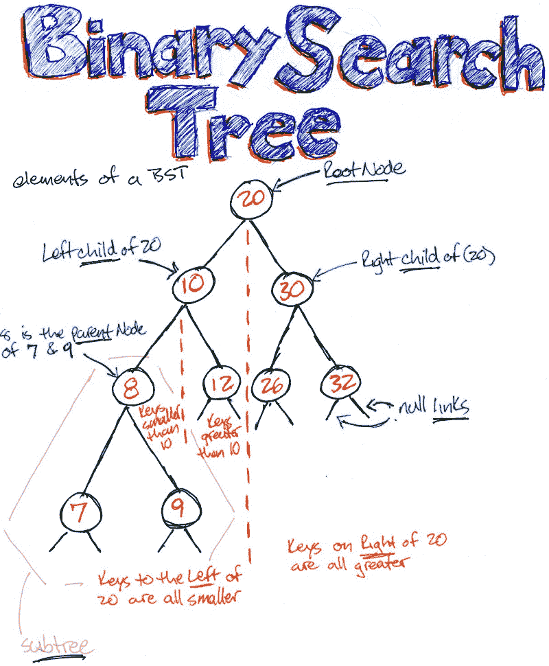
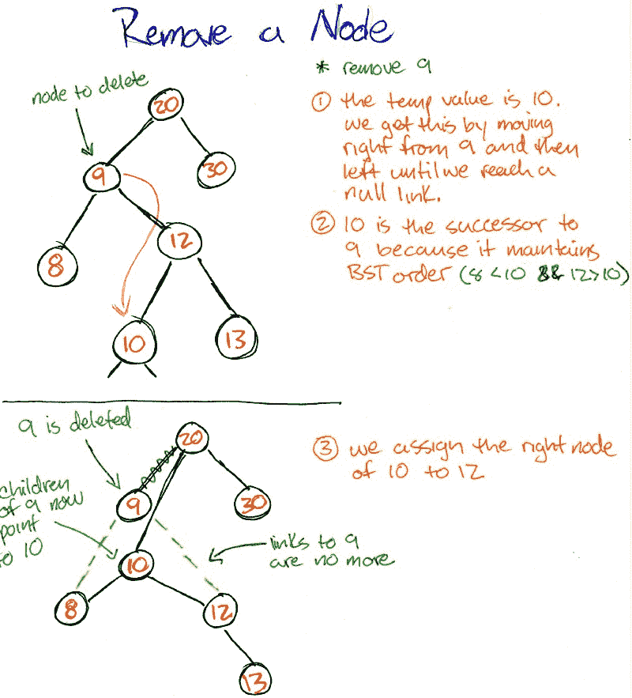

# 数据结构 101:二叉查找树

> 原文：<https://www.freecodecamp.org/news/data-structures-101-binary-search-tree-398267b6bff0/>

凯文·特尼

# 数据结构 101:二分搜索法树

#### 如何结合链表插入的效率和有序数组的快速搜索？


“leafless tree on the hill” by [Fabrice Villard](https://unsplash.com/@fabulu75?utm_source=medium&utm_medium=referral) on [Unsplash](https://unsplash.com?utm_source=medium&utm_medium=referral)

### 什么是二叉查找树？

让我们从基本术语开始，这样我们可以共享相同的语言并研究相关的概念。首先，定义二叉查找树的原则是什么？

*从现在开始，为了简洁起见，我将使用“BST”

BST 被认为是由**节点**组成的数据结构，就像 [**链表**](https://medium.freecodecamp.org/data-structures-101-linked-lists-254c82cf5883) ***。*** 这些节点要么为空，要么有到其他节点的引用(链接)。这些“其他”节点是子节点，称为左节点和右节点。节点有**值**。这些值决定了它们在 BST 中的位置。

类似于链表，每个节点只被**引用**一个其他节点，它的父节点(除了根节点)。因此，我们可以说 BST 中的每个节点本身就是一个 BST。因为沿着树往下，我们到达另一个节点，这个节点有左和右。根据我们走的方向，这个节点有左和右，依此类推。

1.左侧节点总是小于其父节点。

2.右侧节点总是大于其父节点。

3.如果除了最后一级之外，树的每一级都被完全填充，则 BST 被认为是平衡的。在最后一层，树从左到右填充。

4.完美的 BST 是既完整又完整的(所有子节点都在同一层上，并且每个节点都有一个左右子节点)。



### 我们为什么要用这个？

BST 的一些真实例子是什么？树经常用于搜索、游戏逻辑、自动完成任务和图形。

速度。如前所述，BST 是一种有序的数据结构。插入时，节点以有序的方式放置。这种固有的顺序使得搜索速度很快。类似于二分搜索法(使用已排序的数组)，我们每次都要将排序的数据量减半。例如，假设我们正在寻找一个小的节点值。在每一遍中，我们继续沿着最左边的节点移动。这将自动消除一半的较大值！

此外，与数组不同，数据是通过引用存储的。当我们增加数据结构时，我们在内存中创建一个新的块并链接到它。这比创建一个具有更多空间的新数组，然后将数据从较小的数组插入到较大的新数组中要快。

简而言之，插入、删除和搜索是 BST 的全明星

既然我们已经理解了 BST 的原理、优点和基本组件，那么让我们用 javascript 实现一个 BST。

BST 的 API 包括以下内容:**插入、包含、获取最小值、获取最大值、移除节点、检查是否已满、是否平衡**，以及搜索类型— **深度优先(前序、中序、后序)、广度优先搜索**，最后**获取高度**。那是一个很大的 API，一段一段来就好了。

### **实施**

**构造者**

BST 由节点组成，每个节点都有一个值。

```
function Node(value){  this.value = value;  this.left = null;  this.right = null;}
```

BST 构造函数由一个根节点组成。

```
function BinarySearchTree() { this.root = null;}
```

```
let bst = new BST();let node = new Node();
```

```
console.log(node, bst); // Node { value: undefined, left: null, right: null } BST { root: null }
```

…到目前为止一切顺利。

### 插入

```
BinarySearchTree.prototype.insert = function(value){ let node = new Node(value); if(!this.root) this.root = node; else{    let current = this.root;    while(!!current){       if(node.value < current.value){       if(!current.left){           current.left = node;           break;         }         current = current.left;         }        else if(node.value > current.value){         if(!current.right){            current.right = node;            break;           }          current = current.right;          }         else {          break;           }         }        }    return this; };
```

```
let bst = new BST();bst.insert(25); // BST { root: Node { value: 25, left: null, right: null } }
```

让我们再添加一些值。

```
bst.insert(40).insert(20).insert(9).insert(32).insert(15).insert(8).insert(27);
```

```
BST { root:  Node { value: 25, left: Node { value: 20, left: [Object], right: null }, right: Node { value: 40, left: [Object], right: null } } }
```

想要一个很酷的视觉效果[请点击这里](http://btv.melezinek.cz/binary-search-tree.html)！！

让我们打开这个。

1.  首先，我们传递一个值并创建一个新节点
2.  检查是否有根，如果没有，将这个新创建的节点设置为根节点
3.  如果有根节点，我们创建一个声明为“current”的变量，并将其值设置为根节点
4.  如果新创建的 node.value 小于根节点，我们将向左移动
5.  我们一直将这个 node.value 与左边的节点进行比较。
6.  如果这个值足够小，并且我们到达了一个没有剩余节点的点，我们把这个项目放在这里。
7.  如果 node.value 更大，除了向右移动之外，我们重复上面相同的步骤。
8.  我们需要 break 语句，因为没有 count 步骤来终止 while 循环。

### 包含

这是一个非常简单的方法。

```
BinarySearchTree.prototype.contains = function(value){ let current = this.root; while(current){ if(value === current.value) return true; if(value < current.value) current = current.left; if(value > current.value) current = current.right; } return false;};
```

### 得到 Min，得到 Max。

继续向左遍历到最小值，或向右遍历到最大值。

```
BinarySearchTree.prototype.getMin = function(node){ if(!node) node = this.root; while(node.left) { node = node.left; } return node.value};
```

```
BinarySearchTree.prototype.getMax = function(node){ if(!node) node = this.root; while(node.right) { node = node.right; } return node.value;};
```

### 搬迁

删除一个节点是最棘手的操作，因为节点必须重新排序才能保持 BST 的属性。一种情况是一个节点只有一个子节点，另一种情况是既有左节点又有右节点。我们使用较大的辅助函数来完成繁重的工作。

```
BinarySearchTree.prototype.removeNode = function(node, value){ if(!node){   return null; } if(value === node.value){ // no children if(!node.left && !node.right) return null; // one child and it’s the right if(!node.left) node.right;// one child and it’s the left if(!node.right) node.left;  // two kids const temp = this.getMin(node.right); node.value = temp; node.right = this.removeNode(node.right, temp); return node; } else if(value < node.value) {     node.left = this.removeNode(node.left, value);     return node; } else  {     node.right = this.removeNode(node.right, value);     return node;   }};
```

```
BinarySearchTree.prototype.remove = function(value){ this.root = this.removeNode(this.root, value);};
```

它是这样工作的…

与 deleteMin 和 deleteMax 不同，在 delete min 和 delete max 中，我们可以一直向左或向右遍历并挑选出最后一个值，我们必须取出一个节点，然后用它替换。这个解决方案是由 T. Hibbard 在 1962 年提出的。我们考虑这样一种情况，我们可以删除只有一个子节点或者没有子节点的节点，这是次要的。如果没有孩子，没问题。如果有一个孩子在场，这个孩子只需向上移动一位。

但是，如果一个计划删除的节点有两个子节点，那么哪个子节点会取代它呢？当然，我们不能下移一个更大的节点。所以我们要做的是用它的继任者，下一个中枢来取代它。我们必须找到比左边的孩子大的右边最小的孩子。

1.  创建一个临时值，并在其右侧存储最小的节点。这样做是为了满足左边的值仍然较小，右边的值仍然较大的特性。
2.  将节点的值重置为此临时变量
3.  移除右侧节点。
4.  然后我们比较左边和右边的值，并确定赋值。

最好用一张图来解释这一点:



### 搜索

有两种类型的搜索，深度优先和广度优先。广度优先就是在下降的过程中每一层都停下来。看起来是这样的:我们从根开始，然后是左边的孩子，然后是右边的孩子。移动到下一级，左边的孩子，然后是右边的孩子。把这个想象成水平移动。我们使用，我应该说模拟，一个队列来帮助排序过程。我们传递一个函数，因为很多时候我们想对一个值进行操作。

```
BinarySearchTree.prototype.traverseBreadthFirst = function(fn) { let queue = []; queue.push(this.root); while(!!queue.length) {   let node = queue.shift();   fn(node);   node.left && queue.push(node.left);   node.right && queue.push(node.right);  }}
```

深度优先搜索包括以指定的方式，前序、中序或后序，向下移动 BST。我将很快解释它们的区别。

本着简洁代码的精神，我们有一个基本的 traverseDepthFirst 函数，我们传递一个函数和一个方法。同样，函数意味着我们希望对值做一些事情，而方法是我们希望执行的搜索类型。在 traverseDFS 中，我们有一个后备:预订搜索。

现在，每一个有什么不同？首先，让我们按顺序调度。它应该是不言自明的，但事实并非如此。我们指的是按插入顺序，从高到低还是从低到高？我只是想让你事先考虑一下这些事情。在这种情况下，是的，它确实意味着从最低到最高。

**preOrder** 可以被认为是**父节点，左边的子节点，然后右边的子节点*。***

**后序**为**左子，右子，父*。***

```
BinarySearchTree.prototype.traverseDFS = function(fn, method){ let current = this.root; if(!!method) this[method](current, fn); else this._preOrder(current, fn);};
```

```
BinarySearchTree.prototype._inOrder = function(node, fn){ if(!!node){ this._inOrder(node.left, fn); if(!!fn) fn(node); this._inOrder(node.right, fn); }};
```

```
BinarySearchTree.prototype._preOrder = function(node, fn){ if(node){ if(fn) fn(node); this._preOrder(node.left, fn); this._preOrder(node.right, fn); }};
```

```
BinarySearchTree.prototype._postOrder = function(node, fn){ if(!!node){ this._postOrder(node.left, fn); this._postOrder(node.right, fn); if(!!fn) fn(node); }};
```

### **检查 BST 是否已满**

记住前面的内容，如果每个节点都有零个或两个孩子，那么 BST 就是满的。

```
// a BST is full if every node has zero two children (no nodes have one child)
```

```
BinarySearchTree.prototype.checkIfFull = function(fn){ let result = true; this.traverseBFS = (node) => {   if(!node.left && !node.right) result = false;   else if(node.left && !node.right) result = false;  } return result;};
```

### 获取 BST 的高度

求树的高度是什么意思？为什么这很重要？这就是时间复杂度发挥作用的地方。基本操作与树的高度成正比。因此，正如我们前面提到的，如果我们搜索一个特定的值，我们在每一步都要做一半的运算。

也就是说，如果我们有一条面包，把它切成两半，然后把那一半也切成两半，一直这样做，直到我们得到我们想要的那块面包。

在计算机科学中，这被称为 O(log n)。我们从某种输入大小开始，随着时间的推移，这个大小会变小(有点变平)。直接线性搜索表示为 O(n ),随着输入大小的增加，运行操作所需的时间也会增加。O(n)在概念上是一条 45 度线，在图表上从原点零开始向右移动。水平刻度表示输入的大小，垂直刻度表示完成输入所需的时间。

常数时间为 O(1)。无论输入大小如何，操作都在相同的时间内进行。例如，数组的 push()和 pop() off 是常数时间。在哈希表中查找一个值是常量时间。

我将在以后的文章中对此进行更多的解释，但是现在我想用这些知识来武装你。

**回到高度。**

我们有一个递归函数，我们的基本情况是:**'如果我们没有节点，那么我们从 this.root' *'开始。*** 这意味着我们可以从树中较低的值开始，得到树的子高度。

因此，如果我们传入 this.root 开始，我们递归地向下移动树，并将函数调用添加到执行堆栈(其他文章在这里)。当我们到达底部时，堆栈被填满。然后调用被执行，我们比较左边的高度和右边的高度，然后加 1。

```
BinarySearchTree.prototype._getHeights = function(node){ if(!node) return -1; let left = this._getHeights(node.left); let right = this._getHeights(node.right); return Math.max(left, right) + 1;};
```

```
BinarySearchTree.prototype.getHeight = function(node){ if(!node) node = this.root; return this._getHeights(node);};
```

### 最后，是平衡的

我们正在做的是检查树是否在每一层都被填充，在最后一层，是否从左到右被填充。

```
BinarySearchTree.prototype._isBalanced = function(node){ if(!node) return true; let heightLeft = this._getHeights(node.left); let heightRight = this._getHeights(node.right); let diff = Math.abs(heightLeft — heightRight); if(diff > 1) return false; else return this._isBalanced(node.left) &&    this._isBalanced(node.right);};
```

```
BinarySearchTree.prototype.isBalanced = function(node){ if(!node) node = this.root; return this._isBalanced(node);};
```

### 打印

使用这个来可视化你看到的所有方法，尤其是深度优先和广度优先遍历。

```
BinarySearchTree.prototype.print = function() { if(!this.root) {   return console.log(‘No root node found’); } let newline = new Node(‘|’); let queue = [this.root, newline]; let string = ‘’; while(queue.length) {   let node = queue.shift();   string += node.value.toString() + ‘ ‘;   if(node === newline && queue.length) queue.push(newline);    if(node.left) queue.push(node.left);   if(node.right) queue.push(node.right);  } console.log(string.slice(0, -2).trim());};
```

**我们的朋友 Console.log！！玩一玩，做做实验。**

```
const binarySearchTree = new BinarySearchTree();binarySearchTree.insert(5);binarySearchTree.insert(3);
```

```
binarySearchTree.insert(7);binarySearchTree.insert(2);binarySearchTree.insert(4);binarySearchTree.insert(4);binarySearchTree.insert(6);binarySearchTree.insert(8);binarySearchTree.print(); // => 5 | 3 7 | 2 4 6 8
```

```
binarySearchTree.contains(4);
```

```
//binarySearchTree.printByLevel(); // => 5 \n 3 7 \n 2 4 6 8console.log('--- DFS inOrder');
```

```
binarySearchTree.traverseDFS(function(node) { console.log(node.value); }, '_inOrder'); // => 2 3 4 5 6 7 8
```

```
console.log('--- DFS preOrder');
```

```
binarySearchTree.traverseDFS(function(node) { console.log(node.value); }, '_preOrder'); // => 5 3 2 4 7 6 8
```

```
console.log('--- DFS postOrder');
```

```
binarySearchTree.traverseDFS(function(node) { console.log(node.value); }, '_postOrder'); // => 2 4 3 6 8 7 5
```

```
console.log('--- BFS');
```

```
binarySearchTree.traverseBFS(function(node) { console.log(node.value); }); // => 5 3 7 2 4 6 8
```

```
console.log('min is 2:', binarySearchTree.getMin()); // => 2
```

```
console.log('max is 8:', binarySearchTree.getMax()); // => 8
```

```
console.log('tree contains 3 is true:', binarySearchTree.contains(3)); // => true
```

```
console.log('tree contains 9 is false:', binarySearchTree.contains(9)); // => false
```

```
// console.log('tree height is 2:', binarySearchTree.getHeight()); // => 2
```

```
console.log('tree is balanced is true:', binarySearchTree.isBalanced(),'line 220'); // => true
```

```
binarySearchTree. remove(11); // remove non existing node
```

```
binarySearchTree.print(); // => 5 | 3 7 | 2 4 6 8
```

```
binarySearchTree.remove(5); // remove 5, 6 goes up
```

```
binarySearchTree.print(); // => 6 | 3 7 | 2 4 8
```

```
console.log(binarySearchTree.checkIfFull(), 'should be true');
```

```
var fullBSTree = new BinarySearchTree(10);
```

```
fullBSTree.insert(5).insert(20).insert(15).insert(21).insert(16).insert(13);
```

```
console.log(fullBSTree.checkIfFull(), 'should be true');
```

```
binarySearchTree.remove(7); // remove 7, 8 goes up
```

```
binarySearchTree.print(); // => 6 | 3 8 | 2 4
```

```
binarySearchTree.remove(8); // remove 8, the tree becomes unbalanced
```

```
binarySearchTree.print(); // => 6 | 3 | 2 4
```

```
console.log('tree is balanced is false:', binarySearchTree.isBalanced()); // => true
```

```
console.log(binarySearchTree.getHeight(),'height is 2')
```

```
binarySearchTree.remove(4);
```

```
binarySearchTree.remove(2);
```

```
binarySearchTree.remove(3);
```

```
binarySearchTree.remove(6);
```

```
binarySearchTree.print(); // => 'No root node found'
```

```
//binarySearchTree.printByLevel(); // => 'No root node found'
```

```
console.log('tree height is -1:', binarySearchTree.getHeight()); // => -1
```

```
console.log('tree is balanced is true:', binarySearchTree.isBalanced()); // => true
```

```
console.log('---');
```

```
binarySearchTree.insert(10);
```

```
console.log('tree height is 0:', binarySearchTree.getHeight()); // => 0
```

```
console.log('tree is balanced is true:', binarySearchTree.isBalanced()); // => true
```

```
binarySearchTree.insert(6);
```

```
binarySearchTree.insert(14);
```

```
binarySearchTree.insert(4);
```

```
binarySearchTree.insert(8);
```

```
binarySearchTree.insert(12);
```

```
binarySearchTree.insert(16);
```

```
binarySearchTree.insert(3);
```

```
binarySearchTree.insert(5);
```

```
binarySearchTree.insert(7);
```

```
binarySearchTree.insert(9);
```

```
binarySearchTree.insert(11);
```

```
binarySearchTree.insert(13);
```

```
binarySearchTree.insert(15);
```

```
binarySearchTree.insert(17);
```

```
binarySearchTree.print(); // => 10 | 6 14 | 4 8 12 16 | 3 5 7 9 11 13 15 17
```

```
binarySearchTree.remove(10); // remove 10, 11 goes up
```

```
binarySearchTree.print(); // => 11 | 6 14 | 4 8 12 16 | 3 5 7 9 x 13 15 17
```

```
binarySearchTree.remove(12); // remove 12; 13 goes up
```

```
binarySearchTree.print(); // => 11 | 6 14 | 4 8 13 16 | 3 5 7 9 x x 15 17
```

```
console.log('tree is balanced is true:', binarySearchTree.isBalanced()); // => true
```

```
//console.log('tree is balanced optimized is true:', binarySearchTree.isBalancedOptimized()); // => true
```

```
binarySearchTree.remove(13); // remove 13, 13 has no children so nothing changes
```

```
binarySearchTree.print(); // => 11 | 6 14 | 4 8 x 16 | 3 5 7 9 x x 15 17
```

```
console.log('tree is balanced is false:', binarySearchTree.isBalanced()); // => false
```

```
// yields ...5 | 3 7 | 2 4 6 8--- DFS inOrder2345678--- DFS preOrder5324768--- DFS postOrder2436875--- BFS5372468min is 2: 2max is 8: 8tree contains 3 is true: truetree contains 9 is false: falsetree is balanced is true: true line 2205 | 3 7 | 2 4 6 86 | 3 7 | 2 4 8true 'should be true'true 'should be true'6 | 3 8 | 2 46 | 3 | 2 4tree is balanced is false: false2 'height is 2'No root node foundtree height is -1: -1tree is balanced is true: true---tree height is 0: 0tree is balanced is true: true10 | 6 14 | 4 8 12 16 | 3 5 7 9 11 13 15 1711 | 6 14 | 4 8 12 16 | 3 5 7 9 13 15 1711 | 6 14 | 4 8 13 16 | 3 5 7 9 15 17tree is balanced is true: true11 | 6 14 | 4 8 16 | 3 5 7 9 15 17tree is balanced is false: false
```

### 时间复杂度

1.插入 O(对数号)2。移除 O(log n)
3。搜索 O(登录号)

哇，那确实是许多信息。我希望这些解释尽可能的清晰和介绍性。同样，写作帮助我巩固概念，正如理查德·费曼所说，“一个人教，两个人学。”

### 资源

可能是可视化的最佳资源，一定要使用它:

[**数据结构可视化**](https://www.cs.usfca.edu/~galles/visualization/Algorithms.html)
[*大卫·加勒旧金山大学计算机科学*www.cs.usfca.edu](https://www.cs.usfca.edu/~galles/visualization/Algorithms.html)[**BinaryTreeVisualiser-二叉查找树**](http://btv.melezinek.cz/binary-search-tree.html)
[*站点描述此处*BTV . melezinek . cz](http://btv.melezinek.cz/binary-search-tree.html)[**visual go-二叉查找树，AVL Tree**](https://visualgo.net/en/bst?slide=1)
[*A 二叉查找树(BST)是一棵二叉树)@ ericdrowell*](https://visualgo.net/en/bst?slide=1)
[*你好啊！这个网页涵盖了计算机科学中常用算法的空间和时间复杂性。当…*www.bigocheatsheet.com](http://www.bigocheatsheet.com/)[**算法，第四版由罗伯特·塞奇威克和凯文·韦恩**](https://algs4.cs.princeton.edu/home/)
[*教科书算法，第四版由罗伯特·塞奇威克和凯文·韦恩调查最重要的算法和数据…*algs4.cs.princeton.edu](https://algs4.cs.princeton.edu/home/)[**二叉搜索树-维基百科**](https://en.wikipedia.org/wiki/Binary_search_tree)
[*在计算机科学中，二叉搜索树(BST)，有时称为有序或排序二叉树，是一种特殊类型…*en.wikipedia.org](https://en.wikipedia.org/wiki/Binary_search_tree)