# 如何将 ReactJS 与 Webpack 4、Babel 7 和 Material Design 一起使用

> 原文：<https://www.freecodecamp.org/news/how-to-use-reactjs-with-webpack-4-babel-7-and-material-design-ff754586f618/>

by Nazare Emanuel Ioan

# 如何将 ReactJS 与 Webpack 4、Babel 7 和 Material Design 一起使用

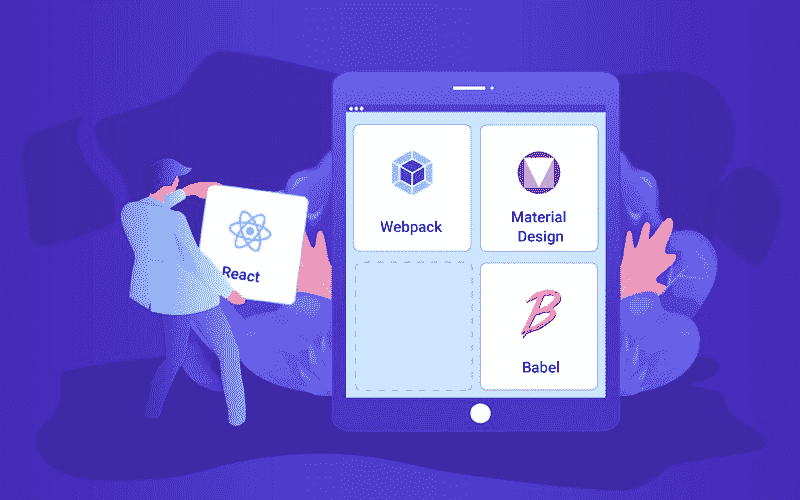

在过去的一年多时间里，我一直在创意时间与 React 一起工作。我一直在用[的 create-react-app](https://github.com/facebook/create-react-app) 开发一些不错的产品。已经有很多客户询问如何在 Webpack 上迁移我们的产品模板。

因此，在多次请求后，我们创建了这个小教程，讲述如何开始将 [React](https://reactjs.org/tutorial/tutorial.html) 与 [Webpack 4](https://webpack.js.org/concepts/) 和 [Babel 7](https://babeljs.io/docs/en) 一起使用。在教程的最后，我将向你们展示如何在新创建的应用程序上添加[材质仪表盘反应](https://www.creative-tim.com/product/material-dashboard-react)。

在我们开始之前，请确保您已经在您的计算机上全局安装了最新版本的 [npm](https://www.npmjs.com/get-npm) 和 [Nodejs](https://nodejs.org/en/) 。在我写这篇文章的时候，我的机器上 npm 的最新版本是 6.4.1，Nodejs 的最新版本是 8.12.0 (lts)。

### 使用 package.json 创建新的项目文件夹

首先，让我们为新的**应用**创建一个**新文件夹**，并输入:

```
mkdir react-webpack-babel-tutorialcd react-webpack-babel-tutorial
```

现在我们已经创建了**文件夹**，我们将在其中开发**应用**，我们需要向其中添加一个 **package.json** 文件。我们有两种方法，您应该选择其中一种:

1.  只需创建 **package.json** 文件，无需任何其他配置:

```
npm init -y
```

如您所见， **package.json** 文件已经创建，其中包含一些非常基本的信息。

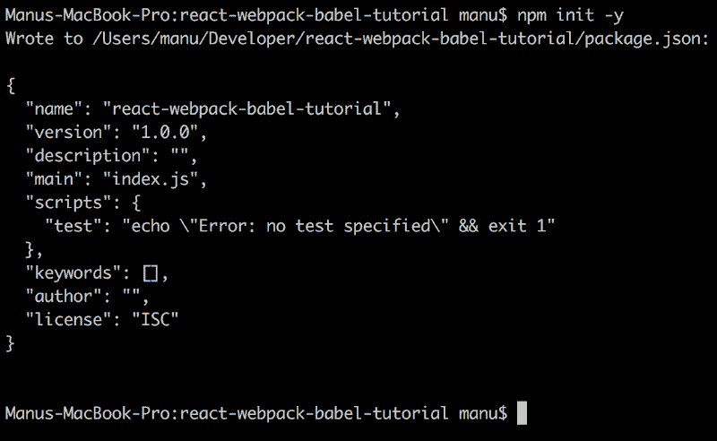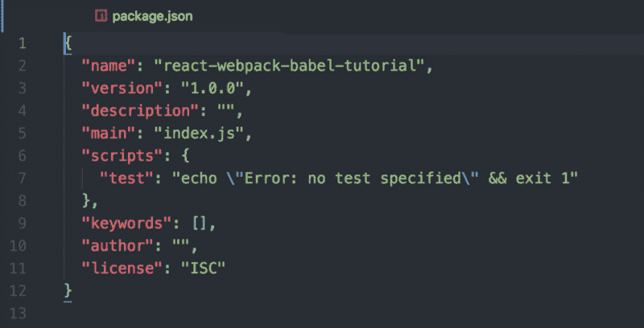

**npm init -y** output

2.用一些额外的配置设置创建 **package.json** 文件

```
npm init
```

我给我们新创建的 **package.json** 文件添加了一些东西，比如一些好听的**关键词**、**回购**等等…

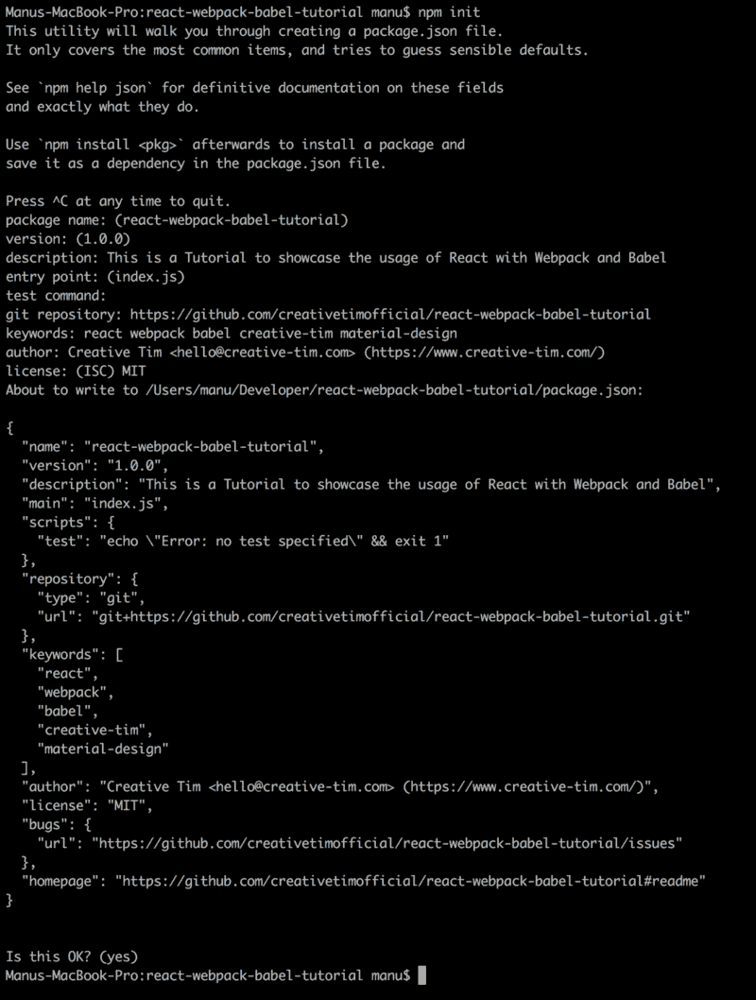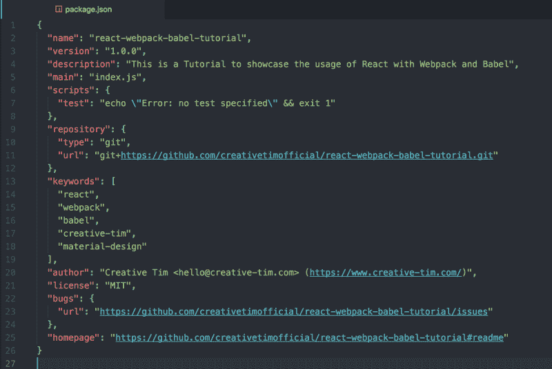

**npm init** output

在这之后，让我们将一个**index.html**和 **index.js** 文件添加到我们的新项目文件夹中，在一个 **src** 文件夹内。

1.  Linux/MacOS 命令

```
mkdir srctouch src/index.htmltouch src/index.js
```

2.Windows 命令

```
mkdir srcecho "" > src\index.htmlecho "" > src\index.js
```

在此之后，让我们将下面的模板添加到**index.html 中。**

```
<!DOCTYPE html><html lang="en">  <head>    <meta charset="utf-8">    <meta name="viewport" content="width=device-width, initial-scale=1, shrink-to-fit=no">    <meta name="theme-color" content="#000000">    <title>React Tutorial</title>  </head>  <body>    <noscript>      You need to enable JavaScript to run this app.    </noscript>    <div id="root"></div>    <!--      This HTML file is a template.      If you open it directly in the browser, you will see an empty page.      You can add webfonts, meta tags, or analytics to this file.      The build step will place the bundled scripts into the <body> tag.    -->  </body></html>
```

让我们在 **index.js** 中添加一些东西，只是为了我们将在下面看到的一些展示。

```
(function () {  console.log("hey mister");}());
```

这是我们目前得到的信息:

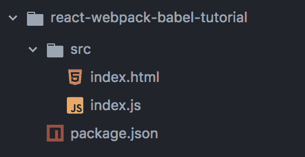

folder project structure

### 将 Webpack 添加到项目

让我们开始添加我们将需要的所有 **Webpack** 包。我们将把它们作为 **devDependencies** 安装，因为它们只在开发模式下使用。

```
npm install --save-dev webpack webpack-cli webpack-dev-server
```

*   [**web pack**](https://www.npmjs.com/package/webpack)
    ——用来配置我们的新 app
    ——在发这篇帖子的时候，版本是 ***4.19.0***
*   [**web pack-CLI**](https://www.npmjs.com/package/webpack-cli)
    -使用以便我们可以在命令行中使用 web pack
    -在这篇文章发表时，版本是 ***3.1.0***
*   [**【web pack-dev-server**](https://www.npmjs.com/package/webpack-dev-server)
    ——用于当我们对新应用程序中的文件进行更改时，我们不需要刷新页面。每当我们在我们的应用
    中改变一个文件时，它会自动刷新浏览器页面——正如它的名字所说，它是一个不停工作的服务器
    ——在这篇文章发表时，版本是 ***3.1.8***

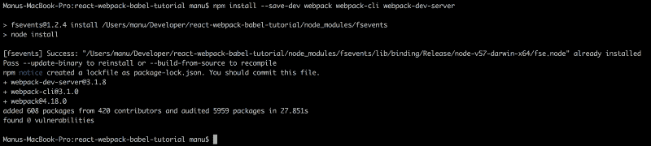

**npm install — save-dev webpack webpack-cli webpack-dev-server** output

如果我们查看一下 **package.json** 文件，我们会看到这三个包是这样添加到这个文件中的:

```
"devDependencies": {  "webpack": "^4.19.0",  "webpack-cli": "^3.1.0",  "webpack-dev-server": "^3.1.8"}
```

我将从每个版本中删除*(插入符号)。这是因为我不知道这些插件的下一个版本是否还能和我正在构建的一起工作。我觉得这是应该是常识的东西。当创建一个新的应用程序时，使用可用的版本，然后，可能会对新版本进行一些更新。你可能不知道新版本会破坏你的应用程序。*

*正如您将看到的，这些插件的安装对我们的项目文件夹做了一些更改。添加了 **node_modules** 文件夹和 **package-lock.json** 。*

*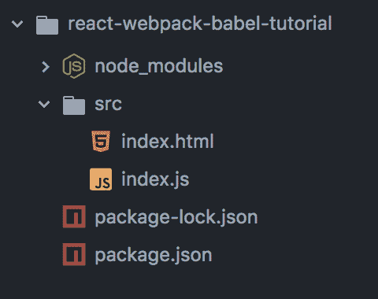

project folder after installing **webpack*** 

*现在，我们需要向我们的项目添加一个新文件，名为**web pack**的配置文件:*

1.  *Linux/MacOS 命令*

```
*`touch webpack.config.js`*
```

*2.Windows 命令*

```
*`echo "" > webpack.config.js`*
```

*或者，如果您不想使用命令行，可以简单地手动创建新文件。*

*在我们开始处理 **Webpack 配置**文件之前，让我们先安装一些我们的应用程序中需要的东西。*

*首先，我们将使用 Webpack 配置文件中的一些路径。让我们将**路径**作为 **devDependency 安装到我们的项目中。***

```
*`npm install --save-dev path`*
```

*此外，由于我们不想在 HTML one 中手动插入 **index.js** 文件，我们需要一个名为 **html-webpack-plugin 的插件。这个插件**会将 **index.js** 注入 HTML 文件内部，无需任何手动操作。*

```
*`npm install --save-dev html-webpack-plugin`*
```

*我将再次编辑我的 **package.json** 文件，并从中删除所有出现的 **^** (插入符号)。*

*我们要对我们的 **package.json** 做的另一个编辑是在**脚本**对象中添加一些新的脚本，在**测试**脚本之后(见下面的第二个例子)。*

```
*`"webpack": "webpack","start": "webpack-dev-server --open"`*
```

*此时，您的 **package.json** 应该是这样的:*

```
*`{  "name": "react-webpack-babel-tutorial",  "version": "1.0.0",  "description": "This is a Tutorial to showcase the usage of React with Webpack and Babel",  "main": "index.js",  "scripts": {    "test": "echo \"Error: no test specified\" && exit 1",    "webpack": "webpack",    "start": "webpack-dev-server --open"  },  "repository": {    "type": "git",    "url": "git+https://github.com/creativetimofficial/react-webpack-babel-tutorial.git"  },  "keywords": [    "react",    "webpack",    "babel",    "creative-tim",    "material-design"  ],  "author": "Creative Tim &lt;hello@creative-tim.com> (https://www.creative-tim.com/)",  "license": "MIT",  "bugs": {    "url": "https://github.com/creativetimofficial/react-webpack-babel-tutorial/issues"  },  "homepage": "https://github.com/creativetimofficial/react-webpack-babel-tutorial#readme",  "devDependencies": {    "html-webpack-plugin": "3.2.0",    "path": "0.12.7",    "webpack": "4.19.0",    "webpack-cli": "3.1.0",    "webpack-dev-server": "3.1.8"  }}`*
```

*让我们一个接一个地运行这些命令，看看会发生什么。*

```
*`npm run webpack`*
```

***Webpack** 会自动获取 **src/index.js** 文件，编译后输出到 **dist/main.js** 里面，并会将该代码缩小。这是因为我们还没有配置 **Webpack 配置**文件。此外，由于我们还没有配置文件，我们将在控制台中显示一些警告。*

*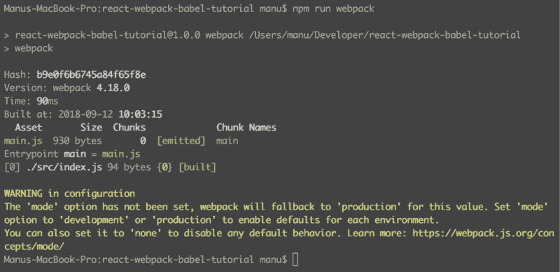**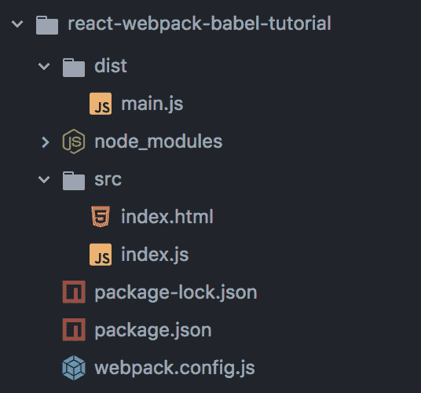**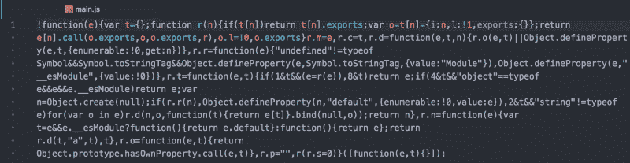

**npm run webpack** output* 

*如果我们运行另一个命令*

```
*`npm start`*
```

***webpack-dev-server** 会自动启动一个服务器，用这个服务器打开默认浏览器。但是同样，由于我们没有配置我们的 **webpack.config.js** 文件，输出将不是预期的结果。*

*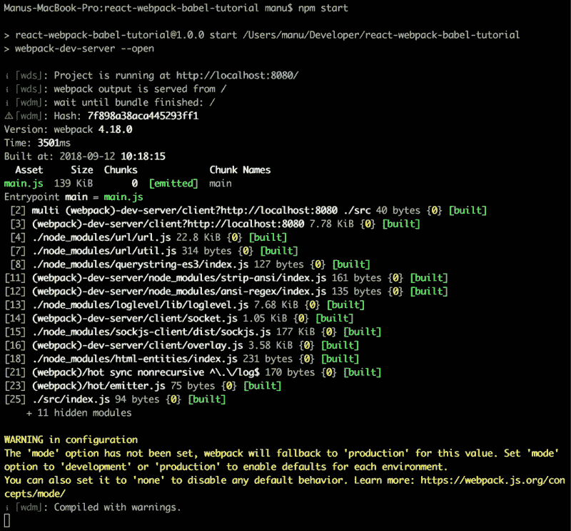**

npm start output* 

*如果你想停止服务器，只需在命令行中同时按下 **CTRL** + **C** 键。*

*让我们将以下模板添加到我们的 **Webpack 配置**文件中:*

```
*`const path = require('path');const HtmlWebpackPlugin = require('html-webpack-plugin');module.exports = {  entry: path.join(__dirname,'src','index.js'),  output: {    path: path.join(__dirname,'build'),    filename: 'index.bundle.js'  },  mode: process.env.NODE_ENV || 'development',  resolve: {    modules: [path.resolve(__dirname, 'src'), 'node_modules']  },  devServer: {    contentBase: path.join(__dirname,'src')  },  plugins: [    new HtmlWebpackPlugin({      template: path.join(__dirname,'src','index.html')    })  ]};`*
```

*   ***entry** 和**output**
    ——这些用来告诉我们的服务器需要编译什么，从哪里编译( *entry: path.join(__dirname，' src '，' index.js '，*)。它还告诉将输出的编译版本放在哪里( *output* —文件夹和文件名)*
*   ***模式**
    ——这是我们输出的模式。我们将它设置为“*开发*”。如果在脚本中我们指定了 **NODE_ENV** 变量，它将取而代之。关于如何使用 **NODE_ENV***

```
*`"webpack": "NODE_ENV=production webpack",`*
```

*   ***resolve**
    —这样我们可以从 **src** 文件夹中以相对路径导入任何东西，而不是绝对路径。对于 **node_modules 也是如此。我们可以直接从 node_modules 导入任何东西，而不需要绝对路径***
*   ***devServer**
    —这告诉 **webpack-dev-server** 需要提供什么文件。我们的 **src** 文件夹中的所有内容都需要在浏览器中提供(输出)*
*   ***插件**
    —在这里我们设置我们的应用程序需要哪些插件。到目前为止，我们只需要 **html-webpack-plugin** ，它告诉服务器 **index.bundle.js** 应该被注入(或者添加到)我们的**index.html**文件中*

*如果我们现在运行前面的命令，我们会看到一些不同之处。*

```
*`npm run webpack`*
```

*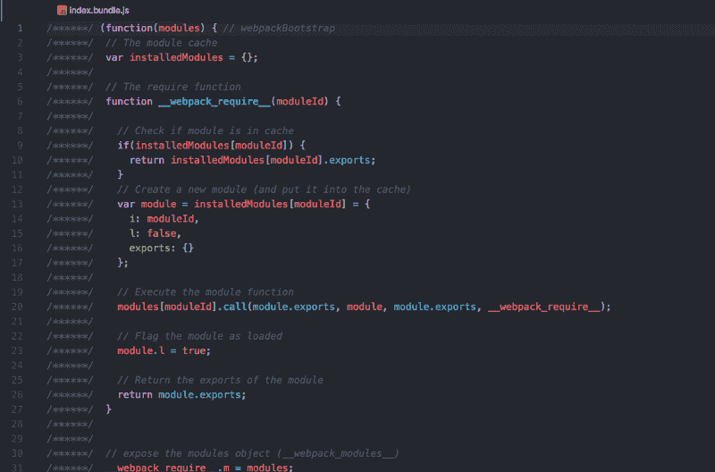**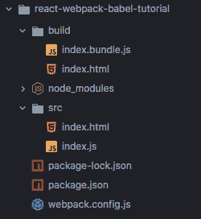**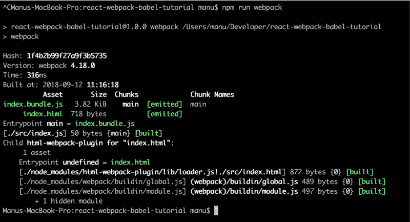

**npm run webpack** output with **webpack.config.js*** 

*我们已经改变了输出的位置(从 **dist** 文件夹到 **build** 文件夹)。通过改变 **Webpack** 的**模式**，现在代码有了不同的外观。上次没有**配置**时**没有缩小**。*

```
*`npm start`*
```

*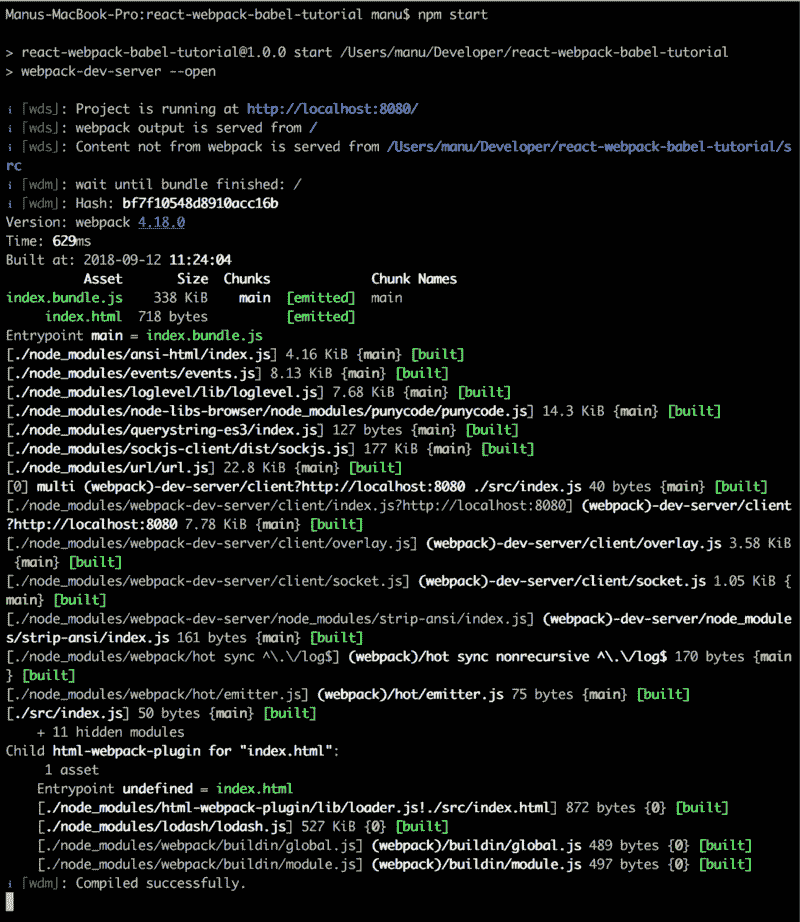**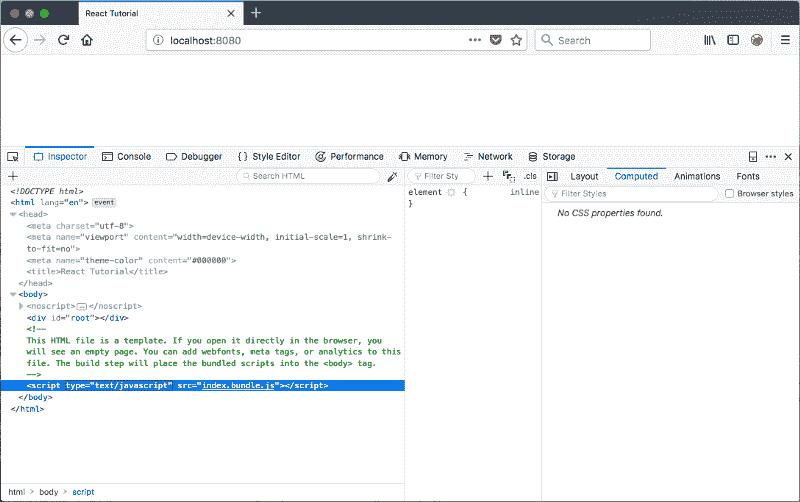**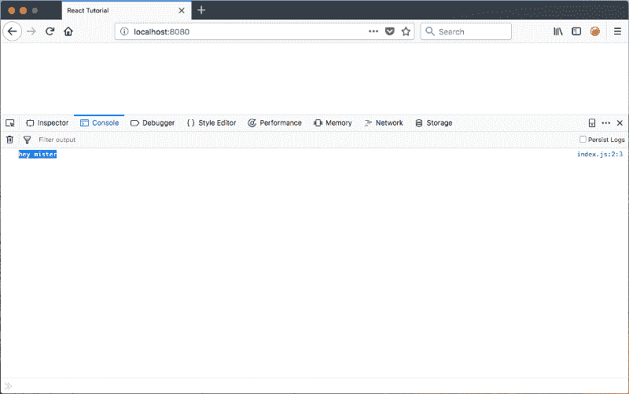

**npm start** output with **webpack.config.js*** 

***webpack-dev-server** 从 **src** 文件夹中取出所有东西，并输出到我们的浏览器中。*

*我们走在正确的道路上，但是我们只在项目中添加了 Webpack。React 和 Babel 在哪里？这就是我们接下来要做的。*

### *React，Babel 和一些不错的风格加载器*

*将 **React** 和 **ReactDOM** 作为**普通依赖**添加到我们的项目中。*

```
*`npm install --save react react-dom`*
```

*在我们开发的这个阶段，如果我们要在 JS 文件中添加 **React** 代码， **Webpack** 会给我们一个错误。它不知道如何在 **bundle.js** 文件里面编译 **React** 。*

*让我们将 **index.js** 文件修改如下:*

```
*`import React from "react";import ReactDOM from "react-dom";let HelloWorld = () => {  return <h1>Hello there World!</h1>}ReactDOM.render(  <HelloWorld/>,  document.getElementById("root"));`*
```

*之后，让我们再次启动服务器。*

```
*`npm start`*
```

*这是个错误:*

*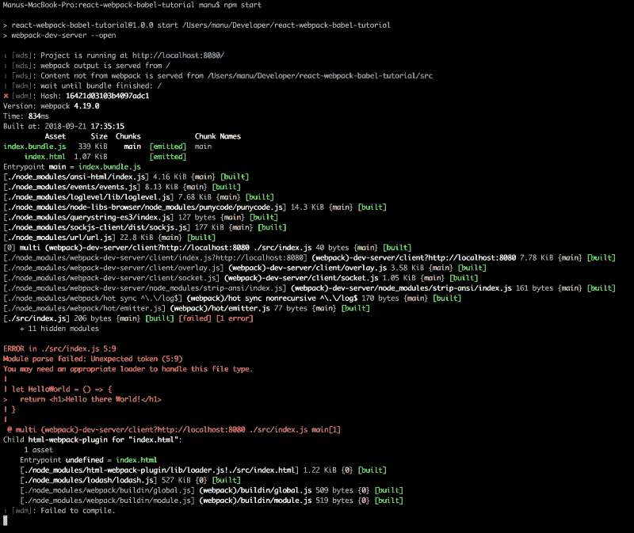**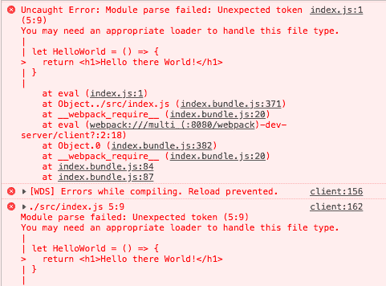

**webpack** error for not having appropriate **loaders** for **react*** 

*所以这就是巴别塔帮助我们的地方。 **Babel** 将告诉 **Webpack** 如何编译我们的 **React** 代码。*

*让我们继续向我们的应用程序添加一堆 Babel 包作为 **devDependencies** 。*

```
*`npm install --save-dev @babel/core @babel/node @babel/preset-env @babel/preset-react babel-loader`*
```

*   ***@babel/core**
    —用于将 **ES6** 及以上编译成 **ES5***
*   ***@babel/node**
    —这是用来让我们能够**在 **webpack.config.js** 中导入**我们的插件和包，而不是**要求**它们(这只是我喜欢的东西，也许你也会喜欢)*
*   ***@babel/preset-env***
*   ***@ babel/preset-React**
    —这是要把 **React** 代码编译成 **ES5** 代码*
*   ***babel-loader**
    —这是一个 **Webpack** 助手，它将您的 **JavaScript** 依赖项转换为 **Babel** (即将 **import** 语句转换为 **require** 语句)*

*因为你可能需要给你的项目添加一些样式(我知道我需要它们)，我们将添加一个加载器，让我们**导入**并使用 **CSS** 文件和 **SCSS** 文件。*

```
*`npm install --save-dev style-loader css-loader sass-loader node-sass`*
```

*   ***样式加载器**
    ——这将添加样式到 **DOM** 中(将注入一个 **< sty** le >标签到 HTML 文件中)*
*   *css-loader
    —让我们将 **CSS** 文件导入到我们的项目中*
*   ***sass-loader**
    —让我们将 **SCSS** 文件导入到我们的项目中*
*   ***node-sass**
    —将 **SCSS** 文件编译成普通的 **CSS** 文件*

*我们将创建一个新的 **SCSS** 文件，并将其添加到我们的文件夹中。*

1.  *Linux/MacOS 命令*

```
*`touch src/index.scss`*
```

*2.Windows 命令*

```
*`echo "" > src/index.scss`*
```

*并且还添加了一些不错的风格。*

```
*`body {  div#root{    background-color: #222;    color: #8EE4AF;  }}`*
```

*并通过为 **SCSS** 文件添加导入来更改我们的 **index.js** 。*

```
*`import React from "react";import ReactDOM from "react-dom";`*
```

```
*`// this line is new// we now have some nice styles on our react appimport "index.scss";`*
```

```
*`let HelloWorld = () => {  return <h1>Hello there World!</h1>}`*
```

```
*`ReactDOM.render(  <HelloWorld/>,  document.getElementById("root"));`*
```

*不要忘记从 **package.json** 中删除 carets (^)。*

*您的 **package.json** 应该是这样的:*

```
*`{  "name": "react-webpack-babel-tutorial",  "version": "1.0.0",  "description": "This is a Tutorial to showcase the usage of React with Webpack and Babel",  "main": "index.js",  "scripts": {    "test": "echo \"Error: no test specified\" && exit 1",    "webpack": "webpack",    "start": "webpack-dev-server --open"  },  "repository": {    "type": "git",    "url": "git+https://github.com/creativetimofficial/react-webpack-babel-tutorial.git"  },  "keywords": [    "react",    "webpack",    "babel",    "creative-tim",    "material-design"  ],  "author": "Creative Tim &lt;hello@creative-tim.com> (https://www.creative-tim.com/)",  "license": "MIT",  "bugs": {    "url": "https://github.com/creativetimofficial/react-webpack-babel-tutorial/issues"  },  "homepage": "https://github.com/creativetimofficial/react-webpack-babel-tutorial#readme",  "devDependencies": {    "@babel/core": "7.0.1",    "@babel/node": "7.0.0",    "@babel/preset-env": "7.0.0",    "@babel/preset-react": "7.0.0",    "babel-loader": "8.0.2",    "css-loader": "1.0.0",    "html-webpack-plugin": "3.2.0",    "node-sass": "4.9.3",    "path": "0.12.7",    "sass-loader": "7.1.0",    "style-loader": "0.23.0",    "webpack": "4.19.0",    "webpack-cli": "3.1.0",    "webpack-dev-server": "3.1.8"  },  "dependencies": {    "react": "16.5.1",    "react-dom": "16.5.1"  }}`*
```

*如果我们再次运行上述任何命令，错误仍然会存在。我们还没有告诉 **Webpack** 它应该使用 **Babel** 和样式加载器来编译我们的 **React** 和 **SCSS** 代码。*

*接下来要做的是为 **Babel** 添加一个配置文件。为此，我们需要创建一个名为**的文件。我们将在其中配置**巴贝尔**。***

*听说可以直接在 **webpack.config.js** 文件中添加 **Babel** 的配置。为此，你可以看看[官方通天塔文件](https://github.com/babel/babel-loader)。就我而言，我认为最好将 **Babel** config 放在自己的文件中。这样，您就不会过度拥挤您的 **Webpack** 配置。*

*因此，让我们在命令行中运行以下命令:*

1.  *Linux/MacOS 命令*

```
*`touch .babelrc`*
```

*2.Windows 命令*

```
*`echo "" > .babelrc`*
```

*并在**内添加以下代码。babelrc** 以便 **babel-loader** 知道用什么来编译代码:*

```
*`{  "presets": [    "@babel/env",    "@babel/react"  ]}`*
```

*在这些步骤之后，我们需要添加一些东西到我们的项目中，这样我们就可以导入各种类型的文件，比如图像。我们还需要添加一个插件，让我们与类和更多的工作。让我们在类中添加类属性。基本上，它将让我们使用面向对象编程——很好。*

```
*`npm install --save-dev file-loader @babel/plugin-proposal-class-properties`*
```

*现在我们已经做了这些，我们需要在 **webpack.config.js** 中做一些改变，这样 **Webpack** 现在将使用 **Babel** 。我们还将配置 **Webpack** 来监听**样式的**文件，并且我们将把**要求**语句改为**导入**语句。*

*所以话虽如此，还是把我们的 **webpack.config.js** 改成下面的吧(我也加了一些注释，也许对你有帮助):*

```
*`// old// const path = require('path');// const HtmlWebpackPlugin = require('html-webpack-plugin');// newimport path from 'path';import HtmlWebpackPlugin from 'html-webpack-plugin';module.exports = {  entry: path.join(__dirname,'src','index.js'),  output: {    path: path.join(__dirname,'build'),    filename: 'index.bundle.js'  },  mode: process.env.NODE_ENV || 'development',  resolve: {    modules: [path.resolve(__dirname, 'src'), 'node_modules']  },  devServer: {    contentBase: path.join(__dirname,'src')  },  module: {    rules: [      {        // this is so that we can compile any React,        // ES6 and above into normal ES5 syntax        test: /\.(js|jsx)$/,        // we do not want anything from node_modules to be compiled        exclude: /node_modules/,        use: ['babel-loader']      },      {        test: /\.(css|scss)$/,        use: [          "style-loader", // creates style nodes from JS strings          "css-loader", // translates CSS into CommonJS          "sass-loader" // compiles Sass to CSS, using Node Sass by default        ]      },      {        test: /\.(jpg|jpeg|png|gif|mp3|svg)$/,        loaders: ['file-loader']      }    ]  },  plugins: [    new HtmlWebpackPlugin({      template: path.join(__dirname,'src','index.html')    })  ]};`*
```

*我们还需要对 **package.json** 文件做一点修改。我们需要告诉我们的脚本，在 **Webpack** 的配置文件中，我们使用**导入**而不是**要求**语句。否则它会给我们一个错误，说它不知道 **import** 代表什么。*

```
*`{  "name": "react-webpack-babel-tutorial",  "version": "1.0.0",  "description": "This is a Tutorial to showcase the usage of React with Webpack and Babel",  "main": "index.js",  "scripts": {    "test": "echo \"Error: no test specified\" && exit 1",    "webpack": "babel-node ./node_modules/webpack/bin/webpack",    "start": "babel-node ./node_modules/webpack-dev-server/bin/webpack-dev-server --open"  },  "repository": {    "type": "git",    "url": "git+https://github.com/creativetimofficial/react-webpack-babel-tutorial.git"  },  "keywords": [    "react",    "webpack",    "babel",    "creative-tim",    "material-design"  ],  "author": "Creative Tim <hello@creative-tim.com> (https://www.creative-tim.com/)",  "license": "MIT",  "bugs": {    "url": "https://github.com/creativetimofficial/react-webpack-babel-tutorial/issues"  },  "homepage": "https://github.com/creativetimofficial/react-webpack-babel-tutorial#readme",  "devDependencies": {    "@babel/core": "7.0.1",    "@babel/node": "7.0.0",    "@babel/plugin-proposal-class-properties": "7.0.0",    "@babel/preset-env": "7.0.0",    "@babel/preset-react": "7.0.0",    "babel-loader": "8.0.2",    "css-loader": "1.0.0",    "file-loader": "2.0.0",    "html-webpack-plugin": "3.2.0",    "node-sass": "4.9.3",    "path": "0.12.7",    "sass-loader": "7.1.0",    "style-loader": "0.23.0",    "webpack": "4.19.0",    "webpack-cli": "3.1.0",    "webpack-dev-server": "3.1.8"  },  "dependencies": {    "react": "16.5.1",    "react-dom": "16.5.1"  }}`*
```

*另一件我们必须添加到**的事情是**@ babel/plugin-proposal-class-properties**。babelrc** 文件。巴别塔会知道如何处理类属性。*

```
*`{  "presets": [    "@babel/env",    "@babel/react"  ],  "plugins": [    "@babel/plugin-proposal-class-properties"  ]}`*
```

*现在我们完成了。我们可以运行上面的任何一个命令，它不会给我们任何错误。让我们看看他们的行动。*

```
*`npm run webpack`*
```

*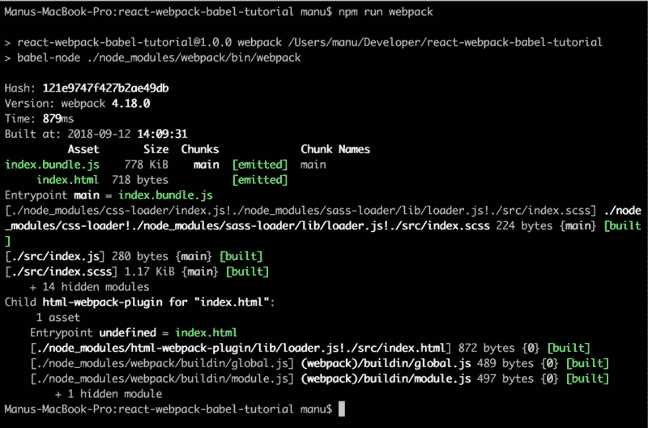

**npm run webpack** with no errors* 

*现在让我们看看我们的应用程序的主要脚本。*

```
*`npm start`*
```

*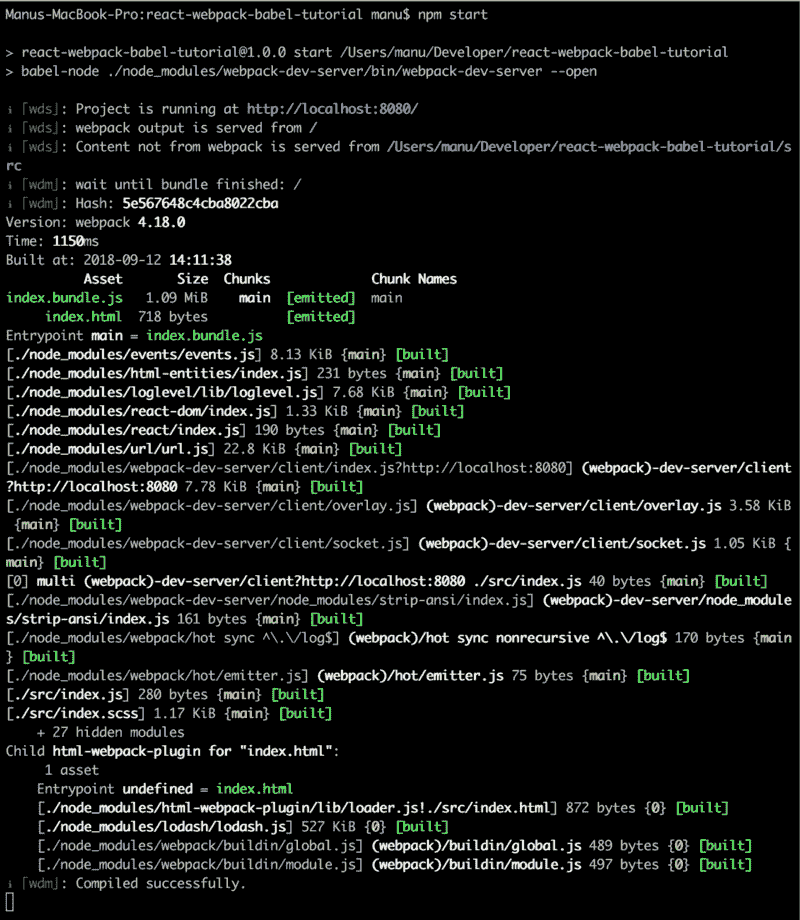**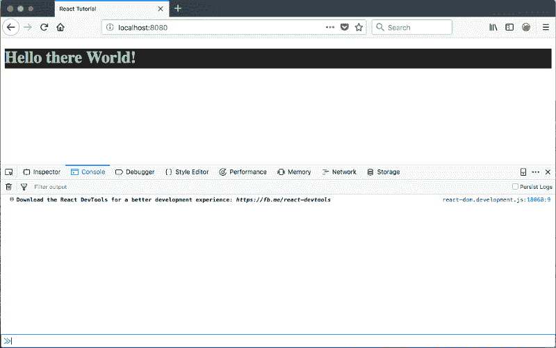

**npm start** output* 

### *将材料设计添加到我们新的 React with Webpack 和 Babel 项目中*

*正如我在这篇文章开始时告诉你的，我们不会为材料设计从头开始创造风格。那将需要大量的工作。我们没时间了。*

*相反，我们将添加一个很好的产品，它实现了[谷歌的材料设计](https://material.io/design/)，并由[的创意人员](https://www.creative-tim.com/presentation)做了一些小改动。我们将为它添加[材质仪表盘反应](https://www.creative-tim.com/product/material-dashboard-react)。*

*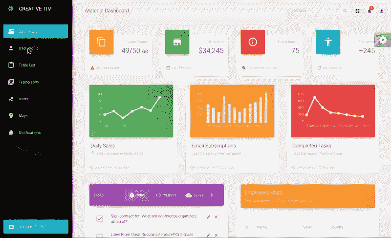*

*首先，你需要得到产品。以下是获得该产品的几种方法:*

*   *在另一个文件夹中克隆存储库:*

```
*`git clone https://github.com/creativetimofficial/material-dashboard-react.git`*
```

*   *[从 Github 下载](https://github.com/creativetimofficial/material-dashboard-react/archive/master.zip)*
*   *[从创意 Tim 下载](https://www.creative-tim.com/product/material-dashboard-react)*

*好了，现在我们有两个项目——材质仪表盘 React 和我们新创建的带有 **Webpack** 和 **Babel 的**和 **React** 。*

*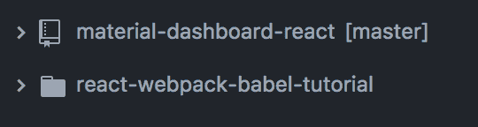

**material-dashboard-react** and **react-webpack-babel-tutorial*** 

*现在，我们不能简单地将 src 文件夹从 **Material Dashboard React** 复制到我们的新项目中。那会给我们带来很多错误。比如错误为缺少依赖项，模块没有找到，你懂的，很多错误。*

*所以，我建议我们从将 **Material Dashboard React** 的 **package.json** 的依赖项添加到我们的 **package.json** 开始。我们不需要 **Material Dashboard React 的**包的所有依赖项，因为我们已经使用 **Webpack 构建了自己的服务器。除了该产品，我们还增加了其他款式的装载机。***

*话虽如此，我们需要以下内容:*

```
*`npm install --save @material-ui/core@3.1.0 @material-ui/icons@3.0.1 @types/googlemaps@3.30.11 @types/markerclustererplus@2.1.33 chartist@0.10.1 classnames@2.2.6 perfect-scrollbar@1.4.0 react-chartist@0.13.1 react-google-maps@9.4.5 react-router-dom@4.3.1 react-swipeable-views@0.12.15`*
```

*我们不会一一列举。他们可以在 npmjs.com 上找到所有的细节和他们自己的文档。*

*我们再次进入 **package.json** 文件，从我们刚刚安装的包中删除 carets (^)。*

*好了，我们差不多完成了。我们将从我们项目的 **src** 文件夹中的 **Material Dashboard React** 复制 **src** 文件夹中的所有内容，并覆盖 **index.js** 文件。而是把它保存在**index.html**文件里。*

*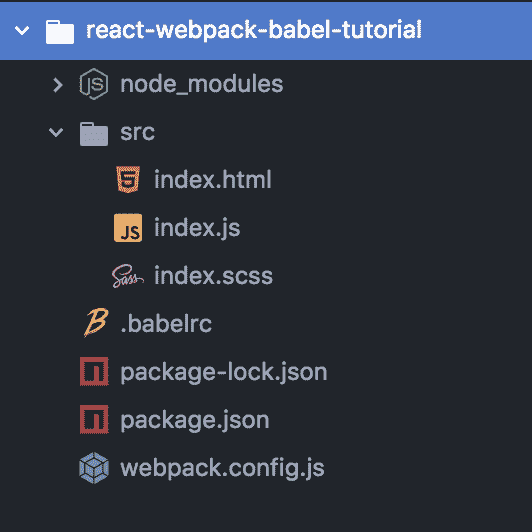**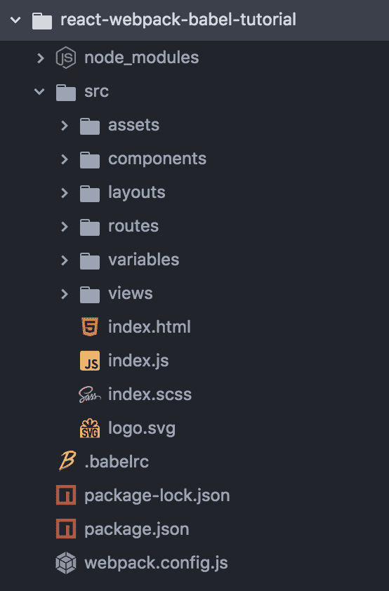

Folder structure before and after adding the Material Dashboard React **src** folder* 

*现在我们需要在我们的**index.html**中添加一些样式和字体 cdn。*

```
*`<!DOCTYPE html><html lang="en">  <head>    <meta charset="utf-8">    <meta name="viewport" content="width=device-width, initial-scale=1, shrink-to-fit=no">    <meta name="theme-color" content="#000000">    <link rel="stylesheet" href="//cdn.jsdelivr.net/chartist.js/latest/chartist.min.css">    <script src="//cdn.jsdelivr.net/chartist.js/latest/chartist.min.js"></script>    <link rel="stylesheet" href="https://fonts.googleapis.com/css?family=Roboto:300,400,500,700|Material+Icons">    <link href="https://fonts.googleapis.com/icon?family=Material+Icons" rel="stylesheet">    <title>React Tutorial</title>  </head>  <body>    <noscript>      You need to enable JavaScript to run this app.    </noscript>    <div id="root"></div>    <!--      This HTML file is a template.      If you open it directly in the browser, you will see an empty page.      You can add webfonts, meta tags, or analytics to this file.      The build step will place the bundled scripts into the <body> tag.    -->  </body></html>`*
```

*我们就快到了。我们还有一个小问题。当我们刷新页面时，我们遇到一个错误**无法获取/仪表板*。*** 如果我们导航到另一个页面我们会得到，例如**无法得到/用户**等等。所以基本上，我们的路线行不通。我们需要在 **src/index.js** 或者我们的 **webpack.config.js** 中做一些改变。*

*我将选择第一个选项，因为它非常简单易懂。*

*我们在新的 index.js 中导航，并更改历史类型。我们用 **createHashHistory()** 代替 **createBrowserHistory()** 。*

*这将允许我们刷新页面，而不会出现任何其他错误。现在我们完成了。*

```
*`import React from "react";import ReactDOM from "react-dom";import { createHashHistory } from "history";import { Router, Route, Switch } from "react-router-dom";import "assets/css/material-dashboard-react.css?v=1.5.0";import indexRoutes from "routes/index.jsx";const hist = createHashHistory();ReactDOM.render(  <Router history={hist}>    <Switch>      {indexRoutes.map((prop, key) => {        return <Route path={prop.path} component={prop.component} key={key} />;      })}    </Switch>  </Router>,  document.getElementById("root"));`*
```

*我真的希望你喜欢这个教程，我非常希望听到你的想法。只要给这个帖子一个评论，我会非常乐意回复。*

*还要特别感谢 [Linh Nguyen My](https://pinglinh.com/) 的[教程](https://medium.freecodecamp.org/part-1-react-app-from-scratch-using-webpack-4-562b1d231e75)，它让我对 **Webpack** 有了一些非常需要的了解。*

*有用的链接:*

*   *从 [Github](https://github.com/creativetimofficial/react-webpack-babel-md-tutorial) 获取本教程的代码*
*   *在 ReactJS 官方网站上阅读更多关于 react js 的信息*
*   *点击阅读更多关于 [Webpack 的信息](https://webpack.js.org/)*
*   *点击[链接阅读更多关于巴别塔的信息](https://babeljs.io/)*
*   *阅读更多关于[材料设计](https://material.io/)的信息*
*   *查看我们的平台，看看[我们在做什么](https://www.creative-tim.com/)和[我们是谁](https://www.creative-tim.com/presentation)*
*   *从[www.creative-tim.com](https://www.creative-tim.com/product/material-dashboard-react)或者从 [Github](https://github.com/creativetimofficial/material-dashboard-react) 获取素材仪表盘反应*
*   *阅读更多关于[材质-UI](https://material-ui.com/) 的信息，材质仪表盘 React 的核心*

*在以下位置找到我:*

*   *电子邮件:[manu@creative-tim.com](mailto:manu@creative-tim.com)*
*   *https://www.facebook.com/NazareEmanuel*
*   *insta gram:[https://www.instagram.com/manu.nazare/](https://www.instagram.com/manu.nazare/)*