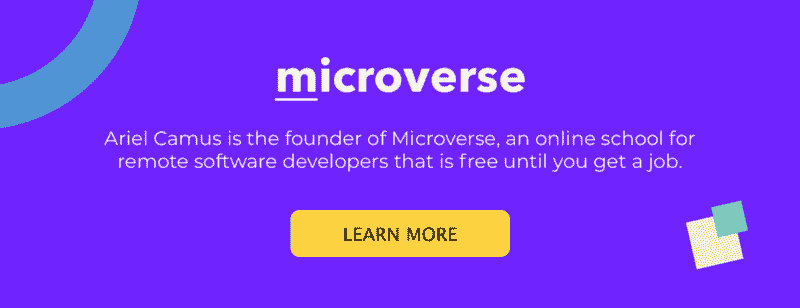

# 每个软件开发人员都需要的五位导师以及如何找到他们

> 原文：<https://www.freecodecamp.org/news/the-five-mentors-every-software-developer-needs-and-how-to-find-them-4f9bbd410d29/>

阿里尔·加缪

# 每个软件开发人员都需要的五位导师以及如何找到他们

#### 作为软件开发人员寻找支持的指南

“student fist bumping mentor” by [rawpixel](https://unsplash.com/@rawpixel?utm_source=medium&utm_medium=referral) on [Unsplash](https://unsplash.com?utm_source=medium&utm_medium=referral)

学习编码和找到第一份工作是一项艰巨的任务。每个尝试过的人都会告诉你，尽管技术层面很难，但真正难的是日复一日地保持你的动力和专注，直到你学到足够多的东西，让你能找到梦想中的工作。对大多数人来说，这个过程可能需要一年或更长时间。

在你的生活中有一个好的导师可以让这个过程变得容易很多。事实上，大多数人会告诉你，如果你想充分发挥你的职业潜力，你必须有一个导师。然而，我们目前对导师的期望有时是被误导的，它们阻止我们真正利用这个强大的想法。

相反，我想建议一种新的方式来思考师徒关系，以及如何在你的生活中找到它，无论你在世界的哪个角落。

但是在我们进入那个之前，让我们先来谈谈什么是错的…

一个人不可能给你一生中所需的所有指导。所以，试图找到一个完美的人是不可能的任务。因为这似乎是一个不可能的任务，大多数人放弃了寻找一个好的导师。

与其寻找一个完美的导师，不如让我们来谈谈导师可以支持你的不同方式。然后，让我们将这些角色分配给不同的角色，并讨论如何找到它们。一旦你独立地看待每个角色，你会意识到找到它们比你想象的要容易得多。

### 导师#1:主播

成为一名成功的开发人员最困难的部分之一是保持你强烈的动机。事实上，有一天你会发现你所有的努力都毫无意义，你看不到隧道尽头的光明。

在那些日子里，有一个亲近的人提醒你你正在做的事情的意义，或者仅仅是听听你的挫折，会有难以置信的力量。

找到这种导师的一个很好的方法是在其他开发者社交的地方活动中。例如， [freeCodeCamp 本地学习小组](https://study-group-directory.freecodecamp.org/)是一个很好的起点。如果你所在的城镇没有本地团体，你可以成立一个。与最近有过相同经历的人建立牢固的关系会帮助你一直向前看。

作为一所面向远程软件开发人员的学校的创始人，我知道这对那些在家或在线学习的人来说尤其重要。这就是为什么我们将高年级学生与新生配对，并帮助他们建立每周通话，以便新生有一只倾听的耳朵，理解他们正在经历的沮丧时刻。

### 导师#2:冠军

冒名顶替综合症是真实存在的。随着您在学习道路上取得进步，总有一天您会怀疑自己是否真的具备成为一名成功开发人员的素质。不仅如此，许多人还会纠结于复杂的问题，如**财务和健康困难**，这将使他们的目标处于危险之中。

在那些时刻，你需要的是一个对你深信不疑的人，一个希望你充分发挥潜力的人。正因为他们坚信你，他们才会愿意以你无法想象的方式提供帮助。

**这个人不一定是软件开发人员**。甚至不是很了解这个行业的人。这个人通常是一个亲密的朋友或亲戚，可以在你学习的过程中提供经济和动力上的支持。

尽管学习编程是一份全职工作，但我不断提醒我亲自指导的人，要腾出时间与他们的家人和朋友社交。只有在这些小圈子里，他们才能找到自己的冠军。

### 导师#3:缪斯女神

这位导师将会激励你**在构建软件的工艺上取得卓越成就，并且会向你展示一旦你释放出你的全部潜力会有什么样的可能**。他们还将向您展示世界上最好的开发人员是如何工作的，并将推动您不断将您的知识扩展到新的领域和技术。

由于这个角色需要一个真正的专家，所以很多人认为他们周围找不到这样的人。事实是，这些人很容易在互联网上找到。你只需要找到专注于你想要掌握的技术的会议，并看看发言人是谁。你可以在网上**找到那些演讲者写的** **的文章和他们演讲的视频**。因为他们是该领域的思想领袖和专家，他们的谈话会令人难以置信地鼓舞人心，并将帮助你跟上最新的进展。

你还应该记住，当你开始第一份工作时，并不指望你会成为专家。因此，你需要**确保你工作的公司也能让你接触到更多的高级开发人员，你可以从他们那里学习**。

这是你在求职面试时应该问的问题。记住面试是一个双向的过程:你也在面试这家公司，因为一份工作不仅仅是挣工资的一种方式，而是一个继续成长的地方。

### 导师#4:合伙人

这不是你期望导师扮演的典型角色。但是因为导师是帮助你实现你的全部潜力，你希望有人能在日常生活的小时刻支持你。

最后，魔鬼就在细节中——你代码中的小而神秘的错误，你学习最新闪亮技术的渴望，以及来自社交媒体的不断干扰。它们都会在你的学习之旅中扮演负面角色，你希望有人在那些微小却扼杀生产力的时刻对你负责。有谁比一个你可以密切合作的编码伙伴更适合呢？

我是结对编程的大力提倡者，结对编程是将这种相互责任带入新软件开发人员学习体验的一种方式。事实上，在我领导的 **学校[，我们将学生结对，他们通过全职远程结对编程进行协作学习](https://www.microverse.org/)**。

即使没有人一直和你一起工作，你也可以从接触当地或网上社区中受益。每天同一时间参加视频会议或在咖啡厅见面。即使你们不在同一个代码上工作，你也会发现共享屏幕和麦克风(或一张桌子)会增加足够的同伴压力，这样你的分心程度就会保持在较低水平。

### 导师#5:你自己

最后，你自己也需要成为导师。指导他人不仅能让你回馈社会，还能帮助你反思你所学的一切，并认可你在自己的道路上取得的进步。

正如我之前提到的，我们将高年级学生与新生配对，这样新生每周都能见到他们的导师(见导师#1)。这不仅有助于新生，也有助于更高级的学生，他们必须在头脑中组织自己最近的学习经历，以便为他们的学员提供良好的建议。

经过几个月的学习，即使你觉得自己知道的还不够多，你也应该加入一些初级程序员聚集的在线或本地社区。接近那些正在迈出第一步的人，并提供你最好的建议。仅仅通过与他们交谈，你就会开始看到你最近完成了多少，学到了多少，这会给你继续前进的动力。

保持动力和专注是学习编码最难的部分，导师可以在寻找你需要的支持方面发挥重要作用。然而，你需要明白导师的角色是什么，这样你才能知道你还缺少哪种支持。你准备好找到你的五位导师了吗？

