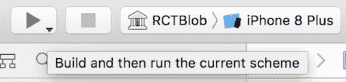

# 如何在 iOS 上运行 React 原生应用

> 原文：<https://www.freecodecamp.org/news/how-to-run-a-react-native-app-on-ios-fc427be3c375/>

作者:Soujanya PS

# 如何在 iOS 上运行 React 原生应用


我最近开始在 iOS 上开发一个 React-Native 应用。这是我第一次尝试本地应用程序开发。React-Native 的命令行界面所提供的易用性和抽象程度让我感到惊讶。我也很好奇 React-Native 在设备或模拟器上运行应用程序时会发生什么。

我花了很多时间浏览相关代码。没有一个地方总结了 React-Native 如何让应用程序工作。从某种程度上来说，这也是创作这篇文章的动机。我想帮助任何其他人重新开始 React-Native 应用程序开发。

React-Native 提供命令行实用程序，在 iOS 和 Andriod 模拟器/设备上运行应用程序。事不宜迟，让我们试着理解在 iOS 上运行 React-Native 应用程序的过程是什么和如何进行的。

### **幕后**

React-native 提供了这个名为`init`的实用工具。它会为您创建一个本机应用程序模板。该模板在应用程序的 iOS 文件夹下创建相关的 Xcode 项目文件。

通过在应用的根文件夹中运行以下命令，可以在 iOS 模拟器/物理设备上启动 React-Native 应用:

```
react-native run-ios
```

成功执行将在模拟器或连接的设备上打开应用程序。为了实现这一点，当我们运行上述命令时，需要执行一系列步骤。

#### **运行-ios 命令**

React-Native 提供了许多命令行实用程序来使用该应用程序。这些可以在 React-Native 节点模块的 **local-cli** 文件夹下找到。 **run-ios** 就是这样一个实用程序，它调用 runIOS.js 文件中定义的`runIOS()`函数。run-ios 接受某些选项，例如:

```
#Launch the app on a specific simulatorreact-native run-ios --simulator "iPhone 5"
```

```
#Pass a non-standard location of iOS directoryreact-native run-ios --project-path "./app/ios"
```

```
#Run on a connected device, e.g. Max's iPhonereact-native run-ios --device "Max\'s iPhone"
```

```
#Build the app in Release modereact-native run-ios --configuration Release
```

#### **设备/模拟器选择**

当未指定设备时，`run-ios`将默认在模拟器上以调试模式启动应用程序。这是通过执行一系列`xcrun simctl`命令来完成的。他们将首先检查 Mac 上可用模拟器的列表，从中选择一个，然后启动所选的模拟器。

或者，如果您希望在物理设备上运行应用程序，将设备插入 Mac，然后将设备详细信息传递给`run-ios`命令。

下一步是构建 app 的 Xcode 项目。

#### **建筑 App 代码**

通常，React-Native app Xcode 项目可以在根文件夹下的 iOS 文件夹中找到。Xcode 项目是使用`xcodebuild`命令构建的。对`run-ios`指定的任何选项，如配置等。被传递给这个命令。

默认情况下，Xcode 项目内置于调试方案中。项目成功构建后，将在模拟器或连接的设备上安装并启动应用程序。

#### **调试模式下的 App 代码捆绑**

在开发过程中，React Native 会在运行时动态加载我们的 JavaScript 代码。为此，我们需要一个服务器来捆绑我们的应用程序代码，并根据需要提供它。

当 Xcode 项目在调试模式下构建时，Metro server 的一个实例也会并行启动。Metro 是由 React-Native 命令行界面(CLI)创建的应用程序使用的捆绑器。它用于捆绑我们开发中的应用程序代码。这有助于我们通过热重装等方式进行更快更简单的调试。

默认情况下，Metro 服务器配置为在端口 8081 上启动。一旦在模拟器中启动了应用程序，就会向服务器发送一个请求来获取这个包。

```
#Code in AppDelegate.m sends the request for the bundle: #index.bundle to serverjsCodeLocation = [[RCTBundleURLProvider sharedSettings] jsBundleURLForBundleRoot:@"index" fallbackResource:nil];
```

```
RCTRootView *rootView = [[RCTRootView alloc] initWithBundleURL:jsCodeLocation  moduleName:@"MobileApp               initialProperties:nil     launchOptions:launchOptions];
```

然后，服务器下载所有需要的依赖项，捆绑 JavaScript 应用程序代码，并将其发送回应用程序。完成此步骤后，您可以看到应用程序在模拟器或连接的设备上运行。

#### **发布模式下的 App 代码捆绑——预打包 JavaScript 捆绑包**

在发布模式中，我们必须预先打包 JavaScript 包，并在我们的应用程序中分发它。这样做需要修改代码，以便它知道加载静态包。在 AppDelegate.m 文件中，如果您没有处于调试模式，请将 jsCodeLocation 更改为指向静态包。

```
#ifdef DEBUGjsCodeLocation = [[RCTBundleURLProvider sharedSettings] jsBundleURLForBundleRoot:@"index" fallbackResource:nil];
```

```
#elsejsCodeLocation = [[NSBundle mainBundle] URLForResource:@"main" withExtension:@"jsbundle"];
```

```
#endif
```

这将引用`main.bundle`资源文件。这个文件是在 Xcode 的`Bundle React Native code and images`构建阶段创建的。在这个阶段，`react-native-xcode.sh` 脚本运行，其中捆绑了 JavaScript 应用代码。这个脚本可以在 React-Native 节点模块的 scripts 文件夹下找到。

#### **从 Xcode 构建应用**

或者，Xcode 项目也可以在 Mac 中的 Xcode 内构建，而不是使用 React-Native CLI。完成后，该应用程序可以在从 Xcode 选项中选择的模拟器或连接的物理设备上启动。



Xcode menu options to build app and launch it on a simulator

我希望这能帮助你理解当我们运行一个简单的`react-native run-ios`命令时发生的各种步骤，这个命令神奇地在 iOS 上打开一个应用程序。

这里提供的部分信息来源于 React-Native [home](https://facebook.github.io/react-native/docs/getting-started.html) 页面。其余的是我窥探代码的产物:)