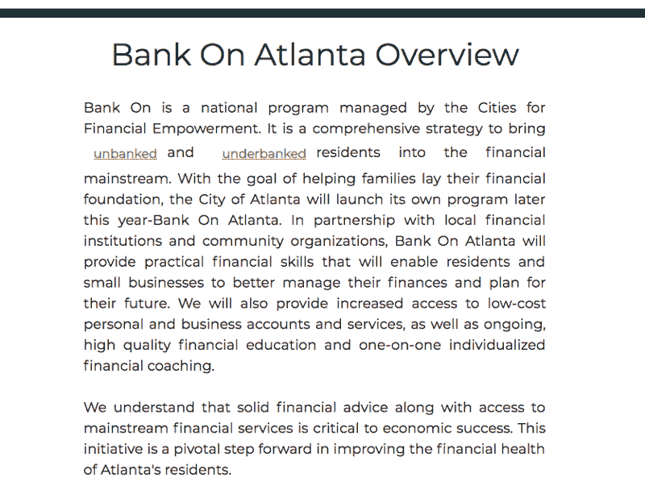
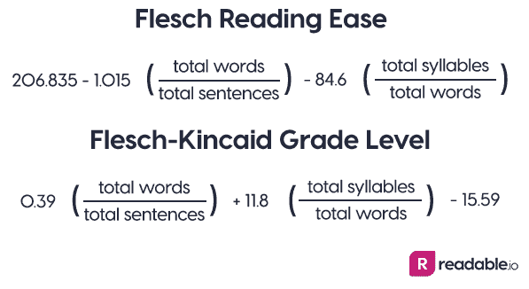
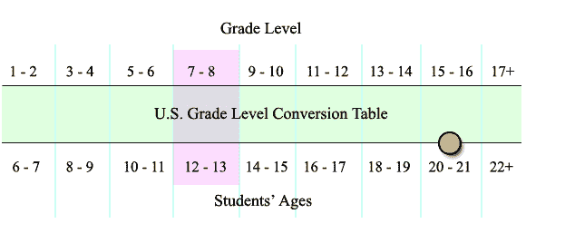
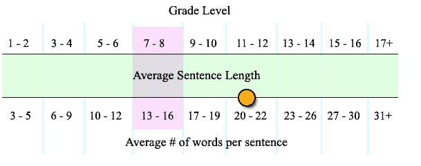
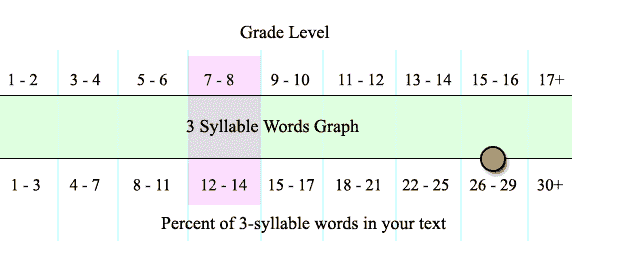
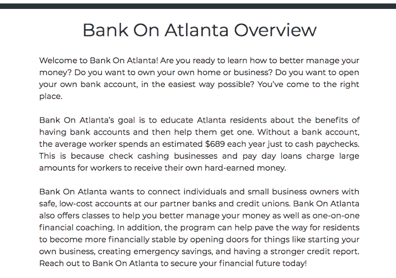

# 如果你想谈论可访问性，那么我们需要谈论可读性问题。

> 原文：<https://www.freecodecamp.org/news/reading-accessibility-82d24841ac7e/>

由代码女孩

# 如果你想谈论可访问性，那么我们需要谈论可读性问题。

Photo by [Callum Shaw](https://unsplash.com/photos/TLxaYmixZ3k?utm_source=unsplash&utm_medium=referral&utm_content=creditCopyText) on [Unsplash](https://unsplash.com/search/photos/computer-reading?utm_source=unsplash&utm_medium=referral&utm_content=creditCopyText)

在我成为一名 web 开发人员之前，我是一名大学教授，我在博士期间的专业是语言和识字习得。这是一种技术上的说法，我研究了我们如何学习阅读和写作。我和所有年龄段的苦苦挣扎的读者一起工作，特别是在中学，但也包括成年人。

你知道吗，生活在美国的成年人的平均阅读水平在 7 到 8 年级之间，也就是中学水平。这是一个可悲的事实。此外，人们更喜欢阅读比他们的阅读水平低两个年级的书，因为这样更舒服。

当涉及到技术内容时，一个人的阅读水平会大大降低。他们只是无法理解陌生的技术词汇、复杂的句子结构和与上下文无关的流行语。

这对于你正在建立的任何网站的内容都是至关重要的。你的**关于**部分、**常见问题** s、**方向**一般是由一个团队的成员撰写的，他们有很强的教育背景，阅读水平介于高中和大学水平之间，并有相当的写作技能。换句话说，你写的东西可能不为你的听众所理解。

当谈到可访问性时，你必须检查你希望你的观众阅读和理解的所有内容的可读性。对于以英语为母语的人和以英语为非母语的人来说，记住这一点很重要。

为了说明这个问题，我想和大家分享我今年春天的一个经历。我志愿帮助一个令人难以置信的非营利组织，亚特兰大银行，建立他们的网站(现在正在进行第二阶段)。他们的目标是帮助低收入、低文化水平的公民了解金融知识、掠夺性贷款和安全地保护他们的钱。

该网站的目标是展示关键信息，因为参与者将直接与训练有素的辅导员一起工作。这是一个链接，指向描述该组织的网站的第[阶段 1](https://fwallacephd.github.io/BOAClone/) (嵌入在下面)。请花一分钟时间阅读此描述。当你阅读时，猜一猜这篇文章的等级。

Phase 1 Description

### 弗莱施阅读容易度评分和弗莱施-金凯等级水平

虽然有很多算法来评估可读性，但有两个主要的方法来定义可读性:Flesch 阅读容易度评分和 Flesch-Kincaid 等级水平。

美国国防部对文件和表格使用 Flesch 阅读难易程度评分。佛罗里达用它来评估保险单。武装部队使用 Flesch-Kincaid 等级评定技术手册。

这些算法(嵌入在下面)通过检查句子的平均长度(用单词的数量来衡量)和每个单词的平均音节数(音节为 3 或更多的单词对苦苦挣扎的读者来说极其困难)来衡量可读性。

Flesch 阅读容易度得分越高，说明阅读容易，所以 100 分是理想的。这种类型的文本使用短句，没有超过两个音节的单词，也没有流行语。60-70 分被认为是平均分。

Flesch-Kincaid 等级在教育领域广泛使用，并使用与 Flesch 阅读难易程度分数相同的测量方法。不同之处在于，不是给出一个数字分数，而是给文章指定一个美国等级，这使得教育工作者、家长、图书馆员和其他人更容易理解和解决学生的能力。

from [Readable.io](https://readable.io/blog/the-flesch-reading-ease-and-flesch-kincaid-grade-level/)

你猜亚特兰大银行的 passage 是几级？

亚特兰大银行网站上的文章在 Flesch 阅读难易程度评分中获得了 30.7 分，这意味着难以阅读。在弗莱施-金凯的等级标准中，这篇文章获得了 14.2 分，也就是大学水平。

如前所述，这个国家的成年人平均阅读水平在 7-8 年级之间，非英语母语者的阅读水平差异很大。

下图清楚地说明了这些结果:

The orange circle indicates the score from our passage.

### 两个关键问题

为了让你了解为什么这篇文章如此困难，我将集中讨论两个关键问题。

第一个问题是句子长度。句子越长，你给句子增加的复杂性就越多。复合句可能有多个主语、动词、宾语，更不用说嵌入的从句和短语，以及可能发生变化的时态。当读者在单词分析和词汇技巧上苦苦挣扎时，复杂的句子结构会让读者感到沮丧，这可能会迫使他们停止阅读。

在 7 或 8 年级的阅读水平上，每句话的单词量应该在 13-16 之间，但我们文章的平均单词量在 20-22 之间(见图表)。

多音节单词是有 3 个或更多音节的单词。这些词让读者在解读(或探听)这个词的同时，还不得不解释这个词的意思。理解词根和前缀/后缀是一项高级技能，但是一个单词的音节越多，包含的这些成分就越多。

以我们文章中的一个关键词“underbanked”为例，它是一个 4 音节单词，由三个有意义的单词部分组成:“under”(2 个音节)、“bank”和结尾“ed”。更糟糕的是，这也是一个流行语。它对读者来说没有上下文。

美国高中和成人读者使用三音节单词的平均比例在 12-14%之间。这篇文章中三音节单词的百分比在 26-29%之间。这是非常高的(见图表)。

### 修订

幸运的是，很容易确定一篇文章的阅读水平，并分析为什么它很难。修改一篇文章以降低阅读水平比你在写作时开始注意句子长度、多音节词甚至流行语更具挑战性。

谢天谢地，亚特兰大银行致力于创建一个网站，让所有读者都能轻松理解必要的信息。

通过简单地写更短但更多的句子，删除多音节词，限制流行词，他们的第二稿成功得多:

Revised Description

亚特兰大银行网站的第一稿在 Flesch 阅读难易程度评分上得了 30.7 分，这是很难阅读的。在弗莱施-金凯的评分标准中，第一稿得了 14.2 分，这意味着大学水平。

这第二稿在弗莱施阅读难易程度量表上得了 64.5 分，被认为是平均水平，在弗莱施-金凯评分标准上得了 8.4 分。这次改版获得了巨大的成功！

因为我们的目标读者是苦苦挣扎的读者，我们有更多的修改要做。充其量，我们的文章应该达到五年级的阅读水平。但关键是团队把可读性放在了首位，我们正在取得进展。

要确定你网站上文章的可读性，使用这个免费工具。它将为你提供 Flesch 阅读容易度评分和 Flesch-Kincaid 等级的分数，希望你能根据你的分数进行修改。