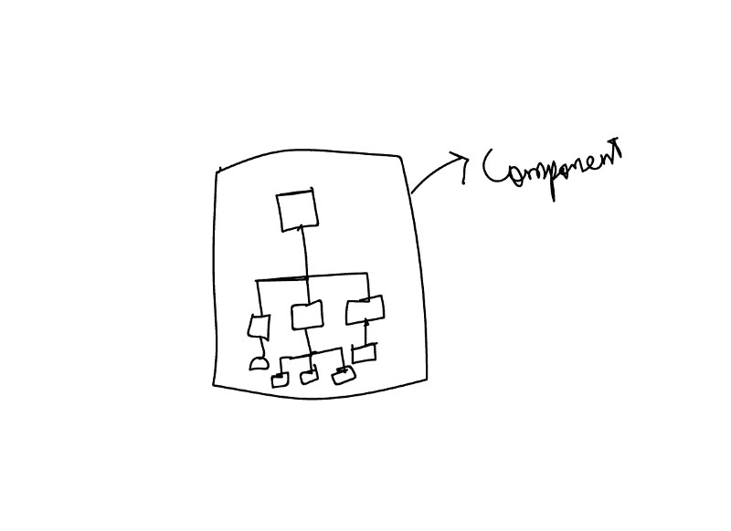
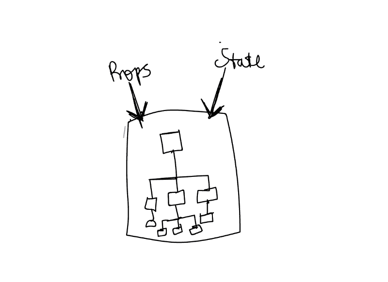
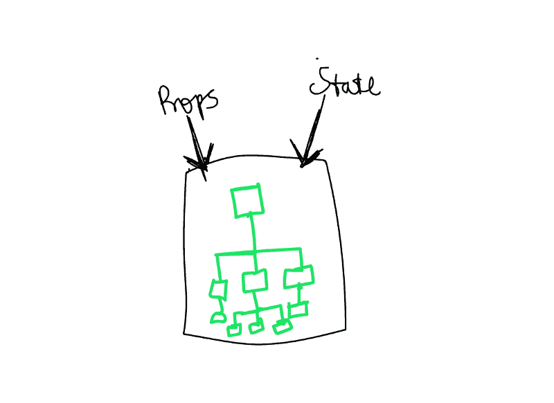
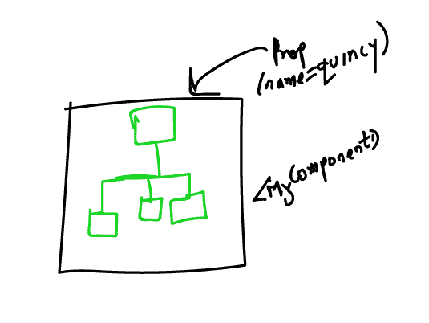
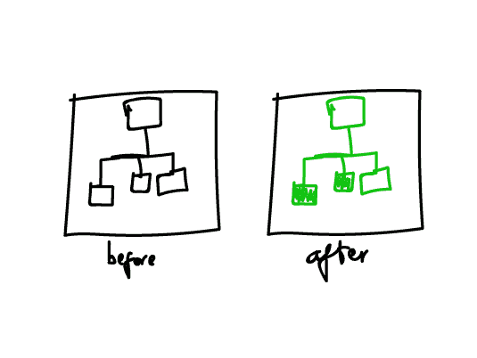
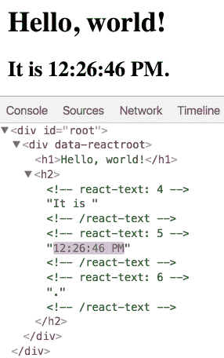
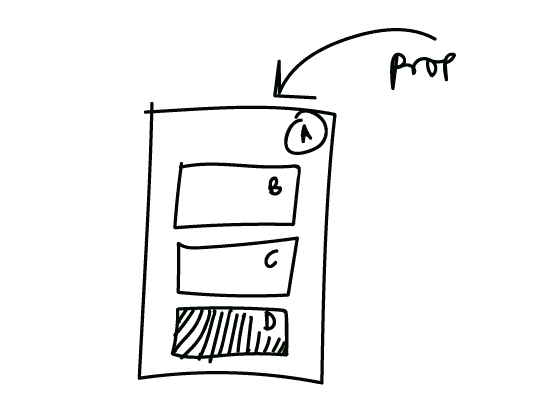
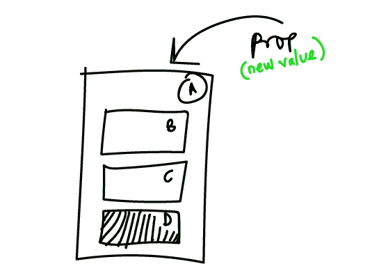
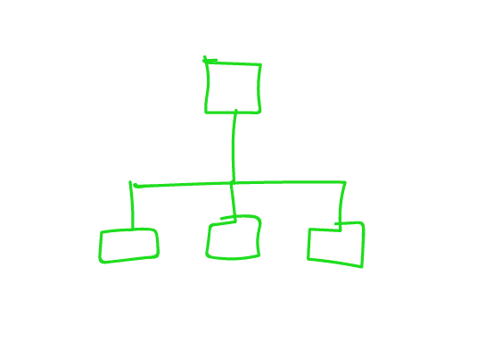

# 你跳过的这些基本反应可能会害死你

> 原文：<https://www.freecodecamp.org/news/these-react-fundamentals-you-skip-may-be-killing-you-7629fb87dd4a/>

很多时候，无法调试某个错误是因为不理解一些基本概念。

如果你因为缺乏某些基本面的知识而不理解一些更高级的概念，你也可以说同样的话。

在这篇文章中，我希望解释我认为你需要理解的一些最重要的基本 React 概念。

这些概念并不特别专业。有很多其他的文章涉及到这些——比如`props`、`state`、`context`、`setState`等等。

然而，在本文中，我将重点介绍一些更概念性的知识，这些知识构成了您将在 React 中完成的大多数技术工作的基础。

准备好了吗？

### React 是如何工作的

每个人在 React 中学到的第一件事就是如何构建组件。我很确定你也学到了。

例如:

```
// functional component function MyComponent() {  return <div> My Functional Component </div> }// class based component class MyComponent extends React.Component {  render() {     return <div> My Class Component </div>   }}
```

您编写的大多数组件都会返回一些元素:

```
function MyComponent() {  return <span> My Functional Component &lt;/span> //span element}class MyComponent extends React.Component {  render() {     return <div> My Class Component &lt;/div> //div element  }}
```

在幕后，大多数组件返回一个元素树。



Components, when evaluated internally, often times return a tree of elements.

现在，您还必须记住，组件就像是基于它们的`props`和`state`值返回值的函数。



Components are like functions with “props” and “state” parameters.

因此，每当组件的`props`或`state`值改变时，就会呈现一个新的元素树。



If the props or state values change, the tree of elements is re-rendered. This results in a new tree.

如果组件是基于类的组件，则调用`render`函数返回元素树。

```
class MyComponent extends React.Component {    render() {    //this function is invoked to return the tree of elements  }}
```

如果组件是一个功能组件，它的返回值产生元素树。

```
function MyComponent() {     // the return value yields the tree of elements   return <div>
```

```
 </div>}
```

为什么这很重要？

考虑一个组件，`<MyComponent` / >，它使用 `in` 一个道具，如下所示:

```
<MyComponent name='Ohans'/>
```

当呈现该组件时，将返回一个元素树。


A tree of elements returned from rendering <MyComponent />

当`name`的值改变时会发生什么？

```
<MyComponent name='Quincy'/>
```

嗯，一个新的元素树被返回了！



A NEW tree of elements returned from rendering <MyComponent /> with different props

好吧。

现在，React 拥有两个不同的树——前者和当前元素树。

在这一点上，React 然后比较这两棵树，找出到底发生了什么变化。



Two different trees. What’s really changed in both trees?

大多数时候整棵树都没有改变。只是这里和那里的一些更新。

在比较这两个元素树之后，实际的 DOM 会随着新元素树的变化而更新。

简单吧。

这种比较两棵树的变化的过程被称为“调和”。这是一个[技术过程](https://reactjs.org/docs/reconciliation.html#motivation)，但是这个概念性的概述对于理解引擎盖下发生的事情非常有帮助。

### React 只更新必要的内容。真的吗？

当你开始使用 React 时，每个人都被告知 React 有多棒——尤其是它是如何更新正在更新的 DOM 的重要部分的。



From the [React Docs](https://reactjs.org/docs/rendering-elements.html#react-only-updates-whats-necessary): DOM inspector showing granular updates.

这完全是真的吗？

是的，它是。

然而，在 React 开始更新 DOM 之前，请记住，它首先为各种组件构建了元素树，并在更新 DOM 之前做了必要的“区分”。换句话说，它比较了先前和当前元素树之间的变化。

我重申这一点的原因是，如果你是 React 新手，你可能会对你的应用程序中挖掘的性能沟渠视而不见，因为你认为 React 只是用必要的东西更新 DOM。

虽然这是事实，但大多数 React 应用程序的性能问题在 DOM 更新之前就已经开始了！

### 浪费的渲染与视觉更新

无论多小，渲染一个组件元素树都需要一些时间(无论多短)。随着组件元素树的增加，渲染时间会变长。

这意味着在你的应用程序中，如果不重要，你不希望 React 重新渲染你的组件元素树。

让我给你看一个简单的例子。

考虑一个组件结构如下所示的应用程序:


An app with a parent component A and child components B,C and D.

整体容器组件，`A`接收某个道具。然而，这样做的唯一原因是将道具传递给组件`D`。



The parent component `A` receives some props and passes them down to the child component D.

现在，每当`A`中的属性值改变时，`A`的整个子元素都被重新渲染以计算新的元素树。



When the parent component receives new Props, every child element is re-rendered and a new tree returned.

这意味着，组件`B`和`C`也被重新渲染，即使它们根本没有改变！他们没有收到任何新道具！

这种不必要的重新渲染被称为“浪费的”渲染。

在这个例子中，`B`和`C`不需要重新渲染，但是 React 不知道这一点。

有许多方法可以处理这样的问题，我在最近的文章[中谈到了如何消除 React 性能问题](https://medium.com/@ohansemmanuel/how-to-eliminate-react-performance-issues-a16a250c0f27)。

接下来，考虑下面的应用:


Cardey in Action :)

我把这个应用程序叫做 [Cardey](http://cardie-performace.surge.sh/) 。

当我单击按钮来更改用户的职业时，我可以选择突出显示 DOM 的更新，如下所示:


Enable the visual updates (Paint Flashing) via Chrome Devtools

现在我看到 DOM 中更新了什么。

这是对 DOM 的可视化更新的表示。请注意“我是图书管理员”文本周围的绿色闪光。

这很好，但我担心 React 对组件元素树的初始渲染。

所以我也可以选择支票。


Enable the highlight update toggle in React Devtools

在这样做的时候，我看到当我点击那个按钮的时候，哪些组件实际上被重新渲染了。


Note the green flash around the user card.

你看到 DOM 的可视化更新和 react 的渲染更新有什么不同了吗？

大用户卡被重新渲染，但只有小文本区域被更新。

这很重要。

### 结论

我相信您现在对 React 组件内部发生的事情有了更直观的理解。

实际上，发生的事情比我在这里讨论的要多得多。然而，这是一个好的开始。

去构建伟大的应用程序吧！

你现在在学习 React/Redux 吗？如果是的话，我在 Redux 上有一个非常棒的[系列丛书。有人说这是](https://thereduxjsbooks.com)[他们](https://twitter.com/Kaafu4u/status/1041495744803491840)[读过的](https://twitter.com/LedZeck/status/1044888661664378880)最好的科技书籍之一！