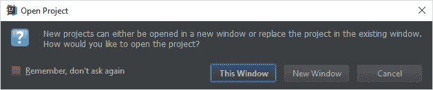
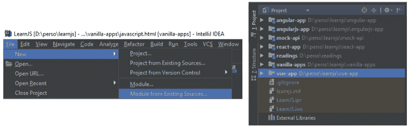
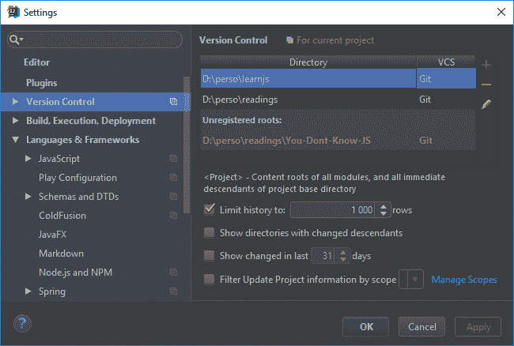
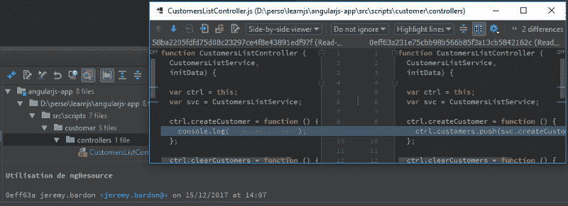
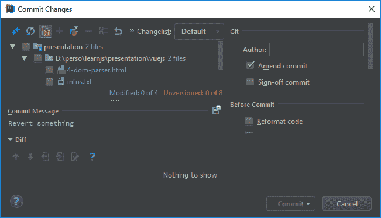
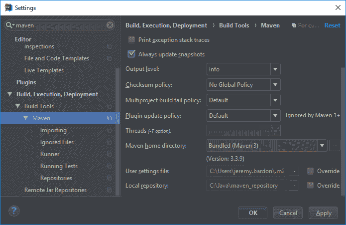
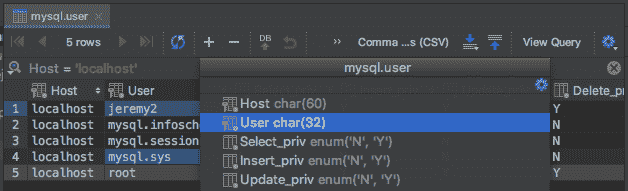
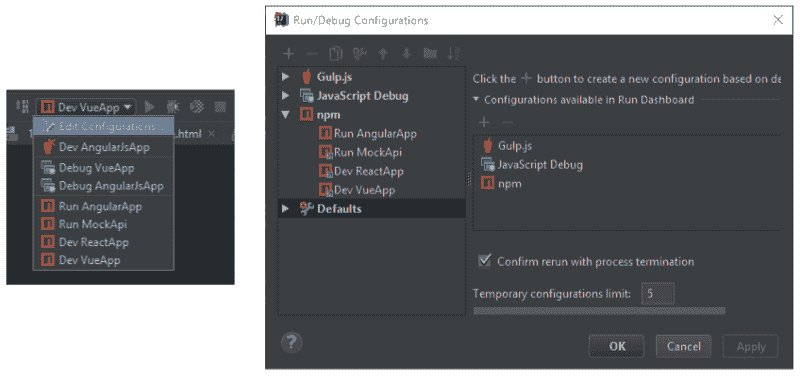

# 如何掌握 IntelliJ 来提高您的生产力

> 原文：<https://www.freecodecamp.org/news/how-to-master-intellij-to-boost-your-productivity-44b9da20c556/>

披露者:这不是 JetBrains 的免费广告，这只是一个开发者分享 IntelliJ 的技巧。

毫无疑问，最重要的开发工具是开发环境(称为 [IDE](https://en.wikipedia.org/wiki/Integrated_development_environment) )。

我最喜欢的，也是我每天在工作中接触的是 **IntelliJ** (终极版)。在这篇文章中，我将与你分享我从自己的经验和同事那里收集到的所有技巧和诀窍。这可能会帮助你掌握这个工具，使你的工作更容易。

不用 IntelliJ 或者即使讨厌也不要离开！我敢打赌，您可以将这些技巧应用到您最喜欢的 IDE 中。

### 目录

*   [将微服务转换成模块](https://medium.com/p/44b9da20c556#c484)
*   [进行有效的代码评审](https://medium.com/p/44b9da20c556#c8d0)
*   [恢复多次提交](https://medium.com/p/44b9da20c556#4bd2)
*   【Java 开发的安全检查
*   [与你的数据库讨论](https://medium.com/p/44b9da20c556#7ea7)
*   最后一条建议:[运行仪表盘](https://medium.com/p/44b9da20c556/edit#086e)、[标记目录](https://medium.com/p/44b9da20c556#0245)、[暂存文件](https://medium.com/p/44b9da20c556#9fea)、[安装插件](https://medium.com/p/44b9da20c556#a2d4)、[过度使用快捷键](https://medium.com/p/44b9da20c556#59a0)

### 将微服务转换为模块

如果您从事许多项目，或者您的项目实现了微服务架构，那么您在许多目录中都有独立的项目。

这意味着您必须为每个项目目录创建一个 IntelliJ 项目。然而，在一个 IntelliJ 窗口中不能有多个项目。

Prompt if a project is already loaded (File > Open Project)

创建模块是解决方案。想法是创建一个具有独立模块的 IntelliJ 项目。

Create a module from your project directory

您可以在项目结构窗口中管理所有模块。也可以通过右键单击单个模块并选择`ng Open Module Setti` ngs 来访问它们。

### 进行有效的代码审查

我希望您使用的是版本控制系统，比如 Git 或 Subversion。如果你不是，你应该考虑学习更多关于版本控制系统的知识！

IntelliJ 为 VCS 提供了很好的集成，特别是对于代码审查。如果您的项目在您的模块中包含许多存储库，那么在一个地方可视化每个提交是可能的。

首先，检查版本控制是否知道您的目录:

File > Settings > Version Control

然后，检查这个工具窗口:

Version Control tool window (Log tab)

您只需启用`Show Root Names`选项，就可以在左侧看到模块的名称。**路径**过滤器允许你使用模块名进行过滤。当您在使用微服务架构的项目上工作时非常有用！

此窗口的右侧显示了从所选提交中修改的每个文件。您可以点击`Show Diff`打开一个新窗口，查看每个文件的修改。

Commit content for code reviews

> 如果您需要同时审查多个提交，选择要审查的提交(按住`ctrl`键)并点击`Show Diff`。

### 还原多个提交

出于某种原因，您可能需要恢复项目中的一些提交。如果你不习惯这样做，你会有麻烦的。

恢复提交非常简单:右键单击它并选择 Revert。一旦你最终解决了冲突，一个提交弹出窗口就会出现。如果您只恢复一次提交，那么照常执行，不要选中`Amend commit`选项。

Commit Changes window (don’t check Amend for the first reverted commit)

但是如果您需要恢复多个提交，您必须更加聪明。这个想法是创建一个提交，它一次恢复所有提交——从最近的提交开始，以避免冲突。

当您恢复提交时，您必须提交更改。这意味着您不能执行多次还原并最终提交结果。我的解决方案是提交第一次恢复，然后检查**修改提交**选项，将其他恢复压缩到第一次提交中。

### Java 开发人员的安全检查

IntelliJ 附带了很多 Java 特性，包括 Maven 集成。它是高度可配置的，但是在探索之前，您需要检查一些设置。

*   项目 SDK *(文件>项目结构* re)
*   每个模块的 Java 编译器版本*(文件>设置> Java Com* 编译器)
*   Maven 配置*(文件>设置>* Maven)

对于 Maven 配置，如果您从事微服务架构的项目，可以考虑检查`Always update snapshots`。

Check Maven configuration

不要忘记检查**忽略的文件**部分，确保 IntelliJ 没有忽略你的模块`pom.xml`。如果你的模块仍然没有被识别为 Maven 项目，右击你的`pom.xml`和`Add as Maven Project`。

有时您可以使用终端进行编译，但是 IntelliJ 会因为 Maven 的依赖性而发现错误。要解决这个问题，右键单击模块`Maven > Rel` oad，然后再次右键单击模块`to Rebu` ild。

### 与您的数据库讨论

我尝试了一些客户端来处理数据库，但是当你也在编写代码时，使用 IntelliJ 要好得多。

您可以使用树资源管理器浏览数据库，而无需编写任何代码。然后，如果双击一个表，还可以过滤结果，执行一些 CRUD 操作，甚至以 SQL、CSV 和 HTML 等多种格式导出数据。

Database table editor

正如您可能想到的，SQL 文件支持[语法高亮显示](https://en.wikipedia.org/wiki/Syntax_highlighting)、自动完成和从文件运行查询的能力。好的一面是，您可以在文件中编写多个查询，但只能使用`Ctrl + Enter`运行突出显示的查询。

### 最后的建议

#### 运行仪表板

可以从 IntelliJ 运行您的应用程序，但是您需要首先创建一个`Run Configuration`。一旦某个流程正在运行，您就可以将它们全部列在仪表板上。

Run configuration settings

要启用运行仪表板，打开运行配置弹出菜单并选择`Defaults`。然后，您可以添加哪种配置可以出现在您的运行仪表板中。

#### 标记的目录

当您右键单击一个目录时，您可以选择将其标记为源、测试，甚至排除它。

这很有用，因为您可以隐藏项目中排除的文件，还可以过滤搜索结果，使它们不显示测试*(在>生产文件* es 的范围内)。

#### 暂存文件

创建临时文件对于测试项目之外的东西非常方便。IntelliJ 对 JavaScript、SQL *等多种文件都支持这个特性*(快捷键:Ctrl + Alt +Maj + Insert)* 。*插件可以帮助你运行那些文件。推荐你试试运行 JS 暂存文件的 Quokka。

#### 安装插件

IntelliJ 有很多插件——几乎每个流行的框架和语言都有一个。你应该安装那些插件，并检查它们是否对你的日常工作有帮助。

例如，检查一下 Java 开发者可能感兴趣的[高级 Java 折叠](https://medium.com/@andrey_cheptsov/making-java-code-easier-to-read-without-changing-it-adeebd5c36de)。您还可以设置特定的字体来轻松区分类似的字符，如`l 1 I` 和`O 0 o`。我推荐[源代码 Pro](https://adobe-fonts.github.io/source-code-pro/) 和 [Hack](https://source-foundry.github.io/Hack/font-specimen.html) ，这有助于避免混淆相似的字符。

#### 过度使用快捷键

*   在任何地方搜索文件
*   `ctrl + shift + E`对于最近打开的文件
*   `ctrl + shift + F`在路径中搜索文本(使用模块过滤器)
*   `ctrl + click`跳转到变量/函数声明
*   `ctrl + f12`在文件中搜索变量/函数
*   `alt + F7`列出变量/函数的用法

感谢阅读！这是我从经验和同事的帮助中学到的技巧和诀窍的汇编。我希望您发现了一些对您的 IntelliJ 日常工作有帮助的东西！

**如果您觉得这篇文章有用，请点击**？**按钮几下，让别人找到文章，以示支持！？**

**别忘了关注我，获取我即将发布的文章的通知**？

### 查看我的其他文章

#### JavaScript

*   [React for 初学者系列](https://medium.freecodecamp.org/a-quick-guide-to-learn-react-and-how-its-virtual-dom-works-c869d788cd44)
*   [如何通过编写自己的 Web 开发框架来提高自己的 JavaScript 技能](https://medium.freecodecamp.org/how-to-improve-your-javascript-skills-by-writing-your-own-web-development-framework-eed2226f190)
*   [使用 Vue.js 时要避免的常见错误](https://medium.freecodecamp.org/common-mistakes-to-avoid-while-working-with-vue-js-10e0b130925b)

#### 提示和技巧

*   [停止痛苦的 JavaScript 调试，用源代码图拥抱 Intellij】](https://medium.com/dailyjs/stop-painful-javascript-debug-and-embrace-intellij-with-source-map-6fe68eda8555)
*   [如何毫不费力地减少庞大的 JavaScript 包](https://medium.com/dailyjs/how-to-reduce-enormous-javascript-bundle-without-efforts-59fe37dd4acd)