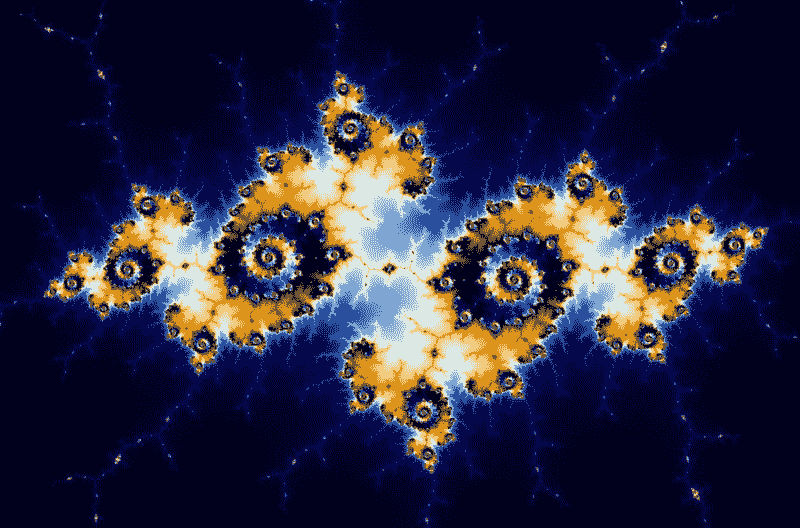
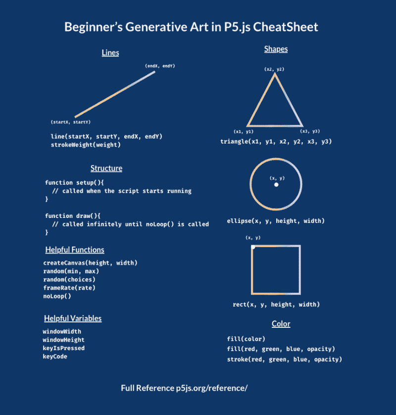

# 生成艺术导论:它是什么，你如何制作它

> 原文：<https://www.freecodecamp.org/news/an-introduction-to-generative-art-what-it-is-and-how-you-make-it-b0b363b50a70/>

作者:阿里·斯皮特尔

# 生成艺术导论:它是什么，你如何制作它



Mandelbrot’s Fractal is derived from a deceptively simple equation

生成艺术可能是一个令人生畏的话题——似乎涉及到很多数学，艺术本身就很棘手！

但是，这并不一定很难——即使没有数学或艺术学位，你也可以做出一些非常酷的东西。这篇文章将分析什么是生成艺术，以及你如何开始建立自己的生成艺术。

### 一、什么是代码艺术？

代码艺术是任何使用代码构建的艺术。CodePen 上的例子数不胜数——比如 [CSS art](https://dev.to/aspittel/learning-css-through-creating-art-54c0) 。

### 什么是生成艺术？

通常，生成艺术从现代艺术中汲取灵感，尤其是大量使用有序几何图案的波普艺术。

然而，这是一个非常广泛和丰富的艺术类别，用具有中心特征的代码创建。生成艺术以某种方式融合了一个自我管理或自治的系统。

随机性是自治系统的一种。通过将偶然性融入到代码艺术中，每次运行脚本、加载页面或响应一些用户交互时，您都会获得不同的、完全独特的艺术。

也有更有序的自治系统。一个例子是 Mandelbrot 的分形，来自一个看似简单的方程。

我们也可以整合这两种方法，将秩序和混乱融合在一起！

艺术品变成了电脑和艺术家之间的合作。艺术品的某些方面由编码者控制，但不是全部。艺术家控制着艺术中的随机性和有序性。

在某种程度上，有了一个自主系统，艺术家就放弃了对他们艺术的控制，电脑在为他们做这件事。当一个新的创造过程被考虑时，一个更微妙的观点出现了。

编码艺术家参与到一个反馈循环中，他们不断地调整系统，以产生更令人满意和更令人惊讶的结果。

这个过程包含了实验和意外的快乐，重塑了艺术家的角色。作为生成艺术家，我们使用代码基础，如循环、控制流和专门的功能。然后，我们将它们与通常不可预测的力量混合，产生完全独特的结果，不同于现存的任何事物。

### 生成艺术的例子

凯特·康普顿的鲜花

[细胞自动机和混沌边缘](http://math.hws.edu/eck/js/edge-of-chaos/CA.html)

#### 菲尔·纳什的多色动画生成艺术

#### Murasaki Uma 的印象派作品

#### 米里亚姆·纳德勒生成的树

### 一件生成性艺术作品包含什么？

*   随机性对于创建生成性艺术来说是至关重要的。每次运行生成脚本时，艺术应该是不同的，所以随机性通常是其中的一大部分。
*   **算法** —可视化实现一个算法往往能生成令人敬畏的艺术，比如上面的二叉树。
*   几何图形——大多数生成艺术都融合了形状，高中几何课上学到的数学知识可以帮助产生一些非常酷的效果。

### 你如何能接近一个生成性的艺术作品？

创造生成性艺术有两种主要策略，尽管大多数都介于这两种策略之间。

第一种是不考虑结果，看看你玩的时候电脑会产生什么。

第二是你对你想要的艺术是什么样子有一个非常确定的想法，这种随意性只会稍微改变最终的结果。

### 你应该从哪里开始？

如果你懂 JavaScript， [p5.js](https://p5js.org/) 是一个不错的起点。它的目标是“让艺术家、设计师、教育工作者和初学者都可以使用编码”它是[画布 API](https://developer.mozilla.org/en-US/docs/Web/API/Canvas_API) 上的一个包装器，它简化了很多数学运算。它专注于绘画，但如果你对这些艺术形式感兴趣，你也可以用它进行声音、视频或网络摄像头交互！

#### P5 的快速介绍

首先，载入 [p5 CDN](https://cdnjs.cloudflare.com/ajax/libs/p5.js/0.7.2/p5.js) 。然后，在您的 JavaScript 文件中，您将添加两个几乎在所有 p5 脚本中都将使用的函数:`setup`和`draw`。这些名字是 p5 调用它们所必需的。

`setup`在程序启动时被调用。您可能会使用`createCanvas`函数创建一个画布来在其中进行绘制，并且您可以在那里设置一些默认值。它只被调用一次！

`draw`在设置后被调用，并不断执行，直到你调用`noLoop`，这将阻止它再次运行。您可以通过`frameRate`功能控制`draw`每秒运行的次数。

使用生成艺术，我通常将`noLoop`放在`setup`函数中，这使得`draw`只运行一次，而不是连续运行。

这里是 CodePen 上的一个 p5 入门模板。

既然我们已经谈了那么多关于随机性对于生成艺术的重要性，p5 中的另一个重要功能就是`random`。它的工作方式类似于 JavaScript 的`Math.random`,但是您可以为数字设置一个范围，这样您就不必做太多的数学运算来将数字转换成有用的格式。

#### p5 行

您可以在 p5.js 中创建一行，如下所示:

```
line(startX, startY, endX, endY)
```

然后，你可以随机生成一串线条，并创建一个简单的艺术作品，就像这样:

即使非常简单的脚本也能产生很酷的艺术作品！

#### p5 形状

您也可以用 p5 创建形状，如圆形、三角形和正方形。

这里有一个用 p5 创建一些形状的例子:

```
// circle ellipse(xCoordinate, yCoordinate, width, height) 
```

```
// square rect(xCoordinate, yCoordinate, width, height) 
```

```
// triangle triangle(xCoordinate1, yCoordinate1, x2, y2, x3, y3)
```

然后，我们可以创建更多的形状来构建更有趣的东西！

#### p5 运动

我们可以通过移除`setup`函数中的`noLoop`函数调用来给我们的图形添加运动——看看这个！

#### 颜色

你也可以通过随机选择颜色来玩生成艺术。你可以通过 RGB 值进行数学计算，或者你可以用你最喜欢的颜色选择器生成一个调色板(我们一直用[这个](https://www.colorbox.io/)的)。

您可以使用`color`功能设置填充颜色。它采用一系列不同的格式，如命名颜色、RGBAs 和十六进制代码。

您也可以使用`stroke`改变轮廓的颜色。你也可以用`noStroke`移除轮廓，或者用`strokeWeight`改变宽度。

#### 把所有的放在一起

一旦我们有了所有这些东西，我们就可以结合这些技术来构建一些真正酷的东西。

### 另一个策略:调整教程

你也可以通过借鉴他人的作品并以此为基础进行创作，从而创造出非常酷的艺术作品。例如，这是丹·希夫曼的一次指导的结果:

这里有两种方法来创造不同的效果:

[这里有](https://codepen.io/collection/nMmoem/)一个 Codepen 集合，甚至更多！

你可以跟随教程、fork CodePens 或 Glitch 项目，创造一些新颖独特的东西。一定要给原创艺术家一些信任。

### Cheatsheet

这里有一张我们在本教程中使用的所有 P5 功能的备忘单。



### 阅读更多

*   [生成艺术](https://generativeartistry.com/)
*   [编码序列](https://www.youtube.com/channel/UCvjgXvBlbQiydffZU7m1_aw)
*   [蒂姆·霍尔曼演讲](https://www.youtube.com/watch?v=4Se0_w0ISYk)

### 保持联络

这篇文章是和詹姆斯·瑞查德合写的。如果你创作了自己的艺术作品，一定要发推特给我们！([阿里](https://twitter.com/ASpittel)和[詹姆士](https://twitter.com/1800THEHIVE))。

*最初发布于[开发至](https://dev.to/aspittel/intro-to-generative-art-2hi7)。*