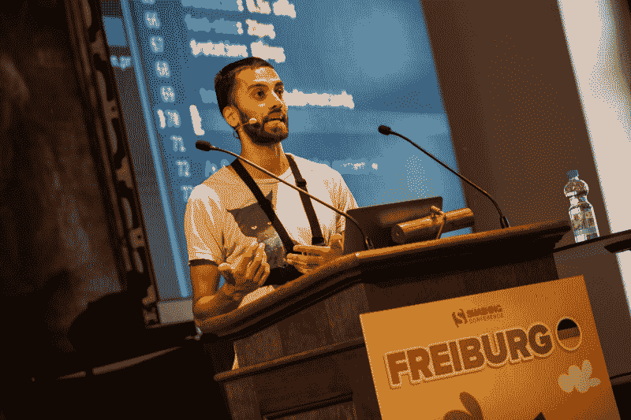
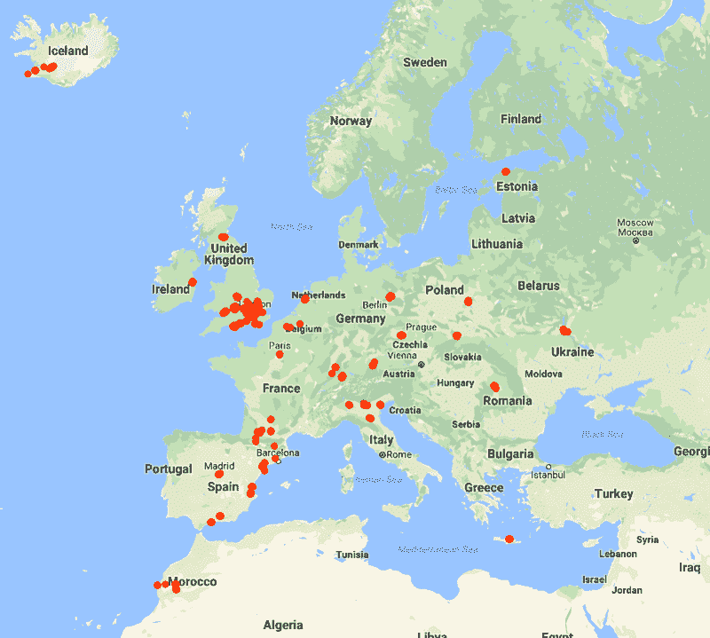
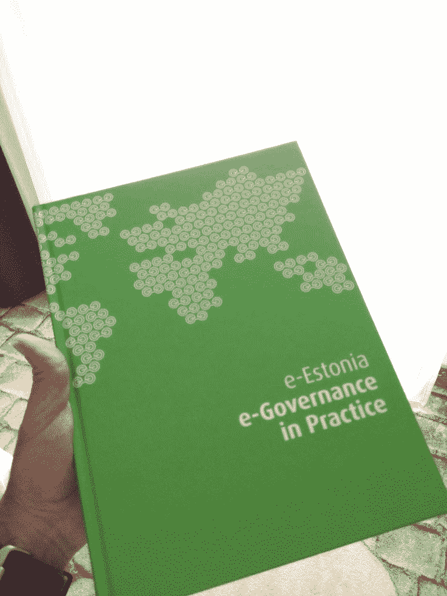
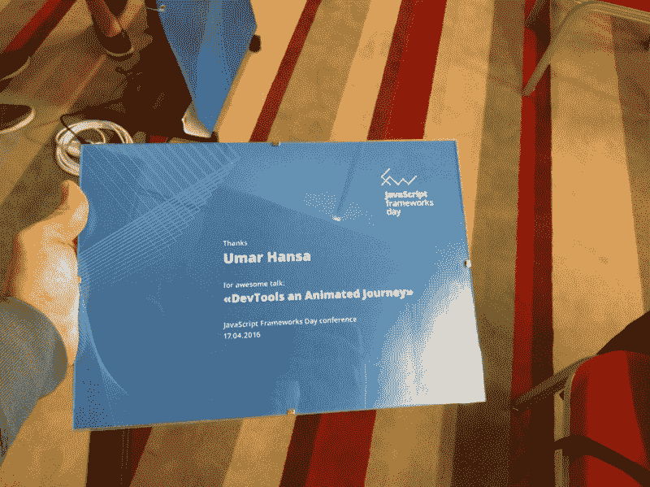
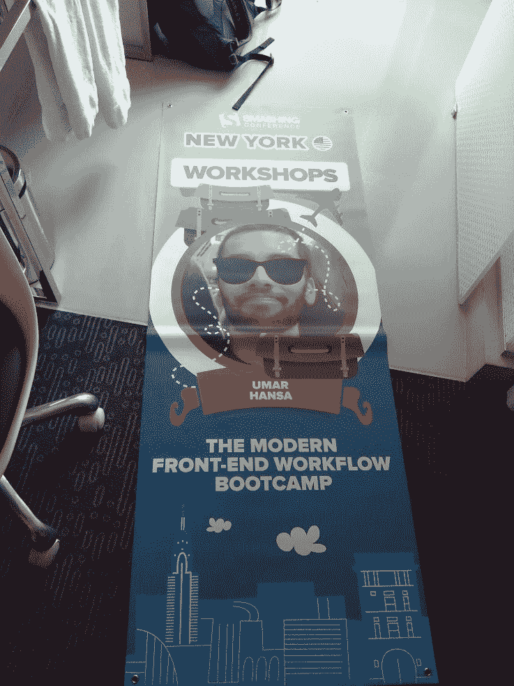
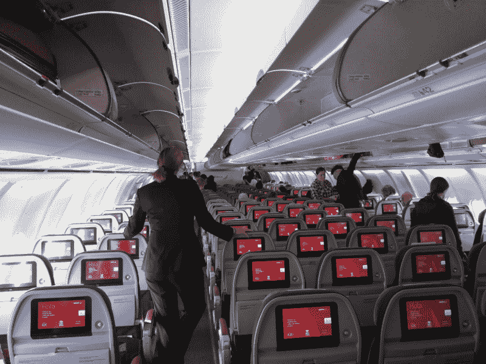
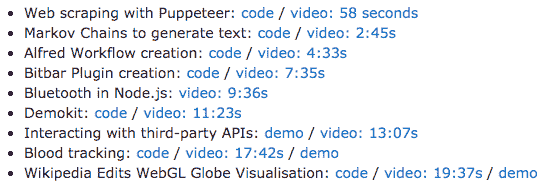
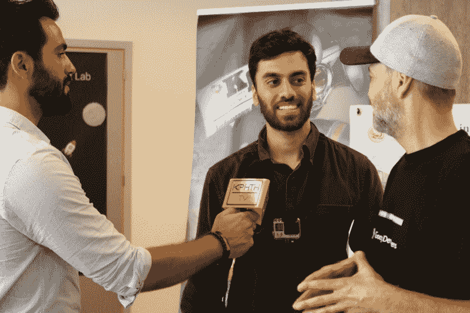

# 在科技会议上演讲的好处

> 原文：<https://www.freecodecamp.org/news/the-benefits-of-speaking-at-tech-conferences-c36348c50ac1/>

我是一名网页开发人员。在几次科技会议上发言后，我想分享一下我在 speaking️.经历的一些好处如果你正在考虑演讲，也许这篇文章可以提供一些额外的见解。

当你决定在会议上发言时，你涉及的不仅仅是 20-40 分钟的发言时间。其他因素也起了作用，比如准备、旅行和金钱。

还有一些更明显的好处，比如学习新技术，走出自己的舒适区，个人品牌化。但在这篇文章中，我希望分享一些不太明显的好处，如旅行，更容易获得未来的会议，以及其他一些方面。

对我来说，最大的好处是 travel️.去新国家的免费旅行真的很棒。如果你想去旅行，但钱是一个问题，在一个国际会议上发言可以帮助你。

我有幸探索过荷兰(？？)，美国(？？爱尔兰)️(？？捷克)️(？？瑞士)️(？？波兰)️(？？)️，乌克兰(？？)️，罗马尼亚(？？希腊)️(？？德国)️(？？)️and·莫尔。我真正付出的只是食物和额外的住宿。

总的来说，旅行有很多好处，我不会在这里介绍，但是你可以自己研究一下。会议组织者通常很乐意帮助你以一种让你感到舒适的方式探索他们的城市。他们可以告诉你去的好地方，而你不必通读无休止的猫途鹰评论，这些评论的完整性是有问题的。你可以在任何阶段向组织者寻求建议，他们会尽力满足你。

如果你有伴侣或密友？，你们都可以从遗愿清单中勾掉旅行。如果你问组织者，你的伴侣可能也会参加会议和演讲者的晚宴。他们可能对会议主题不感兴趣，但对他们来说，看你演讲仍然是一种体验。有几次，我要求组织者也为我的合作伙伴预订航班，这通常是由我的发言人 payment️.说的

Most of these visits are through conferences. Not shown: U.S. where I attended Google I/O a few times and spoke in New York

我发现一个好的策略是，当你参加会议时，你的伙伴或朋友可以独立探索这座城市。之后你们可以见面。但“旅行”方面的真正好处是，你可以预订额外的天数，因为你没有重要的事情要做。

诀窍是延长你在那个国家的停留时间。当会议有足够的预算时，组织者会支付你的机票和酒店住宿费用，但你可以要求返程航班在(比如)conference️.一周后在这两者之间，你会希望住在 Airbnb 或招待所，而不是他们在会议之夜为你预订的昂贵酒店。

有一次，我与会议组织者谈判，为我和我的合作伙伴支付一个非常便宜的 Airbnb 一整个星期，而不是几个晚上的豪华酒店。我们所要支付的只是全程的食物和车票。

#### 住宿

根据我的经验，以我的标准来看，几乎总是超级豪华的酒店。有时感觉很不寻常，但绝对是一次有趣的经历。如果会议支付你的酒店费用，他们可能还会包括酒店早餐！

2 fancy 4 me

当你到达会议城市时，组织者可以给你一张包含数据的预付费 sim 卡，而不是花很多钱购买漫游数据套餐。如果你认为你会从中受益，一定要问清楚。

一些会议给演讲者礼物？️也是，这很好。收到一张手写的卡片也很感动。像这样的额外接触会在旅途中产生强烈的积极氛围，并使整个活动成为一次有益的经历。不过，要小心管理自己的期望，否则你会认为这些事情是理所当然的。

Local snacks, travel card and a sim card

Fancy chocolate

有一次收到一个无线键盘加健身追踪器作为礼物，很惊喜！

当你与会议组织者建立联系时，你会被再次邀请，也许是作为演讲者或与会者。我曾经有幸被邀请回来经营一个车间。

Stole this after the workshop, it’s now my new duvet cover

人际关系网让你被你关心的人所吸引。以下是我观察和体验过的一些人际网络类型:

*   之前的一位演讲者已经以摄影师的身份回归(所以如果你遇到合适的人，还有成长为其他角色的空间)。
*   另一位前发言人接手了会议所需的视频编辑工作。我猜通常会联系一个专门的音频/视频制作团队，但在这种情况下，组织者和他们认识的人一起去了。
*   有时，在酷公司工作的与会者碰巧就在附近工作，被邀请到他们的工作场所共进午餐、聊天，也许还会一起游泳，这并不罕见。

#### **航班**

组织者会在我要求的日期支付经济舱的返程机票。我曾多次询问是否可以在一个新的国家中途停留，并支付额外的飞行费用。

提示:你可能想在回程中中途停留一下，因为那时你的演讲已经结束了。

有几次，在到达会议目的地后，组织者在机场等我，把我领到一辆出租车上，直接把我送到酒店——非常方便。

如果你以后可能想使用公共交通工具，你可以问组织者买什么样的旅行卡(机场有时会卖这些)——如果你不会说他们的当地语言，这也很有用。

#### 科目

关于循环演讲的注意事项:即在多个会议上进行相同的演讲。一般来说，这是好的。如果有疑问，请询问组织者。

一旦你做了一个演讲，你可以在新的会议上重复使用以下内容:

*   ？️你的演讲提案文件(如“在我的演讲中，听众将会学到…”)，你将它发送给组织者，让他们考虑你
*   ？幻灯片
*   ？️演讲

这三个可重用的点可以节省很多天的准备时间。实际上，你会迭代你的幻灯片，但大多数情况下事情会保持不变。

你必须用常识来决定什么时候停止重复使用你的话语，然而对我来说一个重要的因素是:我什么时候停止学习？如果我不断重复使用同一个话题，我就没有新的话题可以学习了。使用会议交谈是学习新技术、技巧或概念的绝佳借口。

#### 品牌宣传

哪怕只说一次话，也能让你建立并保持个人品牌。这有助于未来的演讲和工作机会。例如，我遇到了一家公司的首席执行官，后来我受雇于这家公司。我在一次会议休息时遇到了这位首席执行官，就在他们称赞了我的演讲之后！

通过建立我的品牌，我很高兴地说，我已经成为谷歌开发专家超过 5 年了，✨️！

注意:会议演讲有所帮助，但不是我被 GDE 项目录取的主要原因。

#### 在...之后

当你在会议后回到家，你会想回顾一下 happened️.例如:

*   你得到了什么，这一切值得吗？
*   演讲过程中的时机和节奏如何？
*   演讲前你觉得准备充分了吗？如果没有，还能做什么？

对我自己来说，不可避免的是，我会有动力和激情去实现新的生活目标。这可能听起来很俗气，但这就是被放在一个新的地方用新的惯例的效果！

在我演讲一段时间后，我有时会得到:

*   ？️:一封感谢邮件
*   ？️专业地拍摄了我演讲的照片
*   ？️:我演讲的视频链接

因此，如果我需要一张看起来正常的照片，也许是作为某个地方的个人资料照片，或者因为雇主的要求，我可以使用看起来“专业”的照片。

Don’t think I should use this as a LinkedIn profile pic

我的会议视频也帮助了我:

*   如果我要求在新闻发布会上发言，我可以简单地将视频链接发送给组织者，让他们感受一下我的演讲技巧。
*   如果做得有品味，你可以在求职申请信中加入你的视频链接，这通常会反映良好。
*   当我在演讲后仔细观看我的演讲时，我会发现各种各样的错误，这有助于我下次改进。

当我收到会议组织者发来的视频时，也就是会议结束后，我开始了最后一项任务。从网上获取会议讨论材料，这样其他人也能从中受益。

为了我在 ScotlandJS 的会议演讲，我经历了几个步骤把[的幻灯片放到网上](https://umaar.github.io/node-mini-projects-talk/)？️:

*   删除任何在非语音环境中没有意义的引用。
*   用视频或代码演示替换了所有现场演示。
*   链接到幻灯片中的视频。

这些步骤的组合有助于确保演讲结束后，内容对技术社区仍然有用。我还会在链接到幻灯片的 [YouTube 视频](https://www.youtube.com/watch?v=qIWNoJv4Lyc)中留下评论。在可能的情况下，我会浏览视频，收集与各个主题相对应的 timestamps️。这是为了让人们可以很容易地跳到视频的一部分，而不必观看整个视频。

Timestamps link to a specific point in the YouTube video

所有这些会后活动不会花很长时间，有助于为社区提供价值，并最终建立起你的个人品牌。如果你的内容是好的，你的谈话会继续下去！

小贴士:如果你谈论一个利基或专业的话题，你就有可能获得机会？当业内其他人看到您的幻灯片和视频时，您可以随时使用。

**雇主**

有很多行业的雇主不会支持你参加会议，但科技不是其中之一。我以前就这个话题写过一些建议，如果你认为对你适用，就去看看吧。

几乎所有的雇主都支持我参加会议。这意味着:

*   我可以在“工作时间”参加会议吗？没有预订假期的️。
*   我可以在“工作时间”出差，因为会议将提高我的工作技能。
*   我并不总是因为演讲而获得报酬，当这种情况发生时，一些雇主允许我报销交通费。
*   为了巩固我所学到的知识，并与我的同行分享知识，他们会鼓励我做一次内部技术讲座，这反过来会提高我的传道技能。

如果你要在会议上发言，一些雇主会要求你预订假期。如果他们觉得会议主题与你的工作无关，他们可能会这样做，或者他们以前从未允许过这样的事情。如果是这样，考虑与你的直线经理交流你演讲甚至参加会议的[好处](https://twitter.com/umaar/status/941755764405948417)。

#### 以下是一些需要注意的事情:

有时我会陷入有趣的境地，比如:

在这张照片中，我相信一家当地电视网希望我对他们城市的开发者社区说些好话，但我对这些事情感到紧张。回想起来，如果你错过了一个让你不舒服/害羞/紧张的机会，这真的没什么大不了的…除了谈话本身！

另一个例子是演讲后的问答环节，如果你不感兴趣，就让组织者尽早知道，这样他们就可以有一个替代计划。回顾这次机会和其他许多机会，我一个都不后悔！

每一次问答、小组会议、小组聊天和录音采访都是我的荣幸，我很高兴我做到了。

#### 人们认为你比自己聪明 ️

我是一名前端 web 开发人员。说了这么多，一些雇主和潜在雇主最终会认为我比实际情况更有技能。

不是每个人都区分福音传道和网络开发。我见过的许多演讲者在他们的领域都是真正的专家，所以这并不适用于每个人。

#### **一种错误的旅行方式？**

我真的不认为旅行有正确和错误的方式，因为人们渴望不同的经历，这种经历会在一生中发生变化。我觉得我的很多会议旅行都非常奢侈(比如机场接送)。然而，这完全在我的控制范围内，如果我想要一个更独立的体验，我可以简单地告诉组织者，我不需要机场接送和豪华酒店。

不过，提醒一下，长时间的会议演讲会扭曲你对旅行的看法。

### **结论/总结**

在会议上发言是一种独特的体验:

*   你会走出你的舒适区
*   你会学到一项新技术(假设你的演讲是关于你还不知道的东西)
*   你会建立一个朋友网络
*   你可能会收到一些很酷的扬声器礼物
*   你将会探索一个新的地方和文化
*   你可以在支付很低费用的情况下享受一个假期——你的伴侣或朋友也可以分享这个好处
*   你会从你的演讲中获得很多资源和资产，你可以用在简历、求职信和文件夹中
*   你将提高你的个人品牌和传道技能
*   你将脱离你通常的常规，接触到不同的文化

公开演讲无论行业，都会给你带来一堆美好。这里有一个很大的[征文清单](https://github.com/softwaremill/it-cfp-list)，你可以在这里提交一份演讲提议，让组织者考虑你的演讲。

在我的下一次演讲中，我会在我的 [YouTube 频道](https://www.youtube.com/c/UmarHansa?sub_confirmation=1)上放一些视频，这样你们就能确切地了解会议的准备工作。

*   我在 Twitter 上发布了许多开发人员的建议[——另外，如果你有任何问题或者你想一起工作，请通过 Twitter 与我联系。](https://twitter.com/umaar)
*   我有一份 Chrome DevTools 提示的邮件列表。
*   我也在 [Instagram](https://www.instagram.com/umarhansa/) 上发文。

> [在 Instagram 上查看这篇文章](https://www.instagram.com/p/BNd8uFGjSUm/)

[会议徽章](https://www.instagram.com/p/BNd8uFGjSUm/)

[Umar Hansa](https://www.instagram.com/umarhansa/) (@umarhansa)于太平洋标准时间 2016 年 12 月 1 日中午 12:32 分分享的一篇帖子