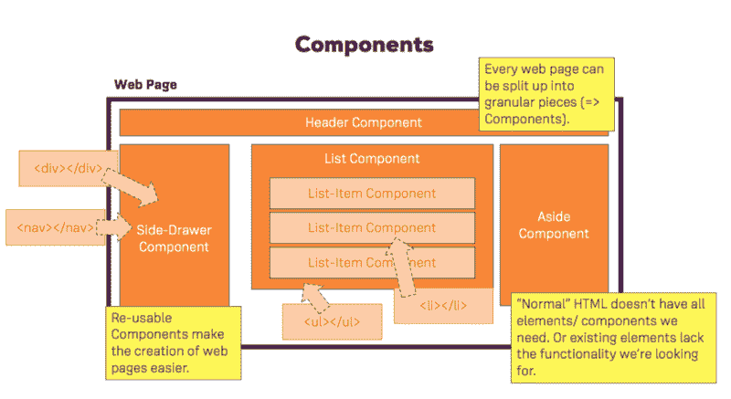
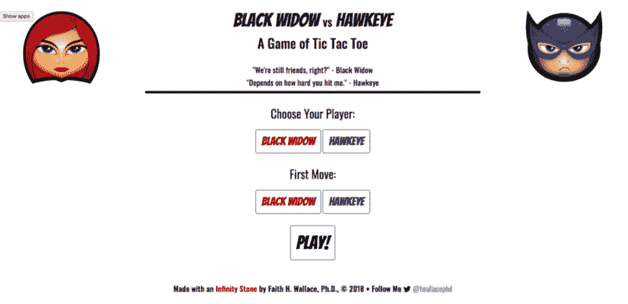
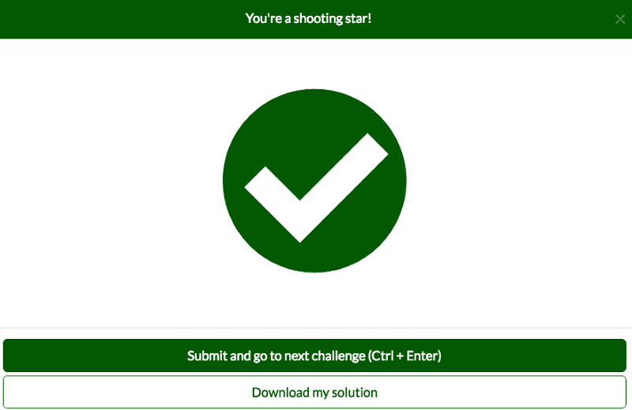

# 当你学习编码时，如何选择正确的在线课程或平台

> 原文：<https://www.freecodecamp.org/news/choosing-the-right-course-9ae77fd3504a/>

由代码女孩

# 当你学习编码时，如何选择正确的在线课程或平台

Photo by [Callum Shaw](https://unsplash.com/photos/TLxaYmixZ3k?utm_source=unsplash&utm_medium=referral&utm_content=creditCopyText) on [Unsplash](https://unsplash.com/search/photos/learn?utm_source=unsplash&utm_medium=referral&utm_content=creditCopyText)

这是学习编码的最佳时机。有大量的在线课程和学习平台，从免费到稍微贵到超出我的预算。重要的是，你要花点时间考虑哪门课程会给你带来最大的成功。

有一种简单地寻找符合你当前需要的课程的诱惑。这可能是一种语言，例如 JavaScript，也可能是一个库，例如 React。

对每门课程的有效评估对成功至关重要。在这篇文章中，我涵盖了基于教育心理学——脑科学——的五点评估，我认为这五点很重要。这是基于我作为一名教育领域的前大学教授的经验。

一门课程应该包括哪些内容，以确保你的学习体验是最佳的，这样你既能完成课程，又能成功地学习内容？如果没有这样的评估，你可能会发现自己在一个又一个过程中不断地迷失，这带来了挫败感，并可能导致你放弃。

### 多种多样的学习方式

在之前的 [帖子](https://fwallacephd.github.io/BrainScience/)中，我谈到了学习风格的重要性，这是你大脑学习新信息的首选方法。

大多数人都有一种主导风格或几种主导风格的组合，它们是:

*   口头(阅读)
*   视觉(图像)
*   听觉(听力)。

这意味着，基于视频的课程,( 1)有阅读文本,( 2)包括图表、图像并利用颜色,( 3)信息的语音记录确保更多的参与者能够成功。

我最喜欢的课程是 Maximillian Schwarzmuller 的[React 16——完全指南](https://www.udemy.com/react-the-complete-guide-incl-redux/)。内容包括语言、视觉和听觉。马克斯解释了课程的每一个步骤，你可以阅读转录并跟着他说话。当你没有完全听清所说的内容，或者你想重读一遍以澄清时，这种转录是很有帮助的——特别是如果他正在一步一步地解释某件事情。

Max 还包括视觉效果—图表和插图—来帮助阐明概念。此外，他的视觉效果总是强调重点。图像与音频完美搭配。三种学习方式的结合确保了你对内容的理解。下面是他的一个图表。

先说一分钟 [freeCodeCamp](https://www.freecodecamp.org/) 。虽然这个平台本身是口头学习——阅读文档的片段，然后实践你所学到的东西——但它远比看上去的要多。因为 freeCodeCamp 非常受欢迎，他们有一群专门的程序员，在 YouTube 频道上提供涵盖音频和视频学习风格的补充材料。

例如，Jose Moreno 的 [We Will Code](https://www.youtube.com/channel/UCQsneWfl8r0lV3evE7W9o3Q) 讲述了各种 freeCodeCamp 的挑战，在他解释方向(口头)时会更详细。科迪·塞伯特的[每日程序员](https://www.youtube.com/watch?v=bcPahhyYEIk&list=PLWKjhJtqVAbk7zM11M36sGvU29hB8EDC4)做了类似的事情，但他在白板上走过挑战，并梳理出涵盖的概念(视觉)。

还有更多这样的渠道，我鼓励你去探索它们。不要忘记免费代码营[播客](https://freecodecamp.libsyn.com/)和[博客](https://medium.freecodecamp.org/)。你有一个强大的学习平台，满足三种学习风格，这是成功的最佳选择。

找课程的时候，选择一门材料以多种方式呈现的课程，这样你就有更大的机会理解和记住信息。

### 基于项目的学习

说到教育，动觉学习——边做边学——是吸收材料最有效的方法。当信息转化为工作产品时，学习就发生了。在这个学习过程中，你的工作变得凌乱和中断是很自然的，因为这是在上下文中学习。

指令应始终是 80/20 的比例。80%的时间你实际上在工作，在这种情况下是编码。你有 20%的时间在听、读或看视频。

我从 Filip Kordanovski 那里学到最多的课程:[用 HTML5、CSS3 和 Bootstrap](https://www.udemy.com/build-a-responsive-website-with-html5-css3-and-bootstrap-4/learn/v4/overview) 构建一个响应式网站。整个课程的中心是为一个虚构的公司建立一个登陆页面。我们边做边学。登录页面的每个部分都是为我们学习新概念而设置的。我不仅学习了 HTML、CSS 和 Bootstrap，还学到了很多关于设计的知识。

我喜欢的另一门课是韦斯·博斯的 JavaScript 30。这是一个免费的课程，是为你设计的，让你在 30 天内每天都可以做小项目。

当然，毫无疑问 [freeCodeCamp](https://learn.freecodecamp.org/) 是基于项目的。为了获得响应式网页设计证书，你需要构建五个非常不同的项目。光是面试带回家预习就有 20 个项目！平台的每个部分都以几个相关项目结束，一旦你完成了课程，这些项目将测试你的能力。

下面你可以看到我的免费代码营井字游戏的第一页。我花了很大力气把这个和一个超级英雄结合在一起。

总是要看看你想学的课程是否有你在整个课程中构建的项目。在真实的项目中工作可以为你的基本技能建立肌肉记忆。但是不要止步于此。一旦你通过你的课程学会了如何构建，你就该创建自己的原创项目了。这就是动觉学习，边做边学。

### 解决问题的机会

不幸的是，许多课程没有给学生提供解决问题的机会。大多数基于视频的课程只是一段代码。

没有解决问题的适当实践，在编码的真实世界中你将会非常困难。这是因为你需要练习分析因果，理解层次结构，调试和重构。这可能是 [freeCodeCamp](https://learn.freecodecamp.org/) 最大的优势之一——你总是在解决问题。平台的整个基础 JavaScript 部分正在解决一个又一个问题。

为了防止疲劳，我建议你设定一周解决一定数量问题的目标。当然也有很多人喜欢上别的课。重要的是，你要评估这些课程，看看是否有解决问题的机会。

柯尔特·斯蒂尔网络开发人员训练营在每一部分学习结束后都会很好地分配编码挑战和项目。[Jonas Schmedtmann 的完整 JavaScript 课程 2018](https://www.udemy.com/the-complete-javascript-course/learn/v4/overview) 非常相似，此外，该课程是基于项目的，您可以使用在课程中学到的一切创建预算应用程序。

当你在评估一个潜在的班级时，总是要看看是否有机会让你自己解决问题。这门课程应该为这些问题提供解决方案，并且应该给你机会来检验你的技能。这是一个自我评估。如果你不能解决这些问题，你可能想回去重做课程中的一两个部分。

### 一个社区

没有什么比你在解决课程问题时碰壁而无处求助更糟糕的了。你尝试了你能尝试的一切，包括大量的谷歌搜索。但是什么都没有。这实际上阻止了你的学习，这也是为什么你的课程把学习者聚集在一起帮助你“摆脱困境”是如此重要的原因。

现在，有很多方法可以做到这一点。freeCodeCamp 在他们网站上的一个论坛中这样做，并且有许多 freeCodeCamp 脸书小组。其他课程用的是 Slack 或者 Discord，是群聊应用。

这是至关重要的。如果你没有办法及时得到问题的答案，你将会忘记你所学的东西，并且会失去前进的动力。为此，我优先选择那些能把学生群体聚集在一起的课程。

freeCodeCamp 通过面对面的学习小组更进一步。我每隔一周的周日参加亚特兰大的学习小组，并在那里交了一些难以置信的朋友。下面是我们学习小组的一些成员(包括我)参加由《女性编码》主办的 We RISE 会议的照片。

In order: Nerando Johnson, Rachel Rae, myself, and Kris Hays.

### 基准

虽然聪明的营销会让你认为你可以在一个月内学会编程并找到一份令人难以置信的工作，但很可能你做不到，这没关系。

学习编程需要时间。你在学习新的能力，比如语言(JavaScript)、框架(Angular)、库(jQuery)。每个人都按照自己的速度学习。重要的是你要设定现实的目标，这样你就不会在前进的道路上变得气馁。这包括:

*   职业目标，例如一年内的开发人员工作
*   长期目标，例如在 6 个月内完成 freeCodeCamp 的响应式网页设计证书
*   短期目标，例如，本周完成 [React 16](https://www.udemy.com/react-the-complete-guide-incl-redux/learn/v4/content) 课程的下三个视频

伟大的课程提供了帮助激励你和鼓励你前进的基准。你可以在 freeCodeCamp 中非常清楚地看到这一点。如果你遵循课程表，你总能看到你在每个部分的进度。每次挑战后的激励性弹出窗口让我开心不已(见下文)。

Filip Kordanovski [用 HTML5、CSS3 和 Bootstrap](https://www.udemy.com/build-a-responsive-website-with-html5-css3-and-bootstrap-4/learn/v4/overview) 构建一个响应式网站课程有内置的基准，因为课程的每个部分都在构建网站的另一部分。这些基准就像短期目标，完成它们会让你觉得你已经完成了一些事情，这反过来会激励你更加努力地工作，达到下一个基准。

虽然这似乎是你在评估课程时可以忽略的事情，但它对你学习时的心理健康极其重要。成就感会给你的心灵带来奇迹。

### 结论

是的，有大量的课程供你学习编程，但是用这五个原则来评估它们实际上会把许多课程从列表中剔除。

我们来复习一下。

*   你想要一门针对不同学习风格的课程，这样你就有更好的机会理解材料。
*   因为教育的最佳实践告诉我们边做边学是最好的方法，所以只选择那些你必须边学边做的课程。
*   确保你的课程有机会让你自己解决问题。这将有助于你了解自己对课程的理解程度。
*   此外，创建一个学习者社区有助于你在工作时“摆脱困境”。任何平台都可以——一个论坛，一个脸书页面，一个 Slack 频道。不要害怕寻求帮助。
*   最后，有明确的基准将帮助你完成短期目标，并在长期保持动力。

关于学习风格和脑科学的更多信息，请访问我的网站[这里](https://fwallacephd.github.io/BrainScience/)。

在 Twitter 上关注我，了解更多脑科学和学习代码@fwallacephd。