# 如何在 15 分钟内在 AWS 上免费推出一个网站

> 原文：<https://www.freecodecamp.org/news/how-to-launch-a-site-on-aws-for-free-in-15-minutes-7b3ce5d8d053/>

丹尼尔·西蒙斯

# 如何在 15 分钟内在 AWS 上免费推出一个网站


如果你对亚马逊网络服务(AWS)完全陌生，它可能会显得异常复杂。

不仅看起来有一千种不同的服务可供选择，每一种都有一个同样神秘的名字(如 S3、拉姆达、EC2 或雅典娜)，而且还有**so****more***要配置。*

*您必须决定为您的函数分配多少内存，您希望您的代码来自世界的哪个地理区域，并且您必须构建一个奇怪的 JSON 对象来授予权限？很容易尝试一下，然后发现太难开始了。*

*如果这描述了你到目前为止的经历，那么很好——这篇文章是给你的。*

*我在同一条船上呆的时间比我想承认的要长。*

*但是尽管它的复杂性令人生畏，AWS 还是有一些东西一直在召唤着你。*

*有速度，可靠性，甚至只是专业的影响力，能够说你有 AWS 的经验。*

*但是，像任何事情一样，如果你想开始，那么你需要迈出第一步。所以我在这篇文章中的目标是使它变得简单。我想让你明白，你可以说“我已经在 AWS 上部署了一个项目。”*

*这将比你想象的要容易得多，它将为你提供一个开始探索 AWS 其他服务的起点。*

### *第 0 步:你需要做的事情*

*这个列表很短，但是我想我应该把它放在前面和中间，以确保从一开始就很清楚。*

1.  *一张可以使用的信用卡/借记卡(别担心，如题所示，完全免费。但是您需要输入信用卡信息才能创建 AWS 帐户)*
2.  *可以在 AWS 上上传和托管的前端代码。这可以像一个正文中带有`<p>Hello Wor` ld < /p >的 HTML 文档一样简单。*

### *步骤 1:创建一个 AWS 帐户*

*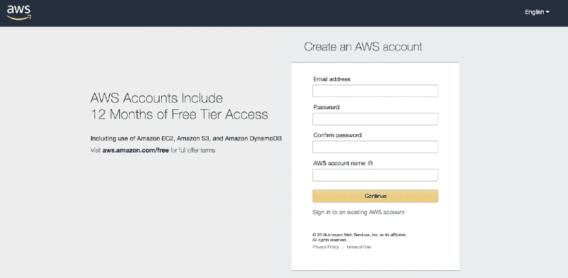*

*老实说，我在这一点上停了几次，仅仅是因为这是一种“免费试用，但他们要求你的信用卡信息”的情况，这是我原则上倾向于抵制的。*

*但是 12 个月免费层是相当惊人的。在决定是否值得继续使用 AWS 之前，一整年的时间是很长的。(我与 AWS 没有任何关系，仅供参考)。*

*请点击此链接，创建您的账户: [AWS 免费等级](https://aws.amazon.com/free/)。*

*我知道有些人可能会担心免费计划的局限性。例如，GET 和 PUT 请求每月有一个上限(分别为 20，000 和 2，000)，超过上限后，您将开始被收费。*

*但是只要你现在只是用它来实验和学习，就几乎没有超越限制的机会。*

*即使你这样做了，超过上限的价格通常是每 1000 个请求一美分的零头。*

### *步骤 2:为您的项目/站点创建一个 S3 存储桶*

*为了让事情尽可能简单，我们将在这个项目中使用的唯一 AWS 服务将是简单存储服务(或 S3)，亚马逊的云存储服务之一。*

*S3 的行为有点像 Google Drive 或 Dropbox。但是它也可以配置为服务于文件，而不仅仅是存储文件，这正是我们将要做的。*

*由于我们将只提供托管在 S3 的文件，这将是一个静态的网站，没有后端或连接到数据库。*

*现在你已经有了一个 AWS 帐户，登录到管理控制台([链接到这里](https://console.aws.amazon.com/))并点击主菜单左上角的“服务”。*

*您将看到我在开始时提到的令人难以置信的大量服务选项。不要担心所有这些，只需点击“存储”部分下的“S3”。*

*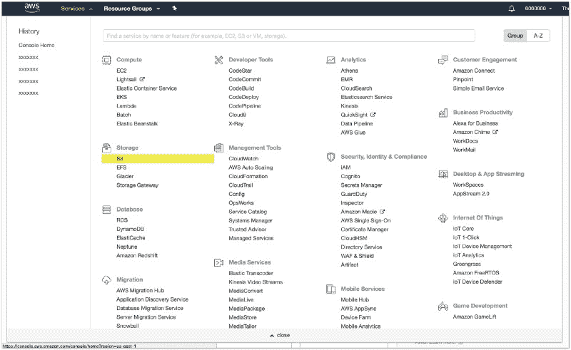*

*这将把你带到 S3 页面，在那里你可以创建不同的“桶”来存储你的不同项目。*

*存储桶就像你桌面上的文件夹。但是 S3 上的文档存储系统并不遵循传统的文件夹结构(如果你有兴趣的话，还会有更多的介绍)。因此，相反，“桶”似乎是正确的词。*

*点击左上角的蓝色大按钮“创建存储桶”来创建一个存储你的项目文件的存储桶。*

*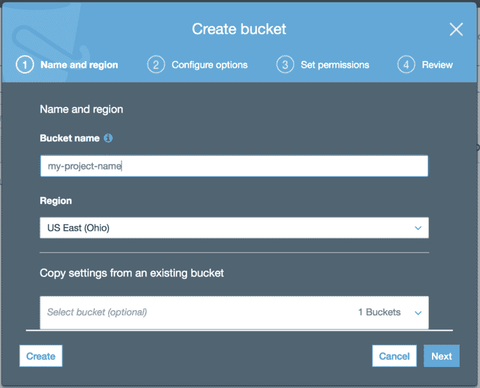**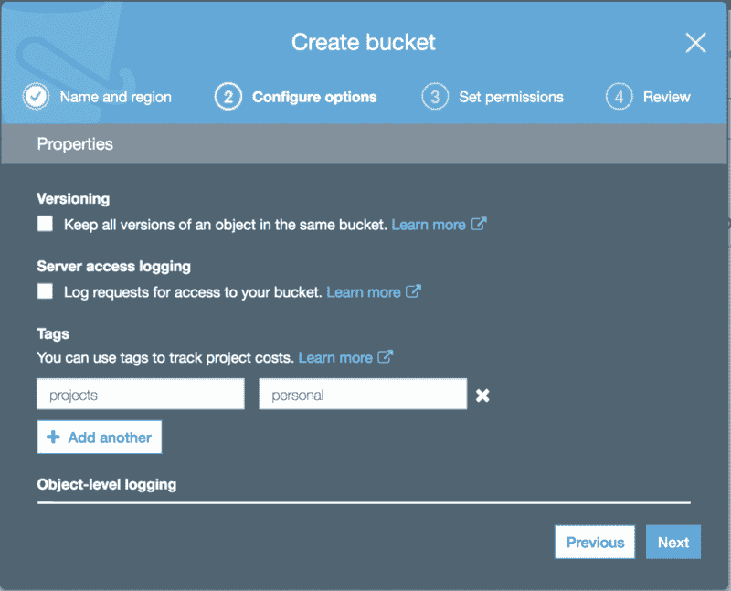

1) Select the region that is closest to you 2) The “tags” are just used for cost tracking. You don’t really NEED to fill this part out, but it’s a good practice* *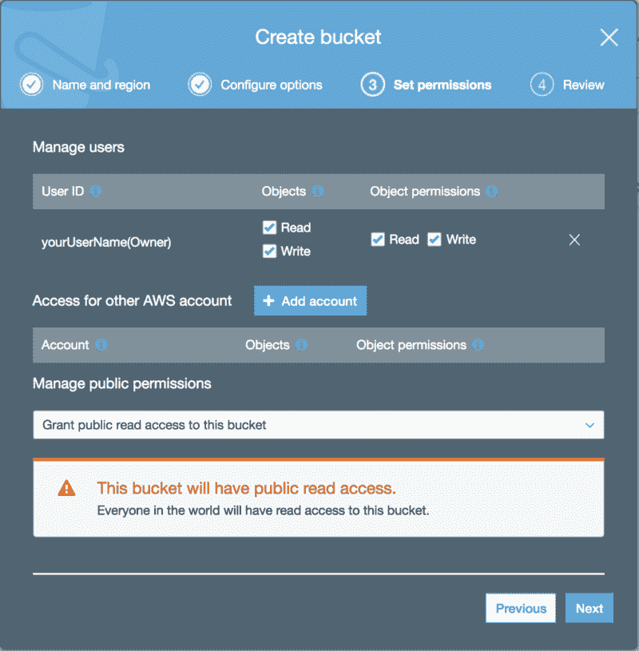**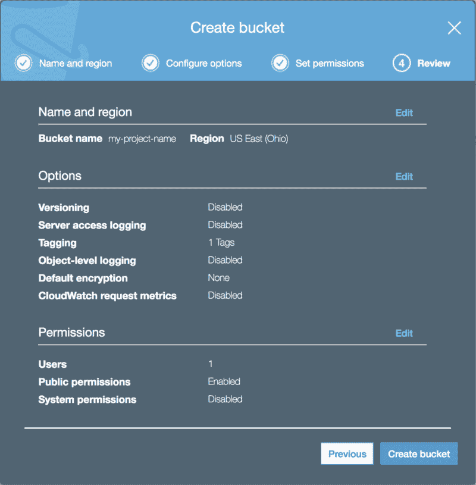*

*这里您需要做的主要事情是确保公共权限被设置为“授予对这个存储桶的公共读访问权”*

*AWS 会给你一个警告，但是不用担心。他们只是想确保没有人会意外这么做。但这正是你想做的。*

*完成后，您将在 S3 控制台的列表中看到您的存储桶。*

### *步骤 3:添加文件并在您的 bucket 上配置设置*

*单击列表中新创建的存储桶。这将把您带到一个页面，在这里您可以向您的存储桶添加内容并配置其设置。*

*首先，您将想要在“Overview”选项卡上添加您的项目文件(在开始提到的)。请记住，这些可以是任何功能前端项目的文件。*

*你将不能上传任何文件夹(同样，因为 S3 实际上没有文件夹结构)。相反，您需要手动创建 S3 项目中的任何文件夹，并将文件上传到这些文件夹中。*

*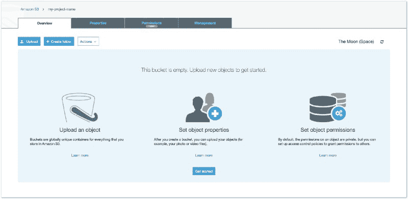*

*接下来，单击“属性”选项卡。*

*这是你告诉 S3 你想用这个桶来存放你的文件的地方。*

*只需点击写着“静态网站托管”的图标，输入你的索引(必填)和错误(非必填)文档的名称，就大功告成了。*

*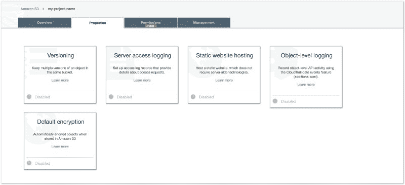**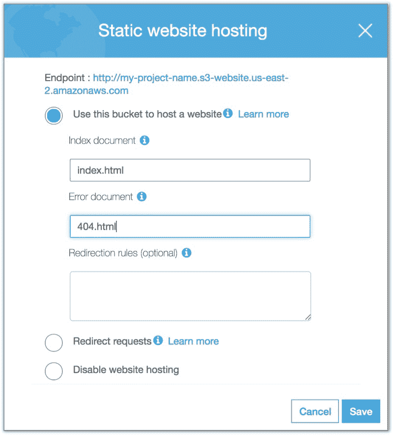*

*接下来，单击“权限”选项卡。*

*您将在主选项卡下方看到一个名为“访问控制列表”的子部分。这已经正确配置了，因为您已经说过任何人都应该能够读取这个桶中托管的文件。*

*现在，您需要单击“Bucket Policy”部分。这里，将提示您创建一个 JSON 对象，其中包含您的 bucket 的访问权限策略的细节。*

*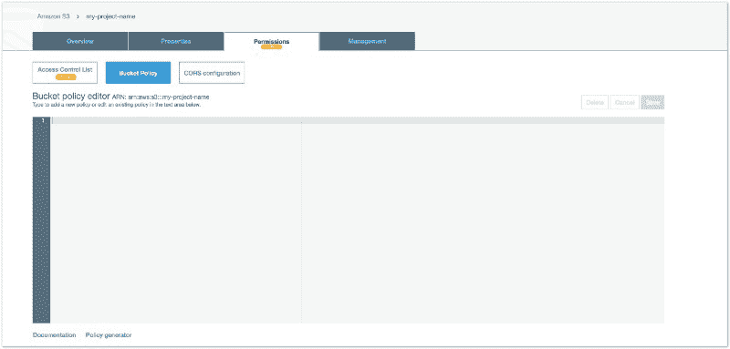*

*这部分可能会让人困惑。现在，我只给你 JSON，它将授予你对 bucket 中文件的完全公共访问权。这将使网站对公众开放。*

*将它粘贴到如上所示的存储桶策略编辑器中:*

```
*`{    "Version": "2012-10-17",    "Statement": [        {            "Sid": "PublicReadForGetBucketObjects",            "Effect": "Allow",            "Principal": "*",            "Action": "s3:GetObject",            "Resource": "arn:aws:s3:::YOUR-BUCKET-NAME/*"        }    ]}`*
```

*不要忘记将“你的桶名”替换为…你的桶名。*

### *你完了！*

*就是这样！现在，您已经在 AWS S3 站点上部署了一个非常简单的静态站点。*

*要访问您的站点，请返回到 S3 的“概述”选项卡，然后单击您的索引文档(单击列表项中的空白区域，而不是指向文档本身的链接)。你会在右边看到一个滑动菜单，上面有一个到你的网站的链接！*

*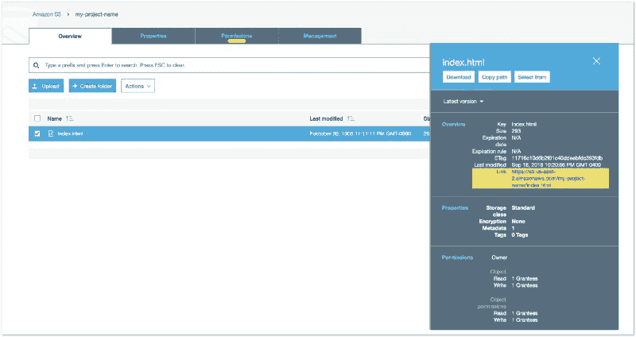**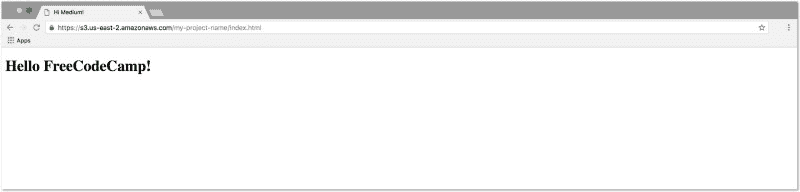*