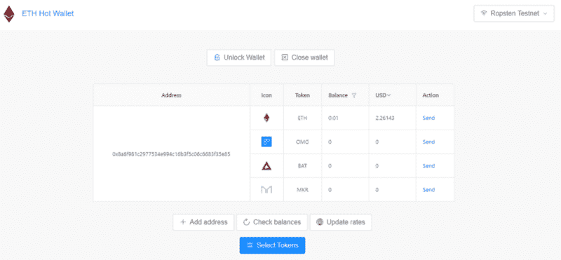
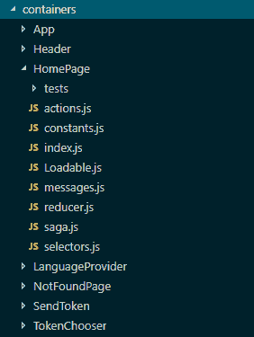
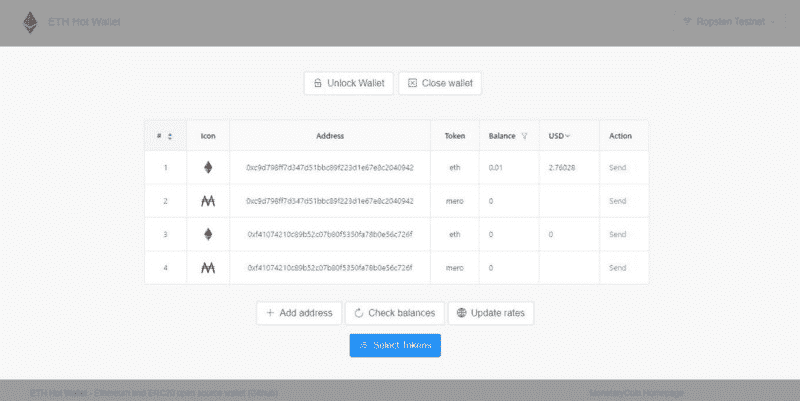
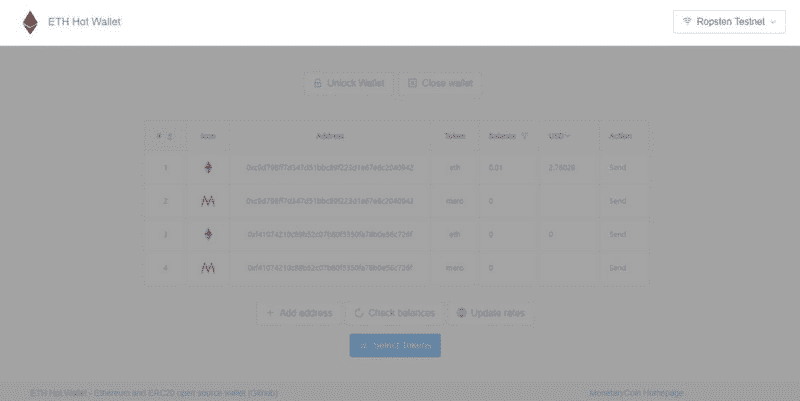
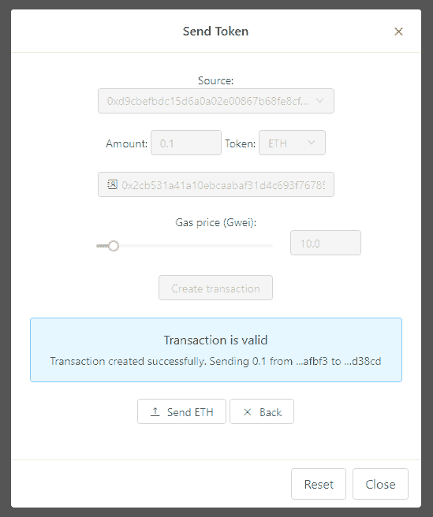
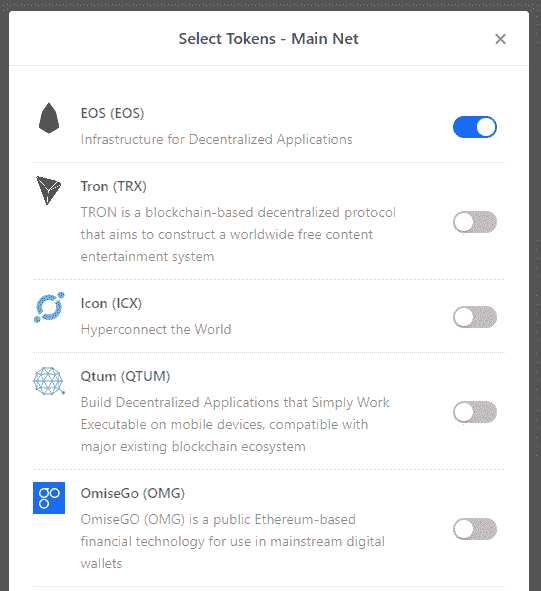
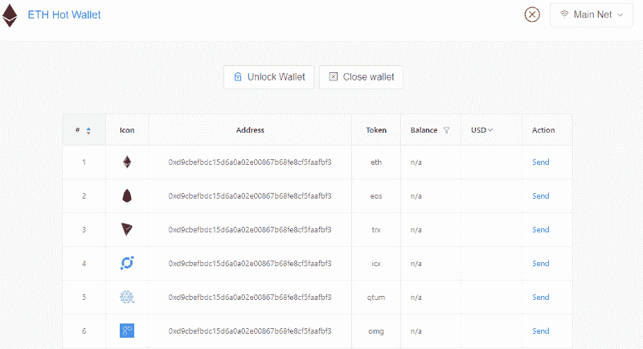
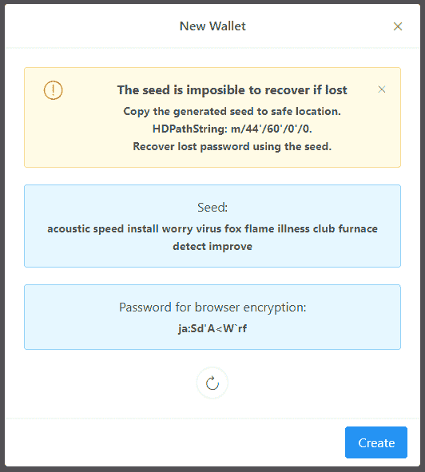
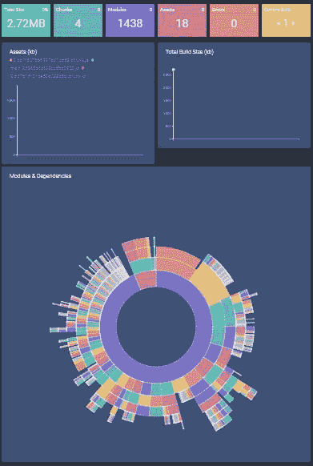

# 如何构建以太坊钱包 web app

> 原文：<https://www.freecodecamp.org/news/how-to-build-an-ethereum-wallet-web-app-ac77dcaac573/>

保罗·劳克斯

# 如何构建以太坊钱包 web app

#### eth-hot-wallet 最酷部分回顾

本文是对 **eth-hot-wallet** 有趣部分的技术综述，这是一个[以太坊钱包](http://eth-hot-wallet.com) web 应用，具有 erc20 令牌原生支持。源代码可以在 [GitHub](https://github.com/PaulLaux/eth-hot-wallet) (麻省理工学院许可)上找到。



eth-hot-wallet preview

**目录:**

*   以太坊钱包作为一个网络应用
*   堆栈
*   热钱包的容器
*   以太坊钱包的统一设计
*   Redux 和 Redux-Saga
*   *安全*密码生成器
*   eth-light 钱包和签名提供商
*   加密离线存储
*   使用 Web3.js 发送以太坊
*   使用 Web3.js 发送 erc20 令牌
*   使用 Web3.js V1 和 Redux-Saga 渠道订阅以太坊交易生命周期
*   使用 Redux-Saga 轮询以太坊区块链和价格数据
*   密切关注包的大小
*   结论

### 以太坊钱包作为一个网络应用

当软件作为 web 应用程序部署时，首先想到的是广泛的可访问性。毕竟，网络是最广泛可访问的跨设备平台。Eth-hot-wallet 是一个 PWA(渐进式网络应用程序),可以在任何现代网络浏览器上使用。

此外，[最近对 PWA 支持的改进](https://medium.com/appscope/designing-native-like-progressive-web-apps-for-ios-1b3cdda1d0e8)显著改善了用户在移动设备上的体验。

优点:

*   不需要额外的软件
*   不需要任何形式的安装
*   能够使用现代网络开发工具。
*   易于部署和升级

缺点:

*   更容易受到网络钓鱼攻击。
*   浏览器插件可能会将恶意代码注入页面。
*   慢速互联网连接上的高加载时间
*   对设备存储的有限访问

恶意浏览器扩展可能会注入 JavaScript 代码试图提取密钥，这一事实非常重要。为了消除这种风险，应该鼓励用户关闭扩展(即在匿名模式下使用)或将 web 与外部 web3 提供商(如 MetaMask 或 Trust browser)集成。将 web 应用程序转换成桌面应用程序也是一个可行的选择。

至于网络钓鱼，应该鼓励用户将网页加入书签，并通过谷歌搜索来访问。钓鱼网站在搜索结果中的排名不太可能高于真实网站。

**底线:一个网络应用可以让你以最小的摩擦接触到最广泛的受众**。在我看来，网络是新应用的最佳目标平台。


eth-hot-wallet logo

### 堆栈

大部分代码专用于**前端:**

最终的包由许多包组成，可以在 [package.json](https://github.com/PaulLaux/eth-hot-wallet/blob/master/package.json) 中看到。

顶级组件包括:

*   [Eth-lightwallet](https://github.com/ConsenSys/eth-lightwallet) —用于节点的轻量级 JS Wallet 和用于密钥库管理的浏览器
*   React、Redux、saga.js、immutableJS 和 reselect 由离线包装-首先[react-样板文件](https://github.com/react-boilerplate/react-boilerplate)
*   Ant 设计——react 的优秀 UI 组件集
*   web pack—JavaScript 和朋友的捆绑器。

对于**后端:**

最终的包从存储库中的一个专用分支直接部署到 GitHub 页面。传统场景中不需要后端。

为了创建 Testnet 以太坊龙头，我们将使用一个[无服务器框架](https://serverless.com/framework/docs/getting-started/)。它显著改善了使用 AWS Lambda 时的开发人员体验。这是一个非常经济高效的解决方案，消除了维护基础设施的需求，尤其是在低容量应用中。

### 热钱包的容器



eth-hot-wallet homepage container

当使用 React、Redux、Saga.js 和 Reselect 的组合时，每个容器(可能)由以下成分组成:

*   index.js —用于呈现 GUI
*   actions.js
*   reducer.js
*   saga.js
*   选择器. js
*   constants.js

正如[丹·阿布拉莫夫](https://www.freecodecamp.org/news/how-to-build-an-ethereum-wallet-web-app-ac77dcaac573/undefined)所说的,[有不止一种方法](https://medium.com/@dan_abramov/smart-and-dumb-components-7ca2f9a7c7d0)来决定是使用组件还是容器。根据我的经验，如果一个组件在应用程序状态中有 8 个以上的属性，它应该被分离到一个新的容器中。这只是一个经验法则。属性的数量可能会随着时间的推移而膨胀。对于复杂的组件，拥有一个唯一的容器比群集主容器的状态更好。

不是每个容器都需要所有的原料。在 eth-hot-wallet 中，`[sendToken](https://github.com/PaulLaux/eth-hot-wallet/tree/master/app/containers/SendToken)` [容器](https://github.com/PaulLaux/eth-hot-wallet/tree/master/app/containers/SendToken)不使用自己的 Saga.js，我们把它分开是为了不给主页组件的状态增加负担。

#### 主页容器



eth-hot-wallet homepage container

主容器是[主页容器](https://github.com/PaulLaux/eth-hot-wallet/tree/master/app/containers/HomePage)，大部分动作都发生在这里。在主页容器中，Saga.js 负责处理副作用。除了 GUI 之外，它的主要职责是处理**密钥库操作**。

ETH-Lightwallet 包提供了密钥库。包括密钥、种子、加密、导入、导出在内的所有相关操作都在此部分完成。

#### 标题容器

[标题](https://github.com/PaulLaux/eth-hot-wallet/tree/master/app/containers/Header)展示了一个事实，即容器不仅仅是一个 GUI 组件:



eth-hot-wallet header container

这个容器起初可能看起来很简单，只有一个徽标和一个网络选择器。它甚至需要在自己的容器中吗？答案是，在 eth-hot-wallet **中，每个与网络通信相关的动作和状态管理都是在头容器**中完成的。对任何容器来说都绰绰有余。

#### SendToken 容器

[SendToken](https://github.com/PaulLaux/eth-hot-wallet/tree/master/app/containers/SendToken) 是用户选择发送以太/令牌时出现的模态。



eth-hot-wallet SendToken container

该模式包括一些基本的输入验证，如金额和以太坊地址检查。它不使用 Saga.js 来启动副作用，而是使用 homepage 和 header 容器提供的动作。

我们将它分离到一个新的容器中，以减少主页容器的状态聚类。

#### TokenChooser 容器

[令牌选择器](https://github.com/PaulLaux/eth-hot-wallet/tree/master/app/containers/TokenChooser)在用户想要选择钱包将管理的令牌时出现。



eth-hot-wallet TokenChooser container

选择`TokenChooser`名称是为了不与在不同上下文中多次出现在钱包代码中的术语“选择器”相混淆([reduxjs/reseselect:Redux](https://github.com/reduxjs/reselect)的选择器库)。

与`SendToken`容器一样，`TokenChooser`不使用自己的 Saga.js 文件，而是在需要时从 homepage 容器调用动作。

### 以太坊钱包的统一设计

自从 ERC20 标准( [EIP20](https://github.com/ethereum/EIPs/blob/master/EIPS/eip-20-token-standard.md) )出现以来，很明显代币将成为以太坊生态系统的重要组成部分。以太坊钱包的设计采用了统一的设计方法。**从用户的角度来看，以太和令牌应该一视同仁。**

在引擎盖下，发送以太和发送令牌的 API 是完全不同的。检查余额也是如此，但它们在 GUI 上显示是一样的。



[A Unified design for Ethereum Wallet](https://eth-hot-wallet.com)

要发送 Ether，我们需要使用 web3.js 库提供的本机函数，而发送令牌和检查余额涉及到与智能契约的交互。稍后再讨论这个问题。

### Redux 和 Redux-Saga

使用 Redux store 作为真实的单一来源对钱包大有好处。GUI 动作和用户触发的流可以相对容易地由 Redux 提供的动作和减少器来管理。

除了保存 UI 状态，Redux store 还保存 key-store 对象(eth-lightwallet 提供的部分加密的 JavaScript 对象)。这使得通过使用选择器可以在整个应用程序中访问密钥库。

Redux-Saga 让整个场景熠熠生辉。

> `redux-saga`是一个库，旨在使应用程序副作用(即，异步的事情，如数据获取和不纯的事情，如访问浏览器缓存)更容易管理，更有效地执行，易于测试，并更好地处理故障。

Saga.js 使用生成器使**异步流易于读写**。通过这样做，这些异步流看起来像标准的同步 JavaScript 代码(有点像`async` / `await`，但是有更多的定制选项)。

以以太坊钱包为例，通过使用 Saga，我们可以轻松处理异步操作，如 rest API 调用、密钥库操作、以太坊区块链通过 web3.js 调用等等。所有的请求都在一个地方干净地管理，没有回调地狱，非常直观的 API。

**redux-saga 用法示例:**

### *安全*密码生成器



A seed and a secure password is auto-generated for the user

为了充分保护用户的密钥库，我们需要用强密码对其进行加密。使用 eth-lightwallet 时，需要在初始化 [hd-wallet](https://www.google.com/url?sa=t&rct=j&q=&esrc=s&source=web&cd=3&cad=rja&uact=8&ved=2ahUKEwiV_JvMw4_dAhWMDcAKHfGpANYQFjACegQICBAB&url=https%3A%2F%2Fethereum.stackexchange.com%2Fquestions%2F33395%2Fwhat-is-a-hd-wallet-for-ether-and-how-to-create-one-using-nodejs%3Frq%3D1&usg=AOvVaw2P31H_vW_U9Dc8tZHEcrNA) 时提供密码。

假设我们有一个名为`generateString`的函数，它可以提供任意长度的真正随机的字符串。

如果用户想生成一个新的钱包，我们将产生以下参数:

我们可以要求用户确认密码和种子，或者代表它生成一个新的集合。或者，我们可以要求用户提供他们自己现有的种子和密码。

`generateString`实现:我们将使用相对较新的 [**window.crypto API**](https://developer.mozilla.org/en-US/docs/Web/API/Window/crypto) 来获取随机值(目前[所有主流浏览器都支持](https://caniuse.com/#feat=getrandomvalues))。

[Eth-hot-wallet 实现](https://github.com/PaulLaux/eth-hot-wallet/blob/master/app/utils/crypto.js)基于以下代码生成**随机但人类可读的字符串**:

用户接受密码和种子后，我们可以使用这些值并生成新的钱包。

### eth-light 钱包和签名提供商

1.  LightWallet 旨在成为[挂钩的 Web3 提供者](https://github.com/ConsenSys/hooked-web3-provider)的签约提供者。
2.  挂钩的 Web3 provider 已经被弃用，目前作者推荐包 [ethjs-provider-signer](https://github.com/ethjs/ethjs-provider-signer/) 作为替代。
3.  在撰写本文时，ethjs-provider-signer 中有一个 bug 阻止了错误消息的显示。bug 被修复了，但是没有合并回主分支。这些错误消息对于该设置的正常运行至关重要。

**底线**:使用 eth-lightwallet 和这个版本的 ethjs-provider-signer:【https://github.com/ethjs/ethjs-provider-signer/pull/3】T2 来节省试错的时间。

### **加密离线存储**

lightwallet keystore vault JSON 对象是加密的，它需要我们提供一个外部的`passwordProvider`来安全地保存加密密钥。keystrore 对象总是加密的。该应用程序负责保管密码，并为其提供任何操作。

eth-hot-wallet 使用 [Store.js](https://github.com/marcuswestin/store.js) — *跨浏览器存储用于所有用例，跨网络使用*。Store.js 允许我们轻松地存储加密的密钥库，并在网页被访问时将其从存储中提取出来。

首次加载 wallet 时，它将检查本地存储中是否有密钥库，如果有，它将自动将其加载到 Redux 状态。

此时，我们可以读取密钥库的公共数据，但不能读取密钥。要在用户输入加密密码之前显示公共数据，我们需要一个额外的操作模式: **loaded and locked。**在此模式下，电子钱包将显示地址并提取余额，但不能执行发送交易或生成新地址等操作。触发这些操作中的任何一个都会提示用户输入密码。


locked wallet after loading from local storage

### 使用 Web3.js 发送以太坊

使用 Web3.js@0.2.x 时，函数`sendTransaction`以如下形式提供:

`web3.eth.sendTransaction(transactionObject [, callback])`

如果成功，回调将返回 TX 作为结果。

然而，为了正确地将它集成到我们的 saga.js 流中，我们需要用承诺包装`[sendTransaction](https://github.com/PaulLaux/eth-hot-wallet/blob/master/app/containers/Header/saga.js#L203)` [函数:](https://github.com/PaulLaux/eth-hot-wallet/blob/master/app/containers/Header/saga.js#L203)

这样，我们在调用`sendTransaction`之后继续常规的 Saga.js 执行。

### 使用 Web3.js 发送 erc20 令牌

以太坊区块链不提供封装令牌功能的原语，也不应该提供。以太坊上部署的每一个令牌，实际上都是一个对应于 [**eip20 规范**](https://github.com/ethereum/EIPs/blob/master/EIPS/eip-20.md) 的程序。由于以太坊虚拟机(EVM)是图灵完全的(有一些限制)，每个令牌可能有不同的实现(即使是相同的功能)。将所有这些程序统一在术语“令牌”下的是它们提供了规范定义的相同 API。

当我们在以太坊上发送令牌时，我们正在与智能合约进行交互。为了与智能合约通信，我们需要知道它的 API，共享合约的 API 的格式称为[以太坊合约 ABI](https://github.com/ethereum/wiki/wiki/Ethereum-Contract-ABI) 。

我们将把 [erc20 ABI](https://github.com/PaulLaux/eth-hot-wallet/blob/master/app/utils/contracts/abi.js) 存储为 JavaScript 包的一部分，并在程序运行时实例化一个契约:

`const erc20Contract = web3.eth.contract(erc20Abi);`

在契约设置之后，我们可以使用 [Web3.js 契约 API](https://github.com/ethereum/wiki/wiki/JavaScript-API#web3ethcontract) 轻松地以编程方式与之交互。

对于每个令牌，我们都需要一个专用的合同实例:

`const tokenContract = erc20Contract.at(tokenContractAddress);`

创建契约实例后，我们可以通过直接从 JavaScript 调用所需的函数来访问契约函数:

详见 [Web3.js 合同 API](https://github.com/ethereum/wiki/wiki/JavaScript-API#web3ethcontract) 。

我们将承诺`tokenContract.transfer.sendTransaction`在我们的 redux-saga 流程中使用它:

可以使用 [es6-promisify](https://github.com/digitaldesignlabs/es6-promisify) 或类似的方法，而不是直接写承诺，但在这种情况下，我更喜欢直接的方法。

### 使用 Web3.js V1 和 redux-saga 渠道订阅以太坊交易生命周期

*eth-hot-wallet 使用 web3.js v0.2.x，暂时不支持此功能*。*另一个项目提供了例子。这是一个重要的特性，应该广泛使用。*

Web3.js 的新版本(V1.0.0)附带了一个[新契约 API](https://web3js.readthedocs.io/en/1.0/web3-eth-contract.html#methods-mymethod-send) ，它可以通知我们事务生命周期的变化。

进入`PromiEvent`:一个[承诺组合事件发射器](https://web3js.readthedocs.io/en/1.0/callbacks-promises-events.html#promievent)。

```
web3.eth.sendTransaction({...}).once('transactionHash', function(hash){ ... }).once('receipt', function(receipt){ ... }).on('confirmation', function(number, receipt){ ... }).on('error', function(error){ ... }).then(function(receipt){    //fired once the receipt is mined});
```

`web3.eth.sendTransaction()`将返回一个对象(承诺),该对象将在交易被挖掘后解决。同一个对象将允许我们订阅`‘transactionHash’`、`‘receipt’`、`‘confirmation’`和`‘error’`事件。

这个 API 比 0.2.x 版本的 Web3.js 提供的要丰富和优雅得多。我们将看看如何在 [Saga.js 频道](https://redux-saga.js.org/docs/advanced/Channels.html)的帮助下将其整合到我们的网络应用中。其动机是一旦检测到事务状态的变化，就更新应用程序状态(Redux store)。

在下面的示例中，我们将创建一个对任意智能合约的“提交”事务，并在获得`‘transactionHash’`、`‘receipt’`和`‘error’`事件时更新应用状态。

我们需要初始化新的通道并派生一个处理程序:

处理程序将捕获所有通道事件，并将调用适当的 Redux 动作创建器。

一旦通道和处理程序都准备好了，并且用户启动了事务，我们就需要注册生成的事件:

事实上，我们不需要为每笔交易建立一个新的渠道，我们可以对所有类型的交易使用同一个渠道。

这个例子的完整源代码可以在这里找到。

### 使用 redux-saga 轮询以太坊区块链和价格数据

有几种方法可以观察区块链的变化。可以使用 Web3.js 来[订阅事件](https://web3js.readthedocs.io/en/1.0/web3-eth-subscribe.html)或者我们可以自己轮询区块链，并对轮询的某些方面有更多的控制。

在 eth-hot-wallet 中，钱包定期轮询区块链以了解余额变化，并轮询 [Coinmarketcap API](https://api.coinmarketcap.com/v1/ticker/?convert=EUR) 以了解价格变化。

这个 redux-saga 模式将允许我们轮询任何数据源或 API:

默认 saga 看到`CHECK_BALANCES`动作后，调用`checkAllBalances`函数。它可能以两种可能的结果结束:`CHECK_BALANCES_SUCCESS`或`CHECK_BALANCES_ERROR`。他们中的每一个人都会被`watchPollData()`抓住等待 X 秒，然后再次呼叫`checkAllBalance`。该程序将继续，直到`STOP_POLL_BALANCES`被`watchPollData`抓住。之后，可以通过再次提交`CHECK_BALANCES`动作来恢复轮询。

### 密切关注包的大小

当使用 JavaScript 和 npm 构建 web 应用程序时，在不分析内存占用增加的情况下添加新的包可能很诱人。Eth-hot-wallet 使用 [webpack-monitor](http://webpackmonitor.com/) 来显示所有依赖关系的图表和**每个版本之间的差异**。它允许开发人员在添加每个新包后清楚地看到包大小的变化。



webpack-monitor example chart

Webpack monitor 还可以帮助找到最苛刻的依赖项，甚至可能通过**突出显示对应用程序没有什么作用但对包大小有很大影响的依赖项来让开发人员感到惊讶。**

Webpack-monitor 易于集成，绝对值得包含在任何基于 Webpack 的 web 应用程序中。

### 结论

本文提出的问题只是构建以太坊钱包时需要解决的挑战的一部分。然而，克服这些问题将创造一个坚实的基础，并允许我们继续创造一个成功的钱包。

构建一个钱包也可以很好地介绍以太坊的世界，因为从前端和区块链的角度来看，大多数分布式应用程序都需要类似的功能。

[**ETH Hot Wallet——支持 ERC20 的以太坊钱包**](https://eth-hot-wallet.com)
[*ETH Hot Wallet 是一款支持 ERC20 的以太坊钱包。密钥是在浏览器内部生成的，不会被发送……*eth-hot-wallet.com](https://eth-hot-wallet.com)

如果您对 eth-hot-wallet 或任何相关主题有任何疑问，请随时通过 [Twitter](https://twitter.com/dr_laux) 联系我，或者在 GitHub 上打开一个[问题。](https://github.com/PaulLaux/eth-hot-wallet)