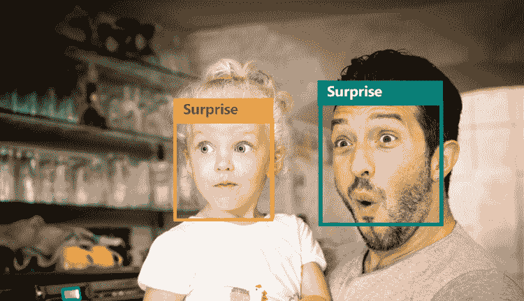
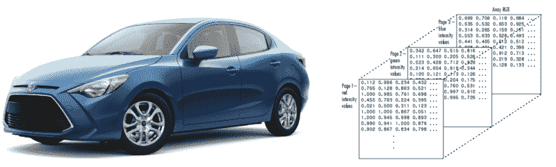
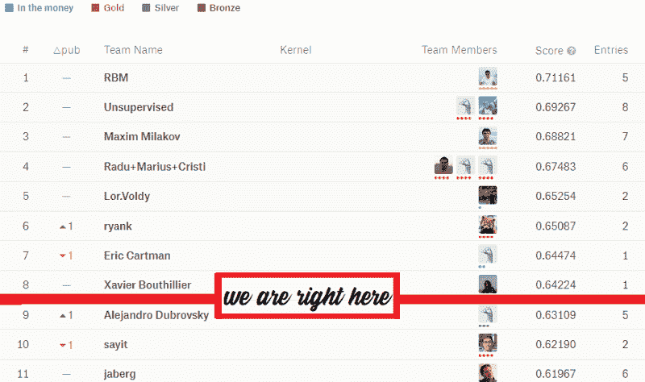

# 我是如何开发出一个能识别情绪的计算机网络，并打入 Kaggle 十强的

> 原文：<https://www.freecodecamp.org/news/facial-emotion-recognition-develop-a-c-n-n-and-break-into-kaggle-top-10-f618c024faa7/>

我是杰瑞·保罗

# 我是如何开发出一个能识别情绪的计算机网络，并打入 Kaggle 十强的

婴儿在几周大的时候就开始认出父母的面孔。随着它的成长，这种与生俱来的能力也在提高。当它几个月大的时候，它开始显示社交暗示，并且能够理解基本的情绪，比如微笑。

多亏了数百万年的进化，我们能够不用一个单词就能相互理解。只要看一眼，就能了解一个人是垂头丧气还是兴高采烈。嗯，我试着教计算机去做。这篇文章详细描述了整个实验的结果。跟着我们重建网络。



Image for representational purposes only.

开门见山保罗，请告诉我密码。不想花式读书？没问题。你可以在这里找到这个项目[的代码。](https://github.com/AssiduousArchitect/Facial-Emotion-Recognition/blob/master/Emotion_Recognition(CNN)_FER2013.ipynb)

### 简介

> “世界上最好最美丽的东西是看不见的，也摸不着的。它们必须用心去感受”――海伦·凯勒

海伦·凯勒在前面提到的引文中很好地描述了人类情感的本质。曾经为动物保留的东西不再局限于它们。机器学习正以令人麻木的速度流行起来。卷积神经网络的出现是一个突破，改变了计算机“看待”世界的方式。

面部表情无非是面部肌肉的排列向观察者传达某种情绪状态。情绪可以分为六大类——愤怒、厌恶、恐惧、快乐、悲伤、惊讶和中性。在这个 M.L .项目中，我们将训练一个模型来区分这些。


Few different types of facial expressions.

我们将使用 FER2013 数据集训练一个卷积神经网络，并将使用各种超参数来微调模型。我们将在 [Google Colab](https://colab.research.google.com) 上训练它，这是一个为传播人工智能教育而创建的研究项目。他们会给你分配一些像 G.P.U .或者 T.P.U .这样的资源，这些可以用来更快的训练你的模型。最好的部分是，它是完全免费的。

### 偷看数据

我们首先将 FER2013.csv 文件上传到我们的驱动器，以便我们可以从 Google Colab 访问它。在这个数据集中有 35，888 幅图像，它们被分为六种情绪。数据文件包含 3 列——类别、图像数据和用途。

**类:**是 0 到 6 之间的数字，代表对应图片中描绘的情绪。每种情绪都被映射到一个整数，如下所示。

```
0 - 'Angry'1 - 'Disgust'2 - 'Fear' 3 - 'Happy' 4 - 'Sad' 5 - 'Surprise'6 - 'Neutral'
```

**图像数据:**是一串 2，304 个数字，这些是我们图像的像素强度值，我们稍后会详细介绍。

**用途:**表示对应的数据应该用于训练网络还是测试网络。

#### 分解图像。

众所周知，图像是由像素组成的，而这些像素无非是数字。彩色图像有三个颜色通道，即红色、绿色和蓝色，每个通道由一个网格(二维阵列)表示。网格中的每个单元格存储一个 0 到 255 之间的数字，表示该单元格的亮度。



What you see (L) vs. what a computer sees.

当这三个通道对齐在一起时，我们就能看到图像。

### 导入必要的库

```
%matplotlib inlineimport matplotlib.pyplot as plt
```

```
import numpy as npfrom keras.utils import to_categoricalfrom sklearn.model_selection import train_test_split
```

```
from keras.models import Sequential #Initialise our neural network model as a sequential networkfrom keras.layers import Conv2D #Convolution operationfrom keras.layers.normalization import BatchNormalizationfrom keras.regularizers import l2from keras.layers import Activation#Applies activation functionfrom keras.layers import Dropout#Prevents overfitting by randomly converting few outputs to zerofrom keras.layers import MaxPooling2D # Maxpooling functionfrom keras.layers import Flatten # Converting 2D arrays into a 1D linear vectorfrom keras.layers import Dense # Regular fully connected neural networkfrom keras import optimizersfrom keras.callbacks import ReduceLROnPlateau, EarlyStopping, TensorBoard, ModelCheckpointfrom sklearn.metrics import accuracy_score
```

### 定义数据加载机制

现在，我们将定义 load_data()函数，它将有效地解析数据文件并提取必要的数据，然后将其转换为可用的图像格式。

我们数据集中的所有图像尺寸都是 48x48。因为这些图像是灰度的，所以只有一个通道。我们将提取图像数据，并将其重新排列成 48x48 的数组。然后转换成无符号整数，除以 255，对数据进行归一化。255 是单个单元格的最大可能值。通过将每个元素除以 255，我们确保所有的值都在 0 和 1 之间。

我们将检查 *Usage* 列，并将数据存储在单独的列表中，一个用于训练网络，另一个用于测试网络。

```
def load_data(dataset_path):
```

```
data = []  test_data = []  test_labels = []  labels =[]
```

```
 with open(dataset_path, 'r') as file:      for line_no, line in enumerate(file.readlines()):          if 0 < line_no <= 35887:            curr_class, line, set_type = line.split(',')            image_data = np.asarray([int(x) for x in line.split()]).reshape(48, 48)            image_data =image_data.astype(np.uint8)/255.0                        if (set_type.strip() == 'PrivateTest'):                            test_data.append(image_data)              test_labels.append(curr_class)            else:              data.append(image_data)              labels.append(curr_class)            test_data = np.expand_dims(test_data, -1)      test_labels = to_categorical(test_labels, num_classes = 7)      data = np.expand_dims(data, -1)         labels = to_categorical(labels, num_classes = 7)          return np.array(data), np.array(labels), np.array(test_data), np.array(test_labels)
```

一旦我们的数据被分离，我们将把测试和训练数据的维度扩大一个维度以适应渠道。然后，我们将使用 to _ categorical()函数对所有标签进行热编码，并将所有列表作为 *numpy* 数组返回。

我们将通过调用 load_data()函数来加载数据。

```
dataset_path = "/content/gdrive/My Drive/Colab Notebooks/Emotion Recognition/Data/fer2013.csv"
```

```
train_data, train_labels, test_data, test_labels = load_data(dataset_path)
```

```
print("Number of images in Training set:", len(train_data))print("Number of images in Test set:", len(test_data))
```

我们的数据已经加载，现在让我们进入最好的部分，定义网络。

### 定义模型。

我们将使用 Keras 创建一个顺序卷积网络。这意味着我们的神经网络将是多层的线性堆叠。该网络将包括以下组件:

1.  卷积层:这些层是我们网络的构建模块，这些层计算它们的权重和它们所链接的小区域之间的点积。这就是这些层从这些图像中学习某些特征的方式。
2.  激活函数:是应用于网络中所有层的输出的那些函数。在这个项目中，我们将求助于两个函数的使用— *Relu* 和 *Softmax* 。
3.  池层:这些层将沿维度向下采样操作。这有助于减少空间数据并最小化所需的处理能力。
4.  密集图层:这些图层位于 C.N.N 的末端。它们接收卷积图层生成的所有特征数据并做出决策。
5.  丢弃层:随机关闭网络中的一些神经元，以防止过度拟合。
6.  批量标准化:通过减去批量平均值并除以批量标准偏差来标准化先前激活层的输出。这加快了训练过程。

```
model.add(Conv2D(64, (3, 3), activation='relu', input_shape=(48, 48, 1), kernel_regularizer=l2(0.01)))model.add(Conv2D(64, (3, 3), padding='same',activation='relu'))model.add(BatchNormalization())model.add(MaxPooling2D(pool_size=(2,2), strides=(2, 2)))model.add(Dropout(0.5))    model.add(Conv2D(128, (3, 3), padding='same', activation='relu'))model.add(BatchNormalization())model.add(Conv2D(128, (3, 3), padding='same', activation='relu'))model.add(BatchNormalization())model.add(Conv2D(128, (3, 3), padding='same', activation='relu'))model.add(BatchNormalization())model.add(MaxPooling2D(pool_size=(2,2)))model.add(Dropout(0.5))    model.add(Conv2D(256, (3, 3), padding='same', activation='relu'))model.add(BatchNormalization())model.add(Conv2D(256, (3, 3), padding='same', activation='relu'))model.add(BatchNormalization())model.add(Conv2D(256, (3, 3), padding='same', activation='relu'))model.add(BatchNormalization())model.add(MaxPooling2D(pool_size=(2,2)))model.add(Dropout(0.5))    model.add(Conv2D(512, (3, 3), padding='same', activation='relu'))model.add(BatchNormalization())model.add(Conv2D(512, (3, 3), padding='same', activation='relu'))model.add(BatchNormalization())model.add(Conv2D(512, (3, 3), padding='same', activation='relu'))model.add(BatchNormalization())model.add(MaxPooling2D(pool_size=(2,2)))model.add(Dropout(0.5))    model.add(Flatten())model.add(Dense(512, activation='relu'))model.add(Dropout(0.5))model.add(Dense(256, activation='relu'))model.add(Dropout(0.5))model.add(Dense(128, activation='relu'))model.add(Dropout(0.5))model.add(Dense(64, activation='relu'))model.add(Dropout(0.5))model.add(Dense(7, activation='softmax'))
```

我们将使用 Adam optimizer 编译网络，并将使用可变学习率。由于我们正在处理一个涉及多个类别的分类问题，我们将使用*categorial _ cross entropy*作为我们的损失函数。

```
adam = optimizers.Adam(lr = learning_rate)
```

```
model.compile(optimizer = adam, loss = 'categorical_crossentropy', metrics = ['accuracy'])    print(model.summary()
```

#### 回调函数

回调函数是那些在训练过程中每个时期后被调用的函数。我们将使用以下回调函数:

1.  ReduceLROnPlateau:训练神经网络有时会停滞不前，在这个阶段我们看不到任何进展。因此，该函数监控平台迹象的有效性损失，然后如果检测到平台，则通过指定的因子改变学习率。

```
lr_reducer = ReduceLROnPlateau(monitor='val_loss', factor=0.9, patience=3)
```

2.EarlyStopping:有时，在训练神经网络时，进度会停止，我们看不到验证准确性的任何提高(在这种情况下)。大多数情况下，这意味着网络不会进一步收敛，继续训练过程没有意义。该函数等待指定数量的时期，如果没有发现参数变化，则终止训练。

```
early_stopper = EarlyStopping(monitor='val_acc', min_delta=0, patience=6, mode='auto')
```

3.模型检查点:训练神经网络通常需要很多时间，在此期间任何事情都可能发生，这可能导致所有变量和权重的丢失。创建检查点是一个好习惯，因为它会在每个纪元后保存您的模型。万一你的训练停止了，你可以加载检查点并继续这个过程。

```
checkpointer = ModelCheckpoint('/content/gdrive/My Drive/Colab Notebooks/Emotion Recognition/Model/weights.hd5', monitor='val_loss', verbose=1, save_best_only=True)
```

### 该训练了

我们所有的努力都将面临考验。但是在我们拟合模型之前，让我们定义一些超参数。

```
epochs = 100batch_size = 64learning_rate = 0.001
```

我们的数据将通过模型 100 次，每批 64 个图像。在每个时期之后，我们将使用 20%的训练数据来验证模型。

```
model.fit(          train_data,          train_labels,          epochs = epochs,          batch_size = batch_size,          validation_split = 0.2,          shuffle = True,          callbacks=[lr_reducer, checkpointer, early_stopper]          )
```

现在网络正在训练，我建议你去完成你开始的那本书或者去跑步。我在 Google Colab 上花了大约一个小时。

### 测试模型

还记得我们分开存放的私人套装吗？那是为了这一刻。这是关键时刻，这是我们收获劳动果实的地方。

```
predicted_test_labels = np.argmax(model.predict(test_data), axis=1)test_labels = np.argmax(test_labels, axis=1)print ("Accuracy score = ", accuracy_score(test_labels, predicted_test_labels))
```

嗯，成绩出来了，我们考了 63.167%。乍一看，这并不多，但我们闯入了第九名的[面部情绪识别卡格尔比赛](https://www.kaggle.com/c/challenges-in-representation-learning-facial-expression-recognition-challenge)。



It's not a big deal though

现在，拍拍你自己的背，开始头脑风暴，想办法改进这个模型。我们可以使用更好的超参数或创建完全不同的网络架构来实现更高的精度。

### 保存模型

使用 *keras.models.* 的 *model_from_json* 快速保存模型

```
from keras.models import model_from_json
```

```
model_json = model.to_json()with open("/content/gdrive/My Drive/Colab Notebooks/Emotion Recognition/FERmodel.json", "w") as json_file:    json_file.write(model_json)# serialize weights to HDF5model.save_weights("/content/gdrive/My Drive/Colab Notebooks/Emotion Recognition/FERmodel.h5")print("Saved model to disk")
```

### 把一切都包起来

我们从定义加载机制和加载图像开始。然后我们创建了一个训练集和一个测试集。然后我们定义了一个精细的模型，并定义了几个回调函数。我们讨论了卷积神经网络的基本组件，然后训练了我们的网络。

我通过创建一个能够实时检测人脸并识别其情绪的 python 应用程序来扩展这个项目。这将在以后的文章中讨论。

我们刚刚完成了几十年前还是科幻小说的一部分。然而，还有很多东西需要学习。互联网为我们不断创造和学习提供了大量的信息。愿学习永不停止。