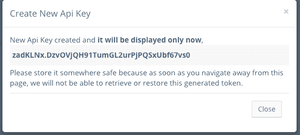
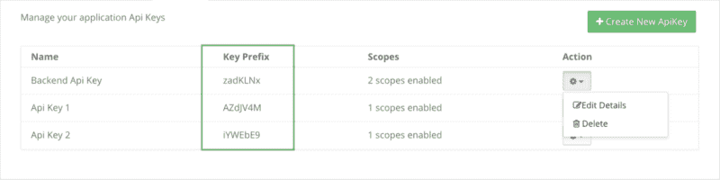
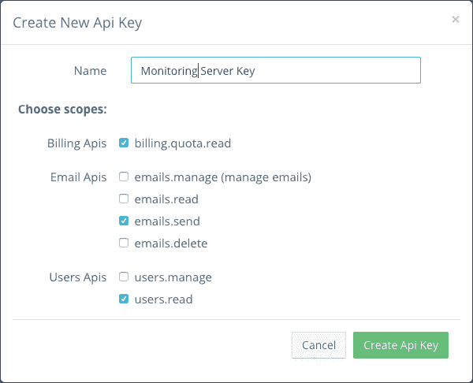

# 构建安全 API 密钥的最佳实践

> 原文：<https://www.freecodecamp.org/news/best-practices-for-building-api-keys-97c26eabfea9/>

作者:拉梅什·林加帕

# 构建安全 API 密钥的最佳实践

我们都知道 API 的价值。它们是探索其他服务、与它们集成以及更快地构建优秀解决方案的门户。

您可能已经构建或者正在考虑构建 API 供其他开发人员使用。API 需要某种形式的认证来提供对它返回的数据的授权访问。

目前有几种认证标准可用，如 API 密钥、 [OAuth](https://oauth.net/2/) 、 [JWT](https://jwt.io/) 等。

在本文中，我们将研究如何正确管理 API 键来访问 API。

#### 那么为什么是 API 键呢？

API 密匙使用起来很简单，它们很短，是静态的，除非被撤销，否则不会过期。它们为多个服务提供了一种简单的通信方式。

如果你提供一个 API 给你的客户使用，你必须以正确的方式构建它。

让我们开始吧，我将向您展示如何以正确的方式构建 API 键。

### API 密钥生成

因为 API 密匙本身是一个用来识别应用程序或用户的身份，所以它需要是唯一的、随机的和不可猜测的。生成的 API 密钥也必须使用字母数字和特殊字符。这种 API 键的一个例子是`zaCELgL.0imfnc8mVLWwsAawjYr4Rx-Af50DDqtlx`。

### 安全 API 密钥存储

由于 API 密匙提供了对数据的直接访问，它很像是 web 或移动应用程序的用户提供的访问相同数据的密码。

想想吧。我们需要存储 API 密钥的原因是为了确保请求中的 API 密钥是有效的，并且是由我们发布的(就像密码一样)。

我们不需要知道原始的 API 密钥，只需要验证密钥是否正确。因此，我们应该将密钥作为散列值存储在数据库中，而不是以纯文本(bad)或加密的形式存储。

散列值意味着即使有人未经授权访问我们的数据库，也不会泄露 API 密钥，一切都是安全的。最终用户将在每个 API 请求中发送原始 API 密钥，我们可以通过散列请求中的 API 密钥来验证它，并将散列密钥与存储在我们数据库中的散列进行比较。下面是它在 Java 中的一个粗略实现:

在上面的代码中，主键将是 API 键`{prefix}.{hash_of_whole_api_key}`的前缀和散列的组合。

但是等等，还有更多。存储哈希值会带来特定的可用性问题。让我们现在解决这些问题。

### 向用户呈现 API 密钥

因为我们不存储原始的 API 密钥，所以我们只能在创建时向用户显示一次。因此，一定要提醒用户，它不能再次被检索，如果他们忘记复制 API 密钥并安全地存储它，他们需要生成一个新的令牌。你可以这样做:

Displaying generated API Key with an alert message

#### 用户以后如何识别生成的 API 密钥

另一个问题是，如果用户需要编辑或撤销它，他们如何在您的控制台中识别正确的 API 键。这可以通过给 API 键添加前缀来解决。注意上图中的**前 7 个字符(那是我们的前缀)**用点号隔开。

现在，您可以将这个前缀存储在数据库中，并在控制台中显示它，这样用户就能够快速识别正确的 API 键条目，如下所示:

API Key management console

### 不要给 API 键所有的权力

API 密钥提供者犯的一个常见错误是提供一个密钥来访问所有东西，因为这很容易管理。不要那样做。假设用户只需要阅读一封电子邮件，并生成一个 API 密钥。但是这个键现在可以完全访问其他服务，包括删除数据库中的记录。

**右**方法是允许最终用户适当地限制 API 密钥访问，并选择 API 密钥可以执行的特定操作。这可以通过提供**范围**来实现，其中每个范围代表一个特定的权限。

举个例子，

*   如果你只需要一个 API key 来发送邮件，你可以生成一个 API key，作用域为**“email . send”**
*   如果终端用户有多个服务器，并且每个服务器执行一个特定的操作，那么可以生成一个具有特定范围的单独的 API 密钥。

因此，在创建 API 密匙时，允许用户选择 API 密匙应该拥有的访问权限，如下图所示。

这样，用户可以生成多个 API 密匙，每个密匙都有特定的访问规则，以获得更好的安全性。当收到一个 API 请求时，您可以检查 API 键是否具有访问该 API 的正确范围。现在数据库看起来像这样:

API Key database entity

### 速率限制 API 密钥

是的，您可能已经知道这一点，但是对使用特定 API 键发出的速率限制请求进行评级是很重要的，这样可以确保没有不良行为者能够破坏您的 API 服务器或导致影响其他客户的性能问题。拥有适当的速率限制和监控解决方案可以保持 API 服务的健康。

### 结论

如果构建正确，API 密匙仍然是与另一个服务器通信的好方法。正如我们在本文中所讨论的，遵循某些实践对 API 消费者和 API 提供者都有好处。希望这对你有帮助。

祝保护您的 API 愉快！