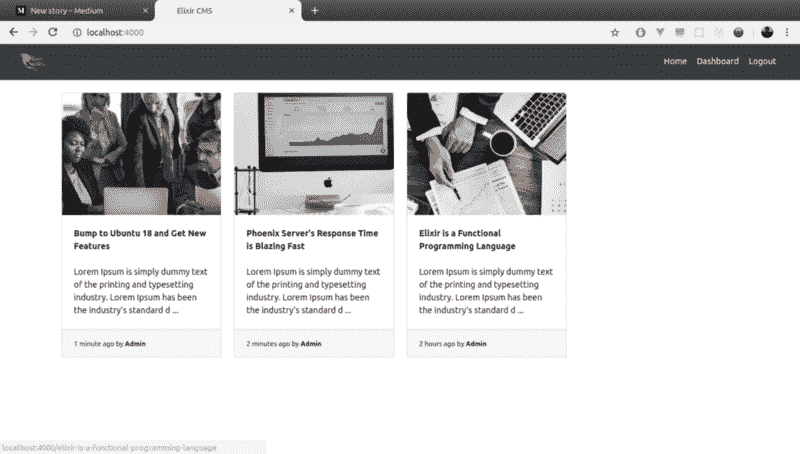
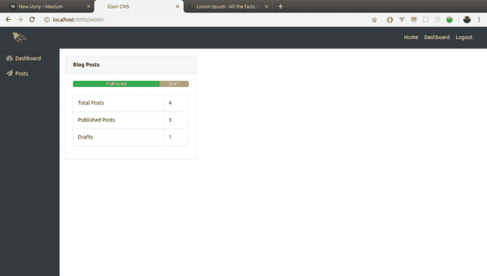
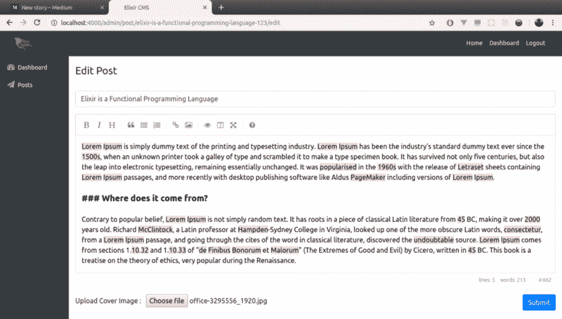
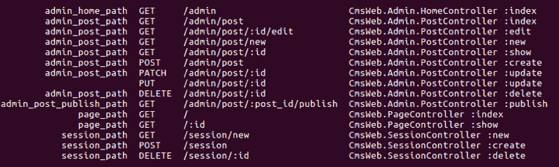
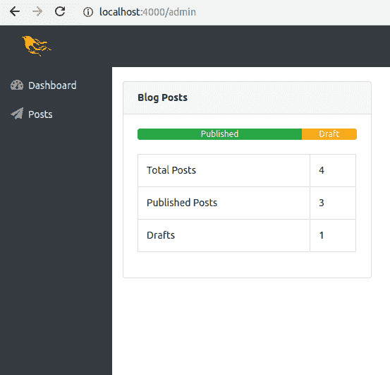

# 如何用 Elixir 和 Phoenix 构建一个简单的、可扩展的博客

> 原文：<https://www.freecodecamp.org/news/simple-extensible-blog-built-with-elixir-and-phoenix-61d4dfafabb1/>

作者拉曼·萨赫

在本文中，我们将讨论如何构建一个带有用户认证和管理面板的样板 Phoenix web 应用程序，以及在 Elixir 中上传图像。

[TodoMVC](http://todomvc.com/) 已经成为事实上的比较各种基于 JavaScript 的 MV*框架的工具。同样，我觉得博客应用程序在选择新的后端或 API 框架时会成为决胜局。

所以让我们开始在凤凰城建一个吧。我们将遵循默认设置，即 Phoenix 与运行在 PostgreSQL 上的 Ecto 相连接。

这里是最后的屏幕，让你对应用程序最终的样子有个概念。



登录页面将以卡片布局显示所有已发布的博客。可以点击一张卡片来查看特定的帖子。



我们将有一个简要显示统计数据的仪表板。访问此页面需要管理员用户登录。


将有一个单独的部分，概述了所有的职位。您可以在这里发布/修改/删除帖子。



这是一个帖子编辑器布局，具有一个 markdown 编辑器和一个用于精选图像的文件选择器。

> *注意:完整的工作代码存放在 [GitHub](https://github.com/ramansah/cms) 上。项目中有许多文件不能在一个博客中共享。因此，我解释了我认为至关重要的具体问题。*

现在让我们将项目的名称保留为 CMS。所以我们将从用`mix phx.new cms`创建一个新项目开始。运行`mix deps.get`来安装依赖项。

分别为用户和帖子生成迁移文件。

```
# User migration file
```

```
mix phx.gen.schema Auth.User users name:string email:string password_hash:string is_admin:boolean
```

```
# Posts migration file
```

```
mix phx.gen.schema Content.Post posts title:string body:text published:boolean cover:string user_id:integer slug:string
```

必须在数据库中创建两个表，分别代表用户和帖子。我把它保持得相当简单，只保留必需的字段，并在需要时扩展。

随后，我们可以在用户和 post 模式中定义变更集和附加方法。

**user.ex**

**post.ex**

```
@derive {Phoenix.Param, key: :slug}
```

由于我们希望帖子有一个可读且 SEO 友好的 URL 结构，我们通知路由助手在 URL 名称空间中引用`slug`而不是`id`。

路线描述如下:

特定于管理部分的资源被组合在一起，并被分配一个强制进行身份验证的管道。

同时，全局路由被视为被动认证。如果会话存在，但页面仍可访问，则获取用户详细信息。登录和主页属于这里。

执行`mix phx.routes`给了我这个输出:



该视图分为三个逻辑部分:

1.  导航栏
2.  补充报道
3.  主要内容

虽然导航栏始终可见，但只有管理员用户登录后，侧栏才会出现。浏览内容将在管理上下文中。侧边栏中的链接会随着应用的发展而增长。



管理员。Post controller 遵循典型的 CRUD 架构，包括一个切换给定 Post 的发布状态的操作。


很多控件位于管理员的文章部分的索引页面中。在这里，可以删除、发布和修改帖子。

**templates/admin/post/index . html . eex**

为了保持模板整洁，我们可以定义方便的视图助手，如格式化时间等。分开。

**views/admin/post_view.ex**

Arc 和 arc_ecto 一起提供了现成的文件上传功能。由于一篇文章有一个封面图片，我们必须在我们的应用程序中定义一个弧形配置。

我们博客中的每篇文章都需要两个版本的封面图片——在特定的文章视图中可以看到的原始版本和占用空间较小的缩略图版本。现在，让我们为 thumb 版本选择 250x250 分辨率。

回到应用程序的登录页面，它将存放所有已发布帖子的卡片。并且通过形成的嵌条可以接近每个柱。

```
controllers/page_controller.ex
```

这个项目探索 Phoenix——Phoenix 应用程序是如何构建的，以及如何拆除基于 Phoenix 的项目。我希望你学到了一些东西，并喜欢它！

完整的工作应用程序在 Github:[https://github.com/ramansah/](https://github.com/ramansah/votex)CMS。随意克隆？如果你觉得这个博客有用，请鼓掌？