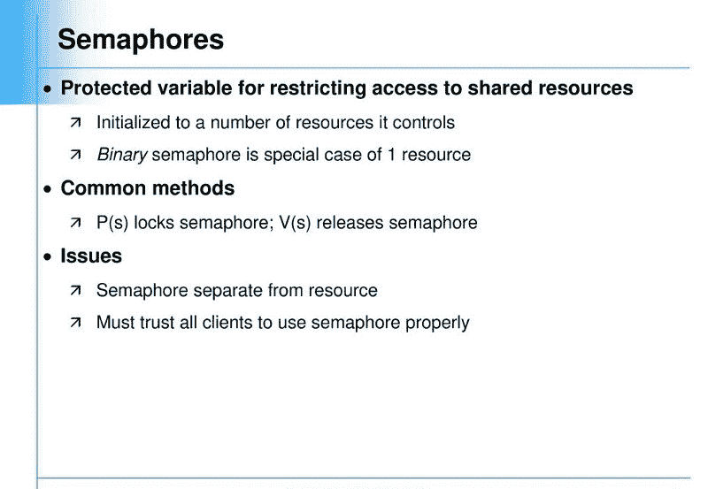

# 是的，我编写了一个信号量，不，我不是操作系统开发人员。

> 原文：<https://www.freecodecamp.org/news/yes-i-coded-a-semaphore-and-no-i-am-not-an-os-developer-c721650e1887/>

作者:萨加尔·萨瓦尔·夏尔马

# 是的，我编写了一个信号量，不，我不是操作系统开发人员。

#### 当您可能在日常编码工作中使用信号量时

Semaphores!

> 你正坐在第八标准数学教室里阅读毕达哥拉斯三元组，你正在研究毕达哥拉斯定理。著名的方程式 *(a * a)+ (b * b) = (c * c)* 铭刻在你的脑海里*。*

> 快进 10 年——你仍然在回忆那一天，并想知道为什么以上帝的名义你被教那个等式，你在生活中从未真正遇到过任何使用这个等式的实际情况，这让你质疑我们现有的教育系统。

这是一个让我们怀疑我们生命中那些受教育的岁月是否真的值得努力的场景。我们很多人都会同意，我们大部分的教育实际上并没有在我们的实际生活中帮助我们。

我是一名在 SaaS 产品公司工作的软件开发人员，我发现了一些启示，让我思考我的理论知识和实际生活之间的巨大差异。但偶尔，事情会在最不寻常的场景和地方突然出现。它们让我想知道我们是否忽略了，也没有真正意识到在驱动我们日常生活的引擎盖下到底发生了什么。

### 问题陈述

故事开始于一个晴朗的日子，我平静地坐在办公室舒适温暖的角落里，做着我平常的 API 开发。弹出一个用户标签，说他们收到了来自我们服务的多次通信，他们对此很恼火。我仔细检查了代码，但这不可能发生。运行并向最终用户发送通信的 cron 应该只发送一次(并且这个 cron 每小时运行)。

与此同时，我收到了一个寻呼任务，说我的 cron 服务器上的 CPU 使用率激增。当有大量的作业要由多个 crons 处理时，通常会偶尔发生这种情况。我漫不经心地检查了系统，令我惊讶的是，我发现了导致所有混乱和那些用户票的问题。

让我感到恐惧的是，我看到同一个通信 cron 的多个实例同时运行，选择相同的作业并发送通信。这解释了一切。(这不应该发生 cron 的第一个实例应该在第二个实例开始运行之前完成它的执行。cron jobs 应该就是这样工作的)。

在那一天，cron 应该处理的作业数量激增，这导致 cron 持续运行超过了其通常的执行时间。这导致了重叠(换句话说，它甚至在一个小时后还在运行，然后第二个实例就弹出来了)。

我的工作很艰巨:我必须让执行更快，并且**绝不允许同一个 cron 的多个实例同时运行**。

### 解决方案

我首先想到的是实现**信号量**(终于那些操作系统类在我的记忆中向前冲了过来)。我的教授说得对，有一天我会用这项技术来拯救我自己的生命。

> “今天就是那一天”，我想。

所以我谷歌了一下，找到了很多有用的资源来完成我的任务。我将在这里写下我的收获，以及我是如何最终意识到我实际上已经实现了信号量的概念。

### 第一步

在您的系统文件目录中，创建一个名为 **myCronPID.txt** 的文件，该文件将存储在该特定实例中运行的 cron 的进程 ID (PID)。根据维基百科:

> 在计算中，**进程标识符**(通常被称为**进程 ID** 或 **PID** )是大多数操作系统内核(如 UNIX、macOS 和 Microsoft Windows 的内核)用来唯一标识活动**进程**的数字。

### 第二步

找出正在运行的 cron 的进程 ID (PID)。这可以使用下面的代码来完成(我将使用 PHP 作为参考)。

### 第三步

第一次，文件 **myCronPID.txt** 将为空。将步骤 2 中获得的当前 PID 存储在该文件中。下一次，在获取当前运行的 cron 的 PID(比如 5678)时，从文件 **myCronPID.txt** 中获取 PID。从文件中获得的 PID(比如 1234)将是之前运行的 cron 实例的进程 ID。检查 PID 1234 是否仍处于执行/运行状态。这很容易找到。

在 Linux 系统中，有一个文件夹 ***/proc*** ，里面有系统中当前正在运行的进程的文件夹。这个**/进程**文件夹中的文件夹名就是进程 id。因此，如果 **/proc** 文件夹包含一个文件夹 **1234，**，那么它意味着一个 PID 为 1234 的进程处于运行状态。如果它没有这样的文件夹，这意味着在那个特定的时刻没有 PID 1234 的进程在运行。

### 第四步

在这一步中，从 myCronPID.txt 文件中获取 PID，并使用步骤 3 中给出的代码检查进程是否仍在运行。

1.  如果 *isProcessRunning* 返回 true，那么这意味着之前运行的 cron 实例还没有完成它的执行。因此，调用函数*的新实例 isProcessRunning* 不应该继续执行。
2.  如果 *isProcessRunning* 返回 false，那么它意味着前一个 cron 实例已经完成了它的执行。调用函数*的新实例 isProcessRunning* 应该继续执行，并将自己的进程 ID 放入 myCronPID.txt 中

### **第五步**

将所有这些整合在一起:

在您运行 cron 实例时，只需用其适当的构造函数调用上面的类对象。

**$fileName** —它将是存储 cron 文件的 PID 的文件的名称。

**$rootDir —** 它将是您当前项目的根目录。

调用之后，在 Cron 代码中使用 Util 的方法，如下所示:

这将确保不会有同一个作业的多个 cron 实例同时运行。

### 包扎

在研究了所有这些并编写了上面的代码之后，我发现我一直以来只实现了信号量。我的操作系统教授今天会感到骄傲的。

这让我再次思考:我们只是在强记概念。我们不是在探究我们所学知识的错综复杂，而是在研究如此抽象的层面，以至于我们没有花时间去欣赏实际发生在引擎盖下的工作之美。

我们的教育系统并不总是瘫痪的。我们学习事物的方式非常重要。试着改变自己，而不是抱怨。这个世界充满了奇迹，非常美丽。

PS:希望大家喜欢我的文章，如果我哪里说错了请指正。