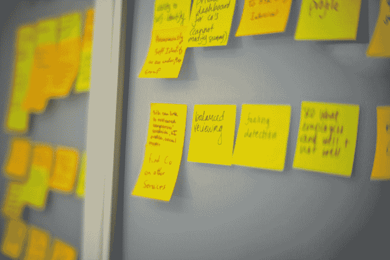

# 如何跑一个成功的设计冲刺

> 原文：<https://www.freecodecamp.org/news/how-to-run-a-successful-design-sprint-1702e0f79797/>

乔治·克拉萨达基斯

**设计冲刺**可以为你的公司带来显著的成果——比如积压的有影响力的想法、功能原型、来自客户的学习和关键见解以及真正的商业机会。

**考虑这种情况**:你的公司需要解决一个重大的现实问题——你需要一个新颖的解决方案，比市场上任何其他产品都要好。你可以瞄准一个*产品*，*一个组件*，*一个系统*，*一个服务*或者一个*流程*。

在一个理想的场景中，在进行任何投资之前，你需要一组候选解决方案，原型化并暴露给一组受控的真实用户。这将使足够多的*信号*和*洞察力*做出明智的决策并建立更好的产品开发战略。

要到达那里——从一个*问题*到*功能原型*丰富了*客户反馈*——你可以遵循标准路径。例如，您可以咨询组织中的专家，将工作流分配给不同的团队，协调工作，安排集思广益会议，排队等待 UI 设计，然后开发原型——这是一个漫长的过程，有几个缺点、依赖性、问题和风险。

**或者，你可以建立一个*强大的多学科团队*，把它“锁”在一个房间里几天**，有一个明确的目标:*一个廉价的、现实的精选高潜力概念原型的候选名单*，每个原型都有来自真实用户的反馈。

> *一个*快速创新过程，为你的问题输出潜在的解决方案*和*来自真实用户的证据*，证明*它们有多有效*。*

这种强烈的*构思和原型制作过程*有几种形式和变化——一种流行的是“设计冲刺”,它承诺“在短短五天内解决大问题”。它使用“设计思维”原则，并介绍了几种技术、工具和规则。

### **成功因素**

为了从设计冲刺中获得真正的价值，你必须强调*正确的设置*、*准备*和*准备*——否则你可能会主持一个昂贵的多日头脑风暴会议，只输出*噪音*。

在参加了大量的“构思和原型制作”会议以及 10 次正式的“设计冲刺”后，我会用以下方式总结关键方面和成功因素。

#### 1.定义问题陈述

**不要让问题陈述成为你真正的问题**！到目前为止，我所经历的大多数*不成功的*设计冲刺和原型制作会议都有一个共同的失败点:一个定义不明确的问题陈述，它会引发耗时的讨论、迭代和不必要的回归——将整个过程置于风险之中。

相比之下，设计冲刺从要解决的问题的清晰性开始，迅速向令人印象深刻的解决方案和原型前进。

> 从清晰地解决问题开始的设计冲刺，迅速向令人印象深刻的解决方案和原型发展。

尽管设计冲刺的第一天通常是对问题陈述进行框架设计和重新框架设计，但我确信，在前期有一个好的*问题定义**是成功的关键。在第一天，你可以随时修改它，并根据需要重新设置，但坚实的基础会有所不同。在任何情况下，团队都需要*开放*来理解问题，并且*准备好*来考虑不同的角度和非常规的方法。*

*有几个模板和方法可以帮助你构建*一个有效的*问题陈述*——一般来说你需要描述*当前情况*对*理想状态*以及*相关含义*对于*涉及的用户*。**

#### **2.组建合适的团队**

**团队的综合为整个设计冲刺奠定了基础——你需要*思想的多样性、* *技能*和*视角*以及*专长*和*创意* —所有这些都结合在一个小的多学科团队中，具有*正确的文化*:一个愿意*分享*、*协作*、*挑战*假设、*大胆思考*的团队**

**一些因素会给流程带来严重的风险:**

*   **团队中的**错误动态**(例如，成员因为害怕受到团队中更高级成员的批评而不表达自己的想法)**
*   **一个**大团队**(增加超过 6-7 个人，你会有更多的问题要解决)**
*   **或者是**错误的心态**(人们倾向于保护想法而不是分享，或者相信他们预先知道正确的解决方案)。**

**团队成员必须‘忘记’资历、*等级*和*权威。他们需要对新思想、新观点和不同观点持开放态度。他们还需要准备好*影响*和*被影响，*和将偏见的影响降至最低，并为共同的使命而合作— *一个解决挑战性问题的伟大方案*。***

*物理空间对于团队集中注意力、表达随机想法和观点、合作以及快速可视化概念也非常重要。你需要一个有足够空间的房间，合适的设备和办公用品——比如可写的墙壁、白板，还有足够多的便利贴。*

#### *3.确保团队准备充分*

***设计冲刺要求很高——快速而紧张**。成功的关键是有一个准备充分的团队。即使你的梦之队由领域专家和高级商业领袖组成，他们都必须付出额外的努力做好准备——这样他们才能完全理解问题及其更广泛的背景、技术、竞争和相关的全球趋势。确保你不仅向团队清楚地传达了背景和要解决的问题，还传达了*规则*和*需要准备的*。*

#### *4.注重思维能力*

*假设有一个可靠的问题陈述和正确的准备，下一个最重要的元素是*构思*。虽然设计冲刺过程提供了一些增强构思能力的工具，但我强烈建议您:*

*   ***增加分配给创意产生、和**的*时间**
*   ****用数字格式*** 捕捉想法——有更详细的描述。*

*[**积压的想法**](https://medium.com/innovation-machine/a-stream-of-ideas-the-foundation-of-an-innovation-machine-2ebcfe4e0653) **是一笔巨大的财富**—sprint 最重要的输出之一，也是原型阶段的关键输入。想法不应该留在便利贴上——即使是未被选中的想法也可能在未来被证明是相关的和有价值的。*

*这就是为什么你需要将冲刺阶段产生的想法输入到一个集中的构思系统中，并让正确的观众发现它们。*

#### *5.为“快速原型”做好准备*

*交付真实的原型是这一过程的关键部分，因为它们将用于获取用户/客户的反馈。您不希望您的伟大概念由于糟糕的原型实现而收到负面反馈——这可能会误导相关决策并破坏设计冲刺的整体价值。你的团队必须能够*真正的* [快速原型](https://medium.freecodecamp.org/is-it-a-prototype-or-an-mvp-well-its-a-proof-of-concept-f8df5bb8940a)——能够在几天或更短的时间内构建真实的用户体验。*

*快速原型制作需要团队中合适的资源以及总体技术准备情况。例如，为了加速这个过程，你需要利用你拥有的任何*可重用软件组件*、*标准化数据集*、*人工* / *静态数据*、 *UI 元素、API、模型*和服务。您还需要系统、工具和流程，例如*线框、软件开发环境*和 DevOps 能力。*

*特殊设备的可用性可能很重要。例如，如果涉及到*物理原型*，3D 打印机可能会有实际价值。或者，如果你期待增强现实原型，你将需要访问相关设备——以及任何模板、API 和文档。*

#### *6.找到一个优秀的辅导员*

*这是一个关键的角色——事实上，我将主持人视为设计冲刺的真正**主角。主持人必须保持正确的*步调*、*方向*、*能量水平*和*交互模式*，带领团队走向一个明确的、共享的目标:定义并原型化一个伟大的、*新颖的概念*，为*真实用户*解决问题。***

*这是一个很难找到的轮廓——你需要有人掌握流程本身，但也对问题和特定的业务环境有深刻的理解。主持人必须能够“解读”房间中的人物，并采取必要的行动，以确保所有的声音都被听到并得到考虑。*

#### *7.捕捉一切*

*设计冲刺阶段通常非常“嘈杂”,墙上贴满了大量便利贴、想法和故事——所有这些，都是在讨论、争论、决策和随机想法之间进行的。是的，这种“受控的混乱”令人兴奋，但除非你有一个专门的人负责做(数字)笔记，否则你最终会感到沮丧，试图解码彩色便利贴和“逆向工程”随机图纸。*

*为了充分利用这些想法和创意，你需要用一种现代的方式来捕捉它们——这样它们就可以被发现并有潜在的用途。*

#### *8.找到一个领导者，而不仅仅是一个“决策者”*

*我发现提议的决策过程——超级投票概念和草图上的粘性投票——过于简单，对团队动态和团队的整体状态非常敏感。此外，鉴于额外的权力，决策者必须表现出对概念的深刻理解，以及从战略上*思考**和*清晰沟通的能力。你需要一个真正的领导者，而不是“权威”或“政治”人士。***

> **主持人和团队应该通过询问正当理由——业务或技术推理——来随意质疑决策者做出的任何决定。**

#### **9.衡量成功**

****设计冲刺是一个昂贵的过程** —考虑一下让 x 名成员全职工作 z 天的相关直接和间接成本。因此，衡量设计冲刺本身的成功是很重要的。在“孤立”sprint 的情况下，成功可以通过处理直接反馈、产出和中期结果来衡量，例如与 Sprint 的交付成果相关的商业机会和成功案例。**

**如果您正在运行**连续的设计 Sprint**，您需要一个框架来捕获和量化 Sprint 的输出和影响——向集中的想法和知识库的流动。这个数据存储应该能够全面跟踪与您的每个设计冲刺相关的真实商业机会和财务收益——而专门的 KPI 允许跟踪整个*创新计划*的成功。**

**这种情况下的关键问题是将*作为比较“量化创新产出”和*的基线，这将在下一篇文章中讨论。**

****D*design Sprints****可以为你的公司产生显著的产出——比如积压的有影响力的想法(也有知识产权机会)、功能原型、来自客户的学习和关键见解以及真正的商业机会。与此同时，假设正确和频繁的执行，设计冲刺可以导致朝向“创新模式”的重大[文化改进](https://medium.com/innovation-machine/innovation-culture-ecf2c1be3102)。***

***[**如何快速构建软件原型**](https://medium.com/innovation-machine/innovation-at-pace-rapid-prototyping-practices-for-software-engineering-teams-442929fdd5ea)
[*如何快速构建软件原型并向真实用户测试您的想法的最佳实践和指导*medium.com](https://medium.com/innovation-machine/innovation-at-pace-rapid-prototyping-practices-for-software-engineering-teams-442929fdd5ea)***

****参考文献****

*   ****问题陈述**——【https://en.wikipedia.org/wiki/Problem_statement **
*   ****设计冲刺书**——【http://www.gv.com/sprint/ **
*   ****设计思维**——【https://en.wikipedia.org/wiki/Design_thinking **
*   **威尔·H·麦克马汉在 Unsplash 上的照片**
*   ****相关:** [如何在工程团队中领导创新和推动变革](https://medium.freecodecamp.org/leading-innovation-in-engineering-teams-ca9890bcad7c)**

****相关文章****

*   **[**创业公司和敏捷产品开发的重要性**](https://hackernoon.com/why-a-good-mvp-is-critical-for-a-startup-5192f5d79215)**
*   **软件工程团队的快速原型实践**
*   **[如何在工程团队中领导创新和推动变革](https://medium.freecodecamp.org/leading-innovation-in-engineering-teams-ca9890bcad7c)**
*   **[**如何(以及为什么)写出伟大的用户故事**](https://medium.freecodecamp.org/how-and-why-to-write-great-user-stories-f5a110668246)**
*   **[如何成为一名优秀的产品经理](https://medium.com/innovation-machine/the-successful-product-manager-5f3cb3aacb51)**
*   **[这是原型机还是 MVP？实际上，这是一个概念验证。](https://medium.com/innovation-machine/is-it-a-prototype-or-an-mvp-well-its-a-proof-of-concept-f8df5bb8940a)**
*   **[如何建立并领导一个优秀的产品开发团队](https://medium.freecodecamp.org/how-to-setup-and-lead-a-great-product-development-team-ebded92ba192)**
*   **[技术创新—2018 年的趋势和机遇](https://medium.freecodecamp.org/2018-innovation-trends-and-opportunities-8a5d642fd661)**