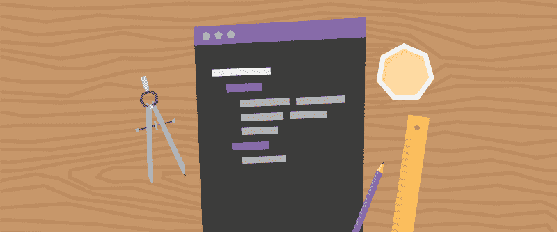
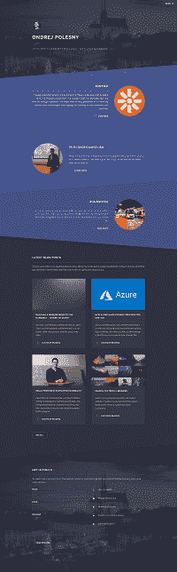
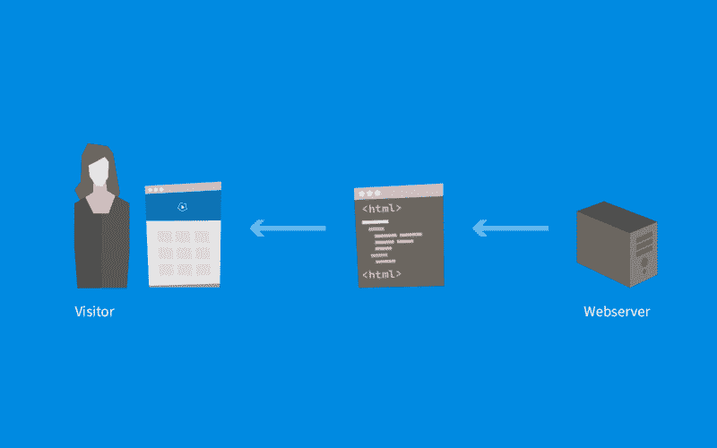
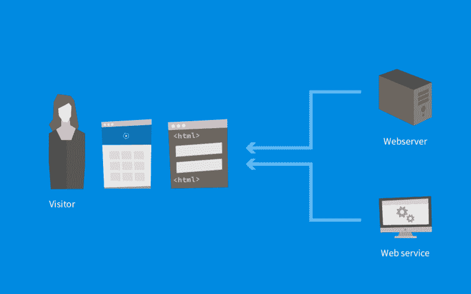
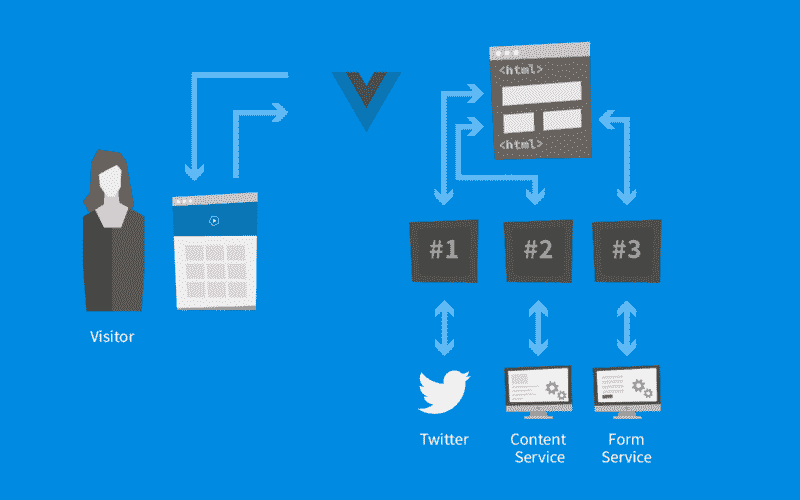

# 如何为你的网站决定最好的技术

> 原文：<https://www.freecodecamp.org/news/how-to-decide-on-the-best-technology-for-your-website-815dbb92294b/>

by Ondřej Polesný

# 如何为你的网站决定最好的技术

你知道你的网站将会是什么样子，并且对内容结构有很好的想法。但是没有人愿意维护一组静态页面，对吧？让我们来看看如何使你的网站动态且易于调整，这样每次修改时，你都不需要修改代码和网站的实现。

但是我们从哪里开始呢？

我们需要安装什么工具吗？使用 JavaScript 还是坚持使用 MVC 或一体化 CMS 进行服务器端渲染是个好主意？我将解释如何将生活带入你的网站，并为未来做好准备。

所以你想建立一个现代化的网站。一个快速、安全、美观并提供最佳用户体验的网站。现代这个词在这里很关键，因为它也与我们忙碌的时间有关。大家都很忙，老板要我们处理 120%的分配工作，每天几乎没有半个小时享受午餐。因此，从头开始创建整个网站功能并不适合我们的场景。我们的目标是让它尽可能快地运行起来，并与全世界分享，最好是今天。

#### 一体化服务器端解决方案

使用内容管理系统(CMS)等一体化解决方案将确保您的网站快速启动和运行。至少是它的第一个版本。如果您已经准备好了开发环境，安装它并第一次访问管理界面可能只需要几分钟的时间(否则安装需要几个小时)。

登录后，您可以配置网站，定义 URL 策略，然后开始根据您选择的设计创建模板和布局。将模板和内容放入 CMS 可能非常耗时。也就是说，你需要:

*   了解每个特定 CMS 模板的概念(通过文档或电子学习)
*   将这个概念应用到你的设计中
*   了解在每个 CMS 中存储内容的最佳实践
*   微调网站以符合你的期望

如果你熟悉 CMS，所有这些都可以很快完成。但是你的前几个网站可能不会成为年度网站的候选人。？

当我过去使用 CMS 系统时，迟早我总是会创建自定义控件(即自定义代码)，因为标准控件的 HTML 输出是不够的，或者直接违背了新的行业标准，如[加速移动页面](http://bit.ly/2QEMfX1)。我认为这是 CMS 系统最大的警告，他们以各种方式限制你，因为他们把自己定位为你网站的主引擎。我总是发现自己 80%的时间都在解决小任务。

我几乎每次都会遇到的另一个问题是在部署期间。第一次部署很容易，你只需要把所有东西放在一个远程 FTP 上，然后在你的主机提供商的服务器上恢复数据库。让事情变得复杂的是后续的部署。尽管这些系统通常以将您的开发(或仅仅是本地)变更带到现场的方式为特色，但它往往是较高定价层的一部分，并且需要一些时间来学习和配置它。

#### 无头方法

我在另一篇文章的[中解释了微服务架构的优势。现在大家都把这种方式叫做无头，因为微服务架构的关键部分就是无头 CMS(比如](http://bit.ly/2Duglu1) [Kentico Cloud](http://bit.ly/2QzUALM) )。它充当一个存储所有内容并确保交付的地方。主要的好处是，它只是另一种服务。你是你网站的新负责人。你说服务将如何相互协作，以及你将利用其中的哪一个。Headless CMS 只是整个堆栈中的另一个服务。但是你是怎么做到的呢？

让我在我的个人网站上展示给你看。当访客到来时，他们希望看到这样的东西:

我的网站的主页只是一个简单的 HTML 代码与内容。现在，有两种方法可以创建这个 HTML 代码。要么我们坚持在服务器上构建这一切的标准方法:

或者我们让 web 服务器放松一些，在客户端编写 HTML 代码:

你看，访问者的浏览器只接受数据，而不是包含内容的整个 HTML 结构。但是浏览器怎么知道显示什么呢？在我们的设计中如何处理数据并输出？

### 现代 JavaScript

我们会通过 JavaScript 告诉浏览器做什么。在过去，JavaScript 是不受欢迎的。无论何时创建 JavaScript 功能，都必须使用替代的 noscript 版本，这一直是一条经验法则。但是时代变了，浏览器也发展了。你仍然需要遵守一些规则，以使你的网站具有可访问性，但稍后会有更多的内容。

使用 JavaScript 构建网站从未如此简单。有许多框架可以帮助你实现你的目标，即使你对普通的 JavaScript 知之甚少。最好的事情是，对于其中一些，你不需要安装任何东西。只要你的浏览器和喜欢的文本编辑器就够了。但是让我们从基础开始，为我们的新网站选择最好的框架。

总的来说，有 3 个主要的 JS 框架有很大的吸引力，它们周围有一个很好的社区。这确保了持续的开发和支持。许多成功的网站都是建立在它们之上的，其中一些你可能每天都会用到。

#### 1.安古斯

Angular 在这三者中有着最伟大的历史。2009 年成立快 10 年了！它由谷歌开发和维护。与其他框架相比，它具有基于 TypeScript 的更复杂的语法，并且需要您设置一个构建过程。然而，它支持模块化和 MVVM 模型，这使得基于 Angular 构建的应用程序非常健壮。

我记得在 2013 年第一次在一个半政府项目中使用它，它使我们能够创建用于管理各种实体的快速前端。用分页、过滤和排序功能创建丰富的列表是如此容易。

#### 2.反应堆

React 最初由脸书在 2013 年创立并开源。它是基于组件的，易于学习。它的组件使用 JSX 语法实现，介于 JavaScript 和 HTML 之间。确定初始架构也很容易，因为每个组件就像一个模块，构成了输出的 HTML。如果你喜欢乐高，你就会喜欢 React！

可以将它作为 JS 库包含在网站中，或者设置一个构建过程并使用 TypeScript。React 也有最大的社区，并且有一个叫 React Native 的兄弟，可以让你构建本地移动应用。

#### 3.VueJS

Vue 于 2014 年发布，并在快速增长——目前，它在社区中获得了最大的增长。它与 React 非常相似，但对初学者来说稍微容易一些。它以其详细的文档和非常容易的集成而大放异彩。组件基于简单的 HTML，这使得 JavaScript 初学者非常容易。也是这三个里面最轻的。

我个人在 Prestashop 中更高级的购物车场景中使用了它，并且惊讶地发现，在没有任何 Vue 知识的情况下，我可以如此快速地让所有的东西一起工作。

如果你想更深入地了解这个对比，可以参考 TechMagic 的文章或者 Jens Nauhaus 的文章。

#### 选择正确的框架

当谈到选择正确的框架时，开发人员通常会选择他们以前有过经验的框架(如果是好经验的话)。但是如果你是前端开发新手，你需要看看你为你的网站设定的目标。正确的选择在很大程度上取决于你正在构建的项目。让我总结一下我的期望:

*   快速学习曲线-我需要尽快建立网站
*   轻量级实现-该网站将非常小，所以我想尽量减少加载时间
*   容易集成-我不想建立建设过程，但立即开始在网站上工作
*   良好的文档——每当我对某样东西感到陌生时，我发现自己总是在浏览文档，寻找特定的用例
*   容易路由-我的网站有多个页面，所以我需要一个路由器来处理各种 URL
*   简单的内容交付——我将使用内容即服务系统，所以我需要一种简单的方法来获取 JavaScript 内容

所以你可以看到在我的情况下 Vue.js 最适合。对于初学者来说，它很容易使用和集成，并且有很棒的文档和简单的教程。写下你的期望，看看 Vue.js 是否也符合它们。

关于内容交付的最后一点非常重要。所有这些 JavaScript 框架都使您能够通过 REST API 获取内容，但是实现原始 API 调用将非常耗时，而且一点也不好玩。一些无头 CMS 系统，如 [Kentico Cloud](http://bit.ly/2QzUALM) 提供了一个用于 JavaScript 的 [SDK，它是 REST 通信的包装器，具有许多附加功能。这将使内容收集更加容易。](http://bit.ly/2xbiwNf)

新网站的最终架构如下所示:

对网站的第一个请求通过返回包含 JavaScript 文件的主 HTML 模板来解决。当浏览器开始处理 JavaScript 逻辑时，Vue.js 将被初始化，它将赋予我们的组件生命。然后，这些组件中的每一个都独立工作——显示 HTML，从 headless CMS 获取数据，或者将表单提交的数据发送到表单 web 服务。

这种架构使我们能够非常快速地建立我们的网站，同时真正地享受它。这就像用乐高积木组装汽车一样。该网站将是轻量级的，快速和全面的，更具成本效益。但是让我们把经济学留给另一篇文章。你的体验是什么？你已经试过微服务了吗？

#### 该系列的其他文章:

1.  [第一次如何开始创建一个令人印象深刻的网站](http://bit.ly/2Duglu1)
2.  如何为你的网站决定最好的技术(这篇文章)？
3.  [如何用 Vue.js 和最少的努力启动你的网站](http://bit.ly/2zLRE8a)
4.  [如何将无头 CMS 与一个 Vue.js 网站混合，并且零付费](http://bit.ly/2CyDnhX)
5.  [如何在 API 网站上安全提交表单](http://bit.ly/2P0gidP)
6.  用 CMS 建立一个超级快速安全的网站没什么大不了的。或者是？
7.  [如何用 Vue.js 快速生成静态网站](http://bit.ly/2PN46Jy)
8.  [如何快速建立静态站点的构建流程](http://bit.ly/2Dv2UGS)