# 关于我和 Outreachy 的夏季旅行的最后反思

> 原文：<https://www.freecodecamp.org/news/final-reflections-on-my-summer-journey-with-outreachy-3d38375f8b0/>

托尼·肖特斯维

# 关于我和 Outreachy 的夏季旅行的最后反思

今年夏天在[图书馆健康](https://librehealth.io/)做[外展](https://www.outreachy.org/)实习生是一次很棒的经历！不用说，当我要交期末报告的时候，我的心情是复杂的。我为自己所做的贡献感到自豪，感谢与伟大的导师和出色的实习伙伴一起工作，并为它的结束感到难过。

对于那些需要赶上进度的人，你可以阅读我经历的[开始](https://medium.freecodecamp.org/how-i-beat-the-odds-and-became-an-outreachy-intern-9a92f47cb44e)部分。我剩下的旅程链接将在本文末尾。对于那些整个夏天都和我在一起的人来说，我将直接切入正题。

### 项目

作为一名文档实习生，我提供了一些关于图书馆电子健康记录系统的英文文档。阿黛尔是我的实习伙伴。她把所有的文件都翻译成了法语。你可以在这里跟随她的旅程[。](http://king21.neowordpress.fr/my-internship-is-coming-to-an-end/)

从 5 月 23 日到 8 月 31 日，我向 LibreHealth wiki 贡献了四篇文档。

#### 用户指南

我的第一份文件是 EHR 图书馆健康用户指南。这是 EHR 图书馆保健系统的基本外观和特征的概述。我们浏览了不同的屏幕，重点关注系统的不同功能。目标是帮助用户平稳高效地运行电子健康记录系统。我们研究了登录、用户首选项和菜单导航部分。

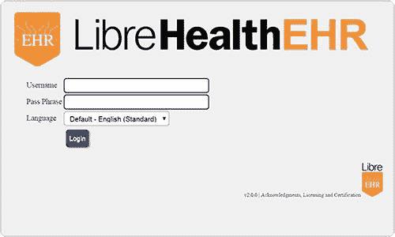

user-login-1

我看了我的 EHR 导师哈利·塔克的一段视频，名为[EHR 自由健康简介](https://www.youtube.com/watch?v=Fh0_NUVUn7k&t=62s)。尽管它只有几个月大，但事情已经发生了变化。我使用网站演示来捕捉视频中没有涉及到的流程和图像。我喜欢哈利说话的方式——清晰、清晰、准确。我试着让用户指南保持对话的语气，就像他那样。

演示中已经列出了一名医生，也称为提供者。我创建了一个新的工具——也称为实践——来显示日历和用户偏好的各种方法。

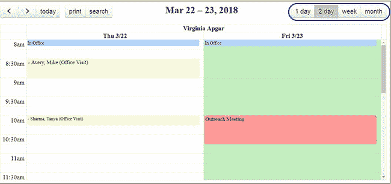

nav-cal-two-day.jpeg

#### 供应商订单

第二份文件是《EHR 医疗服务提供商订单指南》。我创建了一个需要转诊做 x 光检查的病人。然后我创建了一个实验室来进行 x 光检查，这样我们就可以发送订单了。

我使用了与之前的用户指南相同的医生和设施。我还创建了三个用户。他们是前台接待员、LPN 和转录员。

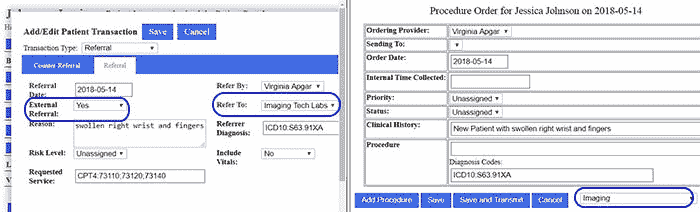

#### 邂逅或拜访

第三份文件是 EHR 图书馆健康遭遇指南。这类似于供应商订单。然而，我们没有把病人送到另一家医疗机构，而是就地给病人用药。

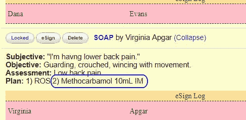

encounter-soap-med.jpeg

在这里，我学到了很多关于医疗保健法规的知识。了解保险计费的服务、程序和理由是如何共同产生要支付的费用的。

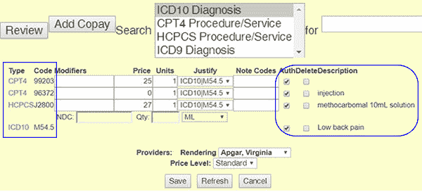

请注意这两个 CTP4 代码:
99203 是第一次 25 美元的患者就诊。
96372 是免费注射。注射费用包含在药物——hcp cs 代码中。

HCPCS J28000 是溶液形式的药物，售价 27 美元。

都是和 ICD10 诊断码 M54.5 一起来的腰痛。

#### 费用单

最终文档是[如何:创建费用表列表类别](https://wiki.ehr.librehealth.io/HOW_TO:_Create_Fee_Sheet_List_Categories)。该指南显示了管理员如何将药物和正确的代码添加到费用单列表中。费用单列表上的信息将用于费用单上的就诊账单。

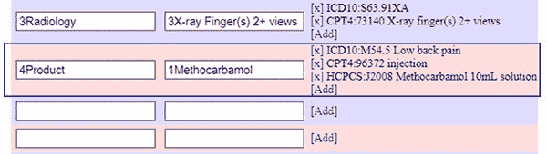

### 经验教训

#### 维基网

维基对贡献者开放。这意味着我们必须非常小心如何命名我们的文件和图像。否则你可能会使用别人的图像。

我通过在图像前加上文档或部分昵称，然后加上实际的图像名称，解决了这个问题。比如:`orders-vapgar.jpg`。

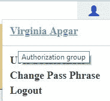

orders-vapgar.jpg

Wiki markdown 与 GitHub ReadME.md 文件不同。而且不是 HTML。我不得不调整代码的态度，因为我不能像往常一样设计风格。

`<`；p > tag 对我根本不起作用。所以我 tr `ied a` < br/ >标记。不，那也没用。呃，< br >标签起作用了。

我不能像在网格上那样分解列。不过，`<d`我`v>,` < s `pan> and` < blockquote >解决了我的问题。

我不能使用`标签。图像被称为文件。所以反而只好 `call [[Files:section-image`。jpg]]。

我的代码创建了一个两行两列的图像部分，如下所示:

`
`
`<blockquote>`
`‘’’Referral Transaction’’’: ‘Referral Date’ = ‘’’Procedure Order’’’: ‘Order Date’`
`  `
``
`[[File:trans-refDate.jpg|500px]] [[File:trans-ordDate.jpg|500px]]</sp`an>
  
</block quote>

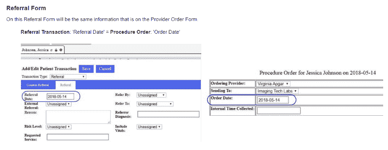

It worked!

对我来说是不同的，需要一些时间来适应。

#### 卫生保健

肥皂笔记不是用来洗东西的肥皂。医生和护士的记录反映了病人的陈述、医生的客观观察、对情况的评估以及对病人的治疗计划。

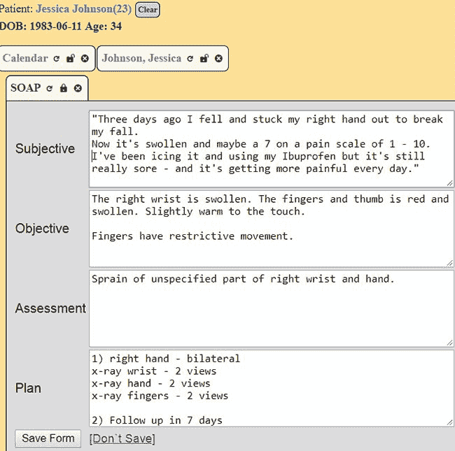

还有，如果不在 SOAP Note 计划上，那就不要做…

工作流程非常具体。许多工作人员限制访问患者信息的各个方面。

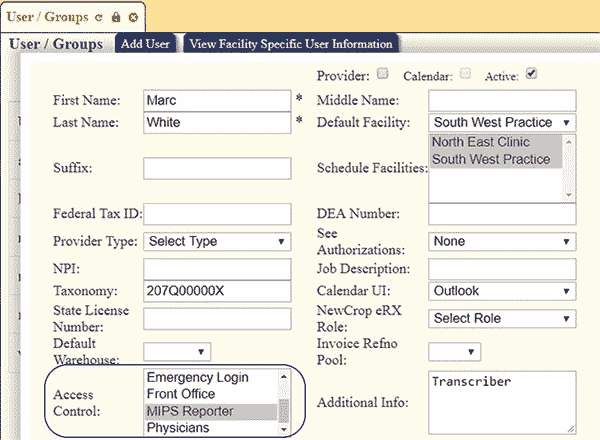

order-access.jpg

账单、药物、费用和证明代码非常严格。我和我的导师反复检查了很多次，以确保我的工作是正确的。

#### 文档样式

我的前三份文件带有对话的语气。然而，最后一份文件是一步一步的教学风格。

对我来说，把箭头和数字放在这里并不容易。虽然这是最小的文件，但我花了更多的精力才让它符合我的导师的要求。

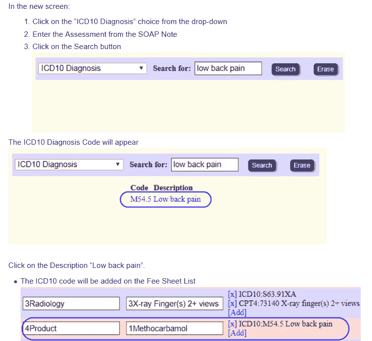

### 成就

这个夏天对我来说充满了祝福和积极的成就感。

我学到了很多关于医疗保健实践、规范和工作流程的知识。我还学到了很多关于技术和用户文档的知识。

我还学会了不止一种创建降价文档的方法。

#### 外展服务；扩大服务范围

如果我没有首先被外展实习所接受，这个夏天就不会走这个方向。在 45 名候选人当中，我被认为是能够帮助他们图书馆健康项目的人，这对我来说意义重大。

我学习的时候他们愿意付钱给我，这更棒。

然后，他们为我的纽约之旅提供了旅行津贴。

我建议每一个理工女学生在实习机会开放时申请拓展实习。

#### 自由代码营

作为一名外展实习生，我的职责之一是每两周写一次我的经历。我真的不认为自己是一个作家，所以这似乎是一项艰巨的任务。

作为一名 freeCodeCamp 的露营者和 Medium 上的 freeCodeCamp 的编辑，我有一个完美的发布平台。幸运的是，我们的创始人昆西·拉森同意了。

我们的执行编辑，阿比盖尔·雷恩梅尔是第一个看到我的草稿的人——在我丈夫，亚历克斯·肖特利夫之后。她让我多写点东西，不再写 1 分钟的文章。

而且，我们有一个很棒的编辑团队，他们让我的最终作品看起来很棒。但是图像都在我身上…

#### 最佳贡献者奖

我是 200 名获得自由代码营最佳贡献者徽章的营员之一。这是一个很大的荣誉，但我不确定我能负担得起去大陆的另一边旅行。

那时我的图书馆健康导师让我联系我的外联组织者。我被批准了旅行津贴！我周五晚上很晚才到达，周日一早就离开了。但是我的周六棒极了！

我见到了一些我崇拜的英雄和作者，一些我最喜欢的版主，以及来自世界各地的优秀的学习小组成员。太不可思议了。这里可以看到直播流[。](https://www.youtube.com/watch?v=u_4ZhwZmtes)

老实说，我觉得我没做什么值得这样。我只是喜欢编辑一些我喜欢的作者的文章，并在论坛上回答我认为我知道答案的问题。但是我很高兴他们没有意识到我只是爱管闲事…

### 遗憾和希望

我希望了解更多关于图书馆健康放射信息系统的知识。我开始着手两份不同的文件，用户指南和技术指南。

由于技术上的困难，我没能完成它。我希望下一个实习生能够正确地创建它。

### 对未来实习生的建议

截至 9 月 19 日，2018 年 12 月至 2019 年 3 月的外展实习现已开始接受申请。这里可以应用[。](https://www.outreachy.org/apply/)

找一些你感兴趣的东西。你可以享受学习的乐趣，并为之做出贡献。

遵循外展指导方针。你的项目也会为你准备好指导方针。你可以让它们都发生。当有疑问的时候——比如截止日期——问问你的外展组织者。

耐心点。不是每个人都在你的时区。每个人都有不同的时间表。所以把你的问题提出来，但是要意识到可能需要几天才能得到答案。

记住节日。在美国，我们有很多国定假日。每个州都有自己的庆祝日。家庭通常是第一位的。如果你的工作、服务和银行即将放假，提前通知你的团队。

要透明。你将在一个开放源代码的环境中工作。不要直接给你的导师发信息，除非是关于你个人工作量的问题。团队的其他成员和导师需要看到每个人都在做什么。

友好相处，友好相处。是的，这是一场比赛。但是保持友好的竞争。

### 欣赏

特别感谢我的导师哈利·塔克和罗比·奥康纳。你们都让我坚持下去，鼓励我发挥自己，并在我做对的时候鼓掌。

感谢你们，我的读者们。你的反馈是无价的。事实上，在我的旅程中你一直陪着我，这真的让我的夏天成为一个特别的季节。

#### 现在怎么办？

秋季以一个特殊的编辑项目的结束开始，并开始与一个露营者一起工作在一个有趣的新图书馆。

我还会回到我的免费代码营课程，看看我是否能在 React-Redux 挑战中取得真正的进展。希望能做出一些特别的东西与世界分享。

#### 以前的文章

*   [我是如何战胜困难成为一名外展实习生的](https://medium.freecodecamp.org/how-i-beat-the-odds-and-became-an-outreachy-intern-9a92f47cb44e)
*   我的外展实习从今天开始！以下是我到目前为止所做的和学到的。
*   [我拓展之旅的下一步:码头工人、大挑战和小胜利](https://medium.freecodecamp.org/the-next-steps-on-my-outreachy-journey-docker-big-challenges-and-small-victories-2c3a2dd2277a)
*   [在我的旅程中，每一步都带来新的东西](https://medium.freecodecamp.org/every-step-brings-something-new-on-my-outreachy-journey-e7c0f7adf2ea)
*   [我的外展旅程中的特殊时刻](https://medium.freecodecamp.org/special-moments-on-my-outreachy-journey-78db1ff11ef4)
*   [我是如何在我的拓展旅程中尽可能多地吸收知识的](https://medium.freecodecamp.org/how-ive-absorbed-as-much-as-i-m-able-on-my-outreachy-journey-3e350c9e0362)
*   [我成功抵达纽约，在我的外展之旅中与自由代码营一起庆祝](https://medium.freecodecamp.org/how-i-escaped-to-nyc-and-celebrated-with-freecodecamp-on-my-outreachy-journey-22946d5af21e)
*   [与云分享阿罗哈精神](https://medium.freecodecamp.org/sharing-the-aloha-spirit-with-the-cloud-1c62e1a93cfb)

你可以在 [GitHub](https://github.com/KoniKodes) 上找到我，或者在 [Twitter](https://twitter.com/konikodes) 上加入我。你也可以访问我的[网站](https://www.konikodes.com)。