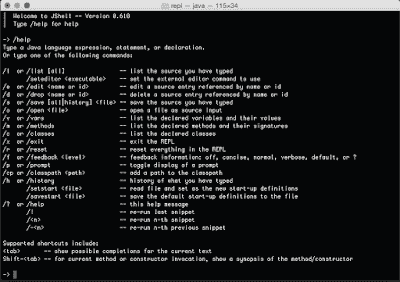
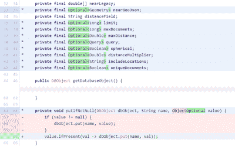
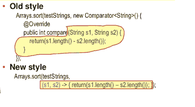
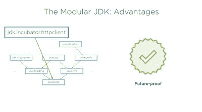

# 这些是帮助你学习 Java 8 和 Java 9 的最好的免费课程

> 原文：<https://www.freecodecamp.org/news/these-are-the-best-free-courses-to-help-you-learn-java-8-and-java-9-a7615c8644ab/>

作者:javinpaul

# 这些是帮助你学习 Java 8 和 Java 9 的最好的免费课程

“ceramic coffee mug filled with coffee” by [Athena Lam](https://unsplash.com/@thecupandtheroad?utm_source=medium&utm_medium=referral) on [Unsplash](https://unsplash.com?utm_source=medium&utm_medium=referral)

在 Java 10 上引入六个月的发布周期后，很难跟上每个 Java 版本的最新变化。但是如果您正在寻找一些关于 Java 的免费资源，比如书籍、教程和其他学习材料，那么您来对地方了。

有如此多的资源可以用来掌握在 [Java 8](https://www.oracle.com/technetwork/java/javase/overview/java8-2100321.html) 和 [Java 9](https://www.oracle.com/java/java9.html) 中引入的特性。

过去，我曾分享过一些[最佳 Java 8 教程](http://www.java67.com/2014/09/top-10-java-8-tutorials-best-of-lot.html)和[书籍](https://javarevisited.blogspot.com/2018/07/java-8-tutorials-resources-and-examples-lambda-expression-stream-api-functional-interfaces.html)。在这篇文章中，我将分享来自 [Udemy](https://www.udemy.com/) 和[pluar sight](https://www.pluralsight.com/)的一些最好的免费 Java 8 和 Java 9 课程。

这些课程与你通常可能购买的付费课程非常相似，其中许多是免费的，用于宣传或教育目的。您可以参加这些课程，在短短几天内了解 JDK 8 和 JDK 9 的功能。

我过去常常通过书本开始学习新的编程特性，但是现在，在线课程是我更喜欢的学习方法。有这么多好的免费课程。

不过，有时候，我注意到免费课程变成了付费课程，尤其是在讲师达到他们的促销目标之后，因此你应该在参加这些课程之前检查一下价格。

趁这些课程是免费的，现在就加入是个好主意。一旦你注册了这门课程，你将可以免费、无限制地学习，即使它已经变成了付费课程。这意味着你可以随时学习。

即使你现在没有学习，当你有一些空闲时间或者你的优先事项改变时，你也可以学习更多——报名参加没有坏处。

### 为什么要学习 Java 8 和 Java 9？

如果你想知道学习 Java 8 和 Java 9 的特性有什么好处，那么，让我来告诉你。如果你想在今天的就业市场上成为一名相关的 Java 开发人员，你现在就应该学习 Java 8。

我之前在我的帖子[中提到了 Java 开发人员应该在 2018 年](https://javarevisited.blogspot.com/2017/12/10-things-java-programmers-should-learn.html#axzz53ENLS1RB)学习的 10 件事情，我再次重申:学习 Java 8 宜早不宜迟。

Java 8 第一次发布已经四年多了，Java 社区对它的反应非常好。它有几个有趣的特性和语言增强，比如用于批量操作的 [lambda 表达式](https://javarevisited.blogspot.sg/2014/02/10-example-of-lambda-expressions-in-java8.html)、[流 API](http://www.java67.com/2014/04/java-8-stream-examples-and-tutorial.html)、用于更好地处理日期的[新日期和时间 API](http://javarevisited.blogspot.sg/2015/03/20-examples-of-date-and-time-api-from-Java8.html)、接口上的[默认](http://www.java67.com/2017/08/java-8-default-methods-on-interface-example.html)和静态方法、[方法引用](https://javarevisited.blogspot.com/2017/03/what-is-method-references-in-java-8-example.html)等等。

现在，越来越多的公司采用 Java 8 风格的编码。如果你不知道用 Java 8 风格写代码，比如使用 [lambda](https://en.wikipedia.org/wiki/Lambda_expression) 和[函数式编程](https://en.wikipedia.org/wiki/Functional_programming)概念，你可能会落后。

一旦你掌握了基本知识，Java 8 不仅对 Java 社区的发展至关重要，而且还能提高你的生产力，让编写 Java 代码变得有趣。这就是这些课程可以帮助你的地方！

来到 Java 9，它没有了 Java 8 的火花。但是它仍然包含了一些有趣的特性，比如模块和一些 API 附魔。了解这些特性最终将帮助您编写更好的 Java 代码，并用 Java 创建更好的应用程序。

### 学习 Java 8 和 Java 9 的课程

下面是我列出的学习 Java 8 和 Java 9 的免费在线课程。这个列表包括适合初学者以及不熟悉 [JDK 8](http://www.java67.com/2014/09/top-10-java-8-tutorials-best-of-lot.html) 和 [JDK 9 特性](http://www.java67.com/2018/01/top-10-java-9-tutorials-and-courses.html)的有经验的 Java 程序员的课程。

你不需要参加所有的课程。你可以观看一个预览，然后决定是否加入。最起码，你可以参加一门 Java 8 的课程和另一门 Java 9 的课程，让自己跟上速度。

而且，由于这些课程是完全免费的，加入它们你不会有任何损失。

#### 面向完全初学者的 Java 9 编程 250 步

这是一门优秀的 Java [课程，适合初学者](https://www.udemy.com/java-programming-tutorial-for-beginners/)，尤其是第一次入门的人。本课程涵盖了 Java 的最新版本，即 Java 9。

如果你想从零开始学 Java，可以加入这个课程。你不仅会学到 Java 8 和 Java 9 的新特性，比如函数式编程、lambdas 和 streams，还会学到 Java 的其他重要概念。

你需要尽快获得免费课程，因为我相信 Ranga Karanam 讲师将很快支付这门课程，一旦他达到他的推广目标，已经有超过 31，000 名学生加入。

反正我个人很喜欢 Ranga 的教学风格和他呈现概念的方式，像他的 [Spring 框架课程](https://javarevisited.blogspot.com/2018/06/top-6-spring-framework-online-courses-Java-programmers.html)中的 JShell 和 Spring 概念。你会在短时间内学到很多东西——这是毫无疑问的。

[Java 9 Programming for Complete Beginners in 250 Steps](https://www.udemy.com/java-programming-tutorial-for-beginners/)

#### Java 8:初学者基础

这是一个非常[的短期课程](https://www.udemy.com/java-8-basics-for-beginners-c/)，用于学习 Java 8 的一些关键特性，包括 lambda 表达式、方法引用、[函数接口](https://javarevisited.blogspot.sg/2018/01/what-is-functional-interface-in-java-8.html)、[默认方法](http://www.java67.com/2017/08/java-8-default-methods-faq-frequently-questions-answers.html)、[流 API](https://javarevisited.blogspot.com/2018/05/java-8-filter-map-collect-stream-example.html)，以及[可选](https://javarevisited.blogspot.com/2017/04/10-examples-of-optional-in-java-8.html)类。

您不仅会学到这些，还会学到新的日期和时间 API 以及其他不太流行但很有用的变化。

尽管本课程没有提供全面的概述，但是您可以快速查看一下，尤其是如果您很忙，没有太多时间用于自学的话。

Java 8: Basic for Beginners

#### Java 8 有什么新特性？

这是一门关于 Java 8 的更全面的[课程](https://pluralsight.pxf.io/c/1193463/424552/7490?u=https%3A%2F%2Fwww.pluralsight.com%2Fcourses%2Fjava-8-whats-new)，它几乎涵盖了你需要知道的所有特性。

作者 Jose Paumard 在计算机编程方面有 20 年的经验，这在本课程中有所体现。您将了解 l [ambda 表达式](https://javarevisited.blogspot.com/2015/01/how-to-use-lambda-expression-in-place-anonymous-class-java8.html#axzz5HKrDEIos)和[流 API](https://javarevisited.blogspot.com/2014/03/2-examples-of-streams-with-Java8-collections.html#axzz5SDm16SbN) 如何让用 Java 编程再次变得有趣。

它不仅涵盖了主要特性，如日期和时间 API，还涵盖了小的 API 增强，如 Java 8 中用于连接字符串的 String 类中的`[StringJoinger](https://javarevisited.blogspot.com/2016/06/10-examples-of-joining-string-in-java-8.html)` 和`[join()](https://javarevisited.blogspot.com/2016/06/10-examples-of-joining-string-in-java-8.html)`方法。

您还将学习使用 [Nashorn](https://en.wikipedia.org/wiki/Nashorn_(JavaScript_engine)) 引擎的 [JavaFXFX](https://en.wikipedia.org/wiki/JavaFX) 和 Java 脚本。总的来说，这是学习 Java 8 的一个很好的课程，但是不幸的是，这个课程并不是完全免费的。

[What’s New in Java 8?](https://www.pluralsight.com/courses/java-8-whats-new)

它来自 Pluralsight，你需要一个会员才能进入这个课程。你可以免费使用的唯一方法是注册一个 [10 天的免费试用](http://pluralsight.pxf.io/c/1193463/424552/7490?u=https%3A%2F%2Fwww.pluralsight.com%2Flearn)，这还不错。

还有一个很好的机会是，你的公司可能有一个企业多重视野许可证，然后你可以在你的公司帐户上免费获得这门课程。

#### Java 9 有什么新特性？

这是一门学习 Java 9 特性的很棒的课程。在本课程中，畅销书《Java 9 模块化》的作者 Sander Mak 解释了 Java 9 的一些重要变化。

本课程分为 6 个部分。第一部分介绍了 Java 模块化，由于这位教师也是《Java 模块化》一书的作者，所以这可能是你能得到的最全面的介绍。

第二部分关注 Java 9 中一个更有趣、更具交互性的变化——JShell。您将了解 REPL 以及如何使用 JShell。

第三部分关注小语言和库的改进，比如[流 API](http://www.java67.com/2016/08/java-8-stream-filter-method-example.html) 、[可选](http://www.java67.com/2018/06/java-8-optional-example-ispresent-orElse-get.html)、[集合上的工厂方法](https://javarevisited.blogspot.com/2018/02/java-9-example-factory-methods-for-collections-immutable-list-set-map.html)的变化，以及其他改进。这是你会喜欢的部分，因为你会在日常生活中用到这些变化。

[What’s New in Java 9?](https://www.pluralsight.com/courses/java-9-whats-new?)

第四部分关注 HTTP/2 和流程 API 的变化，而第五部分关注桌面 Java 的增强，比如 JavaFX 更新。

第六部分也是最后一部分重点关注性能和安全性增强。它解释了 G1 垃圾收集的变化和 Java 9 中引入的压缩字符串特性。

与任何其他 Pluralsight 课程一样，您需要一个月或年会员资格才能参加本课程。尽管会员资格花费不多(每月 35 美元来访问他们的 5000 多门课程)，你仍然可以通过注册一个 [10 天的免费试用](http://pluralsight.pxf.io/c/1193463/424552/7490?u=https%3A%2F%2Fwww.pluralsight.com%2Flearn)来免费获得这门课程和 Java 8 课程，这对于完成这些课程来说是绰绰有余的。

以上是学习 Java 8 和 Java 9 新特性的一些最好的免费课程。我强烈建议您至少参加一门 Java 8 和一门 Java 9 课程，以熟悉新特性，尤其是 JDK 8 的特性，如 lambda 表达式、流 API、收集器、可选的以及新的日期和时间 API。

您可能喜欢的其他**免费编程资源**:

[5 门面向 Java 开发者的免费 Spring 框架课程](http://www.java67.com/2017/11/top-5-free-core-spring-mvc-courses-learn-online.html)
[2018 年学习 Web 开发的前 5 门课程](https://javarevisited.blogspot.com/2018/02/top-5-online-courses-to-learn-web-development.html)
[5 门课程学习大数据和 Apache Spark](http://javarevisited.blogspot.com/2017/12/top-5-courses-to-learn-big-data-and.html)
[2018 年学习 Spring Boot 的前 5 门课程](https://javarevisited.blogspot.com/2018/05/top-5-courses-to-learn-spring-boot-in.html)
[5 门免费数据结构和算法课程](https://javarevisited.blogspot.com/2018/01/top-5-free-data-structure-and-algorithm-courses-java--c-programmers.html)
[5 门面向程序员和开发者的免费 Linux 课程](http://www.java67.com/2018/02/5-free-linux-unix-courses-for-programmers-learn-online.html)

感谢阅读这篇文章。如果你觉得这些免费的 Java 8 和 Java 9 课程有用，那么请分享给你的朋友和同事。

> **附言——**你可能知道 Java 11 刚刚推出，有很多关于它是否免费的讨论。如果你想了解更多信息和 Java 11 的新特性，那么别忘了看看 Sander Mak 的[**Java 11 的新特性:长期支持**](http://bit.ly/2IjIy5x) 课程，在 [Pluralsight](https://www.freecodecamp.org/news/these-are-the-best-free-courses-to-help-you-learn-java-8-and-java-9-a7615c8644ab/undefined) 上。感谢 Mak，一周#免费。