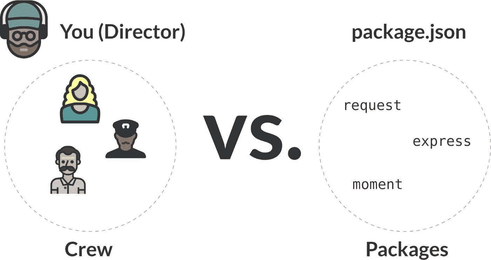
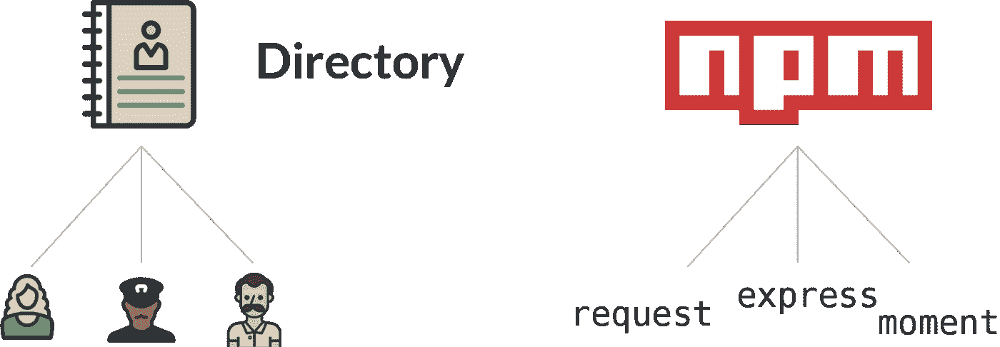
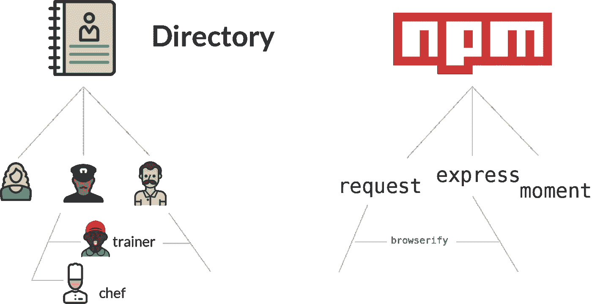
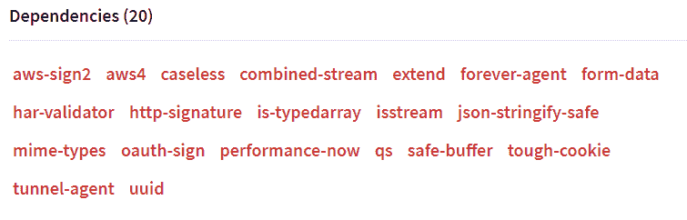
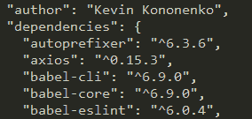
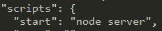
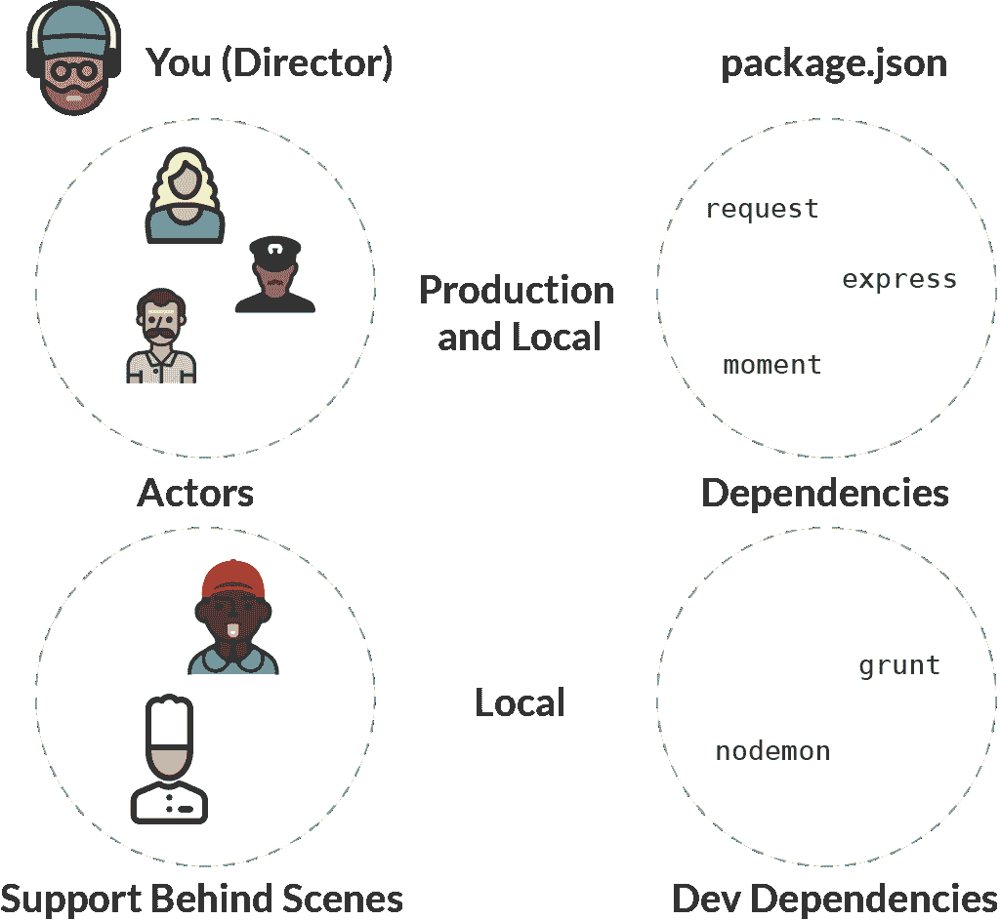
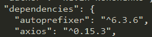
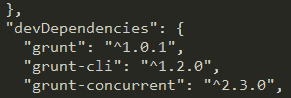

# 节点包经理(NPM)通过导演一部电影来解释

> 原文：<https://www.freecodecamp.org/news/node-package-manager-npm-explained-by-directing-a-movie-9c90f1d16d33/>

凯文·科诺年科

****如果你了解好莱坞电影的一般制作方式，那么你就能理解《节点包经理》(NPM)。****

你知道 Node.js 的最初版本是由一个程序员 Ryan Dahl 在 2009 年编写的吗？

2018 年的今天，数百万开发者已经使用 Node.js 为他们的 web 应用创建后端。但是，Node 依赖于一个活跃的开源社区，在 Node Package Manager 或 NPM 中构建了许多专门的包。

Ryan Dahl 没有自己开发所有这些专门功能有两个原因:

1.  开发人员不希望使用一个庞大、笨重的框架来覆盖数百个用例。
2.  自己创建所有专门的包会花费太长的时间。

相反，Ryan 知道，如果 Node 越来越受欢迎，开发人员会愿意贡献自己的力量。因此，他在 2010 年启动了 NPM 来组织所有这些由社区创建的包。

然而，作为一个初学 web 开发的人，理解整个生态系统，以及如何在您的本地计算机上访问它是一个挑战。

思考了一会儿之后，我意识到使用 NPM 有点像是在导演一部好莱坞电影。你的工作是让一群人(或软件包)变戏法一样拥有专门的功能，而不使每个人都疯狂(或使你的应用无法构建)。

这是 NPM 的完整指南。为了理解这个教程，你只需要知道前端 v .后端的[区别。](https://blog.codeanalogies.com/2018/04/07/front-end-v-back-end-explained-by-waiting-tables-at-a-restaurant/)

# 什么是 NPM？

想象你是一部新的好莱坞电影的导演。接受这个角色后，你需要立即开始雇佣演员和其他高管与你一起创作电影。

当然，这带来了一个迫在眉睫的问题:你会雇佣哪些男演员/女演员？您将如何确保它们能够协同工作？你将如何在预算内安装它？

或者，你会不会走完全不同的方向，尝试用相对不知名的演员从零开始打造完美团队？

如果你想雇佣一个团队，你需要查看一些目录来找到合适的人。我不知道好莱坞是否有某种内部目录，但我想到的是 IMDB。或者，在互联网出现之前，甚至可能有一个实体目录。

就像 IMDB 拥有成千上万名演员的信息，你可以利用这些信息做出招聘决定一样，NPM 拥有成千上万个提供专门功能的“包”。它们都是用 JavaScript 编写的，所以从技术上讲，你可以重写它们…但这不是重点。它们旨在通过提供即时可用的新功能来简化您的生活。

这就像雇佣一个著名的男演员/女演员——由于过去的经验，这个人是某类角色的专家。

**我们都知道连姆·尼森的特产……**

因此，作为一名开发人员，您可以访问 NPM 注册中心，将特定的包添加到您的 web 应用程序中，这应该会让您的生活更加轻松。就像所有的男演员/女演员都建立了自己的事业一样，所有的 NPM 软件包都是由个人开发者或团队建立并贡献给注册表的。

在您的代码中，所有这些包都在 package.json 文件中进行跟踪。所以，这个文件有点像电影中的人员名单。以下是该列表的一个示例:

我们将在本教程的后面讨论这些版本。

# 包装说明

假设你的电影有 100 个角色需要填补。如果你有一个无限的预算，你会想让那些在过去扮演过类似角色的著名演员来填补这些角色吗？

大概不会。

每个人都想成为这部剧的明星，为了符合他们的性格而改变规则。这将是一场噩梦。但是，如果你只雇佣不知名的演员，那就很难拍出一部优秀的电影！

毕竟，成为一名伟大的演员需要多年的经验。

类似地，当您构建 web 应用程序时，您会不断面临一个选择——我可以自己构建这个功能，还是应该使用一个包来完成任务？

你知道电影《超级骑兵》吗？这是一部经典喜剧，预算只有 300 万美元。然而，大多数优秀的电影耗资 1000-1000 万美元。您可以从头开始构建一个令人难以置信的 web 应用程序，但是您可能希望使用包。

比方说，你正在为你的电影聘请美国著名演员马克·沃尔伯格。当马克加入你的电影，不仅仅是他。他有一个支持他并使他成功的团队。厨师，教练，经纪人。

同样，每个独立的软件包也不是独立运行的。软件包的作者使用其他 NPM 软件包来使他们的生活更容易。事实上，他们的包将与其他包共享一些依赖关系，就像马克·沃尔伯格可能与其他男女演员共享一个私人厨师一样。

下面是[请求](https://www.npmjs.com/package/request)的依赖项列表，这是一个流行的包:

因此，让我们回到上面的 package.json 示例:

当你将“**”axios**”包添加到你的应用时，你不仅仅是添加了 axios 文件。如果您之前没有用另一个包添加它们，那么您也添加了 **axios** 文件将需要的任何依赖项。这些没有明确说明，但是您总是可以在 **node_modules** 文件夹中找到它们。

这就是 npm 的好处之一。当您添加一个新的包时，您甚至不需要检查您是否已经使用了支持您正在使用的包的所有必需的包。npm 会自动将新的添加到您的目录中。

# 解释的版本

你看到上面每个包裹旁边的三组数字了吗？那就是 ****版本号**** 。由于开发人员不断更新他们的包，您可以选择使用包的特定版本，或者自动使用最新版本。

因此，当你在你的项目中使用 40 个不同的包，并且它们都在不断地变化时，你可能会发现兼容性问题出现了。例如，当 ReactJS 发布其最新版本时，您的应用程序可能不再像您预期的那样运行。这就是测试发挥作用的地方，但这是另一个教程的主题。

把它想象成处于事业不同阶段的男演员/女演员。有些人可能在他们的职业生涯中扮演类似的角色，而有些人可能会发生巨大的变化。

**年轻 vs 老克林特·伊斯特伍德**

# 使用命令行

当您将节点和 NPM 下载到本地机器时，您可以立即使用各种命令来处理 NPM 目录。一个常见的例子是:

**npm 安装**

如果你想安装 **express** 包，你可以在命令行中输入:

**npm 安装快捷**

然后，NPM 会将快速代码及其依赖项下载到您的本地计算机上。这有点像雇佣新演员的行为。或者—

**npm 卸载快递**

这就像从你的应用程序中“发射”express 包一样。

您可以在 package.json 文件的“脚本”部分添加新命令。一个常见的是“开始”，意思是“开始运行节点服务器”。看起来是这样的:

有点像导演喊“开拍！”

# 依赖关系解释

到目前为止，我们只是简单地谈到了依赖关系的概念。你的应用程序可能会有几个只在本地版本上运行的包，比如测试和传输工具。换句话说，您应该有一些只在本地环境中使用的工具，而不是在生产版本中使用。

如果您需要复习一下本地主机和生产之间的区别，[请查看本指南](https://blog.codeanalogies.com/2018/02/02/localhost-explained-by-trying-to-start-a-microbrewery/)。

想想制作一部电影所花费的时间和精力。只有一小部分发生在官方拍摄现场，摄像机还在转动。在幕后，有几个小时的工作在背台词，在健身房举重和学习新的口音。为了让团队更有效率，主管可能会为每一项职能聘请专业教练。

因此，当我们查看节点应用程序使用的所有包时，我们实际上可以将其分为两类:

1.  生产和本地使用的包
2.  仅在本地使用的包

[Grunt](https://gruntjs.com/) 是一个任务运行器，可以在命令行上自动执行重复的命令。 [Nodemon](https://github.com/remy/nodemon) 在你的服务器代码发生任何变化时自动重启你的服务器。

在 package.json 文件中，它们被分成两个部分:dependencies 和 devDependencies。看起来是这样的:

