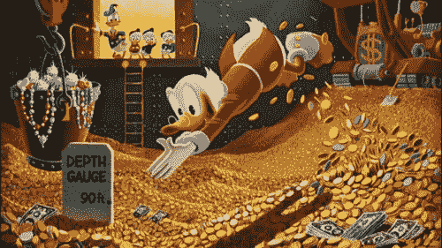

# 令牌模型的另一个大问题是:“交易媒介”令牌和速度问题

> 原文：<https://www.freecodecamp.org/news/single-biggest-problem-with-token-models-part-2-52c0eca2115c/>

作者何塞·马里亚·马塞多

# 令牌模型的另一个大问题是:“交易媒介”令牌和速度问题

作为 Amazix 的一名分析师，我花了大量时间阅读数百个项目的白皮书，并分析它们的经济模型，以辨别它们是否充分捕捉了项目创造的价值。

这一点非常重要，因为代币获取的价值本质上是其效用或内在价值，这也是确保代币价格随着基础项目的采用/成功而增长的原因。缺乏实用性的代币只能通过投机支撑其价格，从长远来看很可能会失败。

关于这方面的更多信息，请参见我之前的博客，在其中我讨论了代币经济模型在确保代币长期价值方面的重要性。

在本系列第一部分中，我讨论了由既有股权又有代币的项目引起的激励不一致的问题，表明项目的股权价值和代币价值之间存在反比关系，因为它们实际上是在竞争获取项目创造的价值。我还提出了一些可能的解决方案。

在这篇博客中，我将讨论我们在代币经济模型中看到的第二个最常见的问题:“交易媒介”代币面临的速度问题。在描述什么是速度问题、它为什么重要以及我们向客户推荐的一些解决方案之前，我将首先简要介绍什么是代币经济学的背景。

### 什么是代币经济模型，为什么它很重要？

如果你是一个经验丰富的秘密投资者，或者理解什么是象征性经济模型，请跳过这一部分。

在我们开始讨论代币经济模型之前，从代币是什么和它的价值由什么构成开始可能是明智的。

代币是一种加密的经济记账单位，代表潜在的价值生成资产或与之交互。代币的价值由内在价值和投机价值组成，内在价值是代币价值中来自基础资产需求的百分比，投机价值是代币价值中来自对未来价格上涨预期的需求的百分比。虽然投机很好，但它很难控制/预测，并使项目受到短期投资者的摆布，就像我们下面的朋友:

我们建议投资者关注内在价值，而不是关注投机价值。代币的内在价值取决于两个因素:基础资产*创造的价值和*代币获得的价值百分比。

令牌经济模型决定了后者——平台创造的价值有多少被令牌捕获。因此，它是项目的效用价值和长期成功的主要决定因素之一。

### 代币交换媒介和速度问题

纯交换媒介令牌是这样一种令牌，其唯一或至少主要用途是为项目平台或协议上的某些公用设施付款。这有各种各样的体现，从像 [Signals Network](https://signals.network/) 这样的市场，令牌是在平台上购买服务的唯一货币，到像 [BitStation](http://bitstation.co/) 这样的 SaaS 类型的项目，客户只能通过向公司支付本地令牌的费用来访问平台的实用程序。

MoE 令牌的普遍问题是它们的速度非常高。这已经被许多人很好地记录下来，包括[维塔利克](https://vitalik.ca/general/2017/10/17/moe.html)、[詹姆士·基尔罗](https://medium.com/newtown-partners/velocity-of-tokens-26b313303b77)和[凯尔·萨马尼](https://www.coindesk.com/blockchain-token-velocity-problem/)。

基本上，鉴于 MoE 令牌的唯一用途是为平台上的服务付费，实际上没有动力持有令牌并承受相对于菲亚特的价格风险。

平台效用的购买者将简单地获得用于特定交易目的的代币(持有代币的时间越短越好)。另一方面，平台效用的卖家(无论是 Signals 的市场用户，还是 Bitstation 的项目背后的公司)将立即出售他们收到的菲亚特代币，而不是承担菲亚特的价格风险。

这将导致代币的高流通速度，因为由购买代币的买家驱动的需求增加将总是很快与将这些代币转换为菲亚特的卖家的供应相应增加相匹配。

实际上，高速度是流通供给的增加，因此与代币的价值成反比(尽管某个基本水平的速度是代币具有任何价值的必要条件，[如詹姆斯·基尔罗](https://medium.com/newtown-partners/velocity-of-tokens-26b313303b77)所指出的)。我们可以使用[交换方程](https://www.investopedia.com/terms/e/equation_of_exchange.asp)来看看这是如何工作的，克里斯·伯尼斯克和维塔利克都将这个方程改编成了著名的密码。

用伯恩斯克的定义来说:

MV=PQ

其中:
*M* =资产基数的大小
*V* =资产的速度(一枚普通硬币每天转手的次数)
*P* =被供应的数字资源的价格。这不是加密货币的价格，而是网络提供的资源的价格(即，在 Filecoin 的情况下，以每 GB 存储的美元为单位的价格)
*Q* =提供的数字资源的数量(提供的存储的 GB 数)

正如 Burniske 告诉我们的，为了评估硬币的价值，我们求解 M，其中:

M = PQ/V。

M 是在速度 v 下支持规模为 PQ 的加密经济所需的货币基础的规模。为了找到代币价格，我们简单地将 M 除以代币的总供应量。正如我们所见，速度越高，硬币的价值越低。

或者，如果我们更喜欢用维塔利克的定义:

Vitalik 取 MV=PT，为了简化对加密货币的分析，将其重铸为 MC=TH，其中:

*M* =货币供应总量(或硬币总数)
*C* =加密货币的价格(或 *1/P* ，其中 *P* 为价格水平)
*T* =交易量(每次交易的经济价值)
*H= 1/V* (用户使用硬币进行交易前的平均持有时间)

因此，等式的左边部分(MC)简单地是市值(总供应量*价格)，而右边是每个时间段交易的经济价值(T)乘以用户持有硬币的平均时间(H)。

为了求解代币价格，必须求解 C:

*C=TH/M*

我们再次看到，速度越高(或持有时间 H 越低)，代币价格越低。

Vitalik impress

在 Burniske 和 Vitalik 的定义中，显然硬币的速度与代币的价值成反比，即人们持有代币的时间越长，每个代币的价格越高。正如詹姆斯·基尔罗伊告诉我们的:

> 这是很直观的，因为如果一个经济体的交易活动是 1000 亿美元(一年)，硬币在一年中流通 10 次，那么硬币的总价值是 100 亿美元。如果它们流通 100 次，那么集体硬币价值 10 亿美元。因此，理解和计算任何代币经济中的速度都是极其重要的。”

要了解速度对代币的价值捕获和市值的巨大影响，请参见以下 John Pfeffer 关于速度对以太坊市值的影响的分析[:](https://medium.com/@john_pfeffer/hi-johnny-8411ec5d266)

> *“在一个由资本效率优化智能机器人管理协议使用的协议世界中(这似乎是可能的)，为了简单起见，让我们假设 1/V 的绝对下限是所讨论的链的阻塞时间。然后，让我们以 ETH 的 2.5 分钟阻塞时间为例(高度理论化，只是为了简单的数学观点)。这意味着每个令牌一年可以使用 210，240 次(假设固定的阻塞时间，这实际上可能会缩短)。Buterin，Choi 等。比如说，10%的 ETH 被押上(让我们假设押上的令牌根本不会移动)。这将使 V 下降到每年 189，216。假设 50%，那么 V=105，120。将最后一个数字乘以 500 亿美元的网络价值(即，ETH 仅维持其当前价值，而你需要 5.25 万亿美元以 ETH 计价的经济活动(即，不包括任何以 ERC20/ ERC721 计价的经济活动)，也就是说，是当前 80 万亿美元全球 GDP 的 65 倍。这些数字都是不同程度的愚蠢。这才是重点。只要你的一些代币以高 V 流通，你的整体 V 就高。”*

### **速度问题的解决方案**

这个问题最常用的解决方案都涉及设计代币经济模型，为人们持有代币提供激励——基本上是将代币转化为资产(或“价值储存”)而不是货币。这可以通过几种方式实现:

#### (1)确保令牌模型中有“接收器”

这个方法最初是由 Vitalik 提出的，后来被广泛采用。基本上，它涉及到设计具有“购买和燃烧”机制的令牌模型，在这种模型中，项目收取交易费，然后使用其平台产生的部分或全部现金流来购买自己的令牌并销毁它们。供应量的减少会提高所有剩余代币的价值，提高的幅度是总供应量被破坏的百分比。实际上，这个项目是把它的现金流分配给它的代币持有者，非常类似于股票通过分红把现金流分配给它的股东。

这方面的一个例子是 Iconomi，这是一个数字资产管理平台，[燃烧所有收费的预设百分比](https://iconomi.zendesk.com/hc/en-us/articles/360001428854-Repayment-Programme-Buybacks-Token-Burn)，并生成概述燃烧令牌数量的季度报告(加密季度收益报告)。

正如我们之前提到的，由于流通速度是流通供应量的增加，从而减少了代币获得的价值，所以购买并烧毁机制具有相反的效果，即确保平台上的每一笔额外交易(即，流通速度的增加)都会减少代币的总供应量，从而以通缩力量抵消流通速度的增加。

这也应该通过给人们一个持有代币的理由来降低流通速度，即由于代币燃烧产生的通货紧缩力，它在未来会更有价值的预期。

The Joker reducing $ velocity

#### (2)实行“利润分成”

这个最初是由 Multicoin 公司的凯尔·萨马尼提出的。它在精神上与“买了就烧掉”非常相似，因为它为代币提供收益，并将其转化为产生现金流的资产。

这方面的一个例子是 Augur，它向代表持有者支付为网络执行工作的费用。代表令牌就像出租车牌照:你必须支付网络工作的权利。具体来说，代表持有者必须报告事件结果以解决预测市场。“利润分享”代币的其他例子包括 [FOAM](https://foam.space/) 、 [Sharpe Capital](https://sharpe.capital/) 以及以太坊(一旦它转换为股权证明)。

同样，利润分享通过迫使人们持有代币来降低代币流通速度，以便有权通过向网络提供工作来产生现金流。

#### (3)鼓励用户锁定代币

这可以通过[利益证明](https://github.com/ethereum/wiki/wiki/Proof-of-Stake-FAQ)等机制来实现，这些机制鼓励用户锁定一定数量的令牌，验证交易并获得回报(这也有作为利润分享的额外好处)。DASH、NEO 和 Navcoin 都是实现了股权证明模型的硬币的例子。

还可以鼓励用户通过巧妙的游戏化锁定代币——为锁定代币的用户提供奖励(金钱或其他)。例如，针对亚洲市场的加密交易所 Alluma 根据用户下注的代币数量提供不同的会员级别和费用折扣:

*   黄金会员资格提供 35%的折扣，兑换 30 天 2500 LUMA 的赌注，以及
*   白金会员资格提供 50%的折扣，以换取 90 天 10，000 LUMA 的赌注([来源:Alluma 白皮书第 28 页](https://cdn2.hubspot.net/hubfs/4077694/whitepaper%20languages/Alluma%20Whitepaper.pdf?__hssc=147911272.3.1531961915300&__hstc=147911272.bf36623eb62b5916dee4146a67129a0e.1531961915299.1531961915299.1531961915299.1&__hsfp=2747456470&hsCtaTracking=8aed7630-08c6-4c61-8bd1-6db116fa6876%7C50cad1a6-1dbf-4b3e-9f82-a8dd851584c5))。

再举一个例子，我们可以看看 YouNow，这是一个直播应用程序，允许用户在其原生令牌道具中给内容创作者小费。

虽然内容创作者可以立即将道具转换为菲亚特，但他们有动力保留它，因为 YouNow 的算法会根据他们持有的令牌数量对他们的内容进行排名。由于可发现性直接导致更多的小费，YouNow 通过确保持有道具的用户能够产生现金流，有效地将道具转化为资产。

Donald Duck’s masternode

### 结论

对于加密货币项目的投资者和创始人来说，令牌经济模型设计是一个极其重要但又被低估的领域。一个具有弱令牌经济模型的项目可能会看到其令牌价格失败，即使项目本身成功了，这仅仅是因为令牌没有捕捉到项目创造的任何价值。

速度是当前令牌经济模型的最大问题之一，许多已建立的项目，如 [Civic](https://www.newtownpartners.com/how-civics-updated-token-model-decentralizes-trust/) 、 [Storj](https://www.coindesk.com/300-million-lockup-storj-clarifies-token-economics-surprise-reveal/,) 和 Po.et 最近修改了它们的令牌模型来解决这个问题。如果你认为你的项目也可能受到高速度的影响，并且有兴趣让你的 token economics 接受审计或进一步讨论这个问题，请随时通过这里或在 [Twitter 上与我联系。](https://twitter.com/zemariamacedo)