# 借助 feature-u V1，释放基于特性的 JS 开发的力量

> 原文：<https://www.freecodecamp.org/news/feature-u-v1-b84e2372c5e6/>

这篇文章介绍了一个名为 [feature-u](https://feature-u.js.org/) 的新 JS 库，它是*在你的 [React](https://reactjs.org/) 项目*中促进基于特性的开发。

> ***注****:2018 年 8 月 14 日 [**feature-u V1**](https://feature-u.js.org/1.0.0/history.html#v1_0_0) 发布，即重新设计的[跨特性通信](https://feature-u.js.org/1.0.1/crossCommunication.html)将 [UI 合成](https://feature-u.js.org/1.0.1/crossCommunication.html#ui-composition)纳入其中作为核心提供。这篇文章涵盖了 V1 发布。第一篇文章，基于 [feature-u V0](https://feature-u.js.org/0.1.3/history.html#v0_1_3) ，可以在这里找到[。我们对此次更新感到非常兴奋，因为它**为所有功能协作**推广了一个解决方案！](http://bit.ly/feature-u)*

大多数开发人员都会同意，通过特性来组织项目比基于类型的模式更可取。因为**应用领域在现实世界中增长**，项目**按类型组织根本无法扩展**，*它只是变得难以管理*！

有许多很好的文章讨论了这个主题，对基于特性的设计和结构有深刻的见解(参见:[参考资料](#8e25))。然而，当涉及到实现时，您几乎只能靠自己了。

[**feature-u**](https://feature-u.js.org/) 是一个管理和简化这个过程的实用程序库。它自动化了管理功能的平凡细节，并有助于推广真正的**即插即用**功能。

本文提供了 [**特性-u**](https://feature-u.js.org/) 概念和术语的基础，帮助您深入了解如何在项目中推广单个**即插即用**特性。它解释了为什么要开发 **feature-u** 并让你更好地理解它的好处。

检查[完整文档](https://feature-u.js.org/)、[源](https://github.com/KevinAst/feature-u)和 [npm 包](https://www.npmjs.com/package/feature-u)。

[**feature-u**](https://feature-u.js.org/) 为基于特性的开发的激动人心的世界打开了新的大门。它把你解放出来**把你的注意力集中在你的功能的“商业端”**！

### 一目了然

为了您的方便，这个**目录** (TOC)直接链接到**的各个部分。还要注意，每个部分标题链接回 TOC** 。

```
Feature Based Development  Segregating Features  Feature Goals    Feature Runtime Consolidation    Feature CollaborationThe feature-u Solution  launchApp()  Feature Object  aspects  Running the App    App Initialization    Framework Configuration    Launching Your Application  Cross Feature Communication  Feature Based UI Composition    Resource Contracts  Feature EnablementIn SummaryBenefitsReferences
```

> *请**帮我在 **feature-u** 上把**T3 这个词弄出来。你的掌声决定了这篇文章的销售/推广。如果你认为**功能-u** 有潜力，请给这篇文章多点掌声:-)*

### [基于特征的开发](#e98c)

从 30，000 英尺的角度来看，基于特性的开发(和大多数软件一样)就是将困难的问题分解成更小的部分。即使在我开始职业生涯的时候*(回到 70 年代)*，这也是一句名言:

> "计算机科学中的所有问题都可以通过另一种间接方式来解决."大卫·惠勒

通过将应用程序分解成多个功能，每个功能可以专注于一组更具体、更独立的任务。**在某些方面，你可以把一个特性想象成一个“迷你应用程序”**！


在定义特征边界时，有许多设计考虑因素。您可以找到几篇关于这个主题的文章，它们提供了关于基于功能的设计的见解。

在很大程度上，这些考虑是每个项目设计的一部分。虽然 **feature-u** 并没有规定整体的设计考虑，但是它确实促进了良好的基于特性的原则(比如封装)。*这将是本文*的重点。

### [分离特征](#e98c)

如果你像我一样，当你考虑基于特性的开发时，首先想到的是将你的代码隔离到特性目录中。

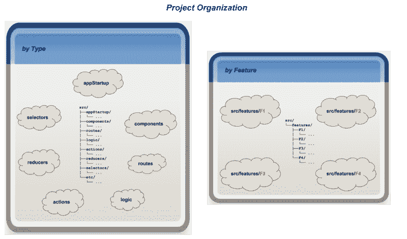

在这样做的时候，你的代码是按照它所完成的(即特性)来组织的，而不是按照它是什么(即组件、路径、逻辑、动作、减少器、选择器等等)来组织的。).

通过将您的特性分离到单独的目录中，有一种隔离的表象。

### [特性目标](#e98c)

我们的目标是**封装每个特性**，使它们真正成为**即插即用**。*但是这是怎么做到的*？

目录结构只是一个开始。要实现我们的目标，有几个障碍必须克服…

*   我们如何封装和隔离我们的功能，同时仍然允许它们相互协作？
*   选定的特性如何引入启动初始化(甚至在根 DOM 注入实用程序)，而不依赖于某些外部启动过程？
*   如何以一种隔离和自治的方式完成基于功能的 UI 组合？
*   既然我们的代码如此分散，我们如何配置我们选择的框架呢？
*   我们如何启用/禁用可选或需要许可证升级的选定功能？

**简而言之**，我们如何从这些孤立的特性中实现一个运行的应用？

总而言之，要实现我们的目标，必须具备两个压倒一切的特征:

1.  `[**Feature Runtime Consolidation**](#c8d1)` : *将我们的功能整合到一个运行的应用程序中*
2.  `[**Feature Collaboration**](#abbc)` : *提供一种机制，通过这种机制我们的功能可以相互作用*

事实证明，*其他一切都是这两个工件*的副产品。让我们仔细看看这些项目。

### [功能运行时合并](#e98c)

既然我们已经将我们的特性隔离到单独的实体中，我们如何将它们组合在一起，使它们作为一个应用程序运行呢？我们必须能够拉取和配置我们各个特性的各个方面，并将它们作为单一的同构运行应用程序“启动”。

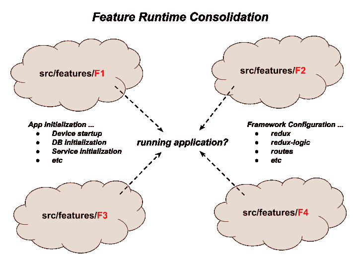

这个问题可以进一步分为两个子问题:

*   `[App Initialization](#d44a)`
    有些功能可能需要一定的启动初始化。例如，封装一些数据库抽象的特性将依赖于数据库服务的运行时设置。
    当然，我们不希望依靠一些全球应用程序逻辑来完成这个*(同样，我们希望我们的功能被封装和自给自足)*。
*   如果您的应用程序依赖于其他框架，那么很可能每个特性中都包含一些资源，这些资源必须累积起来并输入到框架配置过程中。
    这是怎么做到的？

### [功能协作](#e98c)

第二个特征(如上所述)是**特性协作** — *提供了一种机制，通过这种机制我们的特性可以彼此交互*。

基于特性的开发*的**最佳实践**是**将每个特性视为一个独立的实现**。一个特性的大多数方面都在该特性实现的内部*(例如，动作通常由该特性内部的逻辑/归约器/组件专门创建和消费)*。*

*从这个角度来看，你可以把每个特性看作是它自己的独立的迷你应用程序。*

*然而话虽如此，我们知道***没有人是孤岛***！任何给定的特性最终都会作为更大的应用程序的一部分而存在。有些情况下，一个特性需要将其方面的有限子集提升到其他特性。例如，功能可能需要:***

*   ***了解一些外部状态(通过选择器)***
*   ***发出或监控其他功能的动作***
*   ***整合来自其他特性的组件资源——如在 **UI 合成**中***
*   ***调用其他功能的 API***
*   ***等等。等等。等等。***

***这些项目构成了为什么需要`[**Cross Feature Communication**](#5369)`和`[**Feature Based UI Composition**](#a480)`的基础。***

***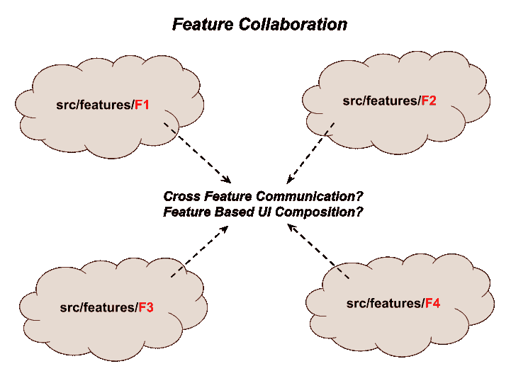***

***更复杂的是，作为一般规则， **JS 导入不应该跨越特性边界**。原因是这种交叉通信应该**限于公共接入点**——帮助**促进真正的即插即用**。***

***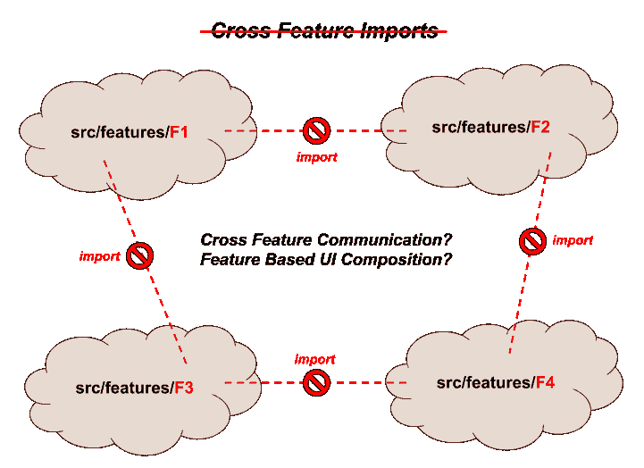***

***既然如此，**如何在不破坏封装的情况下实现** *跨特征通信？****

**特性需要一种方法将它们的**公共接口**提升到其他特性，并消耗其他特性的**公共资产**。**

### **[特征-u 解决方案](#e98c)**

**让我们来看看 **feature-u** 为所有这些目标提供的解决方案。接下来的部分将逐步构建**特性-u** 概念。**

****

### **[launchApp()](#e98c)**

**`[launchApp()](https://feature-u.js.org/1.0.1/api.html#launchApp)`是**功能-u** 中必不可少的实用程序。它是一个代理，代表你工作，为**完成**功能-u** 的所有目标**提供基础！它方便了`[**Feature Runtime Consolidation**](#c8d1)`和`[**Feature Collaboration**](#abbc)`。**

**有了这个工具，**你的主线启动过程非常简单** …它仅仅调用`[launchApp()](https://feature-u.js.org/1.0.1/api.html#launchApp)`，你就完成了！**

**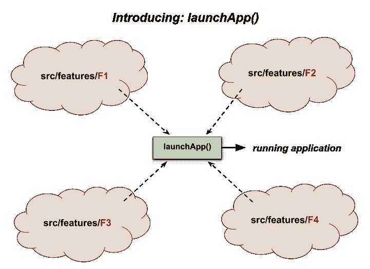**

**`[launchApp()](https://feature-u.js.org/1.0.1/api.html#launchApp)`函数实际上启动你的应用程序运行，使用各种钩子驱动**应用程序初始化**和**框架配置**！**

**你可以在`[Usage](https://feature-u.js.org/1.0.1/usage.html#launchapp)`部分找到`[launchApp()](https://feature-u.js.org/1.0.1/api.html#launchApp)`的例子，还有`[Launching Your Application](https://feature-u.js.org/1.0.1/detail.html#launching-your-application)`。**

****这是怎么回事？`[launchApp()](https://feature-u.js.org/1.0.1/api.html#launchApp)`** 有哪些绑定？...*让我们再深入一点……***

### **[特征对象](#e98c)**

**为了实现这一点，每个特性都提升了一个`[Feature](https://feature-u.js.org/1.0.1/api.html#Feature)`对象*(使用`[createFeature()](https://feature-u.js.org/1.0.1/api.html#createFeature)` )* ，它对**特性-u** 感兴趣的方面进行编目。**

**这是对`[launchApp()](https://feature-u.js.org/1.0.1/api.html#launchApp)`的主要输入。**

**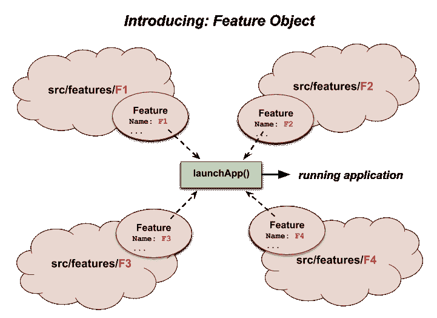**

### **[方面](#e98c)**

**在 **feature-u** ，【aspect】*(小“a”)*是一个广义的术语，用来指组成应用程序的各种成分(当组合在一起时)。方面可以采取许多不同的形式: **UI 组件****路由****状态管理** *(动作、减少器、选择器)***业务逻辑****启动初始化代码***等。等等。等等。***

****并非所有方面都是 feature-u**……*感兴趣的，只有那些设置和启动应用程序*所需的方面……所有其他方面都被视为特性的内部实现细节。作为一个例子，考虑 Redux 状态管理器:当它使用动作、reducer 和选择器时，只需要 Redux 的 reducer 来设置和配置。**

**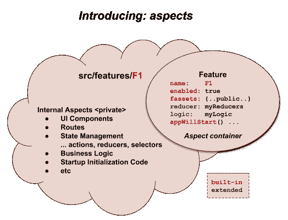**

**对象仅仅是一个轻量级的容器，它保存了 **feature-u** 感兴趣的方面。这些方面既可以是`[Built-In aspects](https://feature-u.js.org/1.0.1/detail.html#built-in-aspects)` *(来自核心**特性-u** )* ，也可以是`[Extendable aspects](https://feature-u.js.org/1.0.1/detail.html#extendable-aspects)` *(来自插件扩展)*。**

### **[运行应用程序](#e98c)**

**让我们看看`[launchApp()](https://feature-u.js.org/1.0.1/api.html#launchApp)`如何适应运行应用程序的两个子目标:**

*   **`[App Initialization](#d44a)`**
*   **`[Framework Configuration](#c339)`**

### **[App 初始化](#e98c)**

**因为`[launchApp()](https://feature-u.js.org/1.0.1/api.html#launchApp)`控制着 app 的启动，所以可以引入`[Application Life Cycle Hooks](https://feature-u.js.org/1.0.1/appLifeCycle.html)`。**

**这允许每个特性执行特定于应用程序的初始化，甚至将组件注入到应用程序的根目录中。**

**有两个挂钩:**

1.  **`[Feature.appWillStart()](https://feature-u.js.org/1.0.1/appLifeCycle.html#appwillstart)` -在应用程序启动时调用一次**
2.  **`[Feature.appDidStart()](https://feature-u.js.org/1.0.1/appLifeCycle.html#appdidstart)` -在应用程序启动后立即调用一次**

**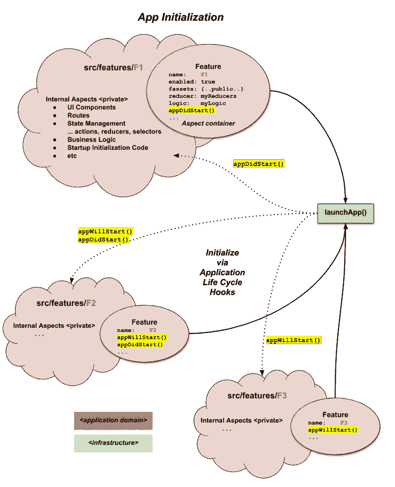**

**`[Application Life Cycle Hooks](https://feature-u.js.org/1.0.1/appLifeCycle.html)` **极大地简化了你的应用程序的主线启动过程**，因为特定于给定特性的*初始化可以封装在那个特性*中。**

### **[框架配置](#e98c)**

****feature-u** 的一个基本目标是**自动配置在你的运行时栈*中使用的框架***(通过在你的所有特性中积累必要的资源)。这大大减少了应用程序中的样板代码。**

**当有如此多的框架存在时，如何实现这一点…并且每个项目都使用不同的组合？**

****feature-u** 可扩展！它在一个开放的可插拔架构中运行，其中**可扩展方面**将**特性-u** 集成到其他框架中，匹配您特定的运行时堆栈。**这很好，** *因为不是每个人都用同样的框架*！**

****可扩展的方面**可以在外部 NPM 包*(正常情况)*中找到，或者你可以使用`[createAspect()](https://feature-u.js.org/1.0.1/api.html#createAspect)` *(更高级的主题)*创建自己的。**

**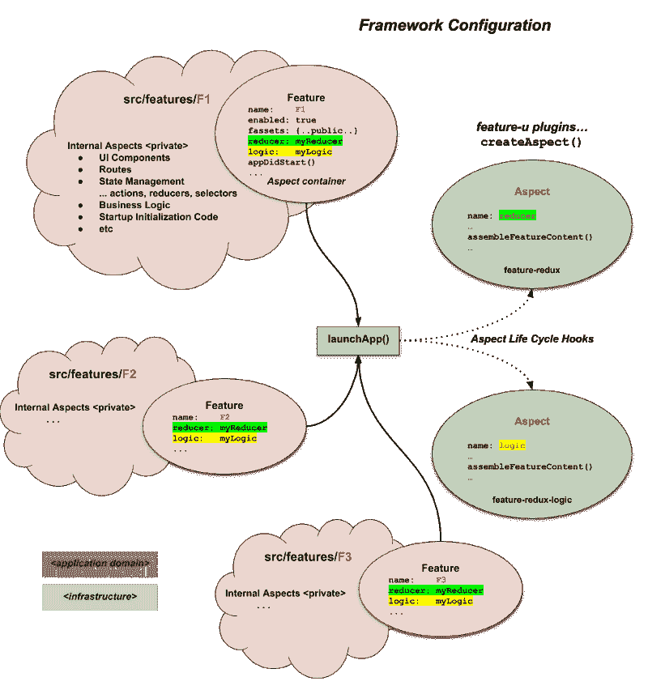**

**`[Aspect](https://feature-u.js.org/1.0.1/api.html#Aspect)`对象包含一系列在**特征-u** ( `[launchApp()](https://feature-u.js.org/1.0.1/api.html#launchApp)`)控制下调用的`[Aspect Life Cycle Hooks](https://feature-u.js.org/1.0.1/extending.html#aspect-life-cycle-methods)`。一般来说，一个方面的职责是:**

*   **累积所有特征的`[AspectContent](https://feature-u.js.org/1.0.1/api.html#AspectContent)`**
*   **执行一些所需的设置和配置**
*   **以某种方式公开它的功能(通常是框架集成)**

**一个`[Aspect](https://feature-u.js.org/1.0.1/api.html#Aspect)`自动扩展`[Feature](https://feature-u.js.org/1.0.1/api.html#Feature)`对象，允许它的`[AspectContent](https://feature-u.js.org/1.0.1/api.html#AspectContent)`在`Feature`中被**【编目】**，使用`Aspect.name`作为它的键。在上图中，你可以看到**

*   **`reducerAspect` ( `Aspect.name: 'reducer'`)允许一个`Feature.reducer: reducerContent`构造**
*   **并且`logicAspect` ( `Aspect.name: 'logic'`)允许一个`Feature.logic: logicContent`构造**

**理解你选择的框架的接口不会以任何方式改变是很重要的。您使用它们的方式与您总是使用*(就在您的特征边界内)*的方式相同。 **feature-u** 仅仅提供了一个定义良好的组织层，在这个组织层中，通过在所有特性中积累必要的资源，框架被自动设置和配置。**

### **[启动您的应用程序](#e98c)**

**在 **feature-u，**中，应用程序主线非常简单和通用。里面没有真正的特定于应用的代码… **甚至没有任何全局初始化**！这是因为**每个特性都可以注入它们自己的特定于应用的构造**！！主线只是累加`[Aspects](https://feature-u.js.org/1.0.1/api.html#Aspect)`和`[Features](https://feature-u.js.org/1.0.1/api.html#Feature)`，通过调用`[launchApp()](https://feature-u.js.org/1.0.1/api.html#launchApp)`来启动 app:**

**以下是一些**重要的兴趣点** *(将上面代码中的数字与`*n*`匹配)*:**

1.  **提供的`[Aspects](https://feature-u.js.org/1.0.1/api.html#Aspect)` *(从单独的 npm 包中提取)*反映了我们的运行时栈*(在我们的例子中为`[redux](http://redux.js.org/)`、`[redux-logic](https://github.com/jeffbski/redux-logic)`和`[feature-router](https://github.com/KevinAst/feature-router)` )* 的框架，并扩展了可接受的特性属性*(分别为`Feature.reducer`、`Feature.logic`和`Feature.route`)*... ***见:*** *`[Extendable aspects](https://feature-u.js.org/1.0.1/detail.html#extendable-aspects)`***
2.  **我们提供所有的应用程序功能(从`features/`目录累积)**
3.  **一个`[registerRootAppElm()](https://feature-u.js.org/1.0.1/api.html#registerRootAppElmCB)`回调用于将提供的`rootAppElm`编目到正在使用的特定 React 平台。因为这个注册是由你的应用程序特定的代码完成的， **feature-u** 可以在任何 React 平台上运行，比如:`[react-web](https://reactjs.org/)`、`[react-native](https://facebook.github.io/react-native/)`和`[expo](https://expo.io/)`... ***见:*** *`[React Registration](https://feature-u.js.org/1.0.1/detail.html#react-registration)`***
4.  ***作为*的一点预告，`[launchApp()](https://feature-u.js.org/1.0.1/api.html#launchApp)`的返回值是一个`[Fassets object](https://feature-u.js.org/1.0.1/api.html#Fassets)`，提升所有特性的累积公脸，导出提供`[Cross Feature Communication](https://feature-u.js.org/1.0.1/crossCommunication.html)`。**

### **[交叉特征通信](#e98c)**

**为了支持不打破封装的**特性协作***，**特性-u** 通过一种叫做`fassets`(特性资产)的东西来提升基于特性的资源。这就是所有**交叉特征通信**是如何完成的。你可以把这想象成一个特性的**公众形象**。***

*****补充说明**:术语`fassets`是一种文字游戏。虽然它读作“facet”*并且与术语*关系不太密切，但它的拼写是 fassets(即特性资产)。***

**一个特性可以通过内置的`[Feature.fassets aspect](https://feature-u.js.org/1.0.1/api.html#fassets)`)暴露它认为必要的任何东西。对这种资源没有真正的限制。它是真正开放的。**

**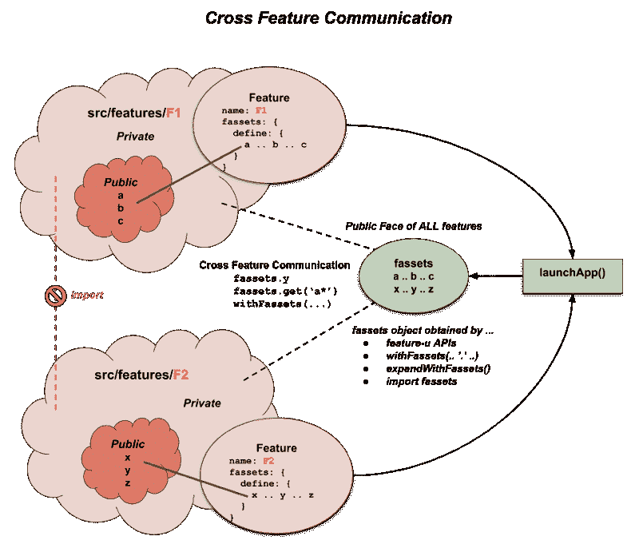**

**`[fassets aspect](https://feature-u.js.org/1.0.1/api.html#fassets)`有一个`define`指令，其中资源被编目。**

**下面是如何定义`fassets`的一个简单例子:**

****feature-u** 从所有活动特性中累加`fassets`，通过`[Fassets object](https://feature-u.js.org/1.0.1/api.html#Fassets)` *(从`[launchApp()](https://feature-u.js.org/1.0.1/api.html#launchApp)`发出)*提升。**

****侧栏**:有几种方法可以获得`Fassets object` *(参见`[Obtaining fassets object](https://feature-u.js.org/1.0.1/crossCommunication.html#obtaining-fassets-object)` )* 。**

**要引用一个`fassets`资源，只需像任何其他对象引用一样取消对它的引用。还有一个可以提供给`[Wildcards](https://feature-u.js.org/1.0.1/crossCommunication.html#wildcards-adding-dynamics)`的`[Fassets.get()](https://feature-u.js.org/1.0.1/api.html#Fassets_get)`方法，返回一个资源数组。**

**这是一个**推动**哲学的例子。在这里，供应商只是公开推广一个资源，让其他特性使用**(接受或拒绝)**。供应商只是说:*“这是我的公众形象”*。**

**你可以在`[Cross Feature Communication](https://feature-u.js.org/1.0.1/crossCommunication.html)`中找到更多关于这个话题的信息。**

### **[基于特征的用户界面组合](#e98c)**

**UI 组件通常是跨越几个特性的子组件的集合。因此， **UI 合成是跨特征交流**中非常重要的一部分。**

**为了支持这一点， **feature-u** 引入了`[withFassets()](https://feature-u.js.org/1.0.1/api.html#withFassets)`高阶组件(HoC ),它将 fasset 属性自动连接到一个组件中。这是 Redux `connect()` *(简化组件对应用状态的访问)*推广的常见模式。**

**下面是一个组件如何访问一个`company.logo` *(由另一个特性定义)*:**

**`[withFassets()](https://feature-u.js.org/1.0.1/api.html#withFassets)` HoC 自动连线通过`[mapFassetsToPropsStruct](https://feature-u.js.org/1.0.1/api.html#mapFassetsToPropsStruct)`钩子将特征资产命名为组件属性。在这个例子中，因为`Logo`属性是一个组件，`MyComponent`可以使用 JSX 简单地引用它。**

**你可以在`[UI Composition](https://feature-u.js.org/1.0.1/crossCommunication.html#ui-composition)`中找到更多关于这个话题的信息。**

### **[资源合同](#e98c)**

**UI 组合通常表示为一个契约，其中一个特性中的组件有一系列注入需求，这些需求将由其他特性提供。**

**`[fassets aspect](https://feature-u.js.org/1.0.1/api.html#fassets)`有额外的构造来促进这种契约安排，允许 **feature-u** 在过程中提供更多的验证。**

**而不是仅仅在一个特性中定义资源并在另一个特性中使用它们:**

*   **一个给定的特征可以使用`fassets.use`指令指定一系列的注射需求。这标识了一组唯一标识这些资源的**注入键**。**
*   **其他特性将通过引用这些相同的**注入键**，使用`fassets.defineUse`指令来提供这些内容。**

**这更多地代表了一种**拉动**的哲学。它给了 **feature-u** 更多的流程知识，允许它验证所提供的资源是正确的。**

**通配符(`*`)可以用来给流程添加额外的动态，允许特性自主地注入它们的内容。**

**这里有一个`main`功能，它从其他功能中引入了一系列子组件*(链接和主体)*:**

****主要特征:****

**因为我们的规范包括通配符，所以一系列定义将匹配！**

**下面是履行使用契约的`MainPage`组件:**

**当`[withFassets()](https://feature-u.js.org/1.0.1/api.html#withFassets)`遇到通配符(`*`时，它仅仅累加所有匹配的定义，并将它们提升为数组。**

**通过这种实现，**任何特性都可以在流程中自动地动态注入自身**！此外，这个动态隐式处理了一个特性被动态禁用的情况**(确实很酷)**！！**

**以下片段摘自为要注入的内容提供定义的其他功能:**

****购物车功能****

****搜索功能****

**两个外部特性(**购物车**和**搜索**)定义了**主**特性所请求的内容。**

**`fassets.defineUse`指令要求资源键匹配一个`fassets.use`特征请求。这是在实施 it 验证时提供**特性-u** 洞察力的合同。**

****侧栏**:因为我们也在处理导航，所以我们将`[react-router](https://reacttraining.com/react-router/)`引入混合(与`Link`和`Route`组件一起)。由于 RR 的 V4 设计，我们的路由也通过组件组合*来处理(更多信息见`[Feature Based Routes](https://feature-u.js.org/1.0.1/featureRouter.html)`)*。**

**你可以在`[UI Composition](https://feature-u.js.org/1.0.1/crossCommunication.html#ui-composition)`中找到更多关于这个话题的信息。**

### **[功能启用](#e98c)**

**通过设置`Feature.enabled`布尔属性*(属于`[Built-In aspects](https://feature-u.js.org/1.0.1/detail.html#built-in-aspects)` )* ，可以动态禁用功能:**

**在这个例子中，就好像`sandbox`特性不存在一样。换句话说**它已经被逻辑删除**。**

**通常，该指标基于一些运行时表达式，允许在应用程序启动过程中动态启用/禁用打包的代码:**

**这种动态在许多不同的情况下都是有用的。例如:**

*   **某些功能可能需要许可证升级**
*   **其他功能可能仅用于诊断目的，默认情况下是禁用的**

**你可以在`[Feature Enablement](https://feature-u.js.org/1.0.1/enablement.html)`中找到更多关于这个话题的信息。**

### **[总之](#e98c)**

**下图总结了 **feature-u** 的基本概念*(如上所述)*:**

**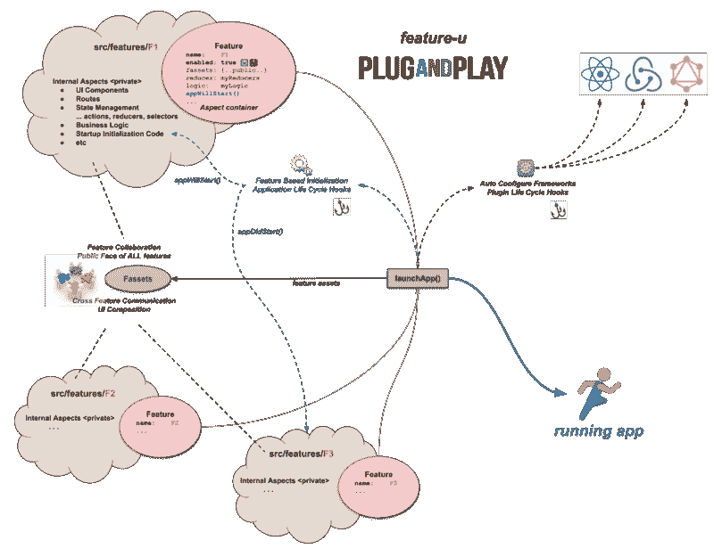**

### **[好处](#e98c)**

**使用 **feature-u** 好处多多！**

****

**从中获得最大好处的两个基本工件是:**

*   **一种正式的方式，通过这种方式，功能可以相互协作 *( `[Cross Feature Communication](http://localhost:4000/crossCommunication.html)` )* ，使它们真正成为**即插即用**
    这包括`[UI Composition](http://localhost:4000/crossCommunication.html#ui-composition)`跨越功能边界的能力。它甚至允许自动注入 UI 内容。这是必须要看到的东西...它很好地展示了**的特性。****
*   **通过以下方式显著减少样板代码:
    自动配置正在使用的框架*(通过插件扩展— `[Extendable aspects](http://localhost:4000/detail.html#extendable-aspects)` )*
    封装在特性*(通过`[Application Life Cycle Hooks](http://localhost:4000/appLifeCycle.html)` )* 内的启动初始化**

**下面列出的好处可以直接联系到为什么开发*(参见:`[Why feature-u?](http://localhost:4000/why.html)`)***功能-u** 的考虑因素。**

1.  ****特性封装:** *隔离特性边界提高了代码的可管理性***
2.  ****特性协作:** *通过明确定义的基于特性的公共接口*促进**跨特性通信****
3.  ****基于特征的 UI 组合:** *便于无缝**跨特征的组件组合*****
4.  ****应用生命周期挂钩:** *特性可以不依赖外部进程自行初始化***
5.  ****功能启用:** *通过运行时开关启用/禁用功能***
6.  ****最小化内嵌代码扩展期间的特征顺序依赖性问题****
7.  *****框架集成:** *通过积累所有功能方面(采用可扩展的 API)自动配置使用的框架(匹配应用程序的运行时堆栈)****
8.  ****UI 组件升级:** *功能可以通过基于功能的路线管理自主升级其 UI 组件***
9.  ****单一事实来源:** *在一个特性的实现中有多种方式可以实现***
10.  ****简化的 app 启动:** *启动一个 App 可以通过一行可执行代码完成！***
11.  ****运行于任何 React 平台** *React Web、React Native、Expo 等。***
12.  ****即插即用:** *可以更方便地添加或删除功能***

****feature-u** 让你**将注意力集中在你的功能的“商业端”！****

**去计算吧！！**

### **[参考文献](#e98c)**

*   **[基于特征的反应开发方法](http://ryanlanciaux.com/blog/2017/08/20/a-feature-based-approach-to-react-development/) *…瑞安·兰奇奥***
*   **如何更好地组织 React 应用程序？*……亚历克西斯·曼金***
*   **[如何在高可伸缩的 javascript 应用上使用 Redux？](https://medium.com/@alexmngn/how-to-use-redux-on-highly-scalable-javascript-applications-4e4b8cb5ef38)*……亚历克西斯·曼金***
*   **[构建 React 应用程序的 100%正确的方法(或者为什么没有这种东西)](https://hackernoon.com/the-100-correct-way-to-structure-a-react-app-or-why-theres-no-such-thing-3ede534ef1ed) *…大卫·吉尔伯森***
*   **[大型 web 应用中状态管理的冗余](https://blog.mapbox.com/redux-for-state-management-in-large-web-apps-c7f3fab3ce9b) *…大卫·克拉克***