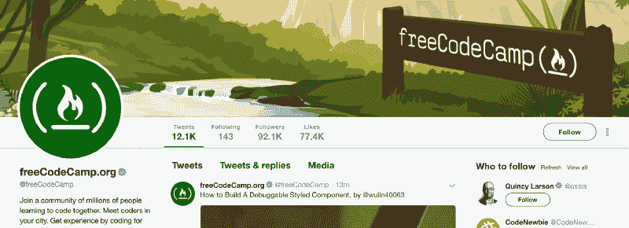
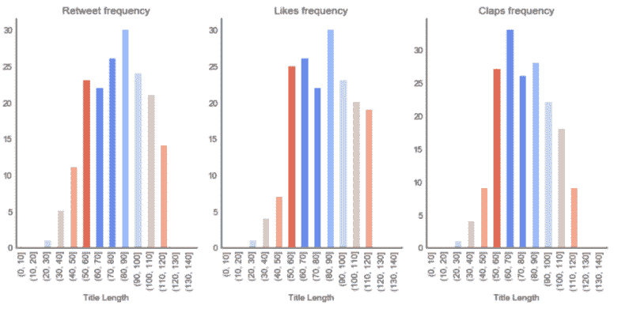
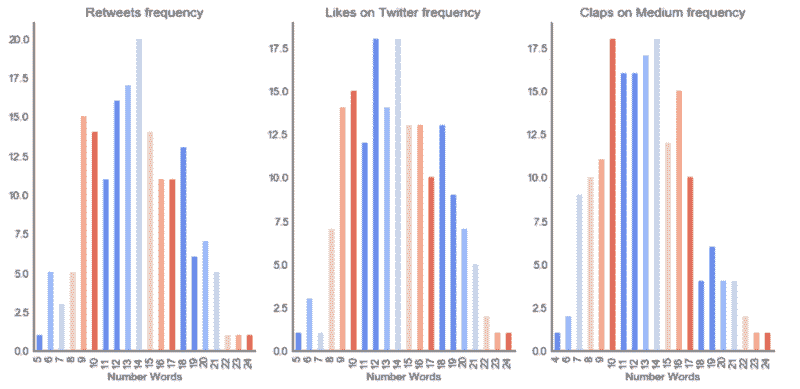
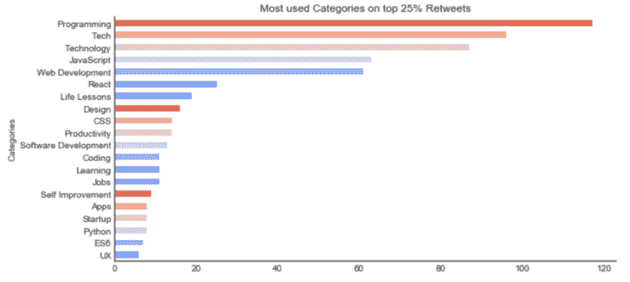
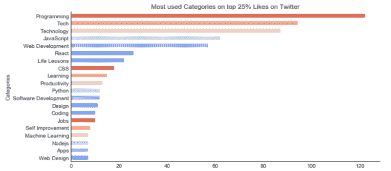
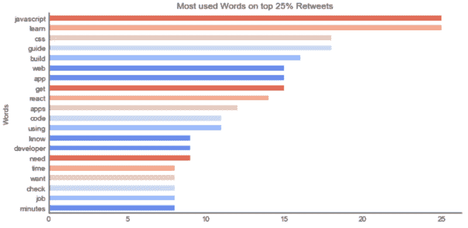
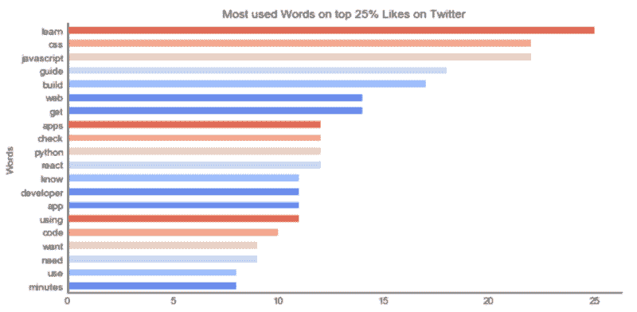
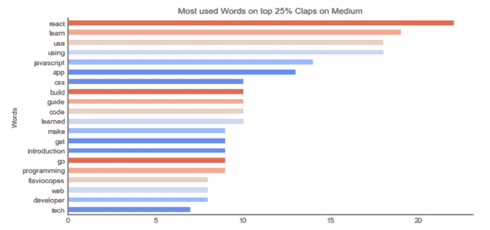

# 如何使用机器学习根据你的文章标题预测喜欢和分享

> 原文：<https://www.freecodecamp.org/news/how-to-predict-likes-and-shares-based-on-your-articles-title-using-machine-learning-47f98f0612ea/>

弗拉维奥·h·弗雷塔斯

# 如何使用机器学习根据你的文章标题预测喜欢和分享

Photo by [Matthew Guay](https://unsplash.com/photos/Q7wDdmgCBFg?utm_source=unsplash&utm_medium=referral&utm_content=creditCopyText) on [Unsplash](https://unsplash.com/search/photos/article?utm_source=unsplash&utm_medium=referral&utm_content=creditCopyText)

为文章选择一个好的标题是写作过程中的重要一步。标题看起来越有趣，读者与整体互动的机会就越高。此外，向用户展示他们更喜欢(与之交互)的内容增加了用户的满意度。

这就是我从[机器学习工程师纳米学位](https://udacity.com/course/machine-learning-engineer-nanodegree--nd009)专业化开始的最后一个项目。刚看完，感觉*好骄傲好开心*？我想和你分享我对整个流程的一些见解。此外，我答应 Q [尤妮西拉森](https://medium.com/@quincylarson)这篇文章，当我完成这个项目。

如果您想查看最终的技术文档[，请点击此处](https://github.com/flaviohenriquecbc/machine-learning-capstone-project/blob/master/final-report.pdf)。如果你想要代码的实现，在这里[查看](https://github.com/flaviohenriquecbc/machine-learning-capstone-project/blob/master/title-success-prediction.ipynb)或者在 [GitHub](https://github.com/flaviohenriquecbc/machine-learning-capstone-project) 上分叉我的项目。如果你只是想用外行人的术语来概括，这是正确的地方——继续阅读这篇文章。

FreeCodeCamp Medium post on Twitter

现在一些最常用的传播思想的平台是 Twitter 和 Medium(你在这里！).在 Twitter 上，文章通常包括外部 URL 和标题，用户可以访问文章，并对原始帖子的赞或转发表示满意。

Medium 显示带有标签的全文(对文章进行分类)和掌声(类似于 Twitter 的赞)，以显示用户对内容的欣赏程度。这两个平台之间的关联可以给我们带来有价值的信息。

### 该项目

我定义的问题是一个使用监督学习的分类任务:*根据标题预测一篇文章收到的赞数和转发数。*

将 Twitter 上的赞数和转发数与一篇媒体文章联系起来，是试图分离读者数量和媒体点击数量的影响。因为这篇文章在不同平台上分享得越多，就会有越多的读者阅读，也就(可能)获得越多的媒体关注。

如果只使用 Twitter 的统计数据，我们预计文章最初会有几乎相同数量的读者(这些读者是 Twitter 上 freeCodeCamp 帐户的追随者)。因此，他们的表现和互动将受限于推文的特征——例如，文章的标题。这正是我们想要衡量的。

我为这个项目选择了 [freeCodeCamp 帐户](https://twitter.com/freecodecamp),因为这个想法是为了限制文章主题的范围，并更好地预测特定领域的响应。同一个头衔在一个类别(如科技)中可以表现出色，但在另一个类别(如烹饪)中就不一定了。此外，该帐户会将原始文章的标题和 URL 作为 tweet 内容发布在 Medium 上。

### 数据看起来怎么样？

这个项目的第一步是从 Twitter 和 Medium 获取信息，然后将它们关联起来。数据集可以在这里找到[，它有 711 个数据点。数据集看起来是这样的:](https://github.com/flaviohenriquecbc/machine-learning-capstone-project/blob/master/dataset/dataset-tweets-final.json)

### 分析和学习数据

在分析了数据集并绘制了一些图形后，我发现了关于它的有趣信息。在这些分析中，**剔除了异常值，**我只考虑了每个功能(转发、喜欢和鼓掌)的 **25%的最佳表现者**。

因此，让我们来看看在媒体上撰写并在 Twitter 上分享的 freeCodeCamp 文章的数字是什么。

#### 什么是好的标题长度？

Title length performance

撰写长度大于 50 个字符且小于 110 个字符的标题有助于增加文章成功的几率。

#### 题目字数多少比较好？

Number of words performance

题目中最有效的字数是 **9 到 17** 。为了优化转发和赞的数量，尝试 9 到 18 个单词，7 到 17 个掌声。

#### 哪些类别最适合标记？

**编程**、**技术**、**技术**、 **JavaScript** 和 **Web 开发**是你在标记下一篇文章时应该考虑的类别。对于所有这三个特征来说，它们都是一个很好的指示器。

#### 哪些是最好用的词？

在这个词法分析中，你会注意到一些单词在 freeCodeCamp 社区中比其他的得到了更多的关注。如果目的是让文章达到更高的数量，谈论 JavaScript、React 或 CSS 会增加它的受欢迎程度。用“学”或者“导”这样的词来形容，也会让概率更高。

### 使用机器学习

好吧！在查看数据并从中提取一些信息后，目标是创建一个机器学习模型，根据文章的标题预测转发、喜欢和鼓掌的数量。

预测一篇文章的转发、喜欢和鼓掌的数量可以被视为一个分类问题，这是机器学习(ML)的一项常见任务。但为此，我们需要将输出作为离散值(一系列数字)。输入将是文章的标题，每个单词作为一个令牌(t1，t2，t3，… tn)，标题长度和标题中的字数。

我们的功能范围包括:

*   转发次数:0–10，10–30，30 以上
*   喜欢:0-25 岁，25-60 岁，60 岁以上
*   鼓掌:0–50，50–400，400+

最后，在预处理我们的数据集和评估一些模型(所有内容都在此处详细描述)后，我们得出结论，MultinomialNB 模型对转发的表现更好，准确率达到 60.6%。对于喜欢和鼓掌，逻辑回归达到 55.3%和 49%。

作为本文的一个实验，我运行了本文标题的预测，模型预测:

它将在 Twitter 上有 10-30 次转发，25-60 次收藏，在 Medium 上有 400 多次鼓掌。

这个预测怎么样？？

[*关注我*](https://medium.com/@flaviohfreitas) *如果想看更多我的文章*？如果你喜欢这篇文章，一定要喜欢它，给我很多掌声——它对作者来说意味着整个世界。

Flávio H. de Freitas 是一名企业家、工程师、技术爱好者、梦想家和旅行家。先后在**【巴西】**【硅谷】和欧洲**担任 **CTO** 。**