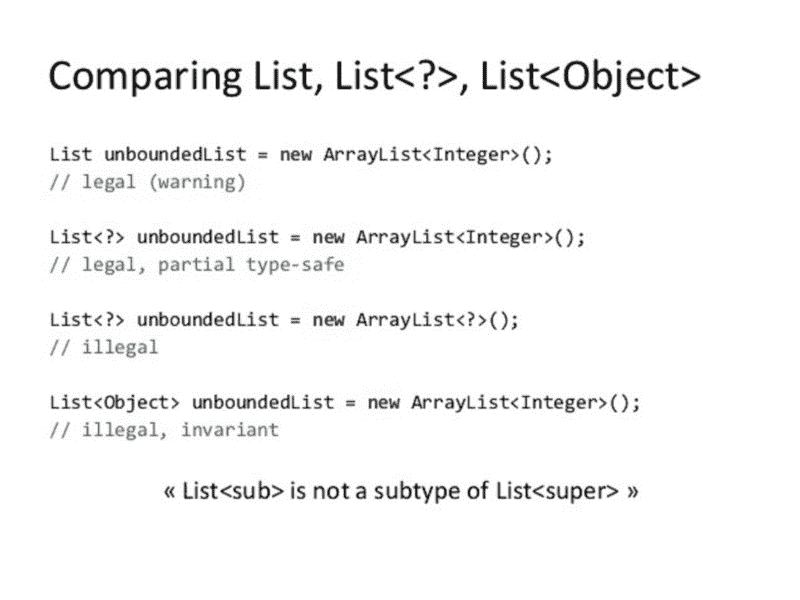

# Java 中泛型类型的介绍:协变和逆变

> 原文：<https://www.freecodecamp.org/news/understanding-java-generic-types-covariance-and-contravariance-88f4c19763d2/>

作者:费边·泰尔

# Java 中泛型类型的介绍:协变和逆变



### 类型

Java 是一种静态类型的语言，这意味着在使用它之前，您必须首先声明一个变量及其类型。

例如:`int myInteger = 42;`

输入通用类型。

#### 泛型类型

[定义](https://docs.oracle.com/javase/tutorial/java/generics/types.html):"一个*泛型类型*是一个泛型类或接口，它在类型上被参数化。"

本质上，泛型类型允许您编写一个通用的泛型类(或方法),它可以处理不同的类型，允许代码重用。

不是将`obj`指定为`int`类型，或者`String`类型，或者任何其他类型，而是定义`Box`类来接受类型参数`<`；T >。然后，您可以使用 T 来表示您类中任何部分的泛型类型。

现在，输入协方差和逆变。

### 协方差和逆变

#### 定义

方差指的是更复杂类型之间的子类型化与它们的组件之间的子类型化的关系([源](https://en.wikipedia.org/wiki/Covariance_and_contravariance_(computer_science)))。

协方差和逆变的一个容易记住(也非常不正式)的定义是:

*   协方差:接受子类型
*   逆变:接受超类型

#### 数组

在 Java 中，**数组是协变的**，这有两层含义。

首先，`T[]`类型的数组可能包含`T`类型的元素及其子类型。

```
Number[] nums = new Number[5];nums[0] = new Integer(1); // Oknums[1] = new Double(2.0); // Ok
```

其次，如果`S`是`T`的子类型，那么`S[]`类型的数组就是`T[]`的子类型。

```
Integer[] intArr = new Integer[5];Number[] numArr = intArr; // Ok
```

但是，一定要记住:(1) `numArr`是引用类型`Number[]`对“实际类型”`Integer[]`的“实际对象”`intArr`的引用。

因此，下面的代码行可以很好地编译，但是会产生一个运行时`ArrayStoreException`(因为堆污染):

```
numArr[0] = 1.23; // Not ok
```

它会产生一个运行时异常，因为 Java 在运行时知道“实际对象”`intArr`实际上是一个数组`Integer`。

#### 无商标消费品

对于泛型类型，由于类型擦除，Java 无法在运行时知道类型参数的类型信息。因此，它不能在运行时防止堆污染。

因此，泛型是不变的。

```
ArrayList<Integer> intArrList = new ArrayList<>();ArrayList<Number> numArrList = intArrList; // Not okArrayList<Integer> anotherIntArrList = intArrList; // Ok
```

类型参数必须完全匹配，以防止堆污染。

但是输入通配符。

#### 通配符、协方差和逆变

有了通配符，泛型就有可能支持协方差和逆变。

调整前一个例子，我们得到这个，这是可行的！

```
ArrayList<Integer> intArrList = new ArrayList<>();ArrayList<? super Integer> numArrList = intArrList; // Ok
```

问号“？”指代表未知类型的通配符。它可以是下界的，这将未知类型限制为特定类型或其超类型。

因此，在第 2 行中，`? super Integer`翻译为“任何整数类型或其超类型”。

您还可以使用`? extends Integer`对通配符进行上限限制，将未知类型限制为特定类型或其子类型。

#### 只读和只写

协方差和逆变产生一些有趣的结果。协变类型是只读的，逆变类型是只写的。

记住协变类型接受子类型，所以`ArrayList<? extends Numb` er >可以包含任何属于 `of a` 数字类型或其子类型的对象。

在这个例子中，第 9 行是有效的，因为我们可以确定无论我们从 ArrayList 中得到什么都可以被转换成一个`Number`类型(因为如果它扩展了`Number`，根据定义，它*是一个* `Number`)。

但是`nums.add()`不起作用，因为我们无法确定对象的“实际类型”。我们只知道它一定是一个`Number`或者它的子类型(比如 Integer，Double，Long 等。).

对于逆变，反过来也是正确的。

第 9 行是可行的，因为我们可以确定无论对象的“实际类型”是什么，它都必须是`Integer`或它的父类型，从而接受一个`Integer`对象。

但是第 10 行不行，因为我们不能确定我们会得到一个`Integer`。例如，`nums`可以引用`Objects`的数组列表。

#### 应用程序

因此，由于协变类型是只读的，逆变类型是只写的(不严格地说)，我们可以推导出以下经验法则:**“生产者扩展，消费者超”**。

生成类型为`T`的对象的类似生产者的对象可以是类型参数`<? extends` T >的对象，而消费类型为T 的对象的类似消费者的对象可以是类型 para `meter <?` super T >的对象。