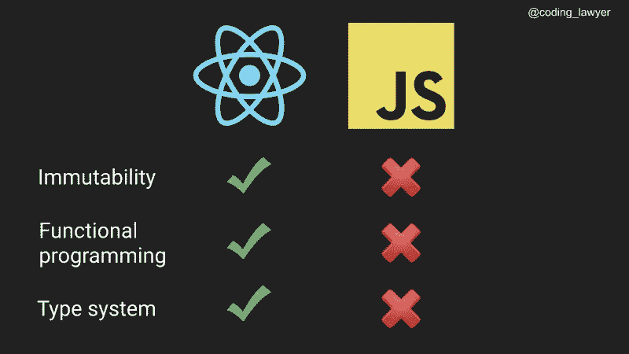
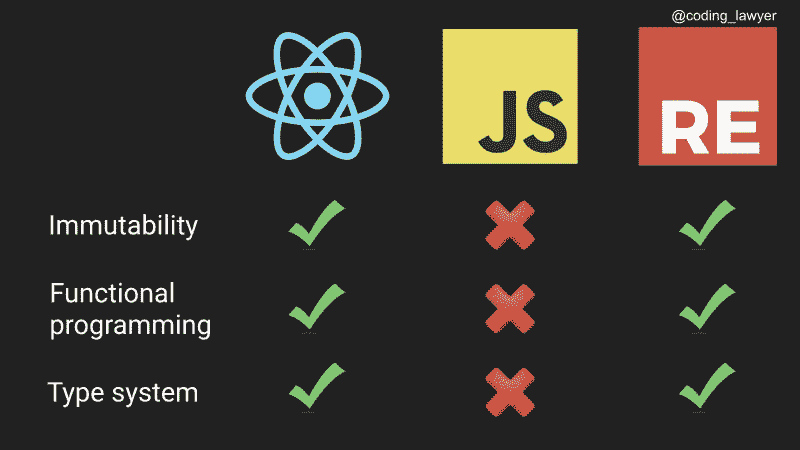
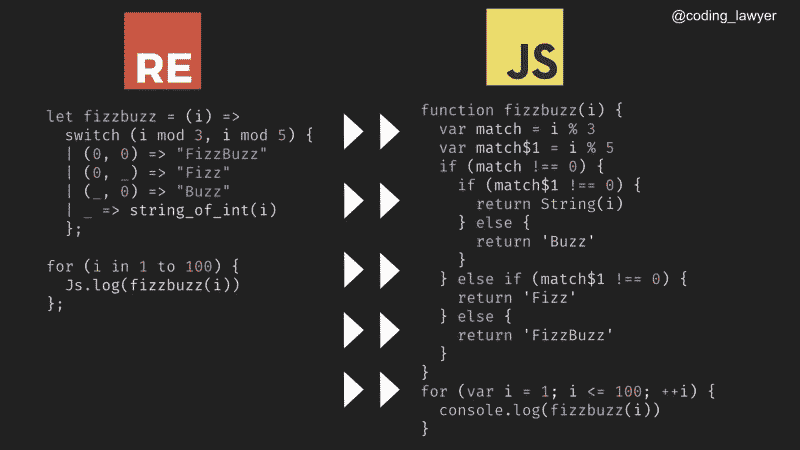
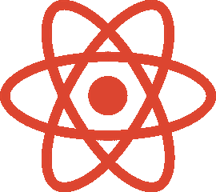
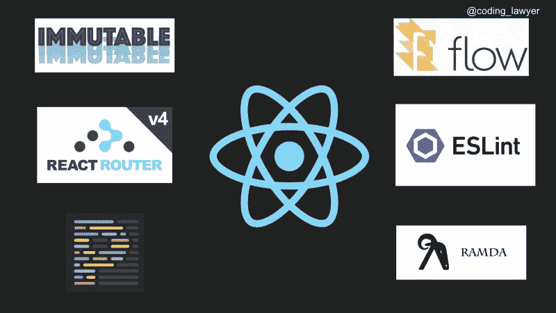
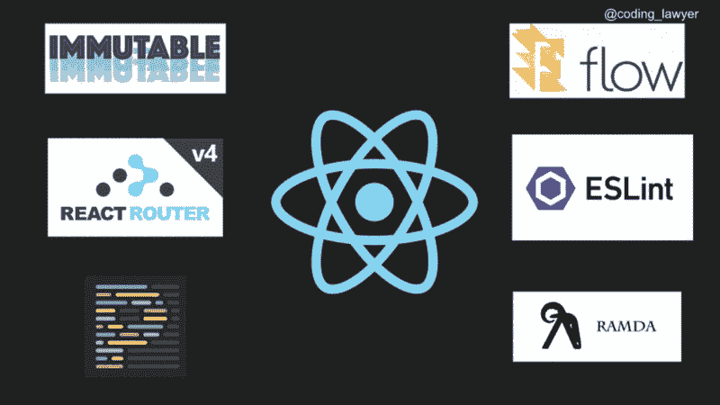

# 嘶！这就是为什么 ReasonReact 是编写 React 的最佳方式

> 原文：<https://www.freecodecamp.org/news/psst-heres-why-reasonreact-is-the-best-way-to-write-react-5088d434d035/>

你在使用 [React](https://reactjs.org/) 来构建用户界面吗？我也是。现在，您将了解为什么应该使用 ReasonML 编写 React 应用程序[。](https://medium.freecodecamp.org/learn-reasonml-by-building-tic-tac-toe-in-react-334203dd513c)

React 是一种非常酷的编写用户界面的方式。但是，我们能让它更酷吗？好些了吗？

为了使它变得更好，我们需要首先确定它的问题。那么，React 作为 JavaScript 库的主要问题是什么？

### **React 最初并不是为 JavaScript 开发的**

如果你仔细看看 React，你会发现它的一些主要原则对 JavaScript 来说是陌生的。让我们来谈谈不变性，函数式编程原则，特别是类型系统。

不变性是 React 的核心原则之一。你不想改变你的道具或状态，因为如果你这样做，你可能会经历不可预知的后果。在 JavaScript 中，我们没有现成的不变性。我们通过约定保持我们的数据结构不可变，或者我们使用像 [immutableJS](https://facebook.github.io/immutable-js/) 这样的库来实现它。

React 基于函数式编程的原则，因为它的应用是函数的组合。尽管 JavaScript 有一些这样的特性，比如一流的函数，但它不是函数式编程语言。当我们想写一些漂亮的声明性代码时，我们需要使用外部库，如 [Lodash/fp](https://github.com/lodash/lodash/wiki/FP-Guide) 或 [Ramda](https://ramdajs.com/) 。

那么，类型系统是怎么回事？在 React 中，我们有[个属性类型](https://reactjs.org/docs/typechecking-with-proptypes.html)。我们用它们来模仿 JavaScript 中的类型，因为它本身不是静态类型语言。为了利用高级静态类型，我们再次需要使用外部依赖，例如[流](https://flow.org/)和[类型脚本](https://www.typescriptlang.org/)。



React, and JavaScript comparison

如你所见， **JavaScript 与 React 的核心原则不兼容。**

有没有比 JavaScript 更兼容 React 的编程语言？

幸运的是，我们有理由。

从道理上讲，我们从盒子里得到了不变性。因为它是基于函数式编程语言 OCaml 的，所以我们也在语言中内置了这些特性。理性本身也为我们提供了一个强类型系统。



React, JavaScript, and Reason comparison

理性与 React 的核心原则是兼容的。

### 理由

它不是一种新语言。它是 OCaml 的一种替代的类似 JavaScript 的语法和工具链，OCaml 是一种已经存在了 20 多年的函数式编程语言。Reason 是由已经在他们的项目中使用 OCaml 的脸书开发人员创建的( [Flow，](https://github.com/facebook/flow) [Infer](https://github.com/facebook/infer) )。


Reason 具有类似 C 的语法，使得来自主流语言(如 JavaScript 或 Java)的人可以接近 OCaml。它为你提供了更好的文档(与 OCaml 相比)和一个围绕它的不断发展的社区。此外，它使得与您现有的 JavaScript 代码库集成更加容易。


OCaml 是 Reason 的支持语言。Reason 与 OCaml 具有相同的语义——只是语法不同。这意味着您可以使用 Reason 的类似 JavaScript 的语法来编写 OCaml。因此，您可以利用 OCaml 出色的特性，比如它的强类型系统和模式匹配。

让我们来看一个 Reason 语法的例子。

```
let fizzbuzz = (i) =>
  switch (i mod 3, i mod 5) {
  | (0, 0) => "FizzBuzz"
  | (0, _) => "Fizz"
  | (_, 0) => "Buzz"
  | _ => string_of_int(i)
  };
for (i in 1 to 100) {
  Js.log(fizzbuzz(i))
};
```

尽管我们在这个例子中使用了模式匹配，但它仍然非常类似于 JavaScript，对吗？

然而，浏览器唯一可用的语言仍然是 JavaScript，这意味着我们需要编译它。

#### BuckleScript


Reason 的强大特性之一是 [BuckleScript 编译器](https://bucklescript.github.io/)，它获取你的 Reason 代码，并将其编译成可读的、高性能的 JavaScript，同时极大地消除了死代码。如果你在一个不是每个人都熟悉 Reason 的团队中工作，你会欣赏它的可读性，因为他们仍然能够阅读编译后的 JavaScript 代码。

与 JavaScript 的相似性是如此之近，以至于 Reason 的一些代码根本不需要被编译器修改。因此，您可以享受静态类型语言的好处，而无需对代码进行任何更改。

```
let add = (a, b) => a + b;add(6, 9);
```

这在 Reason 和 JavaScript 中都是有效的代码。

BuckleScript 自带四个库:名为 [Belt](https://bucklescript.github.io/bucklescript/api/Belt.html) ( [OCaml 标准库不足](https://discuss.ocaml.org/t/what-is-the-preferable-solution-for-the-role-of-standard-library/1092))的标准库，以及对 JavaScript、Node.js 和、DOM APIs 的绑定。

因为 BuckleScript 是基于 OCaml 编译器的，所以你会得到[一个快得惊人的编译](https://bucklescript.github.io/docs/en/build-performance)，它比 Babel 快得多，比 TypeScript 快好几倍。

让我们用 JavaScript 编译我们的 FizzBuzz 算法。



Reason’s code compilation to JavaScript through BuckleScript

如您所见，最终的 JavaScript 代码可读性很好。好像是 JavaScript 开发者写的。

Reason 不仅可以编译成 JavaScript，还可以编译成本机代码和字节码。因此，您可以使用 Reason 语法编写一个应用程序，并能够在 MacOS、Android 和 iOS 手机上的浏览器中运行它。有一个游戏叫做[引力子](https://github.com/jaredly/gravitron)是由 Jared Forsyth 用 Reason 编写的，它可以在我刚才提到的所有平台上运行。

#### JavaScript 互操作

BuckleScript 还为我们提供了 JavaScript [互操作性](https://en.wikipedia.org/wiki/Interoperability)。您不仅可以将您的工作 JavaScript 代码粘贴到您的原因代码库中，而且您的原因代码还可以与 JavaScript 代码进行交互。这意味着您可以轻松地将原因代码集成到现有的 JavaScript 代码库中。此外，您可以在自己的原因代码中使用来自 NPM 生态系统的所有 JavaScript 包。例如，您可以在单个项目中将 Flow、TypeScript 和 Reason 结合在一起。

然而，事情没那么简单。要在 Reason 中使用 JavaScript 库或代码，首先需要通过 Reason 绑定将其移植到 Reason。换句话说，您需要为您的非类型化 JavaScript 代码提供类型，以便能够利用 Reason 的强类型系统。

每当您需要在原因代码中使用 JavaScript 库时，请通过浏览原因包索引( [Redex](https://redex.github.io/) )数据库来检查该库是否已经移植到了 Reason。这是一个集合了用 Reason 编写的不同库和工具以及带有 Reason 绑定的 JavaScript 库的网站。如果您在那里找到了您的库，您可以将它作为一个依赖项安装，并在您的 Reason 应用程序中使用它。

然而，如果您没有找到您的库，您将需要自己编写原因绑定。如果您刚刚开始使用 rational，请记住，编写绑定不是您想要开始做的事情，因为这是 rational 生态系统中更具挑战性的事情之一。

还好我只是在写一篇关于写理由绑定的帖子，敬请关注！

当您需要 JavaScript 库中的一些功能时，您不需要为整个库编写原因绑定。您只能对您需要使用的功能或组件这样做。

### 理性反应

这篇文章是关于编写 React in Reason 的，多亏了 [ReasonReact 库](https://reasonml.github.io/reason-react/)你才能做到。

也许你现在在想“我仍然不知道为什么我应该使用 React in Reason。”

我们已经提到了这样做的主要原因——Reason 比 JavaScript 更兼容 React。为什么更兼容？因为 React 是为 Reason 开发的，或者更准确地说，是为 OCaml 开发的。

#### 理性之路


React 的第一个原型由脸书开发，用标准元语言( [StandardML](https://en.wikipedia.org/wiki/Standard_ML) )编写，是 OCaml 的表亲。然后，它被转移到 OCaml。React 也被转录成 JavaScript。

这是因为整个网络都在使用 JavaScript，说“现在我们要用 OCaml 构建 UI”可能是不明智的。这很有效 JavaScript 中的 React 已被广泛采用。

因此，我们开始习惯于作为一个 JavaScript 库来反应。与其他库和语言一起反应——[Elm](https://elm-lang.org/)、 [Redux](https://redux.js.org/) 、 [Recompose](https://github.com/acdlite/recompose) 、 [Ramda](https://ramdajs.com/) 和[pure script](http://www.purescript.org/)——让 JavaScript 中的函数式编程大行其道。随着[流](https://flow.org/)和[类型脚本](https://www.typescriptlang.org/)的兴起，静态类型也开始流行起来。结果，静态类型的函数式编程范式成为前端世界的主流。

2016 年，[彭博](https://www.bloomberg.com/company/announcements/open-source-at-bloomberg-introducing-bucklescript/)开发并开源了 BuckleScript，这是一个将 OCaml 转换为 JavaScript 的编译器。这使得他们能够使用 OCaml 的强类型系统在前端编写安全的代码。他们使用优化的、速度惊人的 OCaml 编译器，将其后端生成的本机代码替换为 JavaScript 生成代码。

函数式编程的流行和 BuckleScript 的发布为脸书回到 React 的最初想法创造了理想的环境，React 最初是用 T2 的 ML 语言编写的。



ReasonReact

他们采用了 OCaml 语义和 JavaScript 语法，并创造了 Reason。他们还创建了 React 周围的 Reason wrapper——Reason React 库——以及额外的功能，比如在有状态组件中封装 Redux 原则。通过这样做，他们将[回复到了它最初的根源](https://news.ycombinator.com/item?id=15209704)。

#### 理性反应的力量

当 React 进入 JavaScript 时，我们通过引入各种库和工具来调整 JavaScript 以满足 React 的需求。这也意味着我们的项目有更多的依赖性。更不用说这些库仍在开发中，并且会定期引入突破性的变化。因此，您需要在项目中小心维护这些依赖关系。

这给 JavaScript 开发增加了另一层复杂性。

典型的 React 应用程序将至少具有这些依赖性:



*   静态类型—流/类型脚本
*   不变性——不变性
*   路由—路由器
*   格式—更漂亮
*   林挺—埃斯林
*   辅助函数— Ramda/Lodash

现在让我们把 JavaScript React 换成 ReasonReact。

我们还需要所有这些依赖吗？



*   静态类型化— **内置**
*   不变性— **内置**
*   路由— **内置**
*   格式化— **内置**
*   林挺— **内置**
*   助手功能— **内置**

你可以在我的另一篇文章中了解更多关于这些内置特性的信息。

在 ReasonReact 应用程序中，您不需要这些和许多其他依赖项，因为许多使您的开发更容易的关键特性已经包含在语言本身中了。因此，维护您的包将变得更容易，并且您不会随着时间的推移而增加复杂性。

这要感谢 OCaml，它已经有 20 多年的历史了。这是一种成熟的语言，它的所有核心原则都已经到位并且稳定。

### 总结

起初，理性的创造者有两种选择。利用 JavaScript 并设法使它变得更好。通过这样做，他们还需要处理它的历史负担。

然而，他们走了一条不同的道路。他们认为 OCaml 是一种成熟的语言，具有很高的性能，并对其进行了修改，使其类似于 JavaScript。

React 也是基于 OCaml 的原则。这就是为什么当你合理地使用它时，你会得到更好的开发者体验。React in Reason 代表了构建 React 组件的一种更安全的方式，因为强类型系统支持您，您不需要处理大多数 JavaScript(遗留)问题。

### 下一步是什么？


如果您来自 JavaScript 世界，那么使用 Reason 会更容易，因为它与 JavaScript 的语法很相似。如果你一直在 React 中编程，那对你来说会更容易，因为你可以使用你所有的 React 知识作为推理 React 与 React 有相同的心智模型和非常相似的工作流程。这意味着你不需要从头开始。随着你的成长，你会学会讲道理的。

在你的项目中开始使用 rational 的最好方式是增量式的。我已经提到过，你可以在 JavaScript 中使用 Reason 代码，反之亦然。你可以用 ReasonReact 做同样的事情。您将 ReasonReact 组件用于 React JavaScript 应用程序，反之亦然。

脸书的开发者选择了这种渐进式方法，他们在 Facebook Messenger 应用程序的开发中广泛使用了 rational。

如果你想用 React in Reason 构建一个应用程序，并以一种实用的方式学习 React in Reason 的基础知识，请查看我的另一篇文章[我们将一起构建一个井字游戏。](https://medium.freecodecamp.org/learn-reasonml-by-building-tic-tac-toe-in-react-334203dd513c)

如果您有任何问题、批评、意见或改进建议，欢迎在下面写评论或通过 [Twitter](https://twitter.com/coding_lawyer) 或[我的博客](https://www.codinglawyer.io/)联系我。