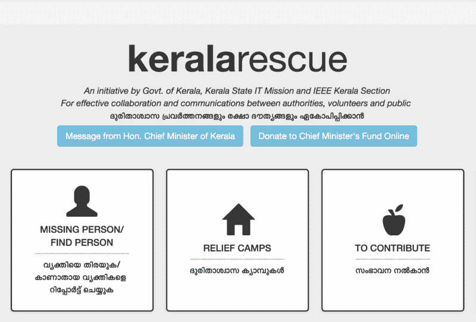
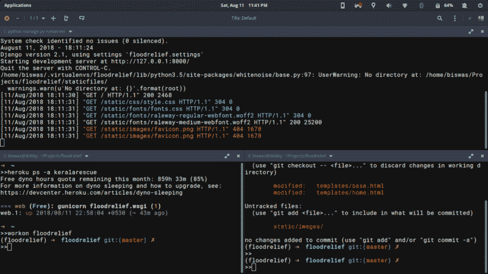
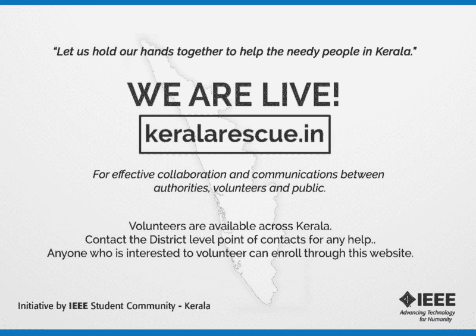
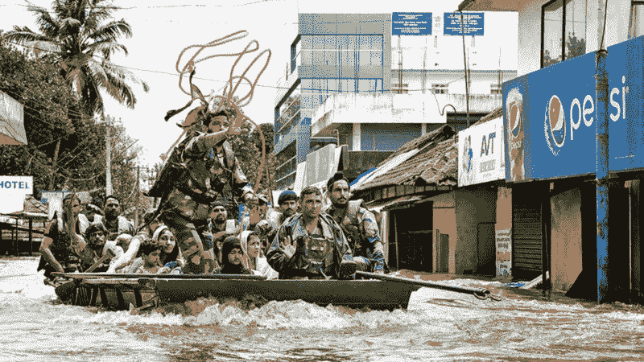
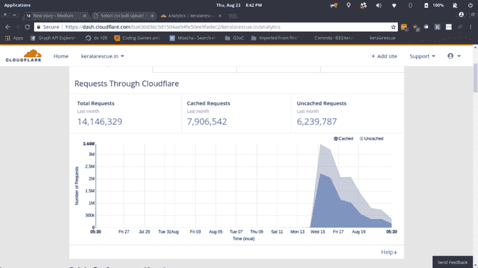
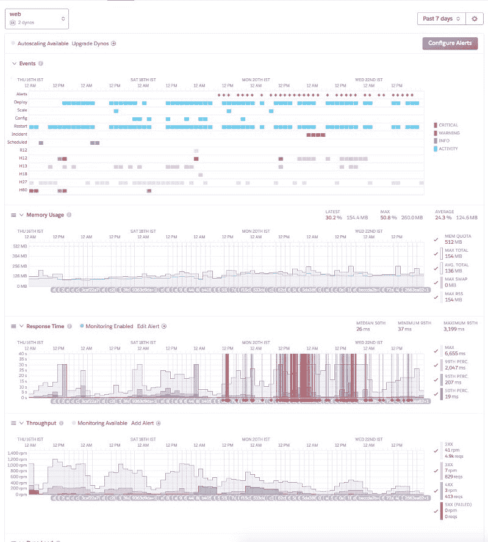
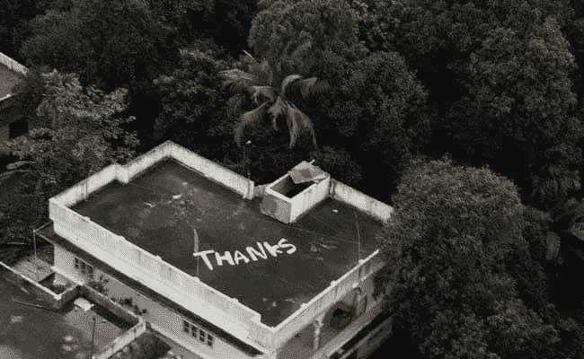

# 在风暴眼:我如何在灾难性的喀拉拉邦洪水中帮助救人

> 原文：<https://www.freecodecamp.org/news/at-the-eye-of-the-flood-5ddec61a87b8/>

作者比斯瓦斯

# 在风暴眼:我如何在灾难性的喀拉拉邦洪水中帮助救人



Image source: [https://keralarescue.in/](https://keralarescue.in/)

这是我对喀拉拉邦经历的最严重的自然灾害的看法，以及我如何能够帮助建立一个伟大社区的基础。这是一次既令人羞愧又充满挑战的经历。

声明:我已经尽了最大努力来交叉检查这篇文章中的数据。但是我不保证这些信息的完整性、可靠性和准确性。

#### 2018 年 8 月 11 日

我从大学宿舍回到了我在帕拉卡德的家。帕拉卡德和喀拉拉邦的许多其他地区刚刚经历了历史上最严重的洪水。但这仅仅是开始。我一点也不知道将要发生什么。

IEEE 喀拉拉邦分会组织的全喀拉拉邦学生大会被取消。Whatsapp 小组讨论了我们可以做些什么来帮助受洪水影响的人们。因此，我们决定建立一个网站。我开始在 Django 应用上工作。

来自 SEMT 的 Muralidaran Manningal 先生也参加了 IEEE，他给出了网站基本版本的要求。当时的要求很简单:

1.将有一个表格，人们或营地可以指定他们的需求，如水，药物等。

2.将有一个联系表格，列出每个地区的 2 或 3 人的信息，他们将协调努力。

3.任何愿意提供帮助的志愿者都应该能够查看他们附近各个地方需要的所有物品。

4.已经被处理的需求应该被标记为完整的，这样就不会有太多的重叠

我在那天午夜前交付了网站。我记得我把我的外壳截图作为我的 WhatsApp 状态发布，只是为了看起来酷一点。



对我来说，这是一个历史里程碑的诞生。这成为一个前所未有的合作平台，在 14 小时内完成。最低可行产品已推出！



The first poster shared among student communities

#### 2018 年 8 月 12 日

我们开始收到地区范围的要求。我记得 Palakkad 和 Ernakulam 县政府是第一批登上平台的。IEEE 在每个地区发起 WhatsApp 团体来动员志愿者，这些团体后来成为喀拉拉邦各地年轻勤劳的人们的控制中心。起初，我们有 3 个 POC，他们都是学生，负责收集资源并把它们送到官方的地区收集中心。

第一个请求来自 Pathanamthitta——要 10 升水。

网站慢慢开始在社交媒体上传播。我记得看到喀拉拉邦警察，一堆名人，最后我们的首席部长分享网站。对于一个一无所知的 B.Tech 家伙来说，这是一个激动人心的时刻，他仍然不知道这将是一次多么戏剧性、可怕而又激动人心的经历。



我们在一个叫做 Heroku 的云平台上运行免费计划。我选择了 Heroku，因为它有一个免费的启动计划，设置起来非常简单，而且我们仍然可以在需要的时候使用大型设备。但最重要的是，我以前部署过大约 4 个 Heroku 应用程序，我对它很熟悉。最终，我们知道我们可能不得不付费或者转移到另一个免费的云平台。

有一些从 Heroku 转移到国家数据中心的想法，因为前者对我们来说是免费的。后来，考虑到在一台空的 Linux 机器上安装会损失工时，这种方法被废弃了。在这样的关键任务场景中，每一分钟都很重要，Heroku 是我的最佳选择。我记得这是我的口号:

> 饭桶推 heroku 主人

在我之前的一些 Heroku 项目中，我会对我的弟弟说这句话。在这个项目中，由于工作的敏捷特性，我经常使用这个命令。(抱歉 CI/CD 爱好者，我们是后来才设置的。)

我们达到了 Heroku 的自由层数据库的 10K 行限制。这是我最担心的事情之一。一点点维护(持续到 IST 时间凌晨 1 点)和一些 shell 命令之后，多亏了 AWS 和它的免费积分，我们才开始运行——所以我们把数据库转移到了 AWS！

第二天，情况变得更加糟糕。来自兰妮等地的请求加剧了压力。我们必须做点什么…



At the time of finishing this, the site had 1.8 Crore+ total page requests and 10 Lakh+ unique visitors.

#### 2018 年 8 月 16 日起

### 我们开源社区的开始

这个时候有人流传了一条 WhatsApp 的消息。它说我们收到了大量的请求，需要帮助。这的确是真的！社区开始提出问题并增加改进。坦率地说，我被那天接到的电话数量吓坏了。

[**Hi all Issue # 92 IEEE Kerala section/rescue Kerala**](https://github.com/IEEEKeralaSection/rescuekerala/issues/92)
[*你好，pr 数和问题数刚刚爆炸了。我们时间不多了。请在下面列出，我们的开发者…*github.com](https://github.com/IEEEKeralaSection/rescuekerala/issues/92)

GitHub 上的上述问题是启动社区参与的第一件事。一切都呈指数级增长(甚至是公开的问题和陈旧的公关)。

Vignesh Hari 指出，在我们的请求部分，我们开始得到严肃的东西:

> ೟岿﹞簄﹞﹞簈﹞簈﹞﹞﹞簈﹞簈﹞簈﹞簈﹞簈﹞ಹ簕﹞簕﹞簕﹞簈﹞﹞簈﹞﹞簈﹞簈﹞簈﹞簈﹞ಹ簕﹞簕﹞簕﹞﹞篩﹞簈﹞簈﹞簈﹞簈﹞簈﹞೟岿﹞簄﹞簈﹞﹞篩﹞簈﹞﹞簈﹞簈﹞簈﹞簈﹞簈﹞簈﹞簈﹗೟岿﹞簄﹞簈﹞簈﹞﹞簈﹞﹞簈﹞簈﹞簈﹞簈﹞.

```
Translation: Me, my newborn, my father and mother, my uncle and my aunt are trapped in our house. The ground floor is flooded.. we cant escape via road too... Our house is near the Pamba river. Water level is increasing dangerously. Please, someone help us...
```

这是一个这样的请求。从那一刻起，我开始与自己的身心抗争，尽我所能做到最好。人们依赖于我编码的东西的想法给了我很大的打击，它让我做了一些否则我永远不会做的事情。

我们中的一些人连续三天每天工作 21 小时。我凌晨 3 点睡觉，6 点醒来，没有闹钟。就好像我的生理节奏变得有知觉，并控制了局面。据我所知，少数志愿者做出了如此非凡的努力，而社区的其他人却没有发现。这需要 10 到 12 天不间断的工作。从那以后，事情开始稳定下来。

这些天，社区也在不停地工作。总有人从地球的某个角落监视着我们的 Heroku 仪表盘，如果有不好的事情要发生，他会叫醒我。

我们的应用在 24x7 危机的高峰期表现得非常好。我们在开发和代码审查中非常小心——但是我承认我在开始时没有进行适当的代码审查就做了一些愚蠢的 PR 合并。



在外人看来，我们的 Slack 组可能看起来很乱——不同的频道讨论着各种“胡言乱语”。这里有生产性的工作吗？是啊！这个社区最棒的地方是混乱中的美丽。对于我的工作量，我不能只是应付懈怠。尽管如此，社区还是找到了自己的路。就像一群蚂蚁搭建的建筑一样，他们做出了令人惊叹的东西。Devops、DataViz、analytics，各种各样的东西都在那里发生。

人们曾问我，即使有许多类似功能的网站，KeralaRescue 是如何成为№1 应用程序的？这主要是由于政府的官方认可。我们之所以能做到这一点，只是因为我们起步很早，当时还没有人开始做这样的网站。另一个原因是它推出得非常快。最后，这都是关于社区的。正是这个社区创造了奇迹——它建立在人类灵魂的力量和帮助他人的同情心之上。

让它开源是我非常自豪的另一个决定。该网站从第 0 天开始就是开源的。

我曾经读到过开源的力量，以及它如何彻底改变了许多类似的事件，但说实话，我甚至没有想太多。我刚刚推了 Git！因为开源是我大脑中配置的默认选项，就像喀拉拉邦的很多其他学生一样。这可能是因为我们在学校熟悉 Ubuntu 之类的东西。感谢教育部门让这一切发生，而印度的许多其他邦仍然依赖于专有软件。

除了开源的好处，我们还看到了开放数据可以实现的奇迹。我们的数据被全球的志愿者用于 IVRs，可视化等等。开放数据的影响在这里显而易见。有一件事我希望能回到过去改变，那就是实现合适的 API。像 https://data.gov.in/这样的项目有很大的潜力。

### 技术

正如我提到的，数据库被转移到 AWS，只是因为我们有免费的信用。后来，DevOps 的一位核心工程师指出，将数据库与应用程序放在一起有其优势。所以我们后来搬回了 Heroku(他们最后给了我们免费学分！).

我想到的一个要点是:不要阻塞请求-响应循环。我们遇到了诸如缓慢的 API 调用(用于发送短信)之类的阻碍循环的事情。这种调用在代码审查中被识别。我们增加了一个 Redis 队列，这对向前发展有很大帮助。所有 CSV 导入都是通过 Redis 队列进行的。看到 RQ 处理数据，而我们的应用程序 dynos 处理请求，这很令人满意。

我们有一个名为/data 的端点，用于填充救援地图。该地图后来被移除。但是/数据停留了一段时间。当请求数据增长(最终达到 51K)时，它开始降低服务器的速度。我们试着给它编页码，后来把它删除了。/data 在危机时刻做得很好。使数据随时可用使 keralafights、saakhi 和 myoperator powered call centres 等各种团体很容易确定请求的优先次序，并通过 IT Mission 将它们传递给各种机构。

社区有多个类似 Ushahidi 和 Sahana 的平行努力。Ushahidi 的数据导入极其缓慢。现有的数据需要移植到 Ushahidi，这样我们才能使用它。其中一个开发者最终提交了一个上游补丁，加速了 40%!但是，我们最终没有同时使用它们。

### 未来的教训

全球变暖和对我们的山脉、河流和山谷的破坏将在不久的将来适得其反。不幸的是，这可能不是马来人一生中经历的唯一一次自然灾害。

> 不读历史的人注定会重复历史——乔治·桑塔亚纳

可持续发展应该付诸实施，而不仅仅停留在教科书上。我认为，由于我们的地理条件，这是喀拉拉邦唯一的发展形式。

理想情况下，我们的灾害管理应该利用现代技术的力量。随时可以部署的技术解决方案应该随时可用。政府应做出努力，利用现有的志愿者力量将 KeralaRescue 转变为灾害管理软件的首选解决方案。

学生/志愿者社区是喀拉拉邦尚未开发的潜力。像这样的危机可以召集全世界的技术人员。我们甚至收到了克罗地亚的捐款。这些沉默的守护者会在未来，等待被召唤。

我们的灾难管理应该有一个技术过硬的团队，能够处理敏捷的工作流程。一个中央管理团队在这里扮演着重要的角色。他们应该能够为志愿者提供愿景和方向。

像球面这样的标准应该被强制执行。物资跟踪、损失评估和资金使用应该作为公共信息在网上公布。公共账目是确保透明度的完美选择。公共审计应该是真相的来源。获取人们的反馈应该被整合到软件中。

#### 包扎

感谢 Cloudflare、Slack、Heroku、AWS 和 Workast 免费提供技术帮助我们！所有在 Twitter，Reddit 和其他地方的牛人，传播我们的信息。


这里没有提到任何贡献者。这是一个有意识的决定。一个 [humans.txt](http://humanstxt.org/) 文件是最好的工具，因为我可能会不可避免地想念某人。

这一努力是由自由和开放源码软件哲学促成的，而喀拉拉邦确实熟悉这一哲学。我希望看到更多的自由/开源软件倡议，从学校层面开始。事实上，我第一次接触自由/开源软件是在喀拉拉邦所有学校使用的 Edubuntu，以及政府为学生组织的 IT 节。



最后，我要感谢每一个帮助过喀拉拉的人，以及喀拉拉的人民。与一个由软件工程师和贡献者组成的国际团队一起工作是一种特权。

通过 https://biswaz.github.io 联系我