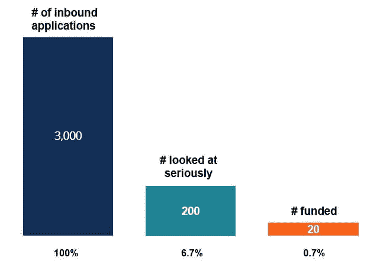
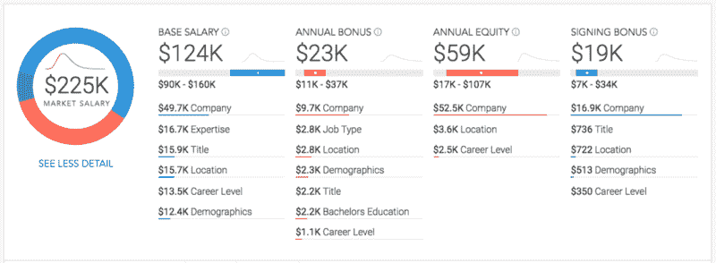

# 为什么你不应该为了“$$”而加入创业公司

> 原文：<https://www.freecodecamp.org/news/why-you-shouldnt-join-a-startup-for-the-c50641ad933/>

肖恩·崔

# 为什么你不应该为了“$$”而加入创业公司

#### 因为你可能看不够这$$$

我作为一名刚从加州理工学院毕业的工程师开始了我在硅谷的生活。我当时年轻，渴望在 T2 大展拳脚。我听说过许多故事，也看过许多电影，讲述了技术亿万富翁在帕洛阿尔托的车库里开创他们的帝国，年轻的大学毕业生在宿舍里创建数十亿美元的公司。

我梦想成为他们中的一员，我很有信心很快就能成为他们中的一员。我以为我知道答案。我认为答案很简单:创办一家初创公司，或者加入一家很酷的上市前初创公司。我会在一家大公司开始我的职业生涯，爬上公司的阶梯，开始或加入一家新公司，BAAM，我会成为亿万富翁。

像许多人一样，我只关注钱。是的，是的，是的，我知道你必须热爱你正在开发的产品，热爱和你一起工作的团队，热爱你正在服务的用户。但是我的心不在我开发的产品、团队或用户身上。我觉得我对更多钱的渴望会让我热爱这个产品，热爱我为制造这个产品而生活的生活。我造了什么真的不重要，只要它能赚钱。

我对那些告诉我不要跟着钱走的人持怀疑态度。我认为他们可以说这些话，因为他们已经拥有了一切。我现在意识到我错了。完全错了。

所以在这篇文章中，我想说服你为什么不应该为了钱而加入一家初创公司——要有真实的数据支持。我也希望你越来越怀疑那些试图用金钱招募你的创业公司。

### 大多数创业公司都会失败——但你已经知道了！

根据哈佛商学院发表的一项由 shik har Ghosh***[是的，风险投资支持的]创业公司中有 75%****失败。在统计大脑的一项研究中，50%的美国公司在 5 年后失败，超过 70%的公司在 10 年后失败。这是如果你足够幸运得到一些风险投资。*

*为了让你了解实际获得风险投资的公司的百分比，这里有一个很好的数据点，可以说明安德森·霍洛维茨基金在选择申请人时有多么挑剔。*

*

Image data [source](https://www.youtube.com/watch?v=JYYsXzt1VDc). Graph is not to scale.* 

*所以，你从最有声望的风险投资公司获得资金的几率是 0.7%。根据这里的[和](https://en.wikipedia.org/wiki/Venture_capital)，在每年创建的 200 多万家公司中，获得风险投资的实际几率约为 600~800 家，约为 0.04%。所以，一家初创公司获得一些风投资金并成功的概率在 0.01%左右，使得成功率**在**左右**为万分之一**。*

*你可以看到得到一些风投资金有多难，即使得到了也有多难成功。当然，没有风投的资助你也能成功，但是这些数据点给了你一个成功难度的视角。*

### *创业公司给你多少工资？*

*好吧，考虑到他们很有可能失败，他们给你的报酬足够补偿失败率吗？*

*首先，从我的经验来看，除非你是创始成员之一，否则一个工程师很难拿到公司 5%以上的股份。所以，让我们满怀希望，假设某家公司像摇滚明星一样对待你，给你 5%的股份。*

*然后，我们把创业公司的成功定义为创业公司成为十亿美元公司的时候。然后，你得到的 5%有一个大约`$1,000,000,000 * 0.05 * 0.0001 = $5,000`的期望值(如果你能兑现的话)。这需要几年时间，直到公司估值达到 10 亿美元。这篇[文章](https://www.businessinsider.com/fastest-startups-to-1-billion-valuation-2015-8#14-square-makes-accepting-payments-easy-1)显示 Slack 是最快达到这个里程碑的，用了 1.25 年。*

*所以，如果你的公司真的非常非常幸运，在同一时间达到了同样的里程碑，你承诺的 5%的股份一年后的预期价值约为 4000 美元。如果你的公司需要更长的时间来达到这个里程碑，你的预期年利润就会减少。而且一般需要 5~8.2 年才能退出，根据[这篇](https://venturebeat.com/2017/05/19/vc-investing-still-strong-even-as-median-time-to-exit-reaches-8-2-years/)文章。*

*所以，当你计算你所得到的那 5%的年利润时，考虑一下这一点。是的，这个计算有很多假设，它可能是完全错误的。但我想传达的信息是，成为十亿美元的公司很难，获得公司 5%的股份很难，通常需要很长时间才能达到十亿美元的估值。相比之下，股票的预期回报率相当低。*

### *大公司给你多少工资？*

*

Sample breakdown of a Google Engineer Total Compensation (TC)* 

*如果你曾经上过 Blind，一个流行的匿名聊天应用，你应该对 TC(总薪酬)这个词相当熟悉。TC 是一个术语，代表你从工资+奖金+股票中获得的年收入。湾区主要大公司(脸书、苹果、亚马逊、网飞、谷歌(FAANG))员工的平均薪酬从 20 万美元到 100 万美元不等，根据他们的经验，甚至更多。*

*[这篇](https://www.teamblind.com/article/google-engineer---total-compensation-in-us---ultimate-post-jYcrij5X)和[这篇](https://www.quora.com/What-is-the-average-total-compensation-salary-+-bonuses-per-year-at-big-tech-companies-Facebook-Google-Apple-etc-for-software-engineers-with-3-4-years-of-experience)文章按照工程师 TC 的级别展示了他们的范围。这个范围相当稳定，这些公司非常善于保持 TCs 与市场一致。*

### *加入创业公司，你失去了什么？*

*假设你要加入的创业公司能够支付相应的薪水，通常情况下，他们没有或无法支付相应的年度奖金或签约奖金。此外，他们通常没有这些大公司提供的福利(免费食物、小吃、按摩等)。*

*此外，你正在失去兑现年度股票奖金的潜力，这可能相当可观(将之前计算的 4k 美元/年与 59k 美元/年的谷歌工程师奖金相比)。*

*我不会进入工作与生活的平衡，以及你在一家初创公司和一家大公司投入了多少时间，因为每个人都在努力工作:)所以，总而言之，当加入一家初创公司时，你很可能会失去稳定的工资和奖金，更高的预期利润和不错的福利。*

### *那么你应该什么时候加入创业公司呢？*

*让我们回到计算。如果你真的相信你的创业公司有 100%的可能性会成功，那 5%的期望值是值得的，这和大公司付给你的报酬有些一致。*

*只有当你真的相信你会成功，并且你真的相信你的公司会达到 1B 估值(大多数公司都没有)，这个计算才有意义。如果你更有信心你的创业会得到资助，这个值就会上升。事实上，这也是为什么没有一家创业公司在获得风投资金后会给你 5%的原因。你能看出其中的规律吗？你对你的公司和你的产品越有信心，你就越相信你的公司的预期价值。*

*我想说的是，如果你真的相信这个产品，热爱在创业公司工作的生活，并且你能从开始一直坚持到结束，你就应该坚持下去。如果不是，你就不应该加入创业公司。从财务角度来看，这根本没有意义。*

### *最后的想法*

*所以，我说这些是因为我拥有一切吗？不。我现在是一名研究生，担心我的房东什么时候会把房租提高到比我现在的研究生工资还高。但是，我热爱我的工作。我现在比在一家糟糕的初创公司工作时更快乐，那家公司是我为了钱而加入的。现在，当我读到史蒂夫·乔布斯的这句话时，我变得不那么怀疑了:*

> *“你的工作将占据你生活的很大一部分，而真正满足的唯一方式就是做你认为伟大的工作。做伟大工作的唯一方法就是热爱你所做的事情。”—史蒂夫·乔布斯*