# ELI5 全栈基础:Django 和 EmberJS 的突破

> 原文：<https://www.freecodecamp.org/news/eli5-full-stack-basics-breakthrough-with-django-emberjs-402fc7af0e3/>

欢迎来到 ***ELI5 全栈:突破与 Django & EmberJS*** 。这是给所有人的全栈开发介绍，尤其是**初学者**。我们将逐步完成一个基本 web 应用程序的开发。算是图书馆吧。我们将一起构建一个存储数据的后端和一个管理数据的 RESTful API。然后，我们将构建一个前端用户界面，供用户查看、添加、编辑和删除数据。

这并不意味着对姜戈或者 T2 的深入探究。我不希望我们因为太复杂而陷入困境。**更确切地说，其目的是展示基本全栈开发的关键要素**。如何将后端和前端缝合到一个工作应用程序中。我将详细介绍这个过程中使用的软件、框架和工具。本教程介绍了最终应用程序中运行的每个终端命令和代码行。

我把每一部分都写得简明扼要，这样就不会有人爆头了。还有一些指示器来标记反思点，这样您就可以回过头来看看我们做了什么并保存状态。如果你不知道某事是什么意思，点击链接的文章会有详细的解释。请记住，这是对每个人的介绍，包括初学者。如果你不需要手握着，请继续阅读与你相关的章节。

如果您是初学者，我建议您自己编写每一行代码并运行每个终端命令。不要复制粘贴。它不会下沉。慢慢来，想想你在做什么。这是一个有效和自给自足的程序员的关键特征。如果你写你自己的代码并且思考你写的东西，你将会随着时间的推移发展这一点。如果你搞砸了(看看我的提交历史，我肯定搞砸了)不要担心。回去吧。这不是一场比赛。如果你慢慢来，你会没事的。


Sometimes I get whiplash

**注**:我在运行 [macOS High Sierra (10.3.6)](https://www.macrumors.com/roundup/macos-10-13/) 的 MacBook Pro 上开发了本教程。我使用 [iTerm2](https://www.iterm2.com/) 作为终端，使用 [Sublime Text 3](https://www.sublimetext.com/3) 作为我的文本编辑器。所有测试都使用 [Chrome](https://www.google.com/chrome/) 浏览器及其内置工具。实际的代码不应该有任何差异。您可以 [**从 Github 资源库**](https://github.com/lookininward/my_library) 下载最终的项目文件。

### 目录

#### **第一部分:是什么，如何做，为什么做**

1.1 我为什么写这个教程
1.2 后端，前端。有什么区别？
1.3 概念:基础库应用
1.4 项目目录结构
1.5 项目目录设置
1.6 结论

#### 第 2 部分:深入后端

2.1 安装所需软件
2.2 启动 Django 项目:服务器
2.3 启动 Django App:书籍
2.4 描述书籍模型
2.5 向管理员注册书籍模型
2.6 结论

#### 第 3 部分:构建一个服务器，然后休息

3.1 Django REST 框架
3.2 创建图书 API 文件夹
3.3 创建图书序列化器
3.4 创建获取和发布图书数据的视图
3.5 创建访问图书数据的 URL
3.6 结论

#### 第 4 部分:奠定前端基础

4.1 安装所需软件
4.2 启动 Ember 项目:客户端
4.3 显示图书数据
4.4 图书路径
4.5 显示图书路径中的真实数据
4.6 结论

#### **第五节:修正数据格式，处理个别记录**

5.1 安装 Django REST 框架 JSON API
5.2 处理单个图书记录
5.3 图书路径
5.4 结论

#### 第 6 部分:功能前端

6.1 向数据库添加新书
6.2 从数据库中删除书
6.3 在数据库中编辑书
6.4 结论

#### 第 7 节:继续前进

7.1 下一步是什么？
7.2 进一步阅读

### 第一部分:是什么，怎么做，为什么

### 1.1 我为什么写这个教程

假设你最近加入了一家新公司。他们开业已经有一段时间了，他们的主要产品已经投入生产。把你今天看到的应用想象成蛋糕。挑选原料、食谱，然后把它们放在一起的过程……那早就结束了。你将会在完成的蛋糕上工作。

项目开始时，开发人员已经制定了某些配置。随着开发人员来来去去，这些变化和约定也随着时间而发展。当你到达时，可能很难理解我们是如何走到今天这一步的。这就是我的情况。我觉得在整个筹码堆里翻来翻去是唯一让我感觉舒服的方法。这将有助于我理解我们从何而来，以及如何推进我们正在构建的软件。

本教程是我作为一名初级软件开发人员的经历的顶峰。我在用[关闭文件夹](http://we%27re%20hiring%20now%20so%20feel%20free%20to%20get%20in%20touch%21/)的时候学到了很多。它代表了我的想法的转变，因为我正朝着更复杂的全栈开发迈进。在开发人员想知道蛋糕是如何烤出来的阶段，它也是一个切入点。我希望这篇教程对你有用，就像它对我创作有指导意义一样。


That wholesome feeling

**注意**:在典型的工作流程中，开发人员会从后端开始建立数据库，并创建一个 REST API。然后，他们将在前端工作，并建立用户界面。然而事情并没有这么简单。我们会犯错误，并且经常不得不反复解决它们。来回跳跃将有助于在你的头脑中建立更多的联系。并帮助您更好地理解所有部分是如何组合在一起的。拥抱你的错误。你会做很多的！

**Note2** :各位资深开发者、初级开发者、设计师们请注意！[关闭文件夹](http://We're hiring now so feel free to get in touch!)现在正在招聘，请随时联系。

### 1.2 后端，前端。有什么区别？

后端开发。前端开发。全栈开发。如此多的发展...这有什么区别吗？

将前端开发视为应用程序中您看到并与之交互的部分。例如，用户界面是前端的一部分。这是用户查看数据并与之交互的地方。

后端开发就是存储和服务数据的一切。想想当你登录到 Medium 时会发生什么。您的用户资料数据或故事都不存在于前端。它从后端存储和服务。

前端和后端共同组成应用程序。后端有关于如何存储和提供数据的指令。前端有捕获数据的指令，以及如何显示数据。

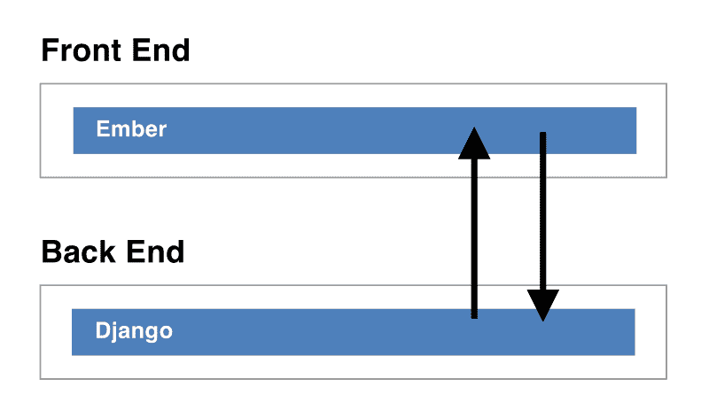

Basic front-end and back-end communication.

在本文中了解更多关于[的差异。](http://blog.teamtreehouse.com/i-dont-speak-your-language-frontend-vs-backend)


MFW I realized development never actually ends

### 1.3 概念:基本的图书馆应用

在我们开始构建任何东西之前，让我们概述一下我们的计划和我们想要达到的目标。我们想要构建一个运行在浏览器中的名为 **my_library** 的 [web 应用](https://stackoverflow.com/a/8694944/5513243)。这个应用程序正如它听起来的那样，是一个图书的数字图书馆。不过，我们不会涉及实际的书籍内容。这些书只有标题、作者和描述信息。保持简单。

该应用程序将具有以下功能:

*   在主页上以单一列表的形式查看所有书籍，并按标题排序
*   详细查看每本书，显示书名、作者和描述
*   添加带有标题、作者和描述字段的新书
*   编辑现有图书的标题、作者和描述栏
*   删除现有图书

#### 1.3.1 my_library 的最终设计和功能

看看下面的截图。它们描述了应用程序的最终外观和功能:

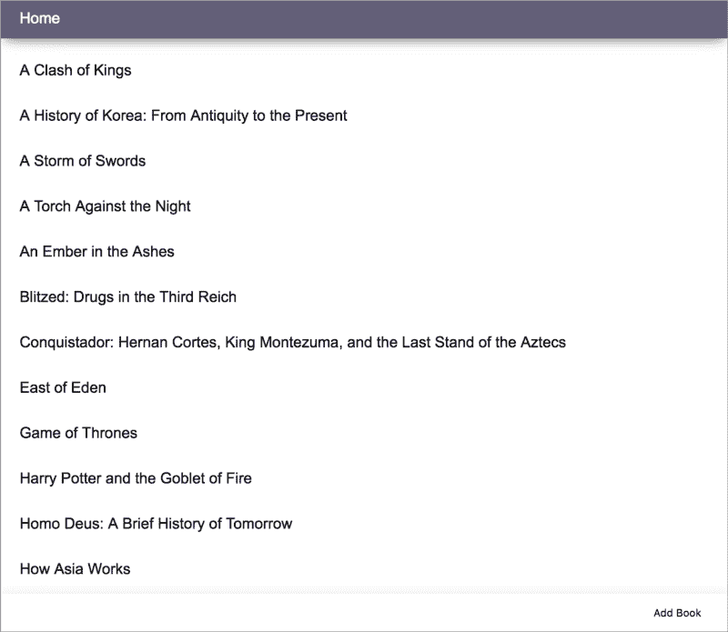

View all the books in our database as a single list ordered by title.


Click on a book to see a detailed view with author and description information.

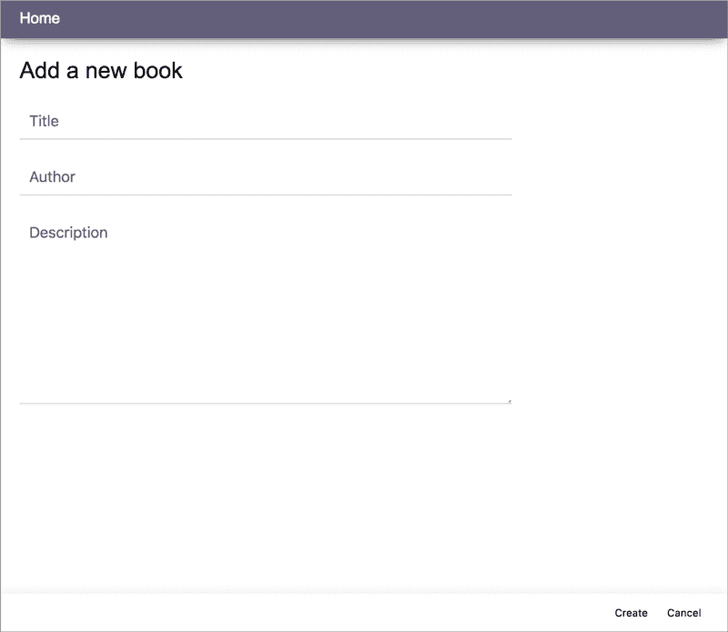

Add a new book to the database with the fields title, author, and description.

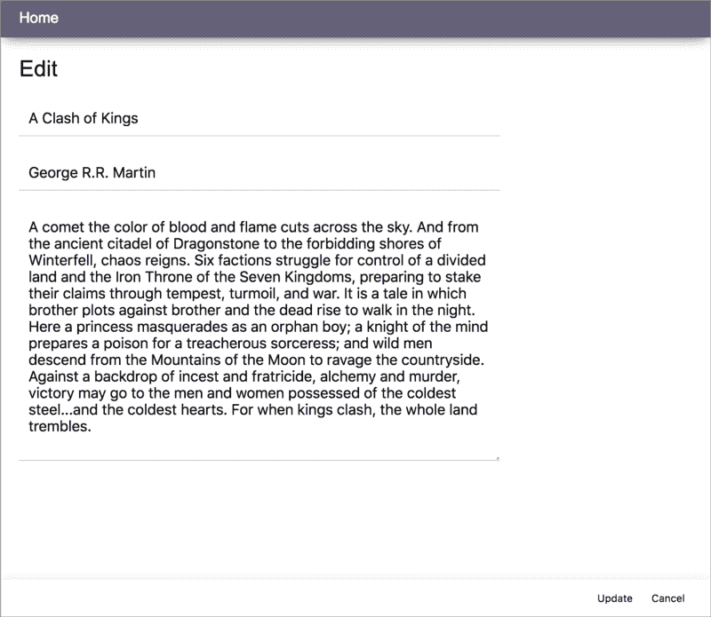

Edit an existing book’s title, author, and description fields.

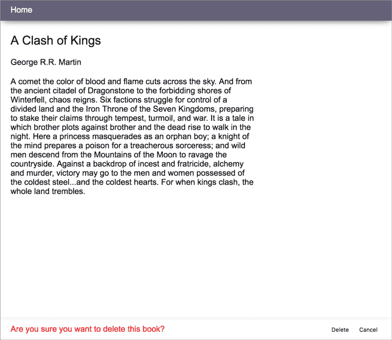

Confirm deletion of an existing book.

### 1.4 项目目录结构

有无数种方法来构建一个给定的项目。为了简单起见，我将所有的东西放在一个`my_library`文件夹中，如下所示:

```
my_library
  - server
    - server
    - books
      - api
    - db.sqlite3
    - manage.py
  - client
    - app
      - adapters
      - controllers
      - models
      - routes
      - templates
      - styles
      router.js
```

这些不是项目将包含的所有文件夹和文件，尽管它们是主要的。您会注意到相当多的自动生成的文件，您可以忽略它们。尽管阅读解释它们用途的文档会对您有所帮助。

`my_library`目录包含后端和前端子项目的文件夹。`server`指 Django 后端，`client`指 EmberJS 前端。

#### 1.4.1 后端

*   `server`包含另一个名为`server`的文件夹。里面是后端的顶级配置和设置。
*   `books`文件夹将包含图书数据的所有模型、视图和其他配置。
*   在`books/api`文件夹中，我们将创建构成 REST API 的序列化器、URL 和视图。

#### 前端

*   `client`是我们 EmberJS 的前端。它包含路线、模板、模型、控制器、适配器和样式。`router.js`描述了所有的申请路线。

让我们继续设置主项目目录`my_library`。

### 1.5 项目目录设置

#### 1.5.1 创建主项目文件夹:my_library

现在我们知道了我们将要构建什么，让我们花几分钟来设置主项目目录`my_library`:

```
# cd into desktop and create the main project folder
  cd ~/desktop && mkdir my_library
```

在文件夹中创建一个基本的`README.md`文件，内容如下:

```
# my_library
This is a basic full stack library application built. Check out the tutorial: 'ELI5 Full Stack: Breakthrough with Django & EmberJS'.
```

现在让我们将这个项目提交给一个新的 Git 存储库，作为项目的起点。

#### 1.5.2 安装 Git 进行版本控制

Git 是版本控制软件。我们将使用它来跟踪我们的项目，并逐步保存我们的状态，这样，如果我们犯了致命的错误，我们就可以随时返回。我相信你们大多数人已经很熟悉它了。

对于门外汉，你可以在这里找到更多[。如果你没有安装 Git，你可以在这里](https://git-scm.com/about)下载[。](https://git-scm.com/download/mac)

检查它是否安装了:

```
$ git --version
```


#### 1.5.3 创建新的项目存储库

我有一个 Github 的账户。它很受欢迎，效果也很好，所以我会用它。如果其他解决方案更适合你，请随意使用。

创建一个新的存储库并获取远程 URL，如下所示:

```
git@github.com:username/repo_name.git
```


#### 1.5.4 提交您的变更并将其推送到项目存储库

在`my_library`文件夹中初始化空存储库:

```
git init
```

现在[添加远程 URL](https://help.github.com/articles/adding-a-remote/) ,这样 Git 就知道我们将文件推送到哪里:

```
git remote add origin git@github.com:username/repo_name.git
# check that it's been set, should display the origin
  git remote -v
```

是时候把我们的代码推送到 Github 了:

```
# check the status of our repo
# should show the new file README.md, no previous commits
  git status
# add all changes
  git add .
# create a commit with a message
  git commit -m "[BASE] Project Start"
# push changes to the repo's master branch
  git push origin master
```

远程 Git 存储库更新了我们推送的更改:

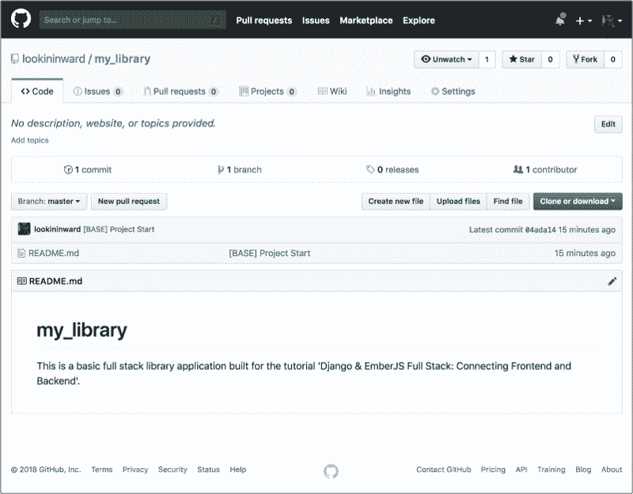

现在我们有了一个主项目目录和一个存储库，我们终于可以开始我们的后端工作了！

**注意**:从这一点开始，我不会再讨论任何关于提交的细节。下面的**审查和提交指示器会让你知道什么时候该这么做:**


### 1.6 结论

随着以下步骤的完成，我们已经到了第 1 节的末尾:

*   对我们正在构建的内容及其工作方式有所了解
*   创建了`my_library`主项目目录
*   在 Github 上安装了`git`并创建了一个远程项目库
*   初始化本地存储库并设置远程 URL
*   创建一个`README.md`文件，然后提交并推送所有更改


Puppy is proud of you

### 第 2 部分:深入后端

这一节是关于用 Django 进行后端开发的。我们将开始安装所需的软件。

接下来，我们将创建一个名为`server`的新 Django 项目，并创建一个名为`books`的新应用程序。在`books`应用程序中，我们描述了`Book`模型，并向管理员注册了该模型。

一旦我们创建了一个`Superuser`账户，我们就可以登录 Django 管理网站。我们将使用 Django 管理站点来管理数据库，并开始用图书数据播种它。

### 2.1 安装所需的软件

在我们开始后端项目之前，我们需要安装一些软件:

*   [Python](https://www.python.org/doc/essays/blurb/)
*   [pip](https://pip.pypa.io/en/latest/installing/#installing-with-get-pip-py)
*   [虚拟人](https://virtualenv.pypa.io/en/stable/installation/)
*   姜戈

#### 2.1.1 Python

如果你的 MacOS 是最新的，很可能已经安装了`Python 2.7`。请随意使用`2.7`或`3.x`。在本教程中，它们是相同的。

安装很简单。[下载安装程序](https://www.python.org/downloads/)并像安装典型的 MacOS 应用程序一样进行安装。打开终端，检查是否已安装:

```
python --version 
```


#### 2.1.2 pip

简单来说，pip (Pip 安装包)就是一个包管理系统。它用于安装和管理用 Python 编写的软件包。在终端中:

```
# cd into the desktop
  cd ~/desktop

# download the pip Python script
  curl https://bootstrap.pypa.io/get-pip.py -o get-pip.py

# run the script
  python get-pip.py
# once installation completes, verify that it's installed
  pip —-version
```

完整的安装文档可从[这里](https://pip.pypa.io/en/latest/installing/#installing-with-get-pip-py)获得。

#### 2.1.3 virtualenv

virtualenv 是一个用来创建独立 Python 环境的工具。这些环境有自己的安装目录。他们不与他人共享库。这种筒仓保护全局安装的库免受不必要的改变。

有了它，我们可以在不破坏全球环境的情况下使用 Python 库。比如你在电脑上安装`exampleSoftware 1.0`。激活虚拟环境后，您可以升级到`exampleSoftware 1.2`并使用它。这根本不会影响`exampleSoftware 1.0`的全球安装。

对于特定应用程序的开发，您可能希望使用`1.2`，对于其他环境，`1.0`将是合适的。虚拟环境给了我们分离这些环境的能力。完整的安装文档可在[这里](https://virtualenv.pypa.io/en/stable/installation/)获得。

现在，打开终端安装 virtualenv:

```
# use pip to install virtualenv
  pip install virtualenv
# verify that it's installed
  virtualenv —-version
```

让我们创建一个目录来存放我们的虚拟环境:

```
# cd into the root directory
  cd ~/
# create a hidden folder called .envs for virtual environments
  mkdir .envs
# cd into the virtual environments directory
  cd .envs
```

我们现在可以为我们的项目创建一个虚拟环境:

```
# create a virtual environment folder: my_library
  virtualenv my_library
# activate the virtual environment from anywhere using
  source ~/.envs/my_library/bin/activate
```

现在我们已经创建了一个名为`my_library`的虚拟环境，有一些规则需要记住。**在安装或更新任何软件包之前，确保环境始终处于激活状态。**

最后，花点时间在这个虚拟环境中升级 pip:

```
pip install -U pip
```

#### 2.1.4 Django 1.11 (LTS)

Django 是一个 web 框架，'*鼓励快速开发和干净、实用的设计…'*

它为我们提供了一套通用组件，因此我们不必从头开始重新发明一切。

例子包括:

*   管理小组
*   一种处理用户认证的方法

查看这篇 DjangoGirls 文章,了解更多关于 Django 的信息以及为什么使用它。


在这个项目中，我们将使用 Django 来处理后端。与其附加组件一起，Django 提供了开发 REST API 的基本工具。

```
# inside my_library with virtualenv activated
  pip install Django==1.11
# verify that it's installed, open up the Python shell
  python
# access the django library and get the version (should be 1.11)
  import django
  print(django.get_version())
# exit using keyboard shortcut ctrl+D or:
  exit()
```

完整的安装文档可从[这里](https://docs.djangoproject.com/en/1.11/topics/install/)获得。

### 2.2 启动 Django 项目:服务器

让我们使用 [django-admin](https://docs.djangoproject.com/en/2.1/ref/django-admin/) 来生成一个新的 django 项目。这是 Django 的用于管理任务的*命令行实用程序*:

```
# cd into the project folder
  cd ~/desktop/my_library
# initialize the virtual environment
  source ~/.envs/my_library/bin/activate
# use Django to create a project: server
  django-admin startproject server
# cd into the new Django project
  cd server
# synchronize the database
  python manage.py migrate
# run the Django server
  python manage.py runserver
```

现在在浏览器中访问`http://localhost:8000`,确认 Django 项目正在运行:


Server running. Success!

可以用`cmd+ctrl`关闭服务器。

#### 2.2.1 创建超级用户帐户

我们必须创建一个超级用户来登录管理站点并处理数据库数据。我们在里面跑:

```
# create superuser
  python manage.py createsuperuser
```

填写`Username`、`Email Address`(可选)和`Password`字段。您应该会收到一条成功消息。

现在用`python manage.py runserver`运行服务器，并转到`localhost:8000/admin`查看管理员登录页面。输入您的超级用户帐户详细信息以登录。

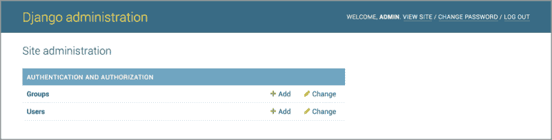

Logged into the Django Admin site

不错！我们可以进入 Django 的管理网站。一旦我们创建了`books`模型并进行适当的设置，我们将能够添加、编辑、删除和查看图书数据。

用`cmd+ctrl`注销并关闭服务器。

#### 保护我们的秘密

在继续之前，我们需要更新 settings.py 文件。它包含我们不想公开的认证凭证。我们希望将这些凭证放在我们的远程存储库之外。有许多保护我们自己的方法。这是我的方法:

```
# create a config.json file to hold our configuration values
  my_library/server/server/config.json
```

在里面，我们将把来自`settings.py`的`SECRET_KEY`值存储在`API_KEY`下:

```
{
  "API_KEY" : "abcdefghijklmopqrstuvwxyz123456789"
}
```

在`settings.py`中，导入`json`库并加载配置变量:

```
import os
import json
BASE_DIR = os.path.dirname(os.path.dirname(os.path.abspath(__file__)))
with open(BASE_DIR + '/server/config.json', 'r') as config:
    obj = json.load(config)
SECRET_KEY = obj["API_KEY"]
...
```

为了不让`config.json`(带有密钥)被推送到存储库，在`my_library`中创建一个`.gitignore`文件。这将忽略它(以及其他一些自动生成的文件和数据库):

```
### Django ###
config.json
*.log
*.pot
*.pyc
__pycache__/
local_settings.py
db.sqlite3
media
```


现在，当您提交更改时，上面列出的文件和文件夹不会被添加。我们的秘密是安全的，我们的回购不会包含不必要的额外文件！


### 2.3 启动 Django 应用程序:书籍

把 Django 应用程序想象成插入到你的项目中的模块。我们将创建一个名为`books`的应用程序，包含模型、视图和其他设置。这是我们与数据库中的图书数据进行交互的方式。

Django 中的项目和 app 有什么区别？检查[这个线程](https://stackoverflow.com/questions/19350785/what-s-the-difference-between-a-project-and-an-app-in-django-world)。

```
# create new app: books
  python manage.py startapp books
# creates directory: my_library/server/books
```

现在我们将把`books`应用程序安装到`server`项目中。打开设置文件:`my_library/server/server/settings.py`。

滚动到`INSTALLED_APPS`数组。Django 已经默认安装了自己的核心应用。在阵列末端安装`books`应用程序:

```
INSTALLED_APPS = [
  ...
  'books'
]
```

### 2.4 描述图书模型

接下来，我们描述图书应用程序中的`Book`模型。打开模型文件`my_library/server/books/models.py`。

描述一个`Book`模型，它告诉 Django 数据库中的每本书都有:

*   最长 500 个字符的`title`字段
*   一个最多 100 个字符的`author`字段
*   一个字符数不限的`description`字段

```
from django.db import models

class Book(models.Model):
  title       = models.CharField(max_length=500)
  author      = models.CharField(max_length=100)
  description = models.TextField()
```

### 2.5 向管理员注册图书模型

现在我们为我们的`books`应用向管理员注册`Book`模型。这让我们可以在管理站点中查看它，并从那里操作图书数据。打开管理文件`my_library/server/books/admin.py`，添加:

```
from django.contrib import admin
from .models import Book

@admin.register(Book)
class bookAdmin(admin.ModelAdmin):
  list_display = ['title', 'author', 'description']
```

创建了新模型后，我们必须进行并运行[迁移](https://docs.djangoproject.com/en/2.1/ref/django-admin/#django-admin-makemigrations)，以便数据库同步:

```
python manage.py makemigrations
python manage.py migrate
```

运行服务器，进入`localhost:8000/admin`登录。请注意，向管理员注册的图书模型显示:

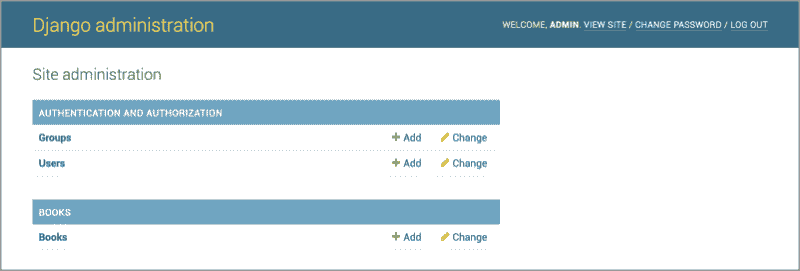

With the ‘Book’ model registered with the admin

单击“书籍”会显示一个空列表，因为数据库中没有书籍。单击“添加”开始创建要添加到数据库中的新书。继续创建几本书。

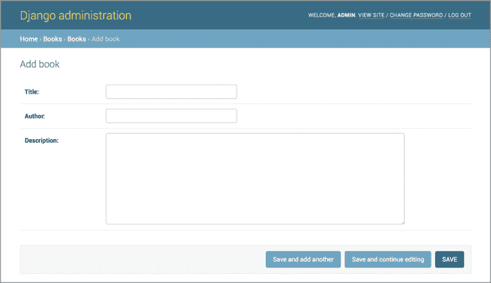

Add a new book to the database

保存并返回列表查看新数据。现在它显示了标题、作者和描述(`list_display array`)字段。

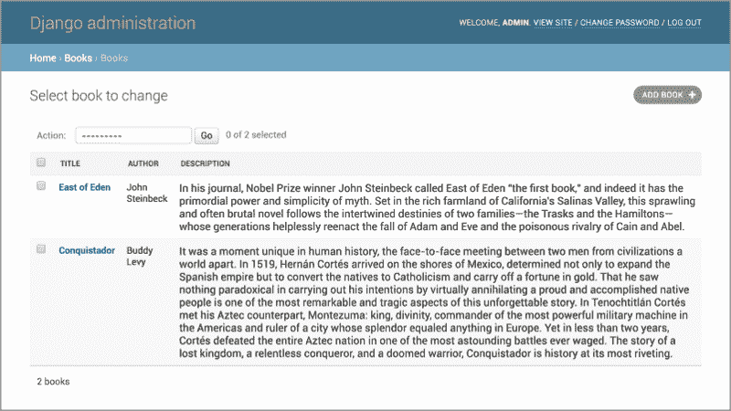

List of all the books we’ve added to the database

这太棒了。我们现在可以在管理站点中查看我们的数据库书籍。还可以使用创建、编辑和删除功能。

**注意**:为了简单起见，我们将使用 [SQLite 数据库。](https://www.sqlite.org/about.html)每个 Django 项目创建时都会预装它。就本教程而言，不需要对数据库做任何额外的工作。


### 2.6 结论

恭喜，我们成功地完成了第二节的结尾！这是我们到目前为止所做的:

*   已安装`python`
*   使用`python`安装`pip`软件包管理器
*   使用`pip`安装`virtualenv`来创建虚拟环境
*   在`~/.envs`中创建了一个名为`my_library`的虚拟环境
*   激活`my_library`环境并升级`pip`
*   安装在`my_library`环境中的`Django 1.11 LTS`
*   创建了我们的项目目录`my_library`
*   创建 Django 项目`server`
*   创建了一个`Superuser`帐户来访问 Django 管理站点
*   通过将我们的`SECRET_KEY`移到`config.json`来保护我们的秘密
*   使用`.gitignore`忽略自动生成和/或敏感文件
*   创建了一个名为`books`的新应用
*   描述了`Book`模型
*   向管理员注册了`Book`型号
*   将书籍数据添加到数据库中


That which holds the internet together

### 第 3 部分:构建一个服务器，然后休息

在这一节中，我们使用 Django REST 框架来构建我们的`books` API。它有序列化器、视图和 URL 来查询、构造和交付图书数据。数据和方法可以通过 API 端点访问。

这些端点是通信信道的一端。API 和另一个系统之间通信的接触点。这个上下文中的另一个系统是我们的 Ember 前端客户端。Ember 客户端将通过 API 端点与数据库进行交互。我们用 Django 和 Django REST 框架创建这些端点。

我们使用 Django 来建立`book`模型和管理站点，让我们与数据库进行交互。Django REST 框架将帮助我们构建 REST API，前端将使用它与后端进行交互。

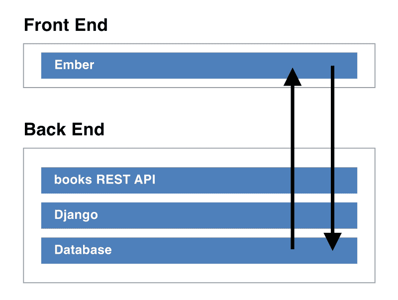

Application layers stacked one by one.

### 3.1 Django REST 框架

Django REST 框架 (DRF)建立在 Django 之上。它简化了[RESTful Web API](http://rest.elkstein.org/)的创建。它附带了一些工具来简化这个过程。

DRF 的开发人员已经确定了序列化程序和视图的通用模式。由于我们的数据和用户可以用它做什么很简单，我们将使用内置的序列化器和视图。记住，我们的账面数据只有三个字段`title`、`author`和`description`。用户可以创建新的图书记录，编辑和删除现有记录。这种功能完全在基本通用模式的范围之内。内置的序列化器和视图很好地支持它们。我们不需要从头开始构建这些。

对于更复杂的项目，您需要覆盖默认设置或创建自己的设置。同样，为了简单起见，我们将使用开箱即用的东西，不做过多的修改。


#### 安装 Django REST 框架

进入`my_library`目录，激活虚拟环境。要开始使用 DRF，请安装`pip`:

```
# enter my_library
  cd ~/desktop/my_library

# activate the virtual environment
  source ~/.envs/my_library/bin/activate

# install Django REST Framework
  pip install djangorestframework
# install Markdown support for the browsable API
  pip install markdown
```

现在打开`my_library/server/server/settings.py`。将 DRF 安装在`INSTALLED_APPS`数组中`books` app 的正上方:

```
INSTALLED_APPS = [
  ...
  'rest_framework',
  'books'
]
```

将默认设置作为名为`REST_FRAMEWORK`的对象添加到文件底部:

```
REST_FRAMEWORK = {
  'DEFAULT_PERMISSION_CLASSES': [      
   'rest_framework.permissions.DjangoModelPermissionsOrAnonReadOnly'
  ]
}
```

设置对象包含一个带有数组的`DEFAULT_PERMISSION_CLASSES`键。数组中唯一的项是权限类。这个'*允许未经验证的用户对 API'* '进行只读访问。点击了解更多权限[。](http://www.django-rest-framework.org/api-guide/permissions/#permissions)

### 3.2 创建图书 API 文件夹

安装了 DRF 之后，让我们开始构建`books` API。在`books`应用程序中创建一个名为`api`的新文件夹。然后在`my_library/server/books/api/__init__.py`中创建一个空的`__init__.py`文件。

空文件告诉 Python 这个文件夹是一个 Python 模块。`api`文件夹将包含我们的图书数据的序列化器、视图和 URL。我将在下面的相应章节中解释这些术语的含义。

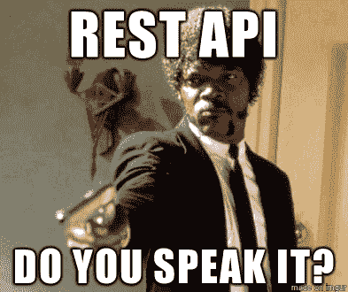

### 3.3 创建图书序列化程序

简单来说，[序列化器](http://www.django-rest-framework.org/api-guide/serializers/)获取数据库数据并对其进行重组。这种结构是数据在应用层之间交互的蓝图。它让前端和后端以一种共同的语言相互交流。

例如，我们将创建的前端期望从请求返回的响应是 JSON 格式的。将数据序列化到 JSON 中可以确保前端能够读取和写入数据。

```
from rest_framework import serializers
from books.models import Book
class bookSerializer(serializers.ModelSerializer):
  class Meta:
    model = Book
    fields = (
      'id',
      'title',
      'author',
      'description',
    )
```

这个序列化程序接收数据并将其转换成 JSON 格式。这确保了前端可以理解它。

#### **进口**

我们从 DRF 进口内置`serializers`，从我们的`books`应用程序进口`Book`型号。

```
from rest_framework import serializers
from books.models import Book
```

#### **book serializer 类**

对于这个项目，我们想要一个“*对应于模型字段*的`Serializer`类。序列化程序应该映射到模型字段`title`、`author`和`description`。我们可以用`[ModelSerializer](http://www.django-rest-framework.org/api-guide/serializers/#modelserializer)`做到这一点。根据文件:

除了以下几点之外，`ModelSerializer`类与常规的`Serializer`类相同:

*   它将根据模型为您生成一组字段。
*   它将为序列化程序生成验证器，比如 unique_together 验证器。
*   它包括简单的默认实现`.create()`和`.update()`。

内置工具完全能够满足我们的基本需求。

```
class bookSerializer(serializers.ModelSerializer):
  class Meta:
    model = Book
    fields = (
      'id',
      'title',
      'author',
      'description',
    )
```

### 3.4 创建一个视图来获取和发布图书数据

视图函数接收 web 请求并返回 web 响应。例如，对`localhost:8000/api/books`的 web 请求会引起服务器的响应。

这个响应可以是网页的 HTML 内容，或者重定向，或者 404 错误，或者 XML 文档，或者图像。。。或者其他… '在我们的例子中，我们希望得到 JSON 格式的图书数据。

在`my_library/server/books/api/views.py`中创建视图文件:

```
from rest_framework import generics, mixins
from books.models import Book
from .serializers import  bookSerializer
class bookAPIView(mixins.CreateModelMixin, generics.ListAPIView):
  resource_name = 'books'
  serializer_class = bookSerializer
  def get_queryset(self):
    return Book.objects.all()
  def post(self, request, *args, **kwargs):
    return self.create(request, *args, **kwargs)
```

#### **进口**

首先我们从 DRF 进口`[generics](http://www.django-rest-framework.org/api-guide/generic-views/#genericapiview)`和`[mixins](http://www.django-rest-framework.org/api-guide/generic-views/#mixins)`。然后是来自我们`books`应用的`Book`模型和我们创建的`bookSerializer`。

`generics`指的是“*映射到您的数据库模型*的 API 视图。这些是提供通用模式的*预构建视图。`mixins`是“*提供用于提供基本视图行为*的动作的类。我们的图书模型过于简单。它只有`title`、`author`和`description`属性，所以这些为我们提供了我们需要的基本属性。*

```
from rest_framework import generics, mixins
from books.models import Book
from .serializers import  bookSerializer
```

#### **bookAPI 视图**

然后我们创建一个`bookAPIView`，它接收`[CreateModelMixin](http://www.django-rest-framework.org/api-guide/generic-views/#createmodelmixin)`和`[ListAPIView](http://www.django-rest-framework.org/api-guide/generic-views/#listapiview)`。

`CreateModelMixin`提供了一个`.create(request, *args, **kwargs)`方法*。*这个实现了一个新模型实例的创建和持久化。当成功时，它返回一个`201 Create`响应。这是它创建的对象的序列化表示。

例如，我们将发出一个 POST 请求，为沃尔特·伊萨克森的《史蒂夫·乔布斯传》创建一个新的图书记录。如果成功，我们将返回一个代码为`201`的响应。图书记录的序列化表示是这样的:

```
{
  "data": {
    "type": "books",
    "id":"10",
    "attributes": {
      "title": "Steve Jobs",
      "author": "Walter Isaacson",
      "description": "Based on more than forty interviews with Jobs conducted over two years—as..."
    }
  }
}
```

如果不成功，我们将得到一个包含错误细节的`400 Bad Request`响应。例如，如果我们试图创建一个新的图书记录，但没有提供任何`title`信息:

```
{
  "errors":[
    {
      "status": "400",
      "source": {
        "pointer": "/data/attributes/title"
      },
      "detail": "This field may not be blank."
    }
  ]
}
```

`ListAPIView`服务于我们的只读端点(GET)。它代表了模型实例的集合。当我们想得到所有或许多书的时候，我们使用它。

`bookAPIView`还为它的`serializer_class`吸收了最近创建的`bookSerializer`。

我们将`resource_name`设置为‘books’*指定 json 输出*中的**键。前端客户端数据存储层将有一个区分大小写的`book`模型。我们不想让 Ember 的`book`型号和 Django 的`Book`型号发生冲突。将`resource_name`设定在这里，将问题扼杀在萌芽状态。**

```
*`class bookAPIView(mixins.CreateModelMixin, generics.ListAPIView):
  resource_name = 'books'
  serializer_class = bookSerializer`*
```

#### ***功能***

*函数`get_queryset`返回数据库中所有的图书对象。`post`接受请求和参数，如果请求有效，就创建一个新的图书数据库记录。*

```
*`def get_queryset(self):
    return Book.objects.all()
def post(self, request, *args, **kwargs):
    return self.create(request, *args, **kwargs)`*
```

### *3.5 创建访问图书数据的 URL*

*URL 模式将 URL 映射到视图。例如，访问`localhost:8000/api/books`应该映射到一个 URL 模式。然后将查询结果返回给该视图。*

*在`my_library/server/books/api/urls.py`中创建 URL 文件:*

```
*`from .views import bookAPIView
from django.conf.urls import url
urlpatterns = [
  url(r'^$', bookAPIView.as_view(), name='book-create'),
]`*
```

#### ***进口***

*我们导入我们的视图`bookAPIView`和`url`。我们将使用`url`来创建一个 url 实例列表。*

```
*`from .views import bookAPIView
from django.conf.urls import url`*
```

#### ***bookapi URL 模式***

*在`urlpatterns`数组中，我们创建了一个具有以下结构的 URL 模式:*

*   *模式`r'^$'`*
*   *视图的 Python 路径`bookAPIView.as_view()`*
*   *名字`name='book-create'`*

*模式`r’^$’`是“ [*匹配空行/字符串*](https://stackoverflow.com/a/31057541/5513243) ”的正则表达式。这意味着它与`localhost:8000`匹配。它匹配基本 URL 之后的任何内容。*

*我们在`bookAPIView`上调用`[.as_view()](https://docs.djangoproject.com/en/1.11/ref/class-based-views/base/#django.views.generic.base.View.as_view)`,因为要将视图连接到 url。它' [*是将[the]类与其 url*](https://stackoverflow.com/a/31491074/5513243) '连接起来的函数(类方法)。访问一个特定的 URL，服务器会尝试将其与 URL 模式进行匹配。然后，该模式将返回我们告诉它要响应的`bookAPI`视图结果。*

*`name=’book-create’`属性为我们提供了一个`name`属性。在整个项目中，我们用它来指代我们的 URL。假设您想要更改 URL 或它所引用的视图。在这里改。没有`name`，我们将不得不经历整个项目来更新每一个引用。查看[这个帖子](https://stackoverflow.com/a/11241936/5513243)了解更多。*

```
*`urlpatterns = [
  url(r'^$', bookAPIView.as_view(), name='book-create'),
]`*
```

#### ***服务器 URL 模式***

*现在让我们打开`server`的 URL 文件`my_library/server/server/urls.py`:*

```
*`from django.conf.urls import url, include
from django.contrib import admin
urlpatterns = [
  url(r'^admin/', admin.site.urls),
  url(r'^api/books', include('books.api.urls', 
                              namespace='api-books'))
]`*
```

*这里我们导入`include`并创建`r’^api/books’`模式，它接收我们在`api`文件夹中创建的任何 URL。现在我们的`books`API URL 的基本 URL 变成了`localhost:8000/api/books`。访问此 URL 将符合我们的`r’^/api/books’`模式。这与我们在`books` API 中构建的`r’^$’`模式相匹配。*

*我们使用`namespace=’api-books’`以便 URL 不会相互冲突。如果它们在我们创建的另一个应用程序中同名，就会发生这种情况。在[这个线程](https://stackoverflow.com/a/19171674/5513243)中了解更多关于我们为什么使用`namespaces`的信息。*

#### *3.5.1 演示:浏览图书 API*

*现在我们有了基本的 REST 框架设置，让我们检查一下后端返回的数据。服务器运行时，访问`localhost:8000/api/books`。[可浏览的 API](http://www.django-rest-framework.org/topics/browsable-api/) 应该返回类似这样的内容:*

*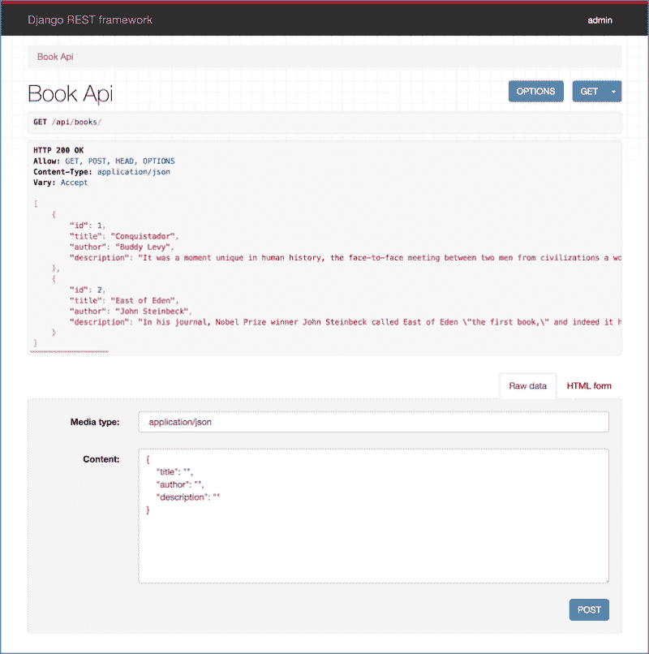

Django REST Framework returning book data from the database* **

### *3.6 结论*

*太好了，我们要走了。在第 3 节的**结束时，我们已经完成了以下步骤:***

*   *将 Django REST 框架安装到我们的项目中*
*   *开始构建`books` API*
*   *为书籍创造了一个`serializer`*
*   *为书籍创造了一个`view`*
*   *为书籍创作的`URLs`*
*   *浏览了从后端返回图书数据的图书 API*

*

Gift from the gods* 

### *第 4 部分:奠定前端基础*

*在这一节中，我们将注意力转移到前端，并开始使用 Ember 框架。我们将安装所需的软件，设置基本的 DOM、样式，创建`book`模型和`books`路线。在我们继续从后端访问真实数据之前，我们还将加载假的图书数据用于演示目的。*

### *4.1 安装所需的软件*

*要开始前端开发，我们需要安装一些软件:*

*   *[NPM node . js](https://nodejs.org/en/)*
*   *[人 CLI](https://ember-cli.com/)*

#### *4.1.1 节点和 NPM*

*NodeJS 是一个开源的服务器环境。我们现在不需要进入细节。NPM 是 Node.js 包的包管理器。我们用它来安装像 Ember CLI 这样的软件包。*

*使用官方网站的[安装文件安装 NodeJS 和 NPM。](http://nodejs.org/en/download/)*

*安装完成后，检查安装的所有内容:*

```
*`node --version
npm --version`*
```

**

#### *4.1.2 人类 CLI*

*让我们使用 NPM 来安装 Ember 命令行界面。这是用于创建、构建、服务和测试 [Ember.js](https://emberjs.com/) 应用和插件的官方命令行实用程序。Ember CLI 提供了构建应用程序前端所需的所有工具。*

```
*`# install Ember CLI
  npm install -g ember-cli
# check that it's installed
  ember --version`*
```

**

### *4.2 启动 Ember 项目:客户端*

*让我们使用 Ember CLI 创建一个名为`client`的前端客户端:*

```
*`# cd into the main project folder
  cd ~/desktop/my_library
# create a new app: client
  ember new client
# cd into the directory
  cd client
# run the server
  ember s`*
```

*转到`http://localhost:4200`，您应该会看到这个屏幕:*

*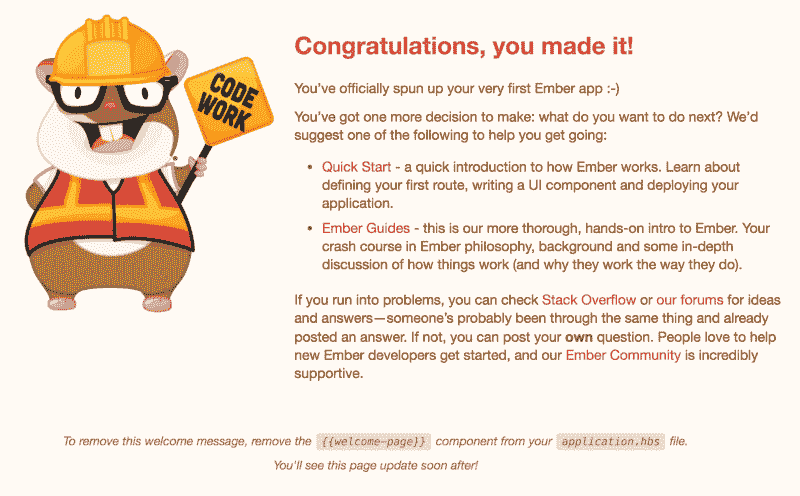

Up and running* 

*基本成员客户端项目正在按预期运行。可以用`ctrl+C`关闭服务器。*

#### *4.2.1 更新。带有余烬排除的 gitignore*

*在我们进行任何新的提交之前，让我们更新一下`.gitignore`文件。我们希望从回购中排除不需要的文件。在 Django 部分下面的文件中添加:*

```
*`...
### Ember ###
/client/dist
/client/tmp
# dependencies
/client/node_modules
/client/bower_components
# misc
/client/.sass-cache
/client/connect.lock
/client/coverage/*
/client/libpeerconnection.log
/client/npm-debug.log
/client/testem.log
# ember-try
/client/.node_modules.ember-try/
/client/bower.json.ember-try
/client/package.json.ember-try`*
```

### *4.3 显示图书数据*

#### *4.3.1 设置 DOM*

*现在我们已经生成了一个基础项目，让我们设置一个基本的 DOM 和样式。我在这里没有做任何花哨的事情。以可读的格式显示我们的数据是最不必要的。*

*找到文件`client/app/templates/application.hbs`。去掉`{{welcome-page}}`和评论。*

*接下来，用类`.nav`创建一个`div`。使用 Ember 内置的`[{{#link-to}}](https://guides.emberjs.com/release/templates/links/)`助手创建一个到路线`books`的链接(我们稍后会创建):*

```
*`<div class="nav">
  {{#link-to 'books' class="nav-item"}}Home{{/link-to}}
</div>`*
```

*用`.container`类将包括`[{{outlet}}](https://guides.emberjs.com/release/routing/rendering-a-template/)`在内的所有内容包装在一个`div`中。每个路线模板将在`{{outlet}}`内渲染:*

```
*`<div class="container">
  <div class="nav">
    {{#link-to 'books' class="nav-item"}}Home{{/link-to}}
  </div>
{{outlet}}
</div>`*
```

*这是父级`application`路线的模板。任何像`books`这样的子路线都会在`{{outlet}}`里面渲染。这意味着`nav`将一直在屏幕上可见。*

#### *创建样式*

*我不打算深入 CSS 的本质。这很容易搞清楚。找到文件`client/app/styles/app.css`并添加以下样式:*

***变量和实用程序***

```
*`:root {
  --color-white:  #fff;
  --color-black:  #000;
  --color-grey:   #d2d2d2;
  --color-purple: #6e6a85;
  --color-red:    #ff0000;
  --font-size-st: 16px;
  --font-size-lg: 24px;
  --box-shadow: 0 10px 20px -12px rgba(0, 0, 0, 0.42),
                0 3px  20px  0px  rgba(0, 0, 0, 0.12),
                0 8px  10px -5px  rgba(0, 0, 0, 0.2);
}
.u-justify-space-between {
  justify-content: space-between !important;
}
.u-text-danger {
  color: var(--color-red) !important;
}`*
```

***通用***

```
*`body {
  margin: 0;
  padding: 0;
  font-family: Arial;
}
.container {
  display: grid;
  grid-template-rows: 40px calc(100vh - 80px) 40px;
  height: 100vh;
}`*
```

*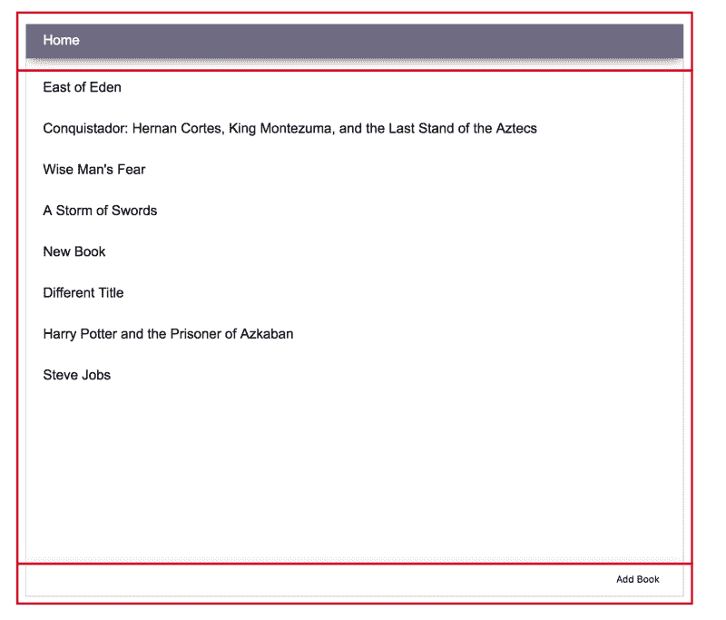*

***导航***

```
*`.nav {
  display: flex;
  padding: 0 10px;
  background-color: var(--color-purple);
  box-shadow: var(--box-shadow);
  z-index: 10;
}
.nav-item {
  padding: 10px;
  font-size: var(--font-size-st);
  color: var(--color-white);
  text-decoration: none;
}
.nav-item:hover {
  background-color: rgba(255, 255, 255, 0.1);
}`*
```

**

***标题***

```
*`.header {
  padding: 10px 0;
  font-size: var(--font-size-lg);
}`*
```

*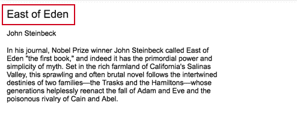*

***书籍列表***

```
*`.book-list {
  padding: 10px;
  overflow-y: scroll;
}
.book {
  display: flex;
  justify-content: space-between;
  padding: 15px 10px;
  font-size: var(--font-size-st);
  color: var(--color-black);
  text-decoration: none;
  cursor: pointer;
}
.book:hover {
  background: var(--color-grey);
}`*
```

*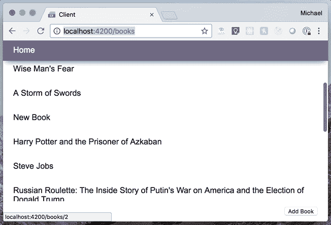*

***按钮***

```
*`button {
  cursor: pointer;
}`*
```

***图书明细***

```
*`.book.book--detail {
  flex-direction: column;
  justify-content: flex-start;
  max-width: 500px;
  background: var(--color-white);
  cursor: default;
}
.book-title {
  font-size: var(--font-size-lg);
}
.book-title,
.book-author,
.book-description {
  padding: 10px;
}`*
```

**

***添加/编辑图书表单***

```
*`.form {
  display: flex;
  flex-direction: column;
  padding: 10px 20px;
  background: var(--color-white);
}
input[type='text'],
textarea {
  margin: 10px 0;
  padding: 10px;
  max-width: 500px;
  font-size: var(--font-size-st);
  border: none;
  border-bottom: 1px solid var(--color-grey);
  outline: 0;
}`*
```

**

***动作***

```
*`.actions {
  display: flex;
  flex-direction: row;
  justify-content: flex-end;
  padding: 10px 20px;
  background-color: var(--color-white);;
  box-shadow: var(--box-shadow)
}`*
```

**

### *4.4 图书路线*

#### ***4.4.1 创建图书路线***

*现在我们已经有了自己的样式和容器 DOM。让我们生成一条新路径，显示数据库中的所有书籍:*

```
*`ember g route books`*
```

*路由器文件`client/app/router.js`更新为:*

```
*`import EmberRouter from '@ember/routing/router';
import config from './config/environment';
const Router = EmberRouter.extend({
  location: config.locationType,
  rootURL: config.rootURL
});
Router.map(function() {
  this.route('books');
});
export default Router;`*
```

#### ***4.4.2 在模型钩子中加载假数据***

*让我们编辑图书路径`client/app/routes/books.js`以从数据库中加载所有图书。*

```
*`import Route from '@ember/routing/route';
export default Route.extend({
  model() {
    return [
      {title: 'Monkey Adventure'},
      {title: 'Island Strife'},
      {title: 'The Ball'},
      {title: 'Simple Pleasures of the South'},
      {title: 'Big City Monkey'}
    ]
  }
});`*
```

*模型挂钩正在返回一个对象数组。这是用于演示目的的假数据。我们稍后将回到这里，并在准备就绪时使用 Ember Data 从数据库中加载实际数据。*

#### ***4.4.3 更新图书路线模板***

*让我们编辑图书路线模板`client/app/templates/books.hbs`。我们希望显示模型中返回的图书。*

```
*`<div class="book-list">
  {{#each model as |book|}}
    <div class="book">
      {{book.title}}
    </div>
  {{/each}}
</div>`*
```

*Ember 使用[车把模板库](https://guides.emberjs.com/release/templates/handlebars-basics/)。这里我们使用`each`助手来遍历`model`中的书籍数据数组。我们用类`.book`将数组中的每个项目包装在一个`div`中。用`{{book.title}}`访问并显示其标题信息。*

#### *4.4.4 演示:书籍路由加载和显示假数据*

*现在我们有了 DOM、`book`模型和带有一些假数据的`books` route 设置，我们可以看到它在浏览器中运行。看一看`localhost:4200/books`:*

*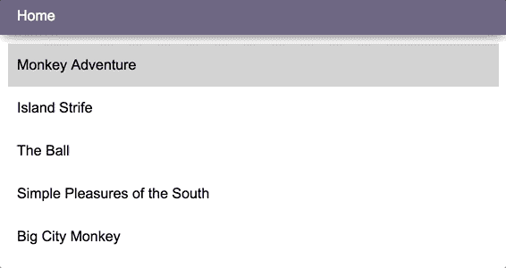

Mouse over a book title to highlight* 

#### *4.4.5 为重定向创建应用程序路由*

*参观`books`路线还得放个`/books`有点烦。让我们生成`application`路线。当我们进入基本路线`/`时，我们可以使用`redirect`钩子重定向到`books`路线。*

```
*`ember g route application`*
```

*如果提示覆盖`application.hbs`模板，说不。我们不想覆盖已经设置好的模板。*

*在`client/app/routes/application.js`中创建`redirect`挂钩:*

```
*`import Route from '@ember/routing/route';
export default Route.extend({
  redirect() {
    this.transitionTo('books');
  }
});`*
```

*现在，如果你访问`localhost:4200`，它将重定向到`localhost:4200/books`。*

**

### *4.5 在图书路径中显示真实数据*

#### *创建一个应用程序适配器*

*我们不想永远用假数据。让我们使用一个[适配器](https://www.emberjs.com/api/ember-data/release/classes/DS.Adapter)连接到后端，并开始将图书数据拉入客户端。可以把适配器想象成一个从商店接收请求的“*对象”。*它*将它们转化为针对持久层采取的适当行动……’**

*生成新的应用程序适配器:*

```
*`ember g adapter application`*
```

*找到文件`client/app/adapters/application.js`并更新它:*

```
*`import DS from 'ember-data';
import { computed } from '@ember/object';
export default DS.JSONAPIAdapter.extend({
  host: computed(function(){
    return 'http://localhost:8000';
  }),
  namespace: 'api'
});`*
```

*JSONAPIAdapter 是 Ember Data 使用的默认适配器。它将商店的请求转换成遵循 [JSON API](http://jsonapi.org/format/) 格式的 HTTP 请求。它插入名为[余烬数据](https://github.com/emberjs/data)的数据管理库。我们使用 Ember 数据以更有效的方式与后端接口。它可以在前端存储和管理数据，并在需要时向后端发出请求。这意味着较小的页面更新不需要不断向后端请求。这有助于用户体验更加流畅，加载速度更快*

*我们将使用它的`store`服务来访问`server`数据，而不用编写更复杂的`ajax`请求。但是对于更复杂的用例来说，这些仍然是必要的。*

*这里适配器告诉 Ember Data 它的`host`在`localhost:8000`，命名空间为`api`。这意味着对服务器的任何请求都以`http://localhost:8000/api/`开始。*

*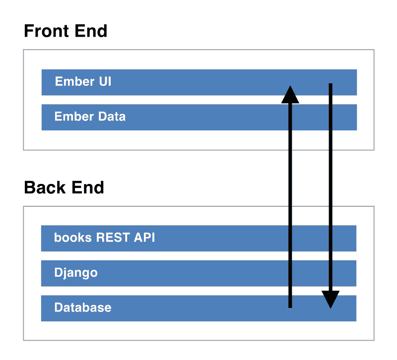

The full stack* 

#### *4.5.2 创建图书模型*

*Ember Data 对将其数据映射到来自后端的数据有特殊的要求。我们将生成一个`book`模型，以便它理解来自后端的数据应该映射到什么:*

```
*`ember g model book`*
```

*在`client/models/book.js`中定位文件并定义`book`型号:*

```
*`import DS from 'ember-data';
export default DS.Model.extend({
  title: DS.attr(),
  author: DS.attr(),
  description: DS.attr()
});`*
```

*这些属性与我们在后端定义的属性相同。我们再次定义它们，以便 Ember Data 知道从结构化数据中可以得到什么。*

#### *4.5.3 更新`books`路线*

*让我们通过导入`store`服务并使用它请求数据来更新 books 路由。*

```
*`import Route from '@ember/routing/route';
import { inject as service } from '@ember/service';
export default Route.extend({
  store: service(),
  model() {
    const store = this.get('store');
    return store.findAll('book');
  }
});`*
```

#### *4.5.4 演示:图书有一个 CORS 问题*

*到目前为止，我们已经创建了一个应用程序适配器，并更新了查询数据库中所有书籍的`books`路径。让我们看看我们得到了什么。*

*运行 Django 和 Ember 服务器。然后访问`localhost:4200/books`，您应该会在控制台中看到:*

*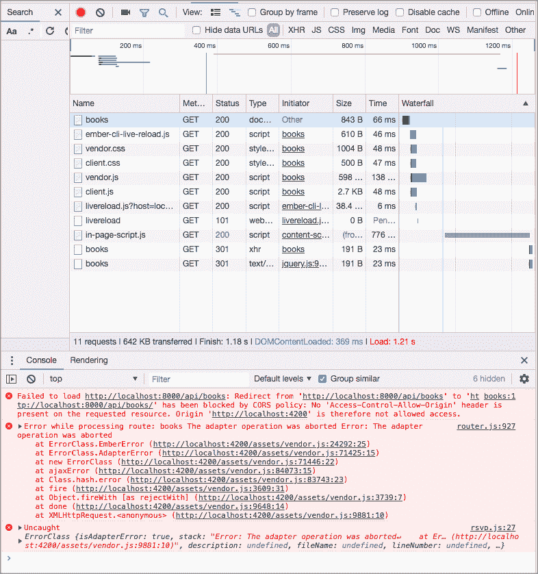*

*CORS 似乎有问题。*

#### *4.5.5 解决跨来源资源共享(CORS)问题*

*CORS 定义了一种方式，通过这种方式浏览器和服务器相互作用来确定允许一个请求是否安全。我们正在从`localhost:4200`向`localhost:8000/api/books`发出跨原点请求。从客户端到服务器，目的是访问我们的图书数据。*

*目前，前端不允许从后端端点请求数据。这个块导致了我们的错误。我们可以通过允许请求通过来解决这个问题。*

*首先安装一个应用程序，将 CORS 标题添加到回复中:*

```
*`pip install django-cors-headers`*
```

*将其安装到`INSTALLED_APPS`数组下`server`的`settings.py`文件中；*

```
*`INSTALLED_APPS = [
...
    'books',
    'corsheaders'
]`*
```

*将其添加到`MIDDLEWARE`数组的顶部:*

```
*`MIDDLEWARE = [
    'corsheaders.middleware.CorsMiddleware',
...
]`*
```

*最后，在开发期间允许所有请求通过:*

```
*`CORS_ORIGIN_ALLOW_ALL = DEBUG`*
```

#### *4.5.6 演示:CORS 问题已解决，数据格式不兼容*

*访问`localhost:4200`,您应该会在控制台中看到:*

**

*看起来我们解决了 CORS 问题，我们正收到来自`server`的回复，其中包含我们预期的数据:*

```
*`[
    {
        "id": 1,
        "title": "Conquistador",
        "author": "Buddy Levy",
        "description": "It was a moment unique in ..."
    },
    {
        "id": 2,
        "title": "East of Eden",
        "author": "John Steinbeck",
        "description": "In his journal, Nobel Prize ..."
    }
]`*
```

*尽管获得了 JSON 格式的对象数组，但它仍然不是我们想要的格式。这是 Ember Data 的预期:*

```
*`{
  data: [
    {
      id: "1",
      type: "book",
      attributes: {
        title: "Conquistador",
        author: "Buddy Levy",
        description: "It was a moment unique in ..."
      }
    },
    {
      id: "2",
      type: "book",
      attributes: {
        title: "East of Eden",
        author: "John Steinbeck",
        description: "In his journal, Nobel Prize ..."
      }
    }
  ]
}`*
```

*接近了，但还没到那一步。*

**

### *4.6 结论*

*我们已经完成了第 4 节中的以下步骤:*

*   *已安装的节点和 NPM*
*   *安装了 Ember CLI 并创建了一个新的客户端项目*
*   *基本 DOM 设置*
*   *创建了一个`books`路径和模板来加载和显示书籍*
*   *演示了用假数据运行的应用程序*
*   *创建了一个应用程序适配器来连接到后端并接收数据*
*   *创建了一个`book`模型并更新了`books`路线以捕获后端数据*
*   *演示了后端数据并没有按照 Ember Data 预期的方式构建*

*

This one’s mine* 

### *第 5 节:纠正数据格式，处理个人记录*

*在本节中，我们将使用 Django REST 框架 JSON API 以一种 Ember 数据可以使用的方式构建数据。我们还将更新`books` API 以返回 book 记录的单个实例。我们还将添加添加、编辑和创建书籍的功能。然后我们就完成了我们的应用程序！*

### *5.1 安装 Django REST 框架 JSON API*

*首先我们使用 pip 来安装 [Django REST 框架 JSON API](https://github.com/django-json-api/django-rest-framework-json-api) (DRF)。它会将常规的 DRF 响应转换成 [JSON API 格式](http://jsonapi.org/format/#document-resource-object-identification)的`identity`模型。*

*启用虚拟环境后:*

```
*`# install the Django REST Framework JSON API
  pip install djangorestframework-jsonapi`*
```

*接下来，更新`server/server/settings.py`中的 DRF 设置:*

```
*`REST_FRAMEWORK = {
  'PAGE_SIZE': 100,

  'EXCEPTION_HANDLER': 
    'rest_framework_json_api.exceptions.exception_handler',

  'DEFAULT_PAGINATION_CLASS':    'rest_framework_json_api.pagination.JsonApiPageNumberPagination',
'DEFAULT_PARSER_CLASSES': (
    'rest_framework_json_api.parsers.JSONParser',
    'rest_framework.parsers.FormParser',
    'rest_framework.parsers.MultiPartParser'
  ),
'DEFAULT_RENDERER_CLASSES': (
    'rest_framework_json_api.renderers.JSONRenderer',
    'rest_framework.renderers.BrowsableAPIRenderer',
   ),
'DEFAULT_METADATA_CLASS': 'rest_framework_json_api.metadata.JSONAPIMetadata',
'DEFAULT_FILTER_BACKENDS': (
     'rest_framework.filters.OrderingFilter',
    ),
'ORDERING_PARAM': 'sort',

   'TEST_REQUEST_RENDERER_CLASSES': (
     'rest_framework_json_api.renderers.JSONRenderer',
    ),

   'TEST_REQUEST_DEFAULT_FORMAT': 'vnd.api+json'
}`*
```

*这些用 JSON API 的默认值覆盖了 DRF 的默认设置。我增加了`PAGE_SIZE`,这样我们可以在一次响应中收回多达 100 本书。*

### *5.2 使用单个帐簿记录*

#### *创建一个视图*

*让我们也更新一下我们的`books` API，这样我们就可以检索图书记录的单个实例。*

*在`server/books/api/views.py`中创建名为`bookRudView`的新视图:*

```
*`class bookRudView(generics.RetrieveUpdateDestroyAPIView):
  resource_name       = 'books'
  lookup_field        = 'id'
  serializer_class    = bookSerializer
  def get_queryset(self):
    return Book.objects.all()`*
```

*该视图使用`id` `lookup_field`来检索单个图书记录。[RetrieveUpdateDestroyAPIView](http://www.django-rest-framework.org/api-guide/generic-views/#retrieveupdatedestroyapiview)提供了基本的`GET`、`PUT`、`PATCH`和`DELETE`方法处理程序。正如您可能想象的那样，这些让我们可以创建、更新和删除单个图书数据。*

#### *更新图书 API URLs*

*我们需要创建一个新的 URL 模式，通过`bookRudView`传递数据。*

```
*`from .views import bookAPIView, bookRudView
from django.conf.urls import url
urlpatterns = [
  url(r'^$', bookAPIView.as_view(), name='book-create'),
  url(r'^(?P<id>\d+)', bookRudView.as_view(), name='book-rud')
]`*
```

*导入`bookRudView`，匹配图案`r'^(?P<id>`；\d+)'，并给它起名叫`book-rud`。*

#### *更新服务器 URL*

*最后，更新`server/server/urls.py`中的`books` API URL 模式。我们希望匹配在`books/`之后开始的模式:*

```
*`...
urlpatterns = [
  ...
  url(r'^api/books/?', include('books.api.urls', namespace='api-books')),
]`*
```

#### *5.2.4 演示:访问单个帐簿记录*

*现在，如果您访问`localhost:8000/api/books/1`，它应该显示一个与图书的`id`相匹配的图书记录:*

*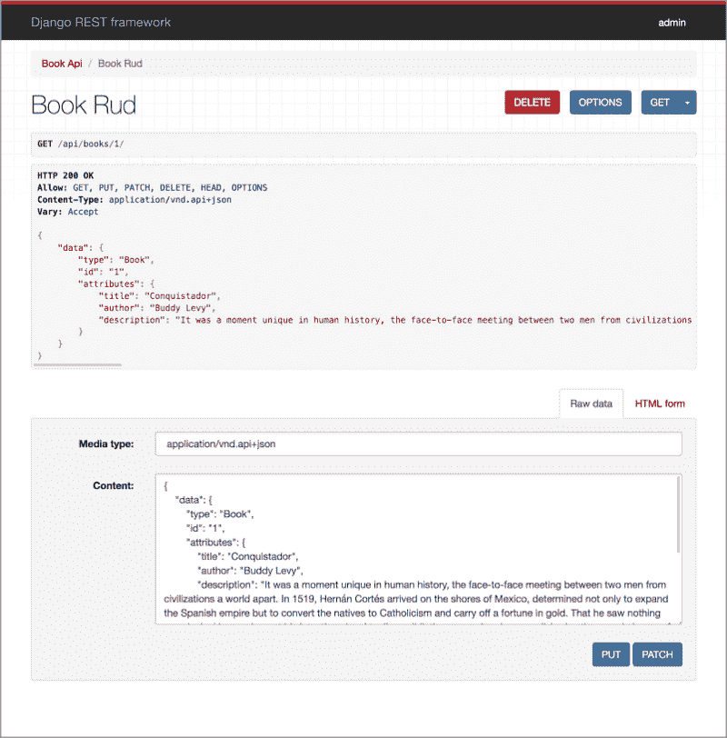*

*注意，我们可以访问`DELETE`、`PUT`、`PATCH`和其他方法。这些自带`RetrieveUpdateDestroyAPIView`。*

#### *5.2.5 演示:以正确的格式从后端捕获和显示数据*

*安装了`JSONAPI`之后，后端应该会发回 Ember 可以处理的响应。运行两个服务器并访问`localhost:4200/books`。我们应该从后端获取真实数据，并让路由显示出来。成功！*

*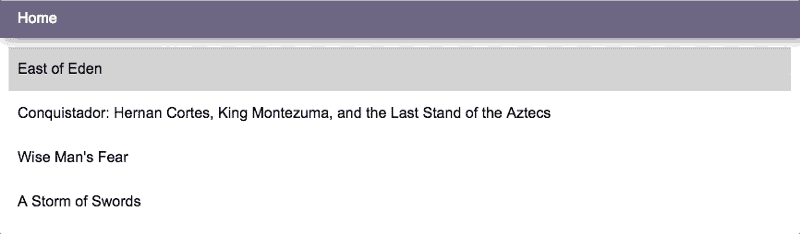

Capturing and displaying data from the back end* 

*看看我们得到的回应。它是 Ember 数据使用的有效的`JSONAPI`格式。*

*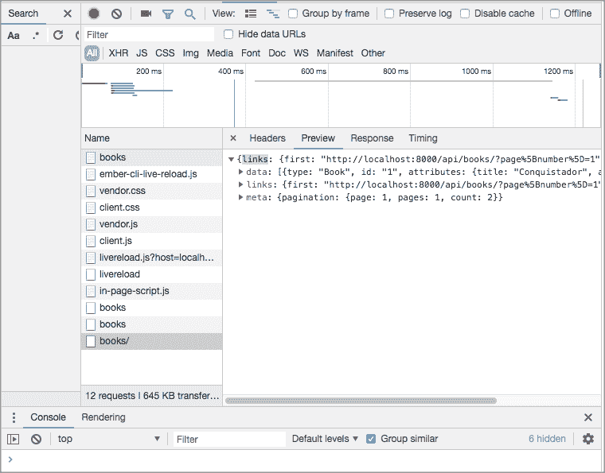***

### *5.3 出书路线*

*我们现在可以在`books`路径中查看数据库中的图书列表。接下来，让我们在前端`client`创建一个新的路由。它将详细显示单个图书的`title`、`author`和`description`数据。*

#### *5.3.1 创建`book`路线*

*为单个图书页面生成新路线:*

```
*`ember g route book`*
```

*在`router.js`中，用路径`‘books/:book_id’`更新新路线。这将覆盖默认路径，并接受一个`book_id`参数。*

```
*`...
Router.map(function() {
  this.route('books');
  this.route('book', { path: 'books/:book_id' });
});
...`*
```

*接下来更新`book`路线`client/app/routes/book.js`以从数据库中检索单个图书记录:*

```
*`import Route from '@ember/routing/route';
import { inject as service } from '@ember/service';
export default Route.extend({
  store: service(),
model(book) {
    return this.get('store').peekRecord('book', book.book_id);
  }
});`*
```

*如`router.js`所示，`book`路线接受`book_id`参数。该参数进入路由的`model`钩子，我们用它来检索带有余烬数据`store`的书。*

#### *5.3.2 更新`book`模板*

*我们的`client/app/templates/book.hbs`模板应该显示我们从`store`返回的图书数据。去掉`{{outlet}}`，更新一下:*

```
*`<div class="book book--detail">
  <div class="book-title">
    {{model.title}}
  </div>
  <div class="book-author">
    {{model.author}}
  </div>
  <div class="book-description">
    {{model.description}}
  </div>
</div>`*
```

*像在`books`模板中一样，我们使用[点符号](https://codeburst.io/javascript-quickie-dot-notation-vs-bracket-notation-333641c0f781)来访问`model`属性。*

#### *5.3.3 更新`books`模板*

*最后，我们来更新一下`books`模板。我们希望链接到我们创建的`book`路线中显示的每个单独的图书页面:*

```
*`<div class="book-list">
  {{#each model as |book|}}
    {{#link-to 'book' book.id class="book"}}
      {{book.title}}
    {{/link-to}}
  {{/each}}
</div>`*
```

*用`link-to`助手包裹`book.title`。它是这样工作的:*

*   *创建到`book`路线的链接*
*   *接受`book.id`作为参数*
*   *用一个`class`来设置`<`的样式；在 DOM 中生成的一个>标签。*

#### *5.3.4 演示:选择图书查看详细信息*

*现在来看看`localhost:4200/books`。我们可以点击我们的书籍，以获得详细的看法。太棒了。*

*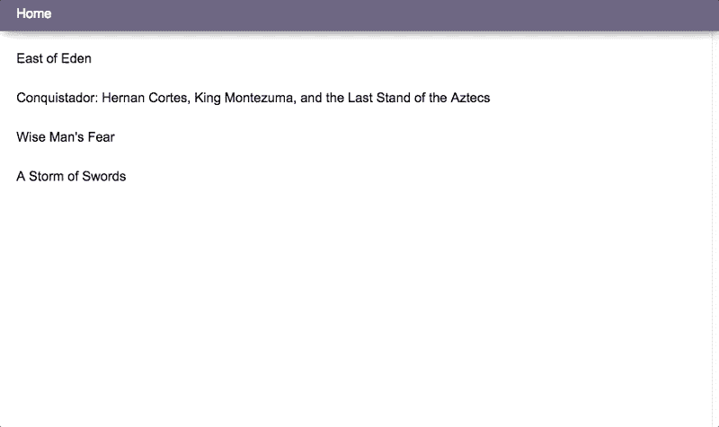***

### *5.4 结论*

*随着以下步骤的完成，我们已经到了第 5 节的末尾:*

*   *通过来自 Django 的数据发现了问题*
*   *安装了 Django REST 框架 JSON API*
*   *更新了`books`路线模板*
*   *创建了`book`路线和模板*

*

Getting into the details now* 

### *第 6 部分:功能前端*

*在本节中，我们将向前端体验添加以下功能:*

*   *添加带有标题、作者和描述字段的新书*
*   *编辑现有图书的标题、作者和描述栏*
*   *删除现有图书*

*这就是我们完成应用程序剩余部分所要做的全部工作。我们走了很长的路。让我们坚持到底！*

### *6.1 向数据库添加新书*

*我们现在可以查看数据库中的所有书籍，并详细查看每本书的记录。是时候构建向数据库添加新书的功能了。我们将采取以下步骤来实现这一目标:*

*   *`create-book`路线处理创建新书并将其添加到数据库的过程*
*   *`create-book`模板将有一个带有两个输入和一个文本区域的表单，用于接收`title`、`author`和`description`*
*   *`create-book`控制器处理输入表单的数据*

#### *6.1.1 创建创建书路由和控制器*

*生成处理新书创作的`create-book`路线:*

```
*`ember g route create-book`*
```

*创建同名的控制器来保存表单数据:*

```
*`ember g controller create-book`*
```

#### *6.1.2 设置`create-book`控制器*

*在`client/app/controllers/create-book.js`中创建一个名为`form`的计算属性。它将返回一个带有我们的图书数据属性的对象。这是我们捕获用户输入的新书数据的地方。默认为空。*

```
*`import Controller from '@ember/controller';
import { computed } from '@ember/object';
export default Controller.extend({
  form: computed(function() {
    return {
      title: '',
      author: '',
      description: ''
    }
  })
});`*
```

#### *6.1.3 设置`create-book`路线*

*在`client/app/routes/create-book.js`中，我们做了以下工作:*

*   *创建操作以确认新书的创建*
*   *取消创建过程*
*   *输入路线时，使用路线挂钩清除表单数据:*

```
*`import Route from '@ember/routing/route';
import { inject as service } from '@ember/service';
export default Route.extend({
  store: service(),
  setupController(controller, model) {
    this._super(controller, model);
    this.controller.set('form.title', '');
    this.controller.set('form.author', '');
    this.controller.set('form.description', '');
  },
  actions: {
    create() {
      const form = this.controller.get('form');
      const store = this.get('store');
      const newBook = store.createRecord('book', {
        title: form.title,
        author: form.author,
        description: form.description
      });
      newBook.save()
        .then(() => {
          this.transitionTo('books');
        });
     },
     cancel() {
       this.transitionTo('books');
     }
  }
});`*
```

*`setupController`钩子允许我们重置表单的值。这是为了当我们在页面间来回移动时，它们不会持续存在。我们不想在没有完成创建图书流程的情况下就点击进入另一个页面。如果我们这样做了，我们将会看到未使用的数据仍然在我们的表单中。*

*`create()`动作将获取表单数据，并用余烬数据`store`创建一个新记录。然后将它持久化到 Django 后端。一旦完成，用户将返回到`books`路线。*

*`cancel`按钮将用户转换回`books`路线。*

#### *6.1.4 设置`create-book`模板*

*接下来，在`client/app/template/create-book.hbs`中，我们构建表单:*

```
*`<form class="form">
  <div class="header">
    Add a new book
  </div>
  {{input
    value=form.title
    name="title"
    placeholder="Title"
    autocomplete='off'
  }}
  {{input
    value=form.author
    name="author"
    placeholder="Author"
    autocomplete='off'
  }}
  {{textarea
    value=form.description
    name="description"
    placeholder="Description"
    rows=10
  }}
</form>
<div class="actions">
  <div>
    <button {{action 'create'}}>
      Create
    </button>
    <button {{action 'cancel'}}>
      Cancel
    </button>
  </div>
</div>`*
```

*`form`使用内置的`{{input}}`助手来:*

*   *接受价值观*
*   *显示占位符*
*   *关闭自动完成功能。*

*区域助手的工作方式类似，只是增加了行数。*

*动作`div`包含创建和取消两个按钮。每个按钮使用`{{action}}`助手绑定到它的同名动作。*

#### *6.1.5 更新`books`路线模板*

*创建图书难题的最后一部分是在`books`路线中添加一个按钮。它会让我们进入`create-book`路线，开始创作一本新书。*

*添加到`client/app/templates/books.hbs`的底部:*

```
*`...
{{#link-to 'create-book' class='btn btn-addBook'}}
  Add Book
{{/link-to}}`*
```

#### *6.1.6 演示:可以添加新书*

*现在，如果我们回到过去，再次尝试创作一本新书，我们会获得成功。点击进入本书查看更详细的观点:*

*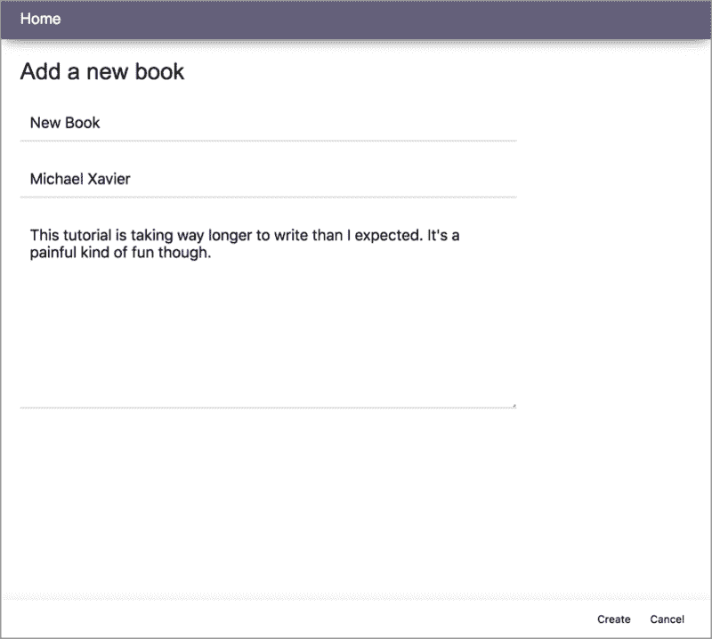

Adding a new book to the library* *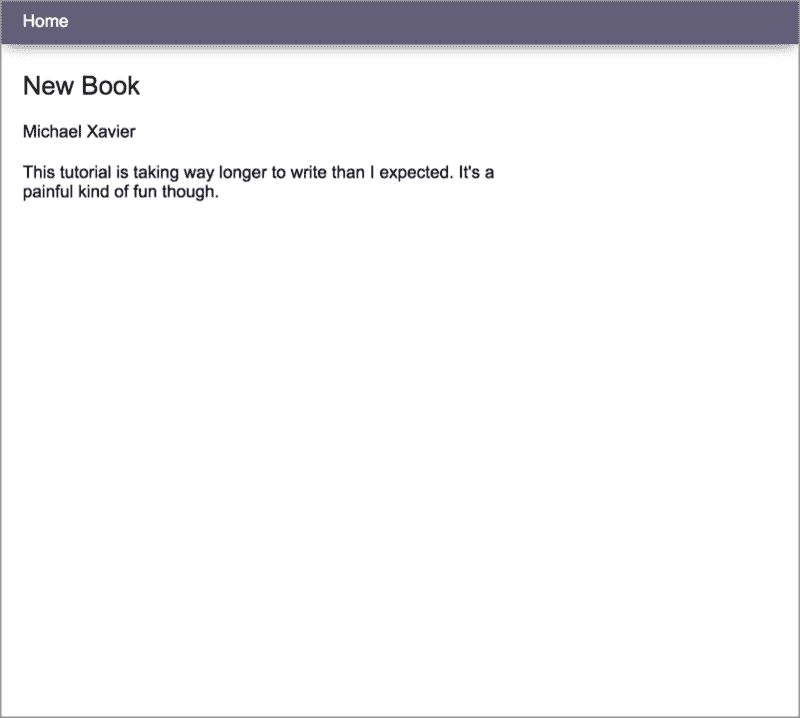

New book created and displayed* **

### *6.2 从数据库中删除图书*

*既然我们可以向数据库中添加书籍，我们也应该能够删除它们。*

#### *6.2.1 更新`book`路线模板*

*首先更新`book`路线的模板。在`book book--detail`下添加:*

```
*`...
<div class="actions {{if confirmingDelete
                         'u-justify-space-between'}}">
  {{#if confirmingDelete}}
    <div class="u-text-danger">
      Are you sure you want to delete this book?
    </div>
    <div>
      <button {{action 'delete' model}}>Delete</button>
      <button {{action (mut confirmingDelete)false}}>
        Cancel
      </button>
    </div>
  {{else}}
    <div>
      <button {{action (mut confirmingDelete) true}}>Delete</button>
    </div>
  {{/if}}
</div>`*
```

*`actions` `div`包含书籍删除过程的按钮和文本。*

*我们有一个`bool`叫做`confirmingDelete`，它将被设置在路线的`controller`上。`confirmingDelete`在`true`的时候在`actions`上添加`.u-justify-space-between`工具类。*

*如果为真，它还会显示一个带有实用程序类`.u-text-danger`的提示。这将提示用户确认删除图书。出现两个按钮。一个在我们的路线上运行`delete`行动。另一个使用`mut`辅助者将`confirmingDelete`翻转到`false`。*

*当`confirmingDelete`为`false`(默认状态)时，单个`delete`按钮显示。点击它会将`confirmingDelete`翻转到`true`。这将显示提示符和另外两个按钮。*

#### *6.2.2 更新`book`路线*

*接下来更新`book`路线。在`model`钩下添加:*

```
*`setupController(controller, model) {
  this._super(controller, model);
  this.controller.set('confirmingDelete', false);
},`*
```

*在`setupController`我们称之为`this._super()`。这就是为什么在我们开始工作之前，控制器会进行它通常的动作。然后我们将`confirmingDelete`设置为`false`。*

*我们为什么要这样做？假设我们开始删除一本书，但是离开页面时既没有取消操作也没有删除这本书。当我们转到任何一页时，`confirmingDelete`将被设置为`true`作为剩余页。*

*接下来让我们创建一个`actions`对象来保存我们的路由操作:*

```
*`actions: {
  delete(book) {
    book.deleteRecord();
    book.save().then(() => {
      this.transitionTo('books');
    });
  }
}`*
```

*模板中引用的`delete`动作接收一个`book`。我们在`book`上运行`deleteRecord`,然后运行`save`,以保持更改。一旦承诺完成，`transitionTo`就转换到`books`路线(我们的列表视图)。*

#### *6.2.3 演示:可以删除现有的图书*

*让我们来看看实际情况。运行服务器并选择要删除的图书。*

*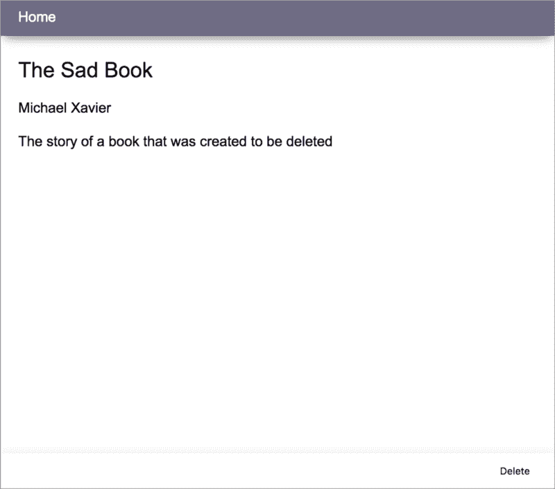

Delete button visible when confirmingDelete is false* *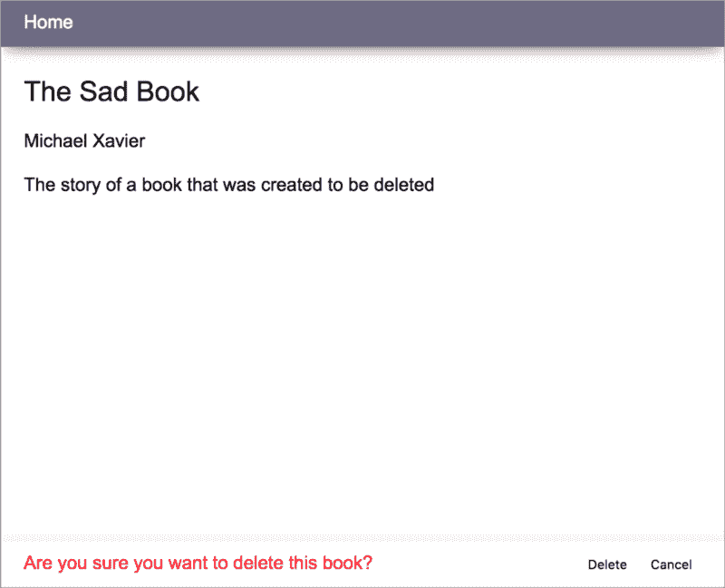

Prompt to confirm deletion of book when confirmingDelete is true* 

*当你删除这本书时，它会重定向到`books`路径。*

**

### *6.3 在数据库中编辑图书*

*最后但同样重要的是，我们将添加编辑现有图书信息的功能。*

#### *6.3.1 更新`book`路线模板*

*打开`book`模板并添加一个表单来更新图书数据:*

```
*`{{#if isEditing}}
  <form class="form">
    <div class="header">Edit</div>
    {{input
      value=form.title
      placeholder="Title"
      autocomplete='off'
    }}
    {{input
      value=form.author
      placeholder="Author"
      autocomplete='off'
    }}
    {{textarea
      value=form.description
      placeholder="Description"
      rows=10
    }}
  </form>
  <div class="actions">
    <div>
      <button {{action 'update' model}}>Update</button>
      <button {{action (mut isEditing) false}}>Cancel</button>
    </div>
  </div>
{{else}}
  ...
  <div>
    <button {{action (mut isEditing) true}}>Edit</button>
    <button {{action (mut confirmingDelete) true}}>Delete</button>
  </div>
  ...
{{/if}}`*
```

*首先让我们用一个`if`语句包装整个模板。这对应于默认为`false`的`isEditing`属性。*

*请注意，该表单与我们的 create book 表单几乎完全相同。唯一真正的区别是动作`update`在`book`路线中运行`update`动作。`cancel`按钮也将`isEditing`属性翻转到`false`。*

*我们之前拥有的所有东西都嵌套在`else`中。我们添加`Edit`按钮将`isEditing`转换为真并显示表单。*

#### *6.3.2 创建一个`book`控制器来处理表单值*

*还记得`create-book`控制器吗？我们用它来保存稍后发送到服务器的值，以创建新的图书记录。*

*我们将使用类似的方法在我们的`isEditing`表单中获取和显示图书数据。它会用当前图书的数据预先填充表单。*

*生成图书控制器:*

```
*`ember g controller book`*
```

*像前面一样打开`client/app/controllers/book.js`并创建一个`form`计算属性。与之前不同，我们将使用`model`用当前的`book`数据预先填充我们的表单:*

```
*`import Controller from '@ember/controller';
import { computed } from '@ember/object';
export default Controller.extend({
  form: computed(function() {
    const model = this.get('model');
    return {
      title: model.get('title'),
      author: model.get('author'),
      description: model.get('description')
    }
  })
});`*
```

#### *6.3.3 更新`book`路线*

*我们必须再次更新我们的路线:*

```
*`setupController(controller, model) {
  ...
  this.controller.set('isEditing', false);
  this.controller.set('form.title', model.get('title'));
  this.controller.set('form.author', model.get('author'));
  this.controller.set('form.description', model.get('description'));
},`*
```

*让我们加上`setupController`挂钩。将`isEditing`设置为`false`，并将所有表单值重置为默认值。*

*接下来让我们创建`update`动作:*

```
*`actions: {
  ...
  update(book) {
    const form = this.controller.get('form');
    book.set('title', form.title);
    book.set('author', form.author);
    book.set('description', form.description);
    book.save().then(() => {
      this.controller.set('isEditing', false);
    });
  }
}`*
```

*这很简单。我们获取表单值，在`book`上设置这些值，并用`save`持久化。一旦成功，我们将`isEditing`翻转回`false`。*

#### *6.3.4 演示:可以编辑现有图书的信息*

*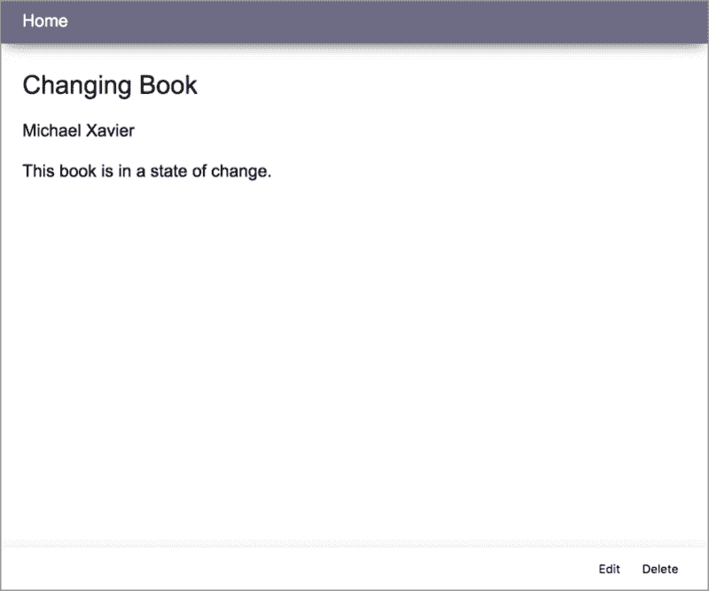

Edit button to toggle the isEditing controller property* *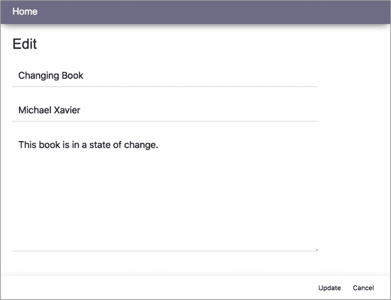

Form pre-populated with book’s current information* *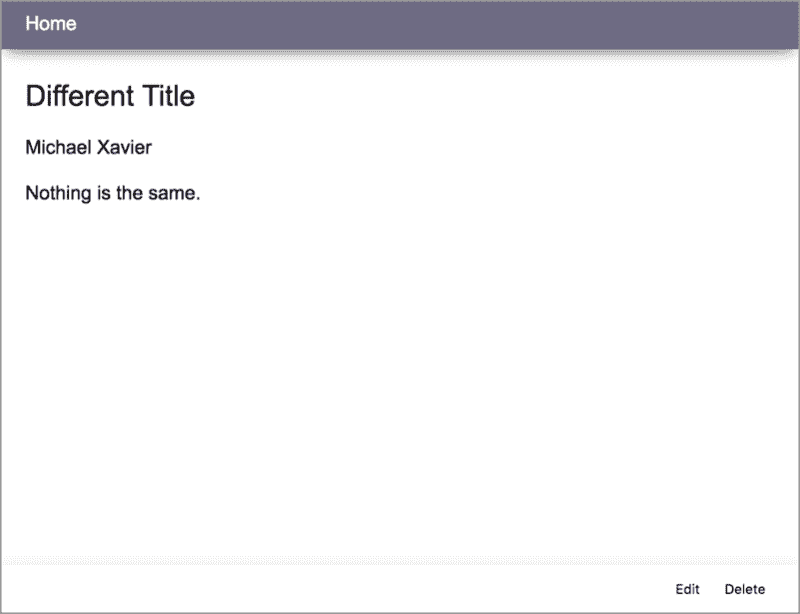

Book updated with new information* **

### *6.4 结论*

*在第 6 节的**结束时，我们已经完成了以下步骤:***

*   *通过来自 Django 的数据发现了问题*
*   *将 JSON API 安装到 Django 中*
*   *更新了图书路线模板*
*   *创建了图书详细路线和模板*
*   *可以从 EmberJS 客户端查看、添加、编辑和删除数据库记录*

***就这样。我们做到了！我们使用 Django 和 Ember 构建了一个非常基本的全栈应用程序。***

*让我们退后一步，花一分钟思考一下我们已经建立了什么。我们有一个名为`my_library`的应用程序:*

*   *列出数据库中的书籍*
*   *允许用户更详细地查看每本书*
*   *添加一本新书*
*   *编辑现有图书*
*   *删除一本书*

*在构建应用程序时，我们了解了 Django 以及如何使用它来管理数据库。我们创建了模型、序列化器、视图和 URL 模式来处理数据。我们使用 Ember 创建了一个用户界面，通过 API 端点来访问和更改数据。*

*

Phew* 

### *第 7 节:继续前进*

### *7.1 下一步是什么*

*如果你已经做到这一步，你已经完成了教程！应用程序正在运行，具有所有预期的功能。那是非常值得骄傲的。软件开发，复杂？那是保守的说法。即使我们拥有所有可用的资源，我们也会觉得完全无法接近。我一直有这种感觉。*

*对我有用的是经常休息。站起来，离开你正在做的事情。做点别的。然后回来把你的问题一步一步分解成最小的单元。修复和重构，直到你到达你想要的地方。积累知识没有捷径。*

*无论如何，我们可能已经做了很多介绍，但我们只是触及了表面。关于全栈开发，还有很多东西需要学习。以下是一些值得思考的例子:*

*   *具有身份验证的用户帐户*
*   *测试应用程序的功能*
*   *将应用程序部署到 web*
*   *从头开始编写 REST API*

*当我有时间的时候，我会考虑写更多关于这些话题的文章。*

*我希望这个教程对你有用。它旨在作为一个起点，让您了解更多关于 Django、Ember 和全栈开发的知识。对我来说，这绝对是一次学习经历。**向我的[关闭文件夹](http://closingfolders.com/)团队大声喊出来，感谢他们的支持和鼓励。我们现在正在招聘，请随时联系我们！***

*如果您想联系我，您可以通过以下渠道联系我:*

*   *[电子邮件](mailto:michael.xavier@closingfolders.com)*
*   *[linkedIn](https://www.linkedin.com/in/vinothmichaelxavier/)*
*   *[中等](https://medium.com/@sunskyearthwind)*
*   *[个人网站](https://lookininward.github.io/)*

### *7.2 进一步阅读*

*写这篇教程迫使我直面自己知识的边缘。以下资源有助于我理解所涵盖的主题:*

*[什么是全栈程序员？](http://qr.ae/TUIx4x)
[什么是 web 应用？](https://stackoverflow.com/a/8694944/5513243)
[Django 是什么？](https://tutorial.djangogirls.org/en/django/)
[ember js 是什么？](https://hacks.mozilla.org/2014/02/ember-js-what-it-is-and-why-we-need-to-care-about-it/)
[什么是版本控制？](https://www.atlassian.com/git/tutorials/what-is-version-control)
[什么是 Git？](https://medium.com/swlh/git-as-the-newbies-learning-steroid-963a2146220b)
[如何配合 Github 使用 Git？](http://rogerdudler.github.io/git-guide/)
[如何创建 Git 资源库？](https://help.github.com/articles/create-a-repo/)
[如何添加 Git remote？](https://help.github.com/articles/adding-a-remote/)
[什么是模型？](https://docs.djangoproject.com/en/1.11/topics/db/models/)
[什么是视图？](https://docs.djangoproject.com/en/1.11/topics/http/views/)
[什么是超级用户？](https://docs.djangoproject.com/en/1.11/ref/django-admin/#createsuperuser)
[什么是迁移？](https://docs.djangoproject.com/en/2.1/ref/django-admin/#django-admin-makemigrations)
[什么是迁移？](https://docs.djangoproject.com/en/2.1/ref/django-admin/#django-admin-migrate)
[什么是 SQLite？](https://www.sqlite.org/about.html)
[JSON Python 解析:简单指南](https://www.makeuseof.com/tag/json-python-parsing-simple-guide/)
[如何保护 API 密钥](https://medium.freecodecamp.org/how-to-securely-store-api-keys-4ff3ea19ebda)
[什么是 Python？](https://www.python.org/doc/essays/blurb/)
[pip 是什么？](https://en.wikipedia.org/wiki/Pip_(package_manager))
[什么是 virtualenv？](https://virtualenv.pypa.io/en/stable/)
[virtualenv 和 git repo 的最佳实践](http://libzx.so/main/learning/2016/03/13/best-practice-for-virtualenv-and-git-repos.html)
[什么是 API？](https://medium.freecodecamp.org/what-is-an-api-in-english-please-b880a3214a82)
[什么是 API 端点？](https://smartbear.com/learn/performance-monitoring/api-endpoints/)
[Django REST 框架是什么？](http://www.django-rest-framework.org/)
[什么是 __init__。py？](https://stackoverflow.com/a/448279/5513243)
[什么是串行器？](http://www.django-rest-framework.org/api-guide/serializers/)
[什么是观点？](https://docs.djangoproject.com/en/1.11/topics/http/views/)
[什么是网址？](https://tutorial.djangogirls.org/en/django_urls/)
[JSON 是什么？](https://www.w3schools.com/js/js_json_intro.asp)
[什么是正则表达式？](https://www.tutorialspoint.com/python/python_reg_expressions.htm)
[什么是 __init__。py do？](https://stackoverflow.com/questions/448271/what-is-init-py-for/448279#448279)
[什么是休息？](http://rest.elkstein.org/)
[node . js 是什么？](https://www.w3schools.com/nodejs/nodejs_intro.asp)
[NPM 是什么？](https://www.w3schools.com/nodejs/nodejs_npm.asp)
[ember js 是什么？](https://hacks.mozilla.org/2014/02/ember-js-what-it-is-and-why-we-need-to-care-about-it/)
[什么是 Ember CLI？](https://ember-cli.com/)
[什么是 Ember-Data？](https://github.com/emberjs/data)
[什么是模型？](https://guides.emberjs.com/release/models/)
[什么是路线？](https://guides.emberjs.com/release/routing/)
[什么是路由器？](https://guides.emberjs.com/release/routing/defining-your-routes/)
[什么是模板？](https://guides.emberjs.com/release/templates/handlebars-basics/)
[什么是适配器？](https://www.emberjs.com/api/ember-data/release/classes/DS.Adapter)
[Django REST 框架 JSON API 是什么？](https://github.com/django-json-api/django-rest-framework-json-api)
[JSON API 格式是什么？](http://jsonapi.org/format/#document-resource-object-identification)
[什么是点符号？](https://codeburst.io/javascript-quickie-dot-notation-vs-bracket-notation-333641c0f781)*