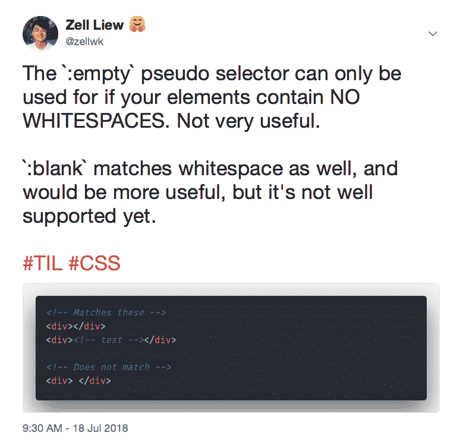
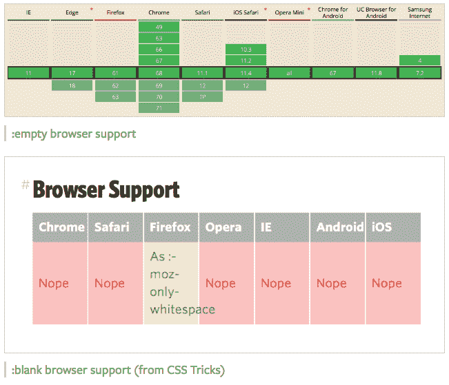

# 何时使用:empty 和:blank CSS 伪选择器

> 原文：<https://www.freecodecamp.org/news/empty-and-blank-53b9e96151cd/>

我前阵子发关于`:empty`和`:blank`的微博时犯了一个可怕的错误。我说`:empty`没用，`:blank`比`:empty`有用多了。



我错了！

`:empty`其实已经足够好了。我们甚至不需要`:blank`！

#### 快速介绍

好的，首先，什么是`:empty`什么是`:blank`？

`:empty`是伪选择器。它允许您选择空的元素。

```
/* This is CSS */
```

```
:empty { /* do something */}
```

空元素是指其中没有任何内容的元素。它甚至不能有空格。

```
<!-- This is html -->
```

```
<!-- Example of an empty element --><div></div>
```

空元素可以有注释，只要注释填满了整个元素。

```
<!-- This is html -->
```

```
<!-- Empty elements can have comments --><div><!-- this is a comment --></div>
```

`:blank`是`:empty`的加电形式。它允许您选择包含空格的元素:

```
<!-- This is html -->
```

```
<!-- Matched with :blank but not with :empty --><div> </div>
```

如果需要,`:empty`和`:blank`都很有用:

1.  设置空元素的样式
2.  创建空状态

#### 一个例子

假设你有一个第四代>。当错误发生时，你只能用内容填充 `this` <分区>。

```
<!-- This is html -->
```

```
<!-- Without errors --><div class="error"></div>
```

```
<!-- With errors --><div class="error">Whoops! Something went wrong!</div>
```

这里，您需要对`.error` div 进行样式化。如果不使用`:empty`，就需要依赖一个类或者属性。这感觉是多余的。

```
<!-- This is html -->
```

```
<!-- With errors --><div class="error" data-state="error">Whoops! Something went wrong!</div>
```

```
/* This is CSS */
```

```
.error { display: none; background-color: hsl(0, 20%, 50%); padding: 0.5em 0.75em;}
```

```
.error[data-state="error"] { display: block;}
```

但是如果使用`:empty`，就不需要额外的类或者属性了。您可以设置。错误类直接。你甚至不需要`display: none;`！

```
/* This is CSS */
```

```
.error { background-color: hsl(0, 20%, 50%); padding: 0.5em 0.75em;}
```

```
.error:empty { padding: 0;}
```

这是我为你制作的一个码笔[空演示](https://codepen.io/zellwk/pen/JaPgdN/)(试着把`.error:empty`中的`padding: 0;`去掉，你会看到一个红色背景？).

假设您想要创建一个待办事项列表。当你的用户第一次看到待办事项列表时，他们可能会看到零个待办事项。

当 todos 为零时，显示什么？

这种零 todo 状态就是我们所说的空状态。

如果你想为你的待办事项列表创建一个空的状态，你可以在 `you` r < ul >之后添加一个额外的`<d` iv >。当你这样做的时候，你可以使用一个 com `binati` on of :em `p` ty 和+(相邻的`s` ibling)或~(后续兄弟)选择器来设置空状态的样式。

```
<!-- This is html -->
```

```
<ul> <li>Item 1</li> <li>Item 2</li> <li>Item 3</li></ul><div class="empty-state"></div>
```

```
/* This is CSS */
```

```
.empty-state { display: none;}
```

```
ul:empty + .empty-state { display: block;}
```

我从海登·皮克林那里学会了如何这样使用`:empty`。如果你想看看 todo-list 的例子，请查阅 [Heydon 的文章](https://inclusive-components.design/a-todo-list/)关于[包容性组件](https://inclusive-components.design/)。

> 注意:空状态很重要。如果你需要一些令人信服的东西，可以看看关于 vision 的这篇文章。

#### 剖析我的推理

`:empty`在实践中往往就足够了。我觉得`:empty`不够好，有两个原因:

1.  开发者体验差
2.  我需要用 JavaScript 手动修剪空白

第一个原因是有道理的，但没什么大不了的。

**第二个理由不成立**。我以为我必须修剪空白，但我不需要。

我会带你看完这两个。

让我们回到 todo-list 的例子。假设我们创建了一个 todo-list，我们有这个标记。

```
<!-- This is html -->
```

```
<ul> <li>Item 1</li> <li>Item 2</li> <li>Item 3</li></ul><div class="empty-state"></div>
```

你如何检查`:empty`是否在工作？

嗯，我会删除每个`<`李>th`c`MD+x。这个命令会删除整行。当我删除了所有的`thre` e < li >之后，我将以这个标记结束:

```
<!-- This is html -->
```

```
<ul></ul>
```

现在，你应该知道上面的 HTML 不会触发`:empty`。`:empty`仅在元素中没有空白时有效。

我不得不删除空白来让`:empty`工作，这意味着更多的击键。这是一件我希望不必经历的苦差事。

不过话说回来，这是为了大利益的小问题。

我再说一遍。**如果使用`:empty`，就不需要在 JavaScript** 中手动修剪空白。我做了一个错误的假设。

让我们看一个例子，你就会明白我的意思了。我们将再次使用 todo-list 示例。

假设我们现在有这个 HTML:

```
<!-- This is html -->
```

```
<ul> <li>Item 1</li></ul><div class="empty-state"></div>
```

为了使空状态生效，我们需要删除最后的`<` li >项 `fro` m < ul >。如果你使用普通 JavaScript，你可以 d `o this with` removeChild。

```
// This is JavaScript
```

```
const ul = document.querySelector('ul')const li = ul.children[0]
```

```
ul.removeChild(li)
```

我(错误地)认为`removeChild`会产生这个 HTML:

```
<!-- This is html -->
```

```
<ul></ul>
```

如果它生成这个 HTML，我将不得不修剪列表中剩余的任何空白(这是额外的 JavaScript)。

```
// This is JavaScript
```

```
const ul = document.querySelector('ul')const li = ul.children[0]
```

```
ul.removeChild(li)
```

```
if (ul.children.length === 0) { ul.innerHTML = ''}
```

就像我说的，我错了。它没有生成上面的 HTML。相反，这是它产生的结果:

```
<!-- This is html -->
```

```
<ul></ul>
```

这意味着我们不需要额外的 JavaScript 来修剪空白！

> 声明:我检查了 Safari、Chrome 和 Firefox 上的输出。不过我还没有检查过 Edge。如果你能帮我测试一下，我会非常感激的！

这个例子的代码如下:

看我在 [CodePen](https://codepen.io/) 上做的( [@zellwk](https://codepen.io/zellwk) )带 todolist 的笔[空 demo。](https://codepen.io/zellwk/pen/ZMzgJp/)

`:empty`在所有浏览器上都支持，`:blank`浏览器支持差。这给了你足够的理由今天使用`:empty`而不是`:blank`！



我希望有一天浏览器对`:blank`的支持会有所改善。

#### 包扎

`:empty`和`:blank`让您可以轻松地样式化空元素和产生空状态。

`:blank`比`:empty`更好，因为它为我们提供了更好的开发者体验。但是我们不能用`:blank`，因为`:blank`没有足够的浏览器支持。

`:empty`往往就足够好了。你已经可以用它了。想用就用吧！？

试一试，让我知道你的想法！

感谢阅读。这篇文章对你有什么帮助吗？如果你有，[我希望你能考虑分享它](http://twitter.com/share?text=%3Aempty%20and%20%3Ablank%20by%20@zellwk%20?%20&url=https://zellwk.com/blog/empty-and-blank/&hashtags=)。你可能会帮助别人。谢谢大家！

本文最初发布在 [*我的博客*。](https://zellwk.com/blog/empty-and-blank)

如果你想要更多的文章来帮助你成为一个更好的前端开发者，注册我的[时事通讯](https://zellwk.com/)。