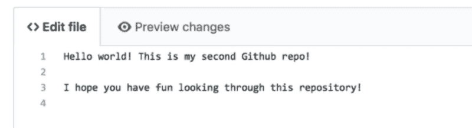
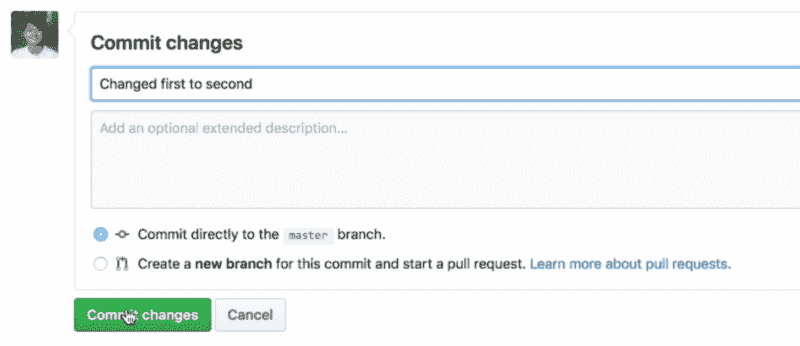
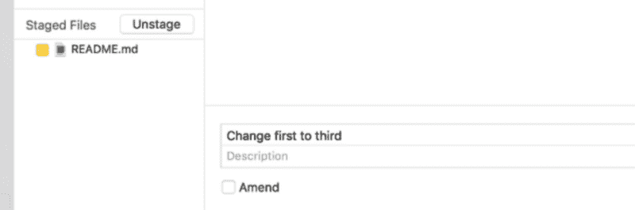
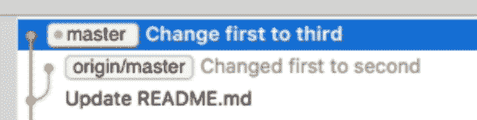
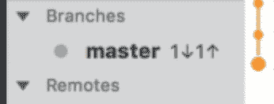
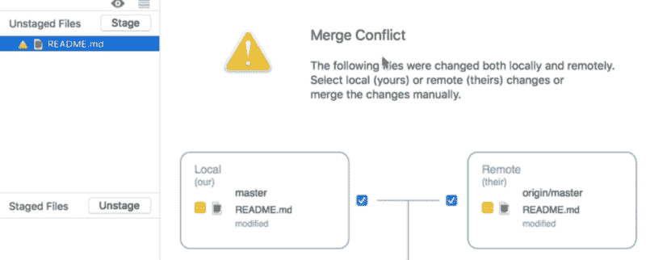
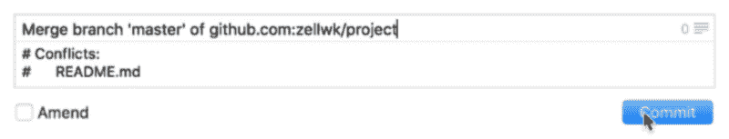
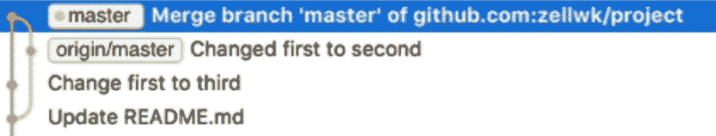
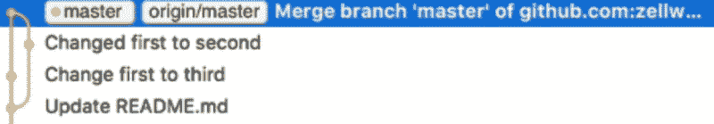

# 如何解决 Git 冲突

> 原文：<https://www.freecodecamp.org/news/resolving-git-conflicts-62bd357ed5f/>

注意:这是 Git 初学者系列的第六个视频。[在这里看第一个视频](https://zellwk.com/blog/setting-up-git)。

假设的一个朋友对您的存储库进行了更改，并将更改推送到 Git remote。同时，您还对同一行代码进行了更改。

当您将他们的变更放入您的本地存储库时，您会注意到有一个冲突。

发生这种情况是因为 Git 不知道你朋友的版本是更新版本还是你的版本是更新版本。

这就是我们所说的 Git 冲突。

今天您将学习如何解决 Git 冲突。

首先，让我们产生一个 Git 冲突，这样您就可以看到发生了什么。

### 产生冲突

为了产生 Git 冲突，我们需要两组代码。对于第一组，我们需要有人将代码输入遥控器。

在我们的例子中，我们编辑 GitHub 上的文件来模拟变化。

假设我们将`README.md`中的文本从“Hello world，这是我的第一个 Github repo”更改为“Hello world，这是我的第二个 Github repo”。



我们还将生成一条 commit 消息，说明“从第一个更改为第二个”,以便稍后在我们的 Git 历史中看到效果。



对于第二组代码，您可以在本地存储库中更改相同的`README.md`文件。我们不说“第二个 Github 资源库”，而是说“第三个 Github 资源库”。

```
Hello world! This is my third Github repo!
```

我们将提交该文件，并将提交消息设置为“将第一个更改为第三个”



您可以使用“Fetch”按钮在 Git 客户端检查更新。一旦获取完成，您可以看到`origin/master`与`master`相比位于不同的分支上。

发生这种情况是因为 Git remote **和本地存储库**上同时有变化。



如果你看左边的分支，你可以看到主分支说一个向下一个向上。这告诉我们，在 Git remote 中有一个提交比我们的 master 提前了**。同时，我们的主分支在远程的**之前有一个提交**。**



我们需要将我们的更改拉到我们的本地分支机构来巩固这些更改。当您提取更改时，您会看到一条错误消息。

根据您使用的 Git 客户端的不同，这个错误消息可能会略有不同。在 Fork 中，它表示“将分支`origin/master`合并为`master`。修复 1 个冲突，然后继续。


这意味着您需要在继续之前解决冲突。

**要查看冲突**，您可以返回更改部分。在这里，您将看到包含冲突的文件。在本例中，它是`README.md`文件。



首先说一下为什么要合并。

### 为什么要合并？

当您将更改从远程分支提取到本地分支时，来自远程分支的更改将合并到本地分支中。

如果 Git 知道什么先被更改，什么后被更改，并且没有歧义，那么它会帮助我们自动进行合并。

但是，当出现冲突时，Git 不知道哪个版本是正确的——所以您必须自己合并代码。

### 解决冲突

解决冲突的最简单方法是更改您计算机上的文件。如果你现在打开`README.md`,你会看到这样的行:

```
<<<<<< HEAD Hello world! This is my third Github repo!====== Hello world! This is my second Github repo! >>>&gt;>> snt2h1s3n4tnthd9au8d3324
```

`<<<`之间的代码；<`<<`；HEAD 和=======是我们本地存储库中的代码(我们的代码)。

`======`和`>&g` t 之间的代码；> > > >是来自远程仓库的代码(他们的代码)。

这两行代码是冲突的。我们需要在“第二次 Github 回购”或“第三次 Github 回购”之间做出选择。

要解决冲突，您需要选择正确的代码行。然后你把其他的都删掉。

在这种情况下，我们说“第三”是正确的版本。你要做的是删除所有不正确的东西。

```
Hello world! This is my third Github repo!
```

### 提交合并

当您返回 Fork 时，您将看到更改已经更新。在我们的例子中，更改是在本地进行的，所以我们看不到任何需要转移的文件。

如果更改不同，您将需要转移文件。

在登台之后，您需要提交合并。

如果您查看提交消息区域，您会看到 Fork 已经自动为您填充了一条提交消息。您可以直接使用提交消息。

单击提交以提交更改。



当您提交更改时，您会看到侧栏中的主分支显示 2 up。这意味着我们的本地分支比远程分支提前两次提交。

如果查看 Git 历史记录，可以看到远程主分支有一个链接指向本地主分支。这显示了一个合并。



接下来您需要做的是将更改推送到 Git 远程。



这就是如何解决 Git 冲突的**。**

### **防止冲突发生**

**当两个或更多的人同时处理同一个文件时，就会发生冲突。**

**有两种方法可以防止冲突。**

**第一种方法是减少提交的大小。这意味着你要为你做的每一件小事做出承诺。提交是免费的，所以多提交几次就行了。**

**这很有帮助，因为像我们刚刚解决的小冲突很容易解决。如果您遇到长达数百行的冲突，将很难解决。**

**第二种方式涉及分支。在这里，不同的人在不同的分支中处理代码。他们不会互相影响。他们只在准备好的时候将代码合并到主分支中。**

**分支稍微高级一些。我们将在下一个视频中讨论分支以及如何使用分支。**

**感谢阅读。这篇文章对你有什么帮助吗？如果你有，[我希望你能考虑分享它](http://twitter.com/share?text=Resolving%20Git%20conflicts%20by%20@zellwk%20?%20&url=https://zellwk.com/blog/resolving-git-conflicts/&hashtags=)。你可能会帮助别人。谢谢大家！**

**本文最初发布在[我的博客](https://zellwk.com/blog/resolving-git-conflicts) *。如果你想要更多的文章来帮助你成为更好的前端开发人员，请注册我的[时事通讯](https://zellwk.com/)。***