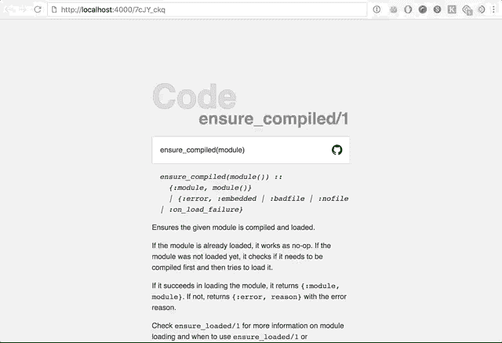

# 如何用仙丹、凤凰和记忆写一个超级快速的链接缩短器

> 原文：<https://www.freecodecamp.org/news/how-to-write-a-super-fast-link-shortener-with-elixir-phoenix-and-mnesia-70ffa1564b3c/>

本·丘奇

# 如何用仙丹、凤凰和记忆写一个超级快速的链接缩短器


This is our stage, though behind the scene’s is where the real action is.

让我们从两个让我陷入麻烦的陈述开始这个月的教程:

1.  灵丹妙药是最有效的语言。
2.  Bit.ly 对他们的付费计划收费很高

Elixir、Phoenix 框架和 Erlang VM 使我们能够快速、轻松地用很少的活动部件来制作生产就绪的系统。在这一点上，你可以看到我们的发展方向。让我们用现成的灵药来创建一个链接缩短器，避免每月 500 美元的账单。

让我们开始吧！

### 初始设置

#### 开始之前

请确保您具备以下条件:

1.  [仙丹](https://elixir-lang.org/install.html)
2.  [凤凰](https://hexdocs.pm/phoenix/installation.html)

#### 创建新的 Phoenix 项目

首先要做的是让 Phoenix 创建项目的框架。对于这个演示，我们没有“前端”,所以我们可以告诉初始化器把它们去掉。

在您的终端中键入:

```
mix phx.new shorten_api --no-html --no-brunch
```

#### 更新您的依赖关系

接下来，我们将向`mix.exs`添加一些依赖项。继续更新该文件中的`deps/0`函数，如下所示:

### 逻辑！

好了，基本设置完毕。这意味着我们正在建立逻辑，它将:

1.  允许我们保存 URL
2.  通过唯一的 HashId(例如`abc123`)
3.  导航到`/abc123`，它会重定向到它所引用的 URL

首先，创建一种存储这些链接的方法。

#### 创建一种存储这些链接的方法

让我们使用 Phoenix 的内置发电机来为我们做这件事。在您的终端运行中:

`mix phx.gen.json Links Link links hash:string:unique url:string:unique`

这将创建

1.  `Links`上下文
2.  `Link`型号
3.  `Link`控制器
4.  数据库迁移

老实说，这一步已经结束了。它会要求你在你的`router.ex`文件中放几行，但是现在，如果你想的话，你可以跳过它，因为我们稍后会谈到它。让我们继续讨论如何修改上面创建的内容，以自动创建我们将用来引用这些链接的 id。

#### 在创建链接时自动生成 HashId

在这些系统中，默认情况下，模型在数据库中有一个`id`列，它是一个唯一的数字，自动递增:1、2、3 等等。在我们的系统中，我们希望`id`是一个:

1.  短的
2.  独一无二的
3.  线
4.  会自动生成。

Ecto 让这一切变得非常简单。

首先要做的是创建一个自定义的 Ecto 类型，它将为我们处理所有这一切。创建一个新文件`shorten_api/ecto/hash_id.ex`，并按如下方式填充:

我们上面所做的基本上是创建一个新的类型，它可以像我们定义一个字段为`String`或`Integer`一样使用。现在我们可以将一个字段定义为一个`HashId`。

> 你可以在 [Ecto 文档](https://hexdocs.pm/ecto/Ecto.Type.html)中了解更多信息。

所以我们就这么做吧，更新`shorten_api/links/link.ex`以使用`HashId`作为主键，而不是`Integer`:

#### 更新迁移

现在`HashId`已经在我们的代码中设置好了，我们想要更新迁移以设置数据库来反映我们的模型文件中发生的事情。您的项目中应该有一个以`_create_links.exs`结尾的文件。找到它，打开它并修改它，使其类似于下面的代码:

好了，这是我们大部分的管道步骤，现在我们要进入整个项目的核心逻辑。

#### 从 Id 重定向到 URL

首先，我们需要控制器中的一个功能

1.  取一个`Link`的`Id`
2.  抬眼看了看`Link`
3.  重定向到附加到那个`Link`的`URL`

为此，让我们在链接控制器中添加一个新函数:`shorten_api_web/controllers/link_controller.ex`

#### 把它连到我们的路由器上

现在我们有了这个新的控制器功能，剩下的唯一事情就是把它连接起来。更新`router.ex`文件以反映以下内容:

> 注意:我们还将添加之前建议的路线到`mix phx.gen`

### TADA! ?

此时，您应该能够使用`mix phx.server`运行项目，并且一切都按预期运行！然而，我们不会就此止步。

### 秘密武器

因为链接缩短器位于用户和实际内容之间，所以这些系统的速度是至关重要的。虽然 Elixir 已经很快了，但是这个过程中的主要滞后时间来自我们的数据库。查找附加到 id 的链接需要时间。

为了加快速度，链接缩短程序通常会选择使用像 Redis 这样的内存数据库，而不是像 Postgres 这样的磁盘数据库(Phoenix 默认为我们设置的)。谢天谢地，因为 Elixir 构建在 Erlang VM 之上，我们已经有了一个内置的内存数据存储:Mnesia！

在下一节中，我们将修改我们的配置，使用 Mnesia 而不是 Postgres。

#### 从 Postgres 到 Mnesia 的转换

这个过程其实很简单。第一次更新`config.exs`如图所示:

#### 创建你的记忆数据库

然后创建 Mnesia 将数据备份到的位置，并通过 Ecto 初始化数据库:

```
mkdir priv/datamkdir priv/data/mnesiamix ecto.createmix ecto.migrate
```

**轰完了！**您现在使用内存数据库保存我们的链接信息。那不是很容易吗？

### 开始吧

你现在可以了

1.  开始项目(对你们中的许多人来说):

`mix phx.server`

2.通过`curl`创建一个缩短链接:

```
curl --request POST \  --url http://localhost:4000/api/links/ \  --header 'content-type: application/json' \  --data '{ "link": {  "url": "https://twitter.com/bnchrch" }}'
```

3.取响应中返回的`hash`

`{“data”:{“url”:”[https://twitter.com/bnchrch](https://twitter.com/bnchrch)","hash":"7cJY_ckq"}}`

4.并在您转到`localhost:4000/{hash}`时被适当地重定向:



### 包裹

令人惊讶的是，使用所有这些工具来创建一个快速、易于维护和易于扩展的链接缩短器是多么容易。这里的大部分功劳可以归于梁(Erlang VM)、何塞·瓦里姆(长生不老药的创造者)和克里斯·麦考德(凤凰的创造者)。其余的赞美都是关于缩短链接的想法有多简单，这并不能证明每月 500 美元的入门价格是合理的。还在看着你。

#### ？‍这是开源的！你可以在 Github 上找到它

#### ❤️:我只写编程和远程工作。如果你在推特上关注我，我不会浪费你的时间。