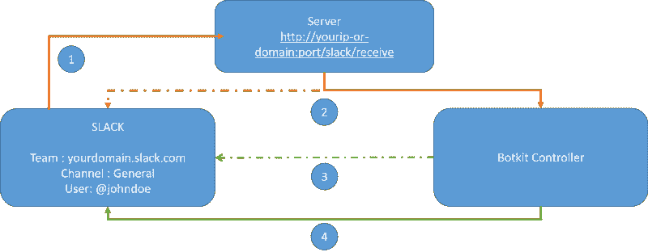

# 我如何用 Node 和 Botkit 构建一个 HR Slack Bot

> 原文：<https://www.freecodecamp.org/news/how-i-built-an-hr-slack-bot-with-node-and-botkit-6b23b81531bb/>

### 为什么要创建一个 Slack Bot？

我是一名人力资源专业人员。更确切地说，我是一名人力资源信息系统(HRIS)顾问。我使用应用程序跟踪系统、学习管理系统和核心人力资源，但我从未有机会使用人力资源机器人。这可能是人力资源的未来。

我在 Slack 和 Messenger 上看了很多关于机器人的东西，并在日常生活中使用了其中的一些——Product Hunt、GitHub 和 Trello。但是出于人力资源的目的，我从来没有机会使用为我的需求量身定制的工具。

这就是为什么我决定开发自己的机器人。


Me starting to work

### 我的目标

我的机器人应该能够满足一家小公司在 Slack 上的所有需求:

*   登机时
*   让人们接触
*   提醒
*   公告
*   生日/周年纪念
*   还有更多

### 复习基础知识

对于这个程序，我将使用:

*   僵尸工具
*   节点 JS
*   快速服务器
*   MongoDB
*   松弛 API &当然

僵尸工具是:

> 建立 bot 用户的一个简单方法，特别是如果你已经使用了 [Node.js](https://nodejs.org/) ，是 Howdy 的 [**Botkit**](https://howdy.ai/botkit/) 。Botkit 是一个框架，负责大多数 API 操作，所以你可以专注于你的机器人的行为。

这正是我想要的:-)

僵尸工具为 Slack 提供了一个样板。但我选择从头开始，以便更好地了解我的机器人。然而，用在 [Glitch](https://glitch.com/botkit) 上创建的机器人来训练自己是个好主意。

#### Slack 机器人是如何工作的？

我不是专家。我反复阅读了 Slack 和 Botkit 的官方文档。我仍然不确定我是否理解了一切。以下是我对 Slack bot 行为的理解:

Slack 上的每个应用程序都有一个“范围”，即应用程序可以读取或执行操作的边界。机器人是在 Slack 上创建和安装的应用程序的一部分。

因此，当你在 Slack 上安装一个应用程序时，你就向它提供了一些信息和权限。对于您的机器人，您希望它至少能够发送和回复其他用户的消息。

有两种情况:

1.  你想让你的机器人在空闲时直接对发生的事件作出反应
2.  你想让你的机器人对服务器上发生的事件做出反应

我们将在本帖中查看它们！

### 入门指南

首先，您需要一台服务器。在我的情况下，快递。

下面是我的 server.js 文件:

```
var express = require('express');
var app = express();
var http = require('http').Server(app);
var dotenv = require('dotenv');

// configuration ===========================================
//load environment variables,
dotenv.load();

// public folder for images, css,...
app.use(express.static(__dirname + '/public'))

//parsing
app.use(bodyParser.json()); // for parsing application/json
app.use(bodyParser.urlencoded({
    extended: true
})); //for parsing url encoded

// view engine ejs
app.set('view engine', 'ejs');

// routes
require('./routes/routes')(app);

//botkit
require('./controllers/botkit')

//START ===================================================
http.listen(app.get('port'), function() {
    console.log('listening on port ' + app.get('port'));
});
```

此端口必须是公共的且可访问的，而不仅仅是在本地主机上。

目前，这个服务器是一个空白页面，不显示和处理任何东西。

然后你将需要一个 Slack 应用程序:只需跟随这个[链接](https://api.slack.com/apps)来创建一个。

然后，您必须配置您的控制器。控制器是你的机器人的大脑。它包含了所有的技能和配置。下面是我的 botkit.js 文件。它有几乎相同的内容发现在僵尸工具的初学者工具包可在这里:[https://github.com/howdyai/botkit-starter-slack](https://github.com/howdyai/botkit-starter-slack)

```
var mongoUri = 'mongodb://localhost:27017/nameofyourDB'
var database = require('../config/database')({
    mongoUri: mongoUri
})
var request = require('request')

if (!process.env.SLACK_ID || !process.env.SLACK_SECRET || !process.env.PORT) {
    console.log('Error: Specify SLACK_ID SLACK_SECRET and PORT in environment');
    process.exit(1);
}

var controller = Botkit.slackbot({
    storage: database,
    clientVerificationToken: process.env.SLACK_TOKEN
})

exports.controller = controller

//CONNECTION FUNCTIONS=====================================================

exports.connect = function(team_config) {
        var bot = controller.spawn(team_config);
        controller.trigger('create_bot', [bot, team_config]);
    }
    // just a simple way to make sure we don't
    // connect to the RTM twice for the same team
var _bots = {};

function trackBot(bot) {
    _bots[bot.config.token] = bot;
}

controller.on('create_bot', function(bot, team) {
    if (_bots[bot.config.token]) {
        // already online! do nothing.
        console.log("already online! do nothing.")
    } else {
        bot.startRTM(function(err) {
            if (!err) {
                trackBot(bot);
                console.log("RTM ok")
                controller.saveTeam(team, function(err, id) {
                    if (err) {
                        console.log("Error saving team")
                    } else {
                        console.log("Team " + team.name + " saved")
                    }
                })
            } else {
                console.log("RTM failed")
            }
            bot.startPrivateConversation({
                user: team.createdBy
            }, function(err, convo) {
                if (err) {
                    console.log(err);
                } else {
                    convo.say('I am a bot that has just joined your team');
                    convo.say('You must now /invite me to a channel so that I can be of use!');
                }
            });
        });
    }
});

//REACTIONS TO EVENTS==========================================================
// Handle events related to the websocket connection to Slack

controller.on('rtm_open', function(bot) {
    console.log('** The RTM api just connected!')
});

controller.on('rtm_close', function(bot) {
    console.log('** The RTM api just closed');
    // you may want to attempt to re-open
});
```

#### 解开第一个案例:对 Slack 上发生的事件做出反应


当你给你的应用程序适当的权限时，每次在一个频道上发送消息时，Slacks 都会向你的服务器发送一个请求，其中包含一些信息——频道 ID、用户、时间戳以及最重要的消息内容。

如果我们想让我们的机器人对像“嗨”这样的简单消息做出反应，我们必须给 Slack 一个地址来发送信息。

在 routes.js 文件中写入:

```
var Request = require('request')
var slack = require('../controllers/botkit')
module.exports = function(app) {
 app.post('/slack/receive', function(req,res){
//respond to Slack that the webhook has been received.
    res.status(200);
// Now, pass the webhook into be processed
    slack.controller.handleWebhookPayload(req, res)
  })
}
```

我们现在有一个 web hook:[http://your-IP-or-domain:port/slack/receive](http://your-ip-or-domain:port/slack/receive)

一旦 Slack 通过你的 Slack 应用程序的事件订阅页面被告知这条路线，它将能够向它发送 JSON。由于上面的 server.js 文件的解析部分，您将能够接收到它。

下面是一个(简单的)模式来解释其背后的过程:



1- SLACK 这是一个 JSON 文件，包含了 SLACK 频道上的最新事件

2 台服务器收到，我把它发给僵尸工具

3-僵尸工具这里是一个临时的答案，等一下

4-僵尸工具耶！我听到一个关键字，这是一个 JSON 对象，带有要执行的操作

如果我们希望我们的机器人每次听到“你好”时都做出反应，我们可以简单地添加这个。我们的控制器监听()函数:

```
controller.hears(['hello', 'hi'], 'direct_message,direct_mention,mention', function(bot, message) {
controller.storage.users.get(message.user, function(err, user) {
        if (user && user.name) {
            bot.reply(message, 'Hello ' + user.name + '!!');
        } else {
            bot.reply(message, 'Hello.');
        }
    });
});
```

注意这个代码片段中的`storage.users.get()`部分。僵尸工具与市场上几乎所有的数据库系统兼容。我已经决定使用 MongoDB，因为它在我的学习清单上已经有很长时间了。此外，僵尸工具的文档也很详细。

现在，我们必须让我们的想象力工作，并找到一些有趣的功能来创造。

#### 第二种情况:与你的机器人开始对话


对于这个特性，我希望我的机器人对不是在 Slack 上发起的事件做出反应。比如做一个日常。如果是某人在公司的周年纪念日，给他们发一份调查，询问他们对第一个月/周的感受。

我已经决定使用 node-cron:[https://github.com/kelektiv/node-cron](https://github.com/kelektiv/node-cron)来管理日常检查。

下面是一个 cronjob 在每个工作日的上午 9:00 发射。得益于 Date()方法，机器人可以获得今天的日期，并可以将其与用户的“joinedDate”进行比较。

为了只获取正确的用户并避免 forEach 循环，我们可以在数据库中使用一个查询:

```
var dailyCheck = new CronJob('00 00 9 * * 1-5', function() {
        /*
         * Runs every weekday (Monday through Friday)
         * at 09:00:00 AM. It does not run on Saturday
         * or Sunday.
         */
        console.log(`DailyCheck triggered ${new Date()}`)

        //Gets today's date
        let d = new Date()
        d.setUTCHours(0, 0, 0, 0)

        let threeMonthsAgo = new Date()
        threeMonthsAgo.setUTCMonth(d.getUTCMonth() - 3)
        threeMonthsAgo.setUTCHours(0, 0, 0, 0)

        let sevenDaysAgo = new Date()
        sevenDaysAgo.setUTCDate(d.getUTCDate() - 7)
        sevenDaysAgo.setUTCHours(0, 0, 0, 0)

        controller.storage.users.find({
            "joinedDate": {
                "$eq": +sevenDaysAgo
            }
        }, function(err, user) {
            user.forEach(function(member) {
                console.log(`Message was sent to ${member.name}(${member.id})`)
                bot.startPrivateConversation({
                    user: member.id
                }, Conversations.sendSurvey7)
            })
        })
    }, function() {
        /* This function is executed when the job stops */
    }, true,
    /* Start the job right now */
    timeZone = 'Europe/Paris' /* Time zone of this job. */ )
```

还有…多田！


“A robot named Pepper holding an iPad” by [Alex Knight](https://unsplash.com/@agkdesign?utm_source=medium&utm_medium=referral) on [Unsplash](https://unsplash.com?utm_source=medium&utm_medium=referral)

### 结论

做了一年多的营员，学了一年多的编码，能够开始并完成这样一个项目，我真的很开心。现在，我有了一个机器人，它可以完成我在设计阶段想到的几乎所有动作。而且我还有很多想法！

我还在研究这个机器人。GitHub 库可以在这里找到:[https://github.com/alexandrobin/hrbot](https://github.com/alexandrobin/hrbot)。一些提交是用法语进行的，但是代码库是用英语注释的。:-)

此外，如果你没有服务器，用 Mongolab 数据库在 Heroku 上部署它是非常容易的！

如果您有一些建议或对本文和项目感兴趣，请随时发表评论！我很乐意和你讨论。