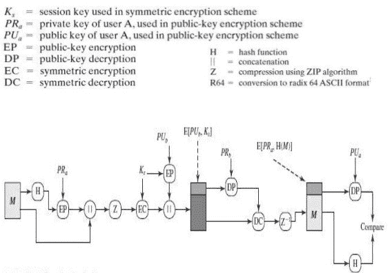

# 想了解相当好的隐私？模拟一下。

> 原文：<https://www.freecodecamp.org/news/understanding-pgp-by-simulating-it-79248891325f/>

顾名思义，相当好的隐私(或 PGP)是一个加密程序，实际上提供了相当好的隐私。“相当好”这个词是有点讽刺性的轻描淡写。自 1991 年由 Phil Zimmermann 开发以来，它一直是电子邮件通信的端到端加密的主要形式之一。在被告密者爱德华·斯诺登使用后，它变得越来越受欢迎。

PGP 为安全通信提供了两个基本要素:

1.  **机密性:**通过使用对称块加密、使用 ZIP 算法的压缩和使用 radix64 编码方案的电子邮件兼容性来提供
2.  **认证:**通过使用数字签名提供

事不宜迟，让我们来看看 PGP 的工作原理。

#### 它是如何工作的

我将在 Alice(发送者)和 Bob(接收者)的上下文中从实现的角度解释 PGP 的概念。我们将使用以下算法:

1.  RSA 作为非对称加密算法
2.  SHA-512 作为哈希算法
3.  DES 作为对称加密算法
4.  压缩拉链

你也可以使用其他算法。(我知道 DES 太老了，不能用了，但是这里的目标是理解 PGP 的概念。)



**The PGP Process**

Alice 和 Bob 都使用 RSA 算法生成他们的密钥对(公钥和私钥)。Alice 和 Bob 的公钥应该是彼此已知的。

**爱丽丝/发送方:**

1.  爱丽丝写了一条信息 M，她打算把它发送给鲍勃。
2.  m 作为输入提供给 SHA-512 算法，以获得它的 512 位二进制散列(表示为 128 位十六进制字符串)。
3.  该散列通过使用 RSA 算法进行数字签名，即该散列通过 Alice 的私钥进行加密。RSA 的输入是 Alice 的私钥和散列。RSA 的输出是数字签名的散列或加密的散列 EH。
4.  现在，M 和 EH 被附加在一起。(追加的意思是将它们放在字符串数组中)。
5.  M 和 EH(在一个字符串数组中)作为 ZIP 压缩算法的输入，再次在一个字符串数组中获得压缩的 M 和压缩的 EH。
6.  现在使用 DES 对称加密算法对上述步骤的输出进行加密。为此，我们将首先为 DES 生成 SecretKey。这个密钥和步骤 5 的输出将作为 DES 加密算法的输入，该算法将为我们提供一个加密的输出(也是一个字符串数组)。
7.  最后但同样重要的是，因为 M 是使用 SecretKey 加密的，所以它也必须发送给 Bob。我们将用 Bob 的公钥加密 DES 算法的 SecretKey。为此，我们将使用 RSA，其输入将是 Bob 和 SecretKey 的公钥。
8.  现在，步骤 6 和 7 的输出被附加并作为最终消息发送给 Bob。

整个消息以字符串(`String finalmessage[]`)数组的形式发送，其中包含以下索引:

0:用 SecretKey 加密的压缩消息 M

1:数字签名的散列 EH，然后用 SecretKey 压缩和加密

2:步骤 7 的输出

**鲍勃/接收方:**

1.  Bob 将首先用他的私钥解密 DES 的密钥。为此，RSA 算法的输入将是 Bob 和`finalmessage[2]`的私钥。RSA 的输出会给 Bob 密钥。
2.  这个 SecretKey 现在将作为 DES 解密算法的输入之一，用于解密`finalmessage[0]`和`finalmessage[1]`。这两个也将作为 DES 解密算法的输入。这一步的输出将是`finalmessage[0]`的`decrypted version`和`finalmessage[1]`。
3.  上述步骤的输出应该作为 ZIP 算法的输入进行解压缩。
4.  从上述步骤的输出中，我们将获得数字签名的散列和原始消息 m。我们将验证散列是否由 Alice 签名。为此，我们将通过使用 SHA-512 ( `calculated_hash`)来计算原始消息 M 的散列。我们还将使用 RSA 用 Alice 的公钥解密数字签名的散列。(RSA 的输入:Alice 的数字签名散列和公钥，RSA 的输出:`decrypted_hash`)。
5.  比较`decrypted_hash`和`calculated_hash`。如果结果证明它们是相同的，那么就实现了认证，这意味着消息确实是由 Alice 发送的。

下面是用 Java 用最简单的方式做的 PGP 的模拟。

```
import java.util.*;
import java.math.*;
import javax.crypto.Cipher;
import java.security.*;
import javax.crypto.KeyGenerator;
import javax.crypto.SecretKey;
import java.io.BufferedReader;
import java.io.ByteArrayInputStream;
import java.io.ByteArrayOutputStream;
import java.io.IOException;
import java.io.InputStreamReader;
import java.util.zip.GZIPInputStream;
import java.util.zip.GZIPOutputStream;
import javax.crypto.spec.*;

public class PGP{

static Cipher ecipher, dcipher;//Required for DES

public static void main(String args[]) throws Exception{

	//Generating sender keys
	KeyPair senderkeyPair = buildKeyPair();
	PublicKey senderpubKey = senderkeyPair.getPublic();
	PrivateKey senderprivateKey = senderkeyPair.getPrivate();
	//Generating receiver keys
	KeyPair receiverkeyPair = buildKeyPair();
	PublicKey receiverpubKey = receiverkeyPair.getPublic();
	PrivateKey receiverprivateKey = receiverkeyPair.getPrivate();

	//Sending both public keys and private keys for choice of digital signature or normal assymetric encryption
	String messagetoreceiver[] = senderside(senderpubKey, senderprivateKey, receiverpubKey, receiverprivateKey);
	receiverside(messagetoreceiver, senderpubKey, senderprivateKey, receiverpubKey, receiverprivateKey);						
}

public static void receiverside(String messagetoreceiver[], PublicKey senderpubKey, PrivateKey senderprivateKey, PublicKey receiverpubKey, PrivateKey receiverprivateKey) throws Exception {

	//Receiver receives the message messagetoreceiver[] with messagetoreceiver[2] as secret key encrypted with receiver pub key
	//Receiver decrypts the messagetoreceiver[2] with his/her privatekey
	String receiverencodedsecretkey = decrypt(receiverpubKey, receiverprivateKey, messagetoreceiver[2], 1);
	//Key after decryption is in base64 encoded form
	byte[] decodedKey = Base64.getDecoder().decode(receiverencodedsecretkey);
	SecretKey originalKey = new SecretKeySpec(decodedKey, 0, decodedKey.length, "DES");
	System.out.println("\nReceiver Side: Receiver SecretKey DES after Decryption with his/her Private Key=\n"+originalKey.toString());

	//Decrypt the rest of the message in messagetoreceiver with SecretKey originalKey
	String receiverdecryptedmessage[] = new String[messagetoreceiver.length-1];
	System.out.println("\nReceiver Side: Message After Decryption with SecretKey=");
	for (int i=0;i<messagetoreceiver.length-1;i++) {
		messagetoreceiver[i] = decryptDES(messagetoreceiver[i], originalKey);
		System.out.println(messagetoreceiver[i]);
	}

	//Unzip this message now i.e. unzip messagetoreceiver
	String unzipstring[] = new String[receiverdecryptedmessage.length];
	System.out.println("\nReceiver Side: UnZipped Message=");
	for (int i=0;i<unzipstring.length;i++) {
		unzipstring[i] = decompress(messagetoreceiver[i]);
		System.out.println(unzipstring[i]);
	}

	//Message has been received and is in unzipstring but check the digital signature of the sender i.e. verify the hash with senderpubkey
	//So decrypting the encrypted hash in unzipstring with sender pub key
	String receivedhash = decrypt(senderpubKey, senderprivateKey, unzipstring[1], 0);                                 
	System.out.println("\nReceiver Side: Received Hash=\n"+receivedhash);
	//Calculating SHA512 at receiver side of message
	String calculatedhash = sha512(unzipstring[0]);
	System.out.println("\nReceiver Side: Calculated Hash by Receiver=\n"+calculatedhash);
	if (receivedhash.equalsIgnoreCase(calculatedhash)) {
		System.out.println("\nReceived Hash = Calculated Hash\nThus, Confidentiality and Authentication both are achieved\nSuccessful PGP Simulation\n");
	}

}

public static String[] senderside(PublicKey senderpubKey, PrivateKey senderprivateKey, PublicKey receiverpubKey, PrivateKey receiverprivateKey) throws Exception {

	//Input from user
	System.out.print("\nPGP Simulation:\nSender Side: Input messsage=\n");
	Scanner sc = new Scanner(System.in);
	String rawinput;
	rawinput = sc.nextLine();

	//Generating SHA-512 hash of original message
	String hashout = sha512(rawinput);	
	System.out.println("\nSender Side: Hash of Message=\n"+hashout);

	//Encrypt the message hash with sender private keys -> Digital Signature
	String encryptedprivhash = encrypt(senderpubKey, senderprivateKey, hashout, 0);
	System.out.println("\nSender Side: Hash Encrypted with Sender Private Key (Digital Signature)=\n"+ encryptedprivhash);     

	//Append original message and encrypted hash
	String beforezipstring[] = {rawinput, encryptedprivhash};
	System.out.println("\nSender Side: Message before Compression=\n"+beforezipstring[0]+beforezipstring[1]);

	//Apply zip to beforezipbytes[][]
	String afterzipstring[] = new String[beforezipstring.length];
	System.out.println("\nSender Side: Message after Compression=");
	for (int i=0;i<beforezipstring.length;i++) {
		afterzipstring[i] = compress(beforezipstring[i]);
		System.out.println(afterzipstring[i]);
	}

	//Encrypt zipstring with DES
	SecretKey key = KeyGenerator.getInstance("DES").generateKey();
	System.out.println("\nSender Side: SecretKey DES=\n"+key.toString());
	String afterzipstringDES[] = new String[afterzipstring.length+1];
	System.out.println("\nSender Side: Compressed Message Encrypted with SecretKey=");
	for (int i=0;i<afterzipstring.length;i++) {
		afterzipstringDES[i] = encryptDES(afterzipstring[i], key);
		System.out.println(afterzipstringDES[i]);
	}

	//Encrypt DES key with Receiver Public Key using RSA
	String encodedKey = Base64.getEncoder().encodeToString(key.getEncoded());
	//SecretKey is base64 encoded since direct string enccryption gives key in string format during decryption which cant be converted to SecretKey Format
	String keyencryptedwithreceiverpub = encrypt(receiverpubKey, receiverprivateKey, encodedKey, 1);
	System.out.println("\nSender Side: DES SecretKey Encrypted with Receiver Public Key=\n"+keyencryptedwithreceiverpub);

	//Decrypting DES key with Receiver Private Key using RSA
	afterzipstringDES[2]=keyencryptedwithreceiverpub;
	String messagetoreceiver[] = afterzipstringDES;
	System.out.println("\nFinal Message to receiver=");
	for (int i=0;i<messagetoreceiver.length;i++) {
		System.out.println(messagetoreceiver[i]);
	}
	return messagetoreceiver;
}

public static String encryptDES(String str, SecretKey key) throws Exception {
	ecipher = Cipher.getInstance("DES");
	ecipher.init(Cipher.ENCRYPT_MODE, key);
	// Encode the string into bytes using utf-8
	byte[] utf8 = str.getBytes("UTF8");
	// Encrypt
	byte[] enc = ecipher.doFinal(utf8);
	// Encode bytes to base64 to get a string
	return new sun.misc.BASE64Encoder().encode(enc);
}

public static String decryptDES(String st, SecretKey key) throws Exception {
	dcipher = Cipher.getInstance("DES");
	dcipher.init(Cipher.DECRYPT_MODE, key);
	// Decode base64 to get bytes
	byte[] dec = new sun.misc.BASE64Decoder().decodeBuffer(st);
	byte[] utf8 = dcipher.doFinal(dec);
	// Decode using utf-8
	return new String(utf8, "UTF8");
}

public static String decompress(String st) throws IOException {
	byte[] compressed = new sun.misc.BASE64Decoder().decodeBuffer(st);
	ByteArrayInputStream bis = new ByteArrayInputStream(compressed);
	GZIPInputStream gis = new GZIPInputStream(bis);
	BufferedReader br = new BufferedReader(new InputStreamReader(gis, "UTF-8"));
	StringBuilder sb = new StringBuilder();
	String line;
	while((line = br.readLine()) != null) {
		sb.append(line);
	}
	br.close();
	gis.close();
	bis.close();
	return sb.toString();
}

public static String compress(String data) throws IOException {
	ByteArrayOutputStream bos = new ByteArrayOutputStream(data.length());
	GZIPOutputStream gzip = new GZIPOutputStream(bos);
	gzip.write(data.getBytes());
	gzip.close();
	byte[] compressed = bos.toByteArray();
	bos.close();
	return new sun.misc.BASE64Encoder().encode(compressed);
}

//Takes any string as input and calculates sha 512 bit hash. Output is in 128 bit hex string
public static String sha512(String rawinput){
	String hashout = "";
	try{
		MessageDigest digest = MessageDigest.getInstance("SHA-512");
		digest.reset();
		digest.update(rawinput.getBytes("utf8"));
		hashout = String.format("%040x", new BigInteger(1, digest.digest()));
	}
	catch(Exception E){
		System.out.println("Hash Exception");
	}
	return hashout;
}

public static KeyPair buildKeyPair() throws NoSuchAlgorithmException {
	final int keySize = 2048;
	KeyPairGenerator keyPairGenerator = KeyPairGenerator.getInstance("RSA");
	keyPairGenerator.initialize(keySize);      
	return keyPairGenerator.genKeyPair();
}

//n: 0->encryptwithprivatekey 1->encryptwithpublickey
public static String encrypt(PublicKey publicKey, PrivateKey privateKey, String message, int ch) throws Exception {
	Cipher cipher = Cipher.getInstance("RSA");
	if (ch == 0) {
		cipher.init(Cipher.ENCRYPT_MODE, privateKey);  
		byte[] utf8 = cipher.doFinal(message.getBytes("UTF-8"));
		return new sun.misc.BASE64Encoder().encode(utf8);
	}
	else {
		cipher.init(Cipher.ENCRYPT_MODE, publicKey);  
		byte[] utf8 = cipher.doFinal(message.getBytes("UTF-8"));
		return new sun.misc.BASE64Encoder().encode(utf8);
		}
	}

//n: 0->decryptwithpublickey 1->decryptwithprivatekey
public static String decrypt(PublicKey publicKey,PrivateKey privateKey, String st, int ch) throws Exception {
	Cipher cipher = Cipher.getInstance("RSA");
	byte[] encrypted = new sun.misc.BASE64Decoder().decodeBuffer(st);
	if (ch == 0) {
		cipher.init(Cipher.DECRYPT_MODE, publicKey);
		byte[] utf8 = cipher.doFinal(encrypted);
		return new String(utf8, "UTF8");
	}
	else {
		cipher.init(Cipher.DECRYPT_MODE, privateKey);
		byte[] utf8 = cipher.doFinal(encrypted);
		return new String(utf8, "UTF8");
		}
	}
}
```

我们使用了 base64 编码方案，它类似于 PGP 中使用的 radix64。

**注:**

1.  我们对加密和压缩后的字符串进行 base64 编码，以获得可读的文本形式。
2.  对于解密和解压缩，我们将 base64 解码的输入作为实际输入发送给解密和解压缩算法。
3.  由于我使用 Java 来模拟 PGP，所以这个密钥已经进行了 base64 编码和解码，这需要在接收端进行编码，以便可以转换为 SecretKey 数据类型用于解密过程。

请跟随，鼓掌，分享。评论任何错误或改进或建议。你甚至可以在推特上关注我。