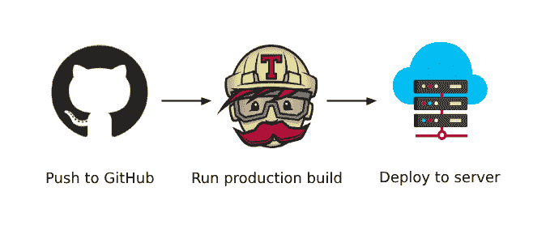
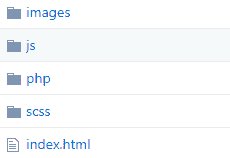
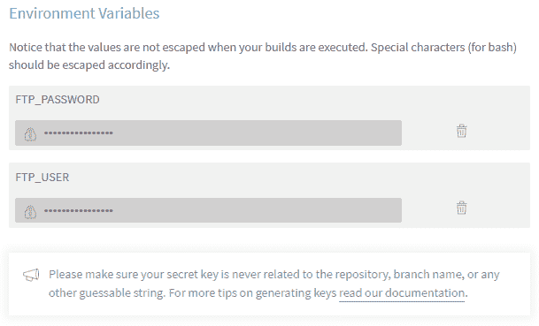
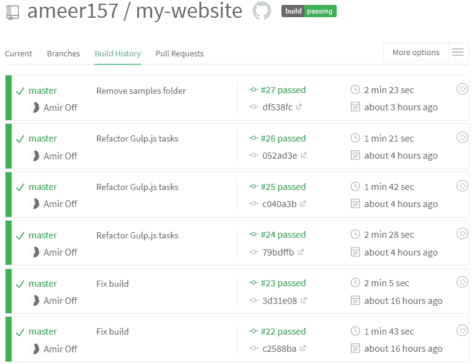

# 如何使用 Travis CI 设置高级自动部署

> 原文：<https://www.freecodecamp.org/news/advanced-automatic-deployment-with-travis-ci-1da32f7930ce/>

由阿米尔关闭

# 如何使用 Travis CI 设置高级自动部署



这篇文章是我之前的 [**高级 Web 开发和部署工作流**](https://codeburst.io/web-development-with-ide-version-control-and-deployment-1eaabb5a256) 教程的续篇。在那篇教程中，我展示了如何自动化我的开发和部署工作流。由于 web 工具和技术的快速发展，当然也由于我作为一名 web 开发人员需要改进我的工作流程，从那以后发生了很多变化。

### 我的使用案例

我为我的个人投资组合[网站](https://www.amiroff.me/)使用共享托管服务，大部分代码由前端静态资产组成:



My website’s files structure

在过去的中，我不得不运行一个 Gulp.js 任务来缩小、美化和处理所有的源代码。它把它和 index.html 文件一起输出到一个捆绑文件夹中，这个文件可以通过 FTP 部署到我的托管服务中。

为了自动化这个过程，我使用了 [DeployBot](http://deploybot.com/) 。这是一项服务，允许您使用现有的存储库，并部署到许多地方，如 FTP，SFTP，亚马逊等。

对我来说，DeployBot 的不足之处在于，它只像一个隧道一样运行，每当一个变更提交到我的 GitHub 存储库时，它就部署这个存储库。这意味着它需要我将我的捆绑代码上传到一个单独的分支——在我的例子中我称之为“部署”——并且它通过 FTP 将所有文件从那个分支上传到托管服务器。

我认为这是一种糟糕的做法，也是一种暂时的安慰性解决方案。我在 GitHub 上的代码应该是“源”代码，而不是一堆缩小和丑陋的 JavaScript 和 CSS 资产以及其他处理过的文件。

### 解决方案

为了解决我在 DeployBot 上遇到的问题，我不得不放弃它，转而使用 Travis CI——一种与 GitHub 集成的持续集成和交付服务。通过这种方式，我能够删除存储库中的“deployment”分支，让 Travis CI 为我完成运行 Gulp.js 任务的所有工作，并通过 FTP 将其进一步部署到我的托管服务器。我所要做的就是推送我的源代码，剩下的就交给 Travis CI 了。不再需要手动运行 Gulp.js 任务，然后检查“deployment”分支并手动将其推送到 Github。

在下面的代码中，我定义了 Travis CI 运行所需的脚本文件“ **.travis.yml** ”:

```
// Setting environment language
language: node_js

// Using the lastest version of Node.js
node_js:
- node

// Script to install dependencies
before_script:
- npm install -g --silent

// The actual build script for Gulp.js
script:
- gulp build --prod

// Deploying to hosting server via FTP
after_script:
- gulp deploy --user $FTP_USER --password $FTP_PASSWORD
```

.travis.yml

💡 **第 18 行 FTP 凭证是从 Travis CI* 中提取的*

这是一个很棒的特性，因为它允许我设置受保护的环境变量，在本例中是 FTP 登录凭证“**$ FTP _ USER**”**和“ **$FTP_PASSWORD** ”。这些变量在运行时被加密并嵌入到“ **.travis.yml** ”脚本文件中。这样我就可以将我的源代码提交给 GitHub，而不会暴露任何敏感数据。**

**

Setting environment variables on the Travis CI build settings page** 

**为了让它们工作，我不得不使用一个名为 [**的乙烯基 ftp**](https://www.npmjs.com/package/vinyl-ftp) 包。它被描述为，**

> **用于 FTP 的乙烯基适配器。支持并行传输、有条件传输、缓冲或流式文件等。通常比你最喜欢的桌面 FTP 客户端表现更好。**

```
`const ftp = require('vinyl-ftp');
const minimist = require('minimist');
const args = minimist(process.argv.slice(2));

gulp.task('deploy', () => {
    const remotePath = '/amiroffme/';
    const conn = ftp.create({
        host: 'ftp.amiroff.me',
        user: args.user,
        password: args.password
    });
    console.log('FTP connection successful!');
    gulp.src('build/**/*.*')
        .pipe(conn.dest(remotePath));
});`
```

**gulpfile.js**

**💡 **在第 9 行和第 10 行，部署任务从 Travis CI 脚本运行的参数选项中解析用户和密码** :**

```
`$ gulp deploy --user $FTP_USER --password $FTP_PASSWORD`
```

**我不得不安装另一个流行的 npm 包，名为[**minimit**](https://www.npmjs.com/package/minimist)，以便能够解析上面 CLI 中的“用户”和“密码”参数。**

**除了安装前面的两个 npm 包，我还必须重构我的 Gulp.js 任务文件，以允许我运行开发构建，这样我就可以在本地处理代码。持续的生产部署很棒，但是我仍然希望能够在本地运行我的代码，并且仍然拥有一个实际的开发环境和一个实际的开发版本。😊**

```
`// Main build task
gulp.task('build', ['html', 'images', 'sass', 'js', (args.prod ? 'production' : 'development')], () => {
    // Print build info
    console.log(packageFile.name + ' "' + packageFile.description + '" v' + packageFile.version);
});

// Runs only for production build
gulp.task('production', () => {
    console.log('This is a production build');
    console.log('Please run the following script for deployment:');
    console.log('gulp deploy --user $FTP_USER --password $FTP_PASSWORD');
});

// Runs only for development build
gulp.task('development', () => {
    browsersync(browserSyncConfig);
    console.log('This is a development build');
    console.log('File changes will be watched and trigger a page reload');
    gulp.watch(html.watch, ['html', browsersync.reload]);
    gulp.watch(images.src, ['images', browsersync.reload]);
    gulp.watch(css.watch, ['sass', browsersync.reload]);
    gulp.watch(js.src, ['js', browsersync.reload]);
});`
```

**gulpfile.js**

**💡在第 2 行，我检查构建参数，然后相应地运行构建任务。**

**如果任务检测到类似 Travis CI 构建脚本中的" **prod** "参数:**

```
`$ gulp build --prod`
```

**它跳过为本地开发设计的**开发**任务，转而构建并运行**生产**任务。**

**执行不带“ **prod** 参数的构建将触发**开发**任务，该任务监视文件更改并重新加载页面——与任何开发环境非常相似。**

```
`$ gulp build`
```

### **结论**

**不再需要在分支机构之间切换，也不再需要手动将捆绑资产复制和推送到 GitHub。我可以只在本地工作，然后推送到 GitHub，剩下的就交给 Travis CI 了。**

**

My Travis CI build history log** 

**我希望你喜欢阅读！更多科技玩意儿请 [****关注****](https://medium.com/@amiroffme)****分享**** 🤖💖**