# 如何用 Raspberry Pi 制作自己的 Python 开发服务器

> 原文：<https://www.freecodecamp.org/news/how-to-make-your-own-python-dev-server-with-raspberry-pi-37651156379f/>

作者 Karan Asher

# 如何用 Raspberry Pi 制作自己的 Python 开发服务器

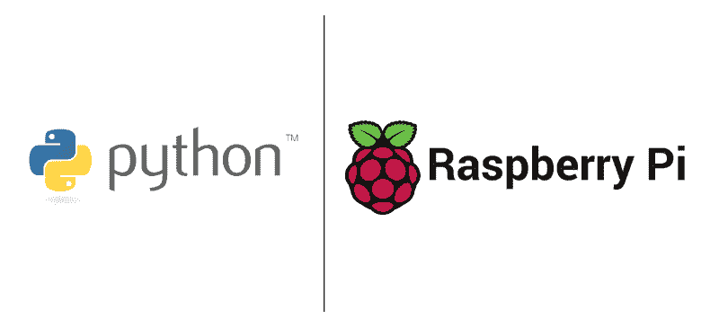

Image credit. [https://www.python.org/static/community_logos/python-logo-master-v3-TM.png,](https://www.python.org/static/community_logos/python-logo-master-v3-TM.png) [https://upload.wikimedia.org/wikipedia/commons/1/10/RPi-Logo-Landscape-SCREEN.png](https://upload.wikimedia.org/wikipedia/commons/1/10/RPi-Logo-Landscape-SCREEN.png)

简单来说，Raspberry Pi 是一台超级便宜的(40 美元)基于 Linux 的电脑。就是这样。说真的。

它可以做你能想象的普通 Linux 计算机能做的任何事情，比如浏览网页、编写代码、编辑文档，以及连接到 I/O 设备，比如拇指驱动器、鼠标、键盘等。本教程将重点学习如何用 Raspberry Pi 制作自己的 Python 开发服务器。

### 步骤 0。定义目标

在我们开始之前，重要的是要理解我们试图构建的是什么。在本教程结束时，你将能够在本地家庭网络上使用 Raspberry Pi 运行一个基本的网站(使用 [Flask](http://flask.pocoo.org/) )。

本教程的目标是演示如何将 Pi 用作开发服务器，更具体地说，这个例子将托管一个简单的网站(使用 [Flask](http://flask.pocoo.org/) )。

### 第一步。陈述假设

以下是本教程将做出的一些假设:

1.  您已经用 Raspbian 操作系统设置了一个树莓 Pi。如果你需要，这里的是一个有用的设置指南。
2.  Pi 连接到您的家庭 WiFi(并且您知道 Pi 的 IP 地址)。
3.  您将不再需要屏幕。假设第 1 点和第 2 点都完成了。

我们将使用带有[远程 VSCode](https://marketplace.visualstudio.com/items?itemName=rafaelmaiolla.remote-vscode) 扩展名的 [VS Code](https://code.visualstudio.com/) 来远程创建和编辑 Pi 上的文件。我绝对推荐你使用这两个来跟随。此外，这将使处理远程文件变得容易得多，所以这是一个优点。

### 第二步。找到 Pi 的 IP 地址

首先，将 Pi 连接到电源，并确保它正确启动并连接到 WiFi/以太网(基本上，它需要有互联网连接)。

我们将使用 ssh 来连接 Pi 并与之通信。要使用笔记本电脑远程操作，您需要知道它的 IP 地址。使用您的 ISP 管理门户网站(通常可以在 [http://192.168.0.1](http://192.168.0.1) 获得)可以很容易地获得这些信息。请注意，这可能因不同的 ISP 而异。)

通常，您应该将您的 Pi 连接到一个类似于“192.168.0.12”的地址。还是那句话，这个会因人而异。因此，请使用您在管理门户中为 Pi 找到的 IP 地址。接下来，本教程将使用 192.168.0.12 作为 Pi 的 IP 地址。

### 第三步。使用 ssh 连接到 Pi

在笔记本电脑上打开 VS 代码及其内置的终端窗口。使用以下 ssh 命令连接到 IP 地址为 192.188.0.12 的 Pi:

> *ssh -R 52698:localhost:52698 pi@192.168.0.12*

上述命令将在您的笔记本电脑和 Pi 之间建立一个双向通信通道。如果这是您第一次连接到 Pi，请使用 raspberry 作为密码。可能会提示您更改默认密码。强烈建议您这样做。

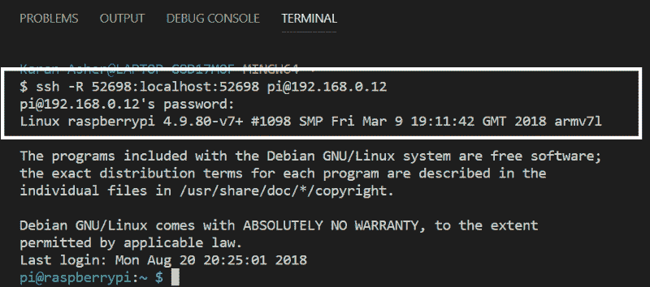

Terminal window after successfully connecting to the pi

### 第四步。创建项目目录

您现在应该在 Pi 的主目录中。让我们为我们希望建立的网站创建一个目录。使用以下命令创建目录:

> *密瓶网站*

使用“ls”命令验证您确实可以看到名为 MyFlaskWebsite 的新文件夹。

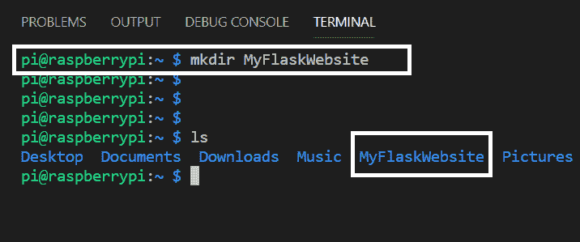

Create and verify the project directory

### 第五步。安装烧瓶

我们将使用 [Flask](http://flask.pocoo.org/) 创建一个简单的网站。 [Flask](http://flask.pocoo.org/) 是一个基于 Python 的微网框架。它使用 [Jinja](http://jinja.pocoo.org/) (基于 Python 的模板引擎)作为它的模板引擎，这使得它非常有用和强大。使用以下命令在 Pi 上安装 flask:

> *sudo apt-get 安装 python3-flask*

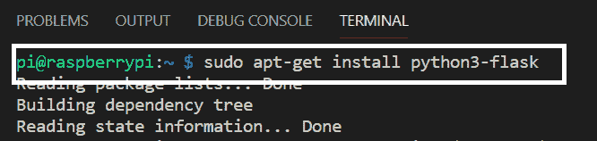

Install flask

### 第六步。写一些基本代码

既然安装了 Flask，我们就可以开始创建文件和编写一些代码了。首先，使用以下命令导航到新创建的项目目录(从步骤 4 开始):

> *cd MyFlaskWebsite*

所有项目文件和文件夹都将驻留在此“MyFlaskWebsite”目录中。现在，使用以下命令创建您的第一个代码文件(app.py ):

> *触摸 app.py*

在使用' ls '命令检查目录时，您应该能够看到这个新创建的文件。

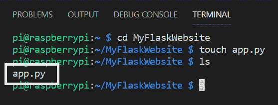

Navigate to project directory and create a new file

现在，按 F1 并选择“远程启动服务器”这应该允许您使用笔记本电脑远程编辑 Pi 上的文件。

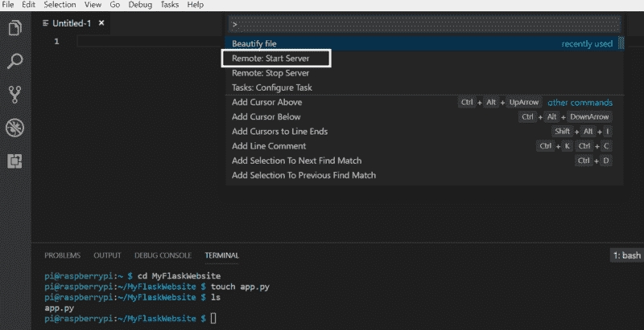

Start the remote server

接下来，使用以下命令开始编辑新创建的 app.py 文件。这可能需要几秒钟的时间，但是空文件应该会出现在上面的窗口中。

> *格式化 app.py*

Start editing the file remotely

输入下图所示的代码。这里，我们定义了一条到网站主页的路线，应该显示“这是我的 flask 网站，太酷了。”请注意，将主机设置为 0.0.0.0 将允许连接到同一网络的所有设备访问该网站。

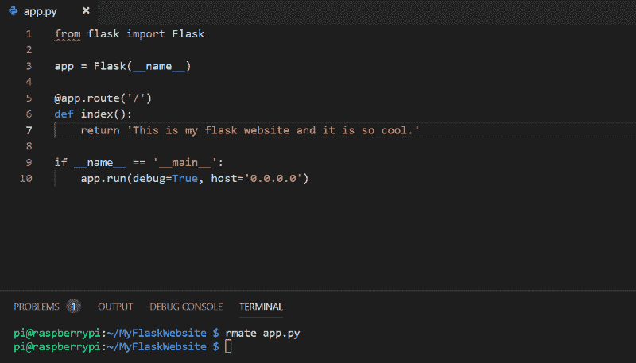

Create a basic website

保存文件并使用以下命令在 Pi 服务器上运行网站:

> *python3 app.py*

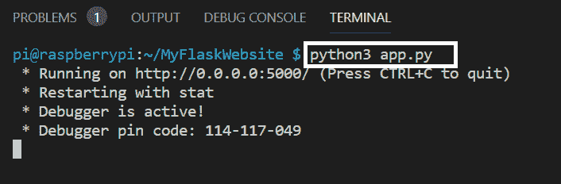

Run the website

收到上述成功消息后，在网络内的任何设备上打开一个新的浏览器窗口，键入 Pi 的 IP 地址(在本例中是 192.168.0.12 ),然后键入运行 dev-server 的端口(5000。)所以完整的地址将是[http://192 . 168 . 0 . 12:5000/](http://192.168.0.12:5000/)

你应该看到文字“这是我的 flask 网站，太酷了。”在网页上。

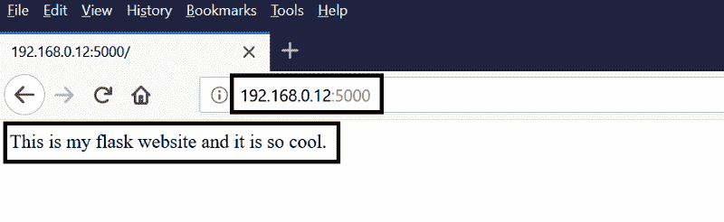

Check the webpage in a browser

这确认了您的开发服务器是活动的，并且正在运行您刚刚创建的网站。

### 第七步。添加更多路线

目前，该代码仅包含一个路由，即网站的主页。通过键入以下代码添加另一条路由。请注意，您可以在 dev-server 运行时动态地进行更改。当你刷新浏览器窗口时，它会自动捕获代码变化并运行一个修改过的版本。

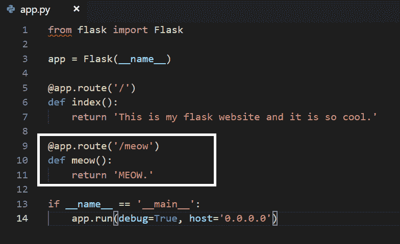

Add a meow route

要检查新路线是否如预期的那样工作，请访问[http://192 . 168 . 0 . 12:5000/MEOW](http://192.168.0.12:5000/meow)，网页会向您发出“喵喵”声。

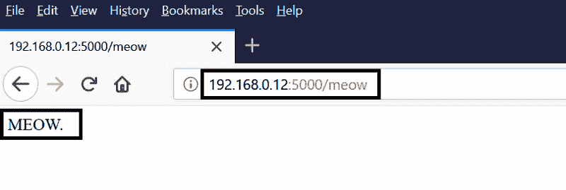

Verify that the new route works as expected

### 第八步。向代码中添加结构

现在，添加更多的路线很酷，但将所有代码放在一个 app.py 文件中并不是一个网站应该有的结构。通常，我们会有一个包含 HTML 模板的文件夹，一个包含静态 CSS 文件的文件夹和另一个包含 JS 文件的文件夹。让我们添加这些文件夹，并将代码移动到适当的文件夹中，以便更好地构建代码。使用以下命令创建这些目录:

> *mkdir 模板*

> *mkdir 静态*

使用' ls '命令验证这些文件夹是否已创建。

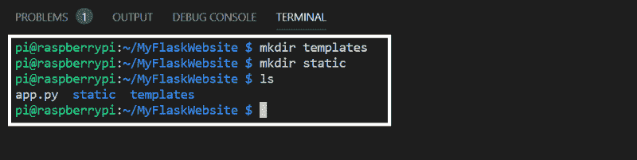

Add structure to your code

现在，让我们为主页创建一个 HTML 文件。使用以下命令导航到模板目录。然后，创建一个名为 index.html 的新文件，并使用 rmate 对其进行编辑:

> *光盘模板*

> *触摸 index.html*

> index.html 将军

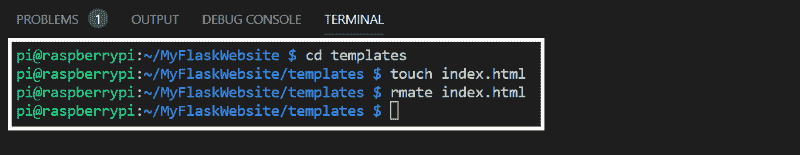

为 index.html 内部的主页写一些基本的 HTML 代码。

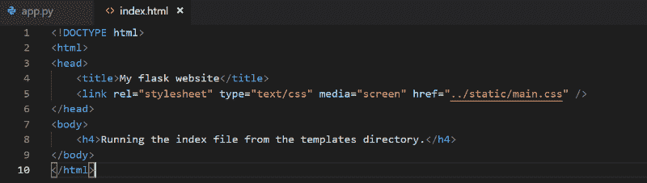

HTML code for the homepage

在 app.py 中进行以下更改以使用 index.html 文件。默认情况下，下面的代码将在模板目录中搜索一个名为 index.html 的文件。

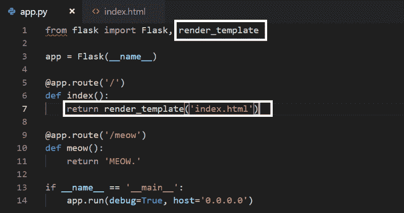

Use the new index.html file and render it using app.py

导航回项目目录并再次运行网站。

回到主页，你应该会看到你放在 index.html 里面的内容。

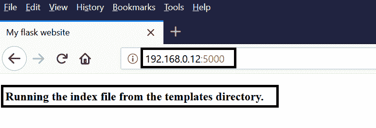

现在，通过在静态目录中创建“main.css”来添加一些样式。和往常一样，使用“cd”命令更改目录，“touch”命令创建新文件，使用“rmate”命令编辑同一个文件。

Create the css file

给 h4 标签添加一些样式。注意，我们目前在 index.html 有 1 个 h4 标签，css 应该修改它。

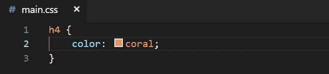

Some css code

像往常一样，使用以下命令测试您的更改:

> *python3 app.py*

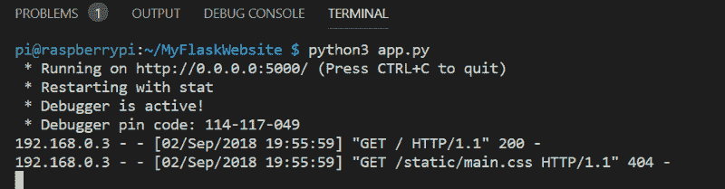

注意 h4 标签中的文本是如何根据 CSS 着色的。

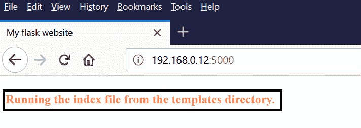

### 第九步。利用金佳

基于 Python 的模板引擎中的 Jinja 为网页添加了许多强大的功能。虽然本教程的重点不是学习 Jinja，但是让我们来看一个简单的例子，看看 Jinja 是如何有用的。

让我们在 app.py 中创建一个水果列表，并将其作为参数传递给 index.html。然后，我们将让 index.html 在网页上显示该列表。在 app.py 和 index.html 中进行以下更改。

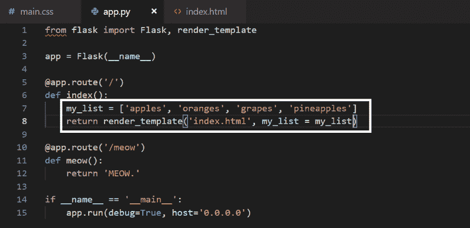

Pass the my_list as a parameter to index.html

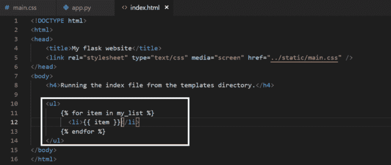

Display my_list on the webpage

刷新你的网页，你会在屏幕上看到水果列表。

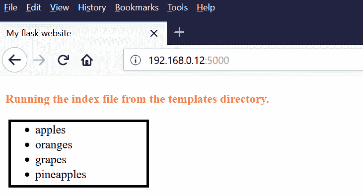

这说明金贾是多么强大和有用。更多关于金贾的信息，请参考[本](http://jinja.pocoo.org/)。

### 第十步。后续步骤

现在您已经有了一个功能齐全的 Python 开发服务器，向前发展的可能性实际上是无限的。以下是一些有用的后续步骤，您可以考虑用于您的项目:

1.  目前，只能通过您个人网络中的设备访问 Pi。为了向外界公开 Pi(通过个人网络之外的任何设备访问它)，您需要一种称为端口转发的东西。基本上，您需要一个域名和一个永久分配给 Pi 的静态 IP 地址。更多信息[这里](https://www.raspberrypi.org/documentation/remote-access/access-over-Internet/README.md)和[这里](https://maker.pro/raspberry-pi/projects/raspberry-pi-web-server)。
2.  大多数应用程序需要一个数据库来进行基本的 CRUD 操作。Python 支持开箱即用的 SQlite。在这里和这里学习如何使用 SQlite 和烧瓶[。](http://flask.pocoo.org/docs/1.0/patterns/sqlite3/)
3.  亚马逊上有一个很酷的树莓派入门套件。最棒的是，它拥有你开始所需的一切，并且省去了你自己搜索单个项目的努力。
4.  因为您没有使用屏幕，所以使用终端对 Pi 使用 shutdown 命令是很重要的。这可确保 Pi 和 SD 卡不会受损:

> *sudo shutdown -h now*

#UntilNextTime。