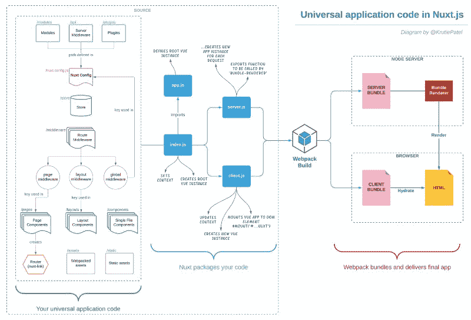
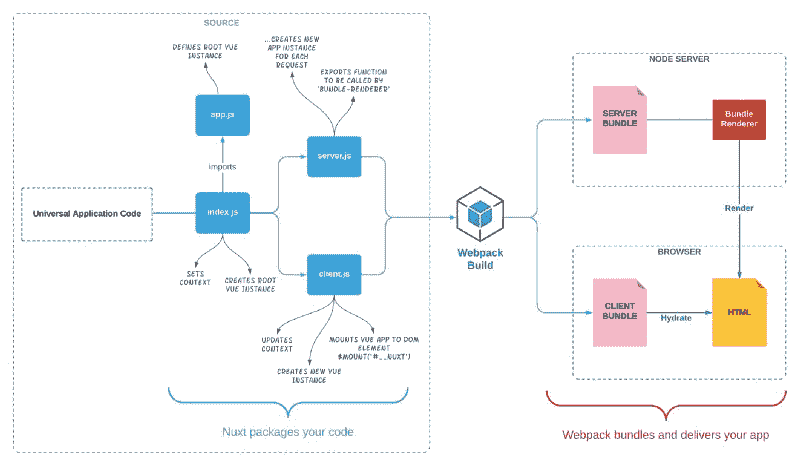
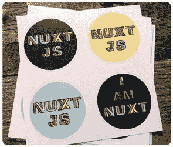

# Nuxt.js 中的通用应用程序代码结构

> 原文：<https://www.freecodecamp.org/news/universal-application-code-structure-in-nuxt-js-4cd014cc0baa/>

作者:克鲁蒂·帕特尔

# Nuxt.js 中的通用应用程序代码结构

#### Nuxt.js 中源代码结构的简要总结

您是否刚刚接触 Nuxt.js 框架，并且完全被它提供的大量文件夹所淹没？你是否也惊讶于其中大部分都是空的，只有自述文件？嗯，那是我一年多前的地方。从那以后，我一直想学习和记录每个文件夹给 Nuxt 项目带来的魔力。

现在，在用这个框架实现了几个项目之后，我记录了我对这些文件夹如何一起工作来使服务器渲染的 Vue 应用程序变得生动的理解。



上图基于 [Vue SSR 指南](https://ssr.vuejs.org/guide/structure.html#introducing-a-build-step)，并考虑到 Nuxt.js 进行了扩展。一眼看去，你可以在*你的通用应用代码*部分看到不同的文件夹，以及代码是如何被 Nuxt 打包和被 Webpack 捆绑的。

本文既不是 Nuxt SSR 的教程，也不是完整的指南。相反，它显示了什么进入普遍应用。

虽然您在图的顶部看到了模块、服务器中间件和插件，但是让我们先从 *Store* 开始。

### Vuex 商店(/store)

Nuxt 预打包了 Vuex，但它不会被激活，除非您在 */store* 目录中创建一个 Vuex 商店并创建该商店。

对于任何数据驱动的项目来说，这都是一个非常特殊的目录。在这里，您可以创建一个数据存储，并定义 *nuxtServerInit* 动作。这恰好也是第一个生命周期挂钩！

```
const createStore = () => {  return new Vuex.Store({     ...  })}
```

当用户最初访问您的应用程序时，这有助于填充/更新商店。它还在整个应用程序中维护数据的状态。

### 路由中间件(/中间件)

Nuxt 中有三种不同的路由中间件。它们都在一个中心位置定义——在*/中间件*目录中。

从这里开始，您可以通过以下方式使用它们:

*   全局中间件—(通过 Nuxt 配置进入并影响所有路由)

```
// nuxt.config.js 
```

```
export default {  router: {    middleware: 'authenticated'  },}
```

*   布局中间件(通过布局进入，并影响一组匹配的路线，即某些页面只能由经过验证的用户查看/访问)

```
// layouts/default.vue
```

```
export default {  middleware: 'authenticated-basic-plan-user'}
```

*   页面中间件(通过页面组件进入并影响单个路由)

```
// pages/index.vue
```

```
export default {   middleware: 'subscribed'}
```

上面的中间件是按照这个顺序处理的——也就是说，它们的优先级是不可协商的。因此，您必须仔细考虑和规划您的应用程序，以充分利用它们。

### Vue 组件

这里有三个目录*。vue* 文件是在 Nuxt 项目中创建的。

#### **1。页面组件？(/pages)**

这是所有存放应用程序视图和路由的目录中最重要的一个。这里创建的 Vue.js 组件直接转换成应用路由。

页面组件的真正强大之处在于动态路由。您可以使用它们来生成 SEO 友好和面向数据的 URL。动态路线是根据您在 */pages 下的目录结构生成的。*

此外，Nuxt 在页面组件上添加了其他地方没有的三个特殊方法。分别是 *validate()* ，*async data()*&*fetch()*。

```
// pages/index.vue 
```

```
export default {
```

```
 validate() {     // validates dynamic URL parameters     // verifies the availability of the data  },   asyncData() {     // sets component data  },
```

```
 fetch() {    // doesn't set component data, but     // fetches further contextual data  }
```

```
}
```

#### **2。布局组件(/布局)**

布局组件增强了应用程序的结构性。所有页面上常见的组件都在这里创建(如主菜单、二级菜单、页眉、页脚等。).它们位于 */layouts* 目录中。

在这里你可以随心所欲地发挥创造力，毕竟它们是 Vue.js 组件。别忘了在布局的主要内容区域添加 *< nux* t/ >。

```
<template>  &lt;div>     <nuxt/>  </div></template>
```

将*路由中间件*和*存储数据状态*与布局组件相结合，为具有不同场景的任意数量的用户类型构建完美的*所见所闻*特性。您可以获得比自定义用户界面更多的东西。

#### **3。Vue.js 组件(/组件)**

这些是常规但通用的 Vue 组件。它们被创建在 */components* 目录下。它们没有像页面组件那样的特殊方法。

但是它们允许您构建和组织您的业务逻辑。他们还隐藏了来自**页面**和**布局**组件的大量标记。这使得您的代码库更易于管理。

现在仔细看看——你能在这个 Nuxt 生命周期图中看到部分文件夹结构吗？
**提示:**存储(nuxtServerInit)，路由中间件和页面组件(validate，asyncData & fetch 方法)

### 资产

#### **网络打包资产(/资产)**

JavaScript 文件、自定义字体和 css 文件等资产由 Webpack 根据文件类型使用特定加载器(CSS 加载器、文件加载器、url 加载器等)进行处理。举个例子，如果你用*写你的 CSS。scss* 或*。less* 格式，那么 Webpack 将使用特定的加载程序处理这些文件，并输出编译后的*。可以被浏览器使用的 css* 文件。

您甚至可以定制您的 *nuxt.config.js* 来指示 Webpack 在构建过程中缩小和优化 assets 文件夹中的图像。在 Webpack 处理完文件后，它会将哈希代码(例如，index . 4258 e 3668 a 44556 DD 767 . js)附加到已处理的项目上，这有助于动态资产的长期缓存和缓存破坏。

#### **静态资产(/静态)**

对于不会改变的资产，您可以放心地将它们放在*静态*文件夹中。Webpack 忽略静态文件夹，不会处理其中的任何内容。

### 模块、服务器中间件和插件

它们都是在 Nuxt 配置中定义的(通过它们的路径)。它们可以在 Nuxt 应用程序中全局访问。

#### **模块(/模块)**

默认情况下，全新的 Nuxt 应用预打包了 Vue、Vue 路由器、Vuex、Vue 服务器渲染和 Vue 元。

但是你可能想知道，像网站地图、谷歌分析、渐进式网络应用等功能呢？如果你正在考虑使用模块，那么是的，你是对的，这就是 Nuxt 模块发挥作用的地方。

#### **服务器中间件(即/api)**

可以将 serverMiddleware 视为应用程序的扩展点。它们很特殊，因为它们可以访问 connect 框架的底层实例。

由于 Nuxt 使用 **connect** 来交付应用程序，它允许将定制函数作为中间件挂接到底层请求管道中。

您可以使用服务器中间件来:

*   创建一个 API 端点来连接外部应用程序。
*   创建一个 API 端点，从 Nuxt 应用程序向用户发送电子邮件。
*   以任何方式访问和修改请求，甚至在它到达 Nuxt 之前。

请注意，对于服务器中间件和模块，您没有任何预填充的空文件夹。您可以在需要时创建它们。

#### **插件(/插件)**

你可以让你现有的 Vue mixins、过滤器或指令更好地工作，只要把它们转换成 Nuxt 插件。您将它们放在新安装的 Nuxt 附带的 */plugins* 目录中。

但大多数时候，你最终会添加外部包或 Vue 库作为 Nuxt 插件。只需使用 *Vue.use()* 语法就可以将它们合并到 Nuxt 中。在我的 Nuxt 实现中，我经常使用的一些主要插件是 Vue Bootstrap、表单验证、字体很棒的图标集和 axios。

这并不是插件的终结。您可以编写自定义插件，并将其添加到应用程序根目录中。它们在您的 Nuxt 应用程序中是全局可用的。这是我个人最喜欢的方式，在项目中添加自定义的绿色或滚动魔术过渡，并在 Vue *(/components)* 和 Page *(/pages)* 组件中使用它们。

#### 模块、服务器中间件和插件的高级概述

### 包装、捆绑和交付

一旦您有了想要的特性，您就可以使用 *npm run build 构建您的应用程序。Nuxt 打包您的应用程序。*

如下图所示， *index.js* 为主入口，导入 *app.js* 。



Nuxt packages your code — Webpack bundles and delivers your code

*App.js* 定义了根 Vue 实例。如果你仔细观察*。nuxt/App.js* ，无非就是一个 Vue 组件。

一旦定义了这个根 Vue 实例，客户机条目( *client.js* )就会基于它创建一个新的实例，并将其挂载到 DOM 元素。终端用户可以在浏览器中看到一个新的应用实例。而服务器条目( *server.js* )为每个请求创建一个新的应用程序实例。

最后，Webpack 捆绑了您的应用程序，这样代码就可以在客户端和服务器端运行。服务器捆绑包呈现服务器端，而客户端捆绑包在浏览器中融合静态 HTML 标记。它把它变成了一个动态 DOM，可以对客户端的数据变化做出反应。

Nuxt 为我们做了所有开箱即用的工作，所以您不必手动编写这个设置。最后两步——打包和捆绑——非常复杂。但是 Nuxt 对你隐瞒了一切。您可以专注于最终交付最终应用程序的应用程序代码。

### 结论

我希望这个对应用程序代码结构的更高层次的概述能让您在学习 Nuxt 框架的旅程中更进一步。

这是帮助您理解 Nuxt 应用程序中所有组件是如何组合在一起的众多视角之一。

对我个人来说，这个小练习帮助了我:

*   根据现成的 Nuxt 特性规划项目的需求
*   列出已经可用的相关社区模块和插件，以及
*   挑选出需要定制开发的剩余/复杂部分。

#### **图表与上面使用的图表的高分辨率版本的链接**

1.  [Nuxt Js 生命周期挂钩](http://bit.ly/2xv6PDV)
2.  [了解模块、服务器中间件和插件](http://bit.ly/2sHNieo)
3.  [nuxt . js 中的通用应用代码](http://bit.ly/2MFl23s)

在下面的评论部分，你可以随意发表评论、反馈，甚至对你想看到的新图表想法提出建议。


[https://www.pariksha.io/](https://www.pariksha.io/)

如果你是 Nuxt 的新手，那么你可能想看看我之前的一篇关于这个主题的文章“[为什么 Nuxt Js 是你的登陆页面的完美框架？](https://codeburst.io/why-nuxt-js-is-perfect-framework-for-your-landing-page-53e214649b88)这会让你更深入地了解用 Nuxt 开发应用程序的本质。

### 你准备好了吗？



当 [@_achopin](https://twitter.com/_achopin) 在 [@vuejsamsterdam](https://twitter.com/vuejsamsterdam) 问“你是不是 Nuxt？”我想，嘿…我是 Nuxt。

我制作了这些 [Nuxt 贴纸](https://www.etsy.com/au/shop/CrewShopDesigns)——由 Moo Printing 专业印刷，如果你感兴趣，可以随时发货。或者，你也可以在 [RedBubble](https://www.redbubble.com/people/krutie?asc=u) 上订购。