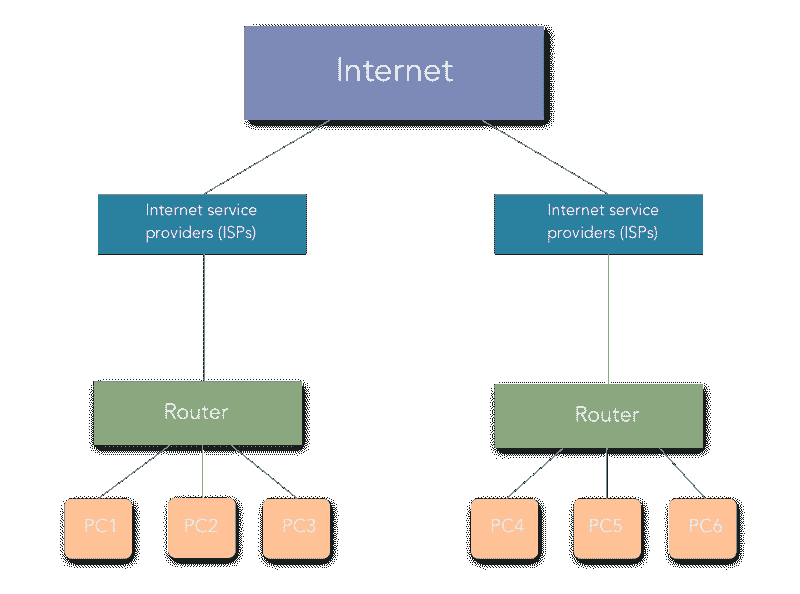
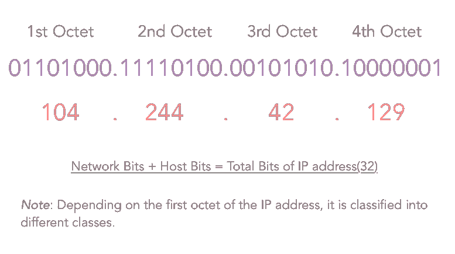
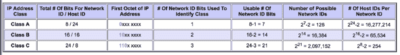
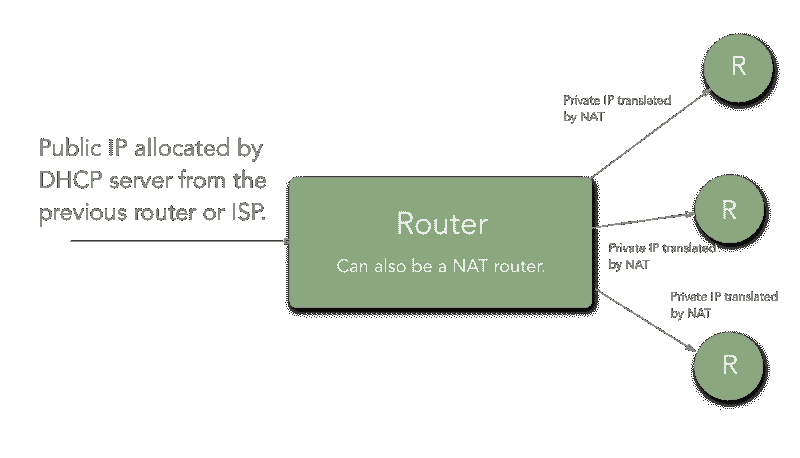
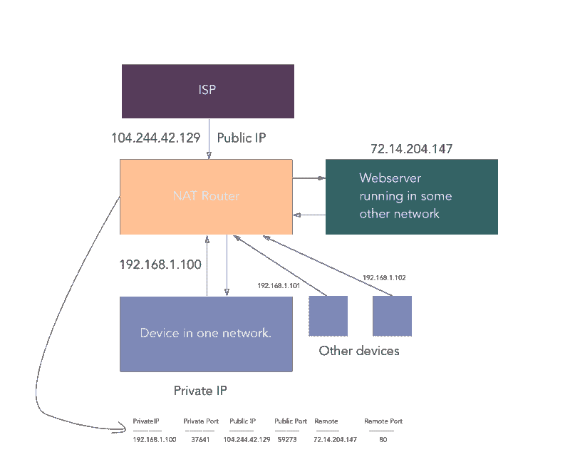
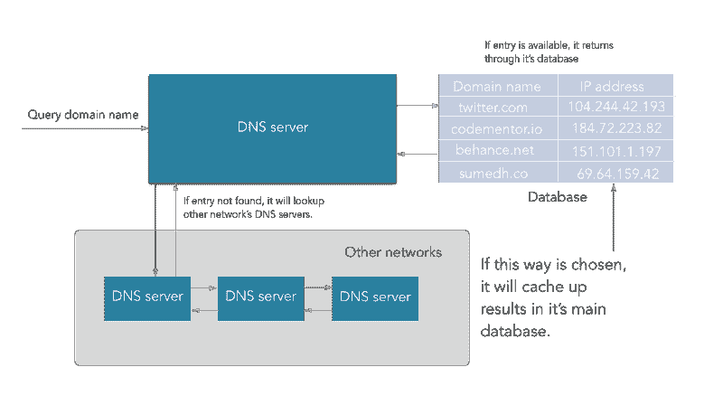
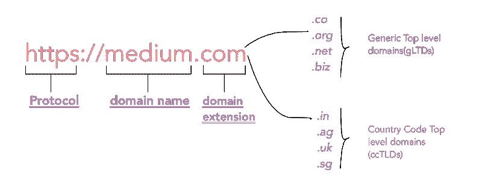
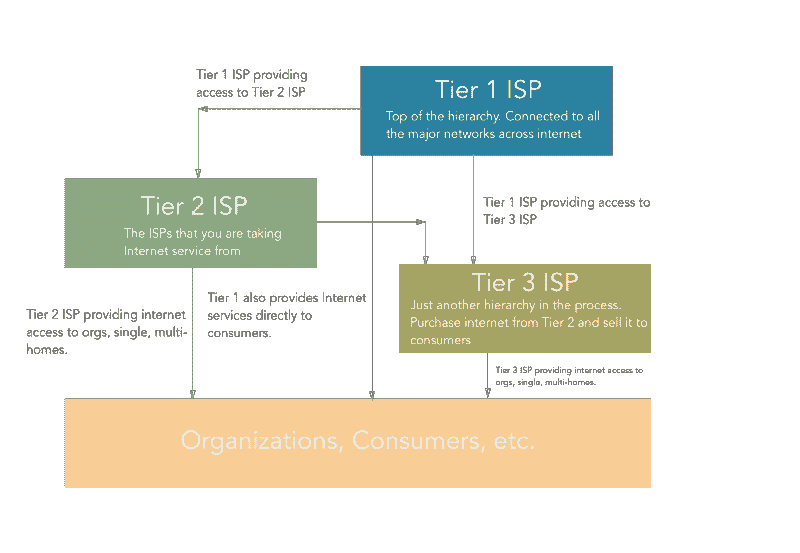
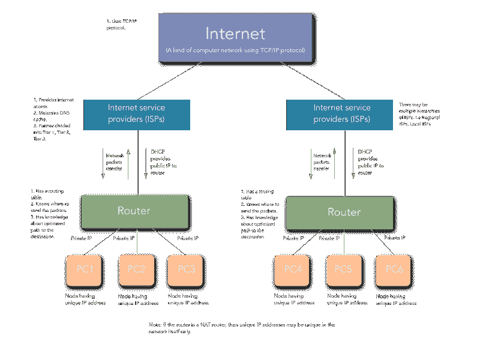

# 什么是计算机网络以及如何真正理解它们

> 原文：<https://www.freecodecamp.org/news/computer-networks-and-how-to-actually-understand-them-c1401908172d/>

作者:苏梅德·尼姆卡德

无论您是开发领域的新手，还是已经开发了很长时间的人，或者即使您只是喜欢计算机和每天使用互联网的人，您都必须了解网络的基础知识，特别是计算机网络。

如果您喜欢深入研究服务器、它们的安全性以及如何从远程客户端连接到服务器，所有这些都需要一些计算机网络及其组件的知识。在这篇文章中，我试图涵盖大多数关于计算机网络的主题。

另外，从这里开始，我将把“计算机网络”简称为“网络”。

让我们先来看看我对计算机网络的工作定义:

> 计算机网络可以被定义为在像电线电缆、光纤等数据线的帮助下，在世界各地的计算机之间交换网络包。

互联网是一种计算机网络。算是吧。



我们将看看一些常用的术语和组件，以及它们在计算机网络中的作用，其中一些在上面的图表中。

### 计算机网络中的常用术语

#### 节点

计算机网络中的节点是指试图通过网络向另一个类似设备发送和接收网络数据包的任何计算设备，如计算机、移动电话、平板电脑等。

#### 网络数据包

网络数据包只不过是源节点想要向/从目的节点发送/接收的信息或数据单元。在本文中，网络包/数据包都传达相同的意思。

#### 互联网协议(IPs)

假设你想在你朋友生日的时候送一份生日礼物给他，你会送去哪里？他们的街道地址对吗？

这里也是如此。早期的计算机科学家想用一个独特的号码来识别互联网上的计算机，就像今天的电话号码一样。因此，他们提出了 TCP/IP 的概念。

计算机设备的 IP 是该设备在计算机网络中的地址。从技术上讲，它是一个 32 位的数字，用于标识网络中的设备。该网络中来自该设备的所有通信都将根据其 IP 地址来完成。

假设你正在上传一个文件到任何一个网站，或者对 Google drive 说。

从网络通信的最底层来说，你的文件被转换成数据包，每个数据包都有目的节点地址，也就是 IP 地址。

在更高的层次上，IP 地址分为两种类型:

*   **IPv4** : IPv4 地址是 32 位(4 字节)，如定义中所解释。IPv4 地址的一个例子是 104.244.42.129**的 IPv4 地址，也就是 twitter.com**的 IP v4 地址。它们使用稳定，因此今天被用来识别世界上的机器。****
*   IPv6:IPv6 地址对这个世界来说是相当新的，基本上是由“:”分隔的八个十六进制数字。IPv6 地址的一个例子是**2001:0cb 8:85a 3:0000:0000:8a2e:0370:7334**。它们不稳定，因此还没有广泛使用。由于 IPv4 的稳定性，网络仍在使用它。由于 IPv6 目前还不稳定，所以无法估计我们何时会开始使用 IPv6。

IPv4 分为五类，即 A 类、B 类、C 类、D 类和 e 类。



Octets in IP address.



Source: tcpipguide.com

**A 类**:如上图第三列所示，对于 A 类 IP 地址，IP 地址的第一个八位字节的第一位是常量，为“0”。

第二列表示相应 IP 地址类别的网络位和主机位。考虑 A 类 IP 地址的情况，我们有以下公式:

**网络/子网数量= `2^(# of network bits)`。**

**每个子网中有效主机的数量= `2^(# of host bits) — 2`。**

网络位数和主机位数由 IP 地址类别的默认子网掩码决定。

A 类 IP 地址的默认子网掩码是 **255.0.0.0，**即`**11111111.00000000.0000000.00000000**` **。**因此，对于 A 类来说:

**网络位数= 8，主机位数= 24。**

*由于网络位= 8* ，*主机位= 24* ，它们的总和必须是 32，因为 IPv4 地址是 32 位。但是，由于我们使用一位(第一个二进制八位数的第一位)来标识类别:

***可用网络位数* =网络位数—常量位数= 8–1 = 7**

*因此，A 类中可能网络的**数目*** **= `2^7 — 2 = 126`** 和，

***A 类中每个网络可能的主机数量(即可以连接到网络的设备)* = `2^24-2 = 16277214`。**

现在，在这里，对于 A 类，你可能想知道为什么我从可能的网络数中减去了额外的 2。这是因为，对于 A 类，127.x.y.z 是保留的。对于其他类，使用通常的公式。

因此，A 类中的 IP 地址范围从`1.x.x.x`到`126.x.x.x`。

**B 类:**B 类的情况与 B 类相似。唯一的区别是第一个二进制八位数的 2 位是常数(10)，它们标识的是 B 类 IP 地址的类别。所有其他计算都是相同的，我在此不再赘述，因为它们很容易从上表中找到。它们的范围从`128.0.x.x`到`191.255.x.x`。

**C 类**:第一个二进制八位数的 3 位是常量(110)，它们将该类标识为 C 类。它们的范围从`192.0.0.x`到`223.255.255.x`。

**D 级和 E 级**:D 级和 E 级用于实验目的。

IPv4 地址主要有两种类型:

*   **静态**:这些 IP 地址是设备随着时间的推移保持不变的地址。例如，我们用来托管应用程序、网站等的远程服务器。在这里，我们使用 ssh 客户机通过 ssh 连接到我们的服务器。
*   **动态**:一般来说，这些是互联网中的普通计算机被分配的 IP 地址。试着关掉你的路由器，你会看到你的电脑的 IP 地址发生了变化！(但只有看完这篇文章？).现在，你可能会想谁分配这些 IP 地址？本文将进一步简要介绍 DHCP(动态主机配置协议)服务器。

**注意**:一个设备可以同时拥有多个 IP 地址。考虑一个连接到两个网络的设备，wifi 以及任何局域网，它将有两个 IP 地址。这意味着 IP 地址被分配给接口，而不是直接分配给计算机。

好的，目前为止还不错。我们继续。

### 路由器

顾名思义，路由器是负责路由数据包的硬件组件。它确定分组来自哪个节点以及发送者节点想要将分组发送到哪个目的地节点。没有一台计算机知道其他计算机的位置，数据包也不会发送到每台计算机。路由器识别网络数据包必须发送到的目的节点地址，并将其转发到所需的地址。

路由器有一个特定的**“路由协议”**，它定义了它们与另一个路由器或网络节点交换数据的格式。换句话说，路由协议定义了路由器如何相互通信。

路由器建立了一个**“路由表”**，它确定了发送数据包时网络中采用的最佳路径。



A Router.

从技术上来说，路由表只是一个包含从一台路由器到另一台路由器的“路由”列表的表格。每条路由都包含网络中其它路由器/节点的地址以及如何到达它们。

```
Routing table:

Destination  Gateway     Genmask        Flags Metric Refs Iface
default      192.168.0.1 0.0.0.0        UG    1024   233  eth0
192.168.0.0  *           255.255.255.0  UC    0      0    wlan0
192.168.0.0  *           255.255.255.0  UH    0      2    eth0
```

上面是一个路由表的例子。这里需要注意的要点是:

*   **目的地:**这是目的地节点的 IP 地址。它指示网络数据包应该在哪里结束。
*   **网关:**网关是连接两个网络的组件。假设您有一台路由器连接到另一台路由器。每台路由器都连接有设备。因此，网络数据包进入另一个网络(比如 R2 的网络)的最后一个路由器(比如这里的 R1)的地址被称为网关。通常，网关只不过是路由器。我再举一个例子:假设你的房间是一个网络，你的隔壁兄弟姐妹的房间是另一个网络，那么两个房间之间的“门”可以被认为是网关。人们有时将"**路由器**称为网关，因为，这就是它们的真实含义，"**通往另一个网络的网关**"。
*   **网络掩码/子网掩码:**就是网络/子网掩码。子网掩码是一个数字，当它与 IP 地址结合使用时，您可以将 IP 空间分成越来越小的块，以便在物理和逻辑网络中使用。子网掩码的计算超出了本文的范围。
*   **旗帜:**不同的旗帜有不同的含义。例如，在第一个路由中，“UG”中的“U”表示该路由是 UP，而“UG”中的“G”表示 GATEWAY。因为路由意味着网关，所以它是通向其它网络的大门。每当我们通过这个路由发送任何数据，它都会被发送到另一个网络。
*   **I 接口(网络接口):**网络接口是指路由表中定义的路由所在的目的计算机所在的网络。也就是说，如果你连接到 Wifi，那么它将是“wlan ”,而当你连接到 lan，那么它将是“eth”。

这就是路由器的工作方式，借助于**路由协议**和**路由表**。

到目前为止一切都好。但是，你一定在想—

“好的！但是，嘿，我们正在这里学习组件。我需要将它们缝合在一起，并了解互联网是如何运作的。”

酷！再多学一些术语，你就会对一切有一个正确的理解。

### 网络地址转换(NAT)

网络地址转换是路由器使用的一种技术，可在较少使用公共 IP 的情况下为更多设备提供互联网服务。因此，ISP 会为路由器分配一个 IP 地址，并将其私有 IP 地址分配给与之相连的所有设备。NAT 帮助 ISP 为更多的消费者提供互联网接入。

因此，如果您连接到家中的路由器，您的公共 IP 将对全世界可见，而私有 IP 则不可见。无论传输什么样的网络数据包，都将通过您的公共 IP 地址(即分配给路由器的公共 IP 地址)进行寻址。



Network address translation (NAT)

考虑上图。假设在您的家庭网络中，您正试图从您的计算机(私有 IP: `192.168.1.100`)访问【medium.com】(远程静态 IP: `72.14.204.147` **)** 。

因此，对于您的计算机，连接看起来像:

`192.168.1.100:37641` → `72.14.204.147:80`。

“37641”是 NAT 路由器分配给设备/电脑的随机端口号。(当在计算机的不同端口上运行的守护程序之间存在网络通信时，NAT 会使用各自的端口)。NAT 路由器为每个出站连接分配一个端口。

连接是在 NAT 中建立的，如下所示:

```
Private IP   |PrivatePort |PublicIP |PublicPort |Remote |RemotePort
------------- ------------ --------- ----------- ------- -----------
192.168.1.100 | 37641 | 104.244.42.129 | 59273 | 72.14.204.147 | 80
```

但是，由于网络的外部世界不知道你的私人地址，对**medium.com**来说，连接看起来像下面这样:

`104.244.42.129:59273` → `72.14.204.147:80`。

这样，我们可以分配更多的 IP 地址，而不会浪费很多公共 IP。

现在，当 medium.com 将响应发送回`104.244.42.129:59273`时，它会一直传送到您的家庭路由器，然后家庭路由器会查找相应的私有 IP 和私有端口，并将数据包重定向到您的设备/计算机。

**注** : NAT 是一个广义的概念。NAT 可以实现为 1:1，1:N，其中 1，N 是网络中 IP 地址的数量。一种称为“IP 伪装”的技术是 1:N NAT。

### 动态主机配置协议(DHCP)

**动态主机配置协议**或 **DHCP** 负责给主机分配动态 IP 地址。如果有一系列路由器可以到达主机，DHCP 服务器由 ISP 或之前的路由器维护。

因此，IP 地址的分配是由 DHCP 服务器执行的。通常，ISP 维护一个 DHCP 服务器，我们家里的路由器从 DHCP 服务器获得一个公共 IP。

**注**:每当路由器或由 ISP 或路由器维护的 DHCP 服务器重新启动时，IP 地址分配再次开始，设备被分配与先前不同的 IP。

### 域名系统/服务器

我们已经讨论过，任何机器都是通过 IP 地址来识别的。

好的，那么你正在你的机器上运行一个 web 服务器。如果您研究过任何 Linux 机器上的主机，您会遇到类似这样的情况:

```
127.0.0.1        localhost
255.255.255.255  broadcasthost
::1              localhost
```

这意味着即使你在浏览器的地址栏中输入`127.0.0.1`，它的意思也和`localhost`一样。

与上面类似，您日常使用的网站是运行在具有静态 IP 地址的远程实例/节点上的 web 服务器。所以，在浏览器的地址栏中输入这个 IP 地址就会带你去那个网站？

是的，肯定会的。但是，你是一个超人，能记住成千上万个网站的 IP 地址吗？

**号**

因此，就有了我们使用的域名，比如 medium.com、twitter.com、behance.net、codementor.io 等等。

> *域名服务器是具有大量域名映射 IP 地址记录的服务器，其搜索域输入并返回你想要访问的网站所在机器的相应 IP 地址。*



Domain Name System (DNS)

**DNS 实际上是如何工作的？**

1.  DNS 由您的 ISP(互联网服务提供商)管理。
2.  当我们在地址栏中输入一个 URL 时，数据包通过您的路由器，可能是多个路由器到达您的 ISP，那里有您的 DNS 服务器。
3.  ISP 处的 DNS 服务器在其数据库中查找该域。如果找到一个条目，它就返回它。
4.  如果在其维护的主数据库中没有找到任何条目，DNS 服务器将通过互联网到达由另一个 ISP 维护的另一个 DNS 服务器，并检查该条目在该另一个 DNS 服务器的数据库中是否可用。除了返回从另一个 DNS 获取的 IP 地址，它还会用这个新条目更新主数据库。
5.  因此，有时(很少)一个 DNS 服务器可能必须遍历多个 DNS 服务器才能获得匹配的条目。
6.  如果在遍历了互联网上的许多 DNS 服务器之后，它没有获得匹配的条目，那么 DNS 服务器会抛出一个错误，指示“域名无效或不存在”。

**注:**

**互联网名称与数字地址分配机构(ICANN)** 是一个代表机构群体管理域名和 IP 地址范围分配的联盟(非盈利机构)。

如下图所示，一个域分为三个部分。



1.  **协议**:用于访问网站的协议，例如 HTTP、HTTPS 等。
2.  **域名**:我们域中的主域名。这可以是 ICANN 注册管理机构提供的任何信息。
3.  **域名扩展**:这是购买域名时被认为很重要的一点。通常，它分为两种类型:

*   **通用顶级域名(gtld)**:这包括最流行的域名扩展，如。com，。组织，。网，。edu。co 等。
*   **国家代码顶级域名(cctld)**:表示该域名与域名扩展中指定的国家代码相关。比如，“。在”表明该网站是起源于印度。此外，一些国家顶级域名要求购买域名的人应该来自同一个国家。大多数小国家代码扩展无法从该国境外进行搜索。

### 互联网服务提供商

互联网服务提供商是为每个人提供互联网的公司。你现在读的这篇文章是因为你的 ISP 提供给你的互联网。

ISP 提供互联网，将您的请求路由到正确的目的地，在他们维护的 DNS 缓存的帮助下解析域名，并处理所有这些使我们能够使用互联网的网络基础设施。



Internet Service Providers (ISP)

ISP 是一个在互联网上工作的等级系统。有特定类型的 ISP，即 1 级、2 级、3 级 ISP。

*   第 1 层 ISP 是连接互联网上主要网络的公司。把它们看作是互联网的主要高速公路。他们几乎连接到互联网上的每一个网络。此外，它们还为第 2 级 ISP 提供互联网接入。前任。CERFNet，UUNet，PSINet。他们也被称为网络服务提供商。这些互联网服务提供商通过[海底的大型电缆](https://www.google.co.in/search?q=ISP+cables+in+sea&source=lnms&tbm=isch&sa=X&ved=0ahUKEwjO6aPV57XdAhUMyrwKHaZvAJAQ_AUICigB&biw=1920&bih=1006#imgrc=gzXVOSE_UDEmAM:)相互连接。
*   **第 2 级(地区)**ISP 主要是向组织、消费者(即“我们”)或第 3 级 ISP 提供互联网服务。您使用的互联网连接来自 2 级 ISP。但是，组织也可以从第 1 级 ISP 获得互联网接入。
*   **第 3 层(本地)**ISP 就像第 2 层一样。这只是从第二层 ISP 购买带宽并出售给消费者的又一个层级。

通过路由器的流量还会经过第 3 层(如果有)、第 2 层，最终通过第 1 层 ISP 到达另一个网络。

呜哇呜！我很高兴你还和我在一起。我们现在要把所有的东西放在一起。

### 把以上所有的东西放在一起

到目前为止，我们已经了解了让一切正常工作所需的所有组件。现在，我们将把它们粘在一起。



A Detailed diagram of a general Computer Network

让我们总结一下我们学到的所有东西:

*   当计算机/设备联机时，它会获得路由器分配的私有 IP。路由器从 ISP 处获得一个公共 IP。
*   网络中的其他设备分配有唯一的私有 IP。
*   ISP 是那些遍布世界各地并相互联系的人。他们向地区和当地的互联网服务提供商出售互联网服务，而我们这些消费者则向他们购买互联网。
*   因此，当一台设备试图与其他网络上的其他设备建立网络连接时，它会使用其网关(路由器)的身份进行连接。然后，路由器将私有 IP 和私有端口号与公共 IP 和随机高整数公共端口号进行映射。
*   然后，路由器将数据包发送到期望的目的地，在那里，其他路由器或网关执行与前一个路由器相同的操作，并分析数据包来自哪台计算机/设备。
*   远程计算机/设备通过发送目的地作为路由器的公共 IP 和公共端口来响应。
*   然后，路由器再次检查私有 IP 和私有端口，并转发网络数据包。

所以，这就是互联网的工作方式，也就是 T2，一种使用 TCP/IP 协议的计算机网络。

感谢您阅读这篇文章。如果你有任何问题，请在下面的评论中提问。

如果你喜欢这篇文章，请给我一些？并与他人分享。下一集见。你真棒！

还有，你是否愿意支持我？

[**给苏迈德·尼姆卡德买杯咖啡——BuyMeACoffee.com**](https://www.buymeacoffee.com/lunaticmonk)
[*大家好，我是苏迈德，我的工作是建造、打破和重建事物。*www.buymeacoffee.com](https://www.buymeacoffee.com/lunaticmonk)

再次感谢您的阅读！请随时在 [Twitter](https://twitter.com/lunatic_monk) 、 [GitHub](https://github.com/lunaticmonk) 上与我联系。