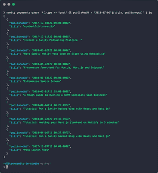
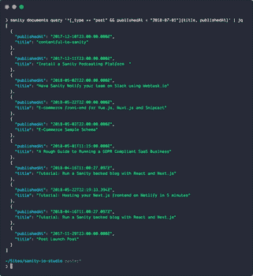
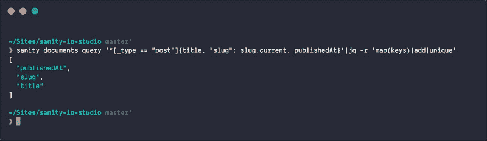
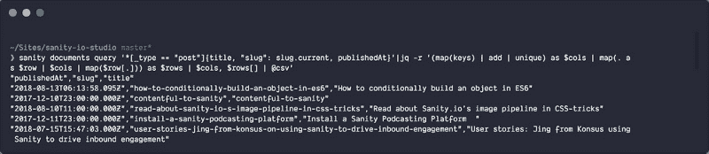

# 如何在命令行中使用 jq 将 JSON 转换成 CSV

> 原文：<https://www.freecodecamp.org/news/how-to-transform-json-to-csv-using-jq-in-the-command-line-4fa7939558bf/>

by Knut Melvær

# 如何在命令行中使用 jq 将 JSON 转换成 CSV


shell 工具 jq 非常适合处理 JSON 数据。它还可以将数据转换成方便的 CSV 文件，满足所有电子表格的需求。

是一个优秀的小工具，它存在于你的终端中，用 JSON-data 做有用的事情。这是一个强大的工具，但对于小事情也很方便。例如，如果您将 JSON 数据通过管道传递给它，它会用语法高亮显示打印出来。默认情况下:

`$ cat some-data.json|jq`

你可以在大多数系统上安装 jq 。(在装有[家酿](https://brew.sh/) / `chocolatey install jq`的 Mac 上，在装有[巧克力](https://chocolatey.org/)的 windows 上)。这篇文章介绍了一种更先进的`jq`技术。如果你想获得基础知识，你应该[查阅教程](https://stedolan.github.io/jq/tutorial/)。

`jq`适用于任何 JSON 源代码。由于我大部分时间都在使用基于 [Sanity.io](https://sanity.io?utm_source=freecodecamp&utm_medium=blog&utm_campaign=jq) 的后端，我将用它作为一个例子。还因为我认为我们可以用这种组合做的事情非常酷。

[Sanity 是结构化内容](https://?utm_source=freecodecamp&utm_medium=blog&utm_campaign=jq)的后端，带有一个实时 API 和一个名为 [GROQ](https://www.sanity.io/docs/data-store/how-queries-work?utm_source=freecodecamp&utm_medium=blog&utm_campaign=jq) 的查询语言。您可以通过 [HTTP](https://www.sanity.io/docs/reference/http-api?utm_source=freecodecamp&utm_medium=blog&utm_campaign=jq) 和 [JS/PHP 客户端](https://github.com/sanity-io/sanity#api-clients)与 Sanity 交互，也可以通过`$ sanity documents query 'GROQ-expression'`与 CLI 工具交互。



Output from sanity.io piped through jq

因此，如果您想要类型为`post`的文档，您可以输入`$ sanity documents query '*[_type == "post"]'`。或者如果你只想要那些出版日期在 2018 年的，那就用`$ sanity documents query '*[_type == "post" && publishedAt > "2018-01-01`“]”。这个查询为您提供整个文档。如果你只是想要标题和出版日期，你可以写`e: *[_type == "post"]{title, published`。



The output from Sanity CLI piped through jq

您也可以在`jq`中从 JSON 数据中挑选出键和值。今天我们将使用它将 JSON 数组中的结构化内容转换成 CSV 文件。因为你的老板想要 Excel 表格里的东西，对吗？坐好，我们开始吧！？‍

假设你想在一个电子表格中列出你的博客条目的标题、段落和发布日期。整个表达式将如下所示:

```
sanity documents query '*[_type == "post"]{title, "slug": slug.current, publishedAt}'|jq -r '(map(keys) | add | unique) as $cols | map(. as $row | $cols | map($row[.])) as $rows | $cols, $rows[] | @csv'
```

你可以复制这个然后用它运行或者在 jqplay.com 上[用它玩，但是让我们看看`jq`里发生了什么-表情:](https://jqplay.org/s/QOs3d_fMLU)

*   `-r`代表`--raw-ouput`,确保输出是没有颜色或特殊格式的普通的旧文本。
*   `(map(keys) | add | unique) as $cols`遍历(`map`)你的对象和`add`的`unique`对象中的键，直到一个名为`$cols`的变量。换句话说，这就是你的列标题是如何制作的。



Map out unique keys to use as column headers

*   `map(. as $row | $cols | map($row[.])) as $rows`获取外部数组中的所有对象，并遍历所有对象键(title、slug、publishedAt)。它将这些值附加到一个数组中，这个数组为您提供了一个包含这些值的数组，这就是您在将 JSON 转换为 CSV 时所需要的。
*   `$cols, $rows[] | @csv`首先将列标题放入数组，然后将每个数组通过管道传输到`@csv`转换为行，这将输出格式化为… csv。



The final result

这个命令在 shell 中打印出结果。如果你想把它直接写到一个文件中，你可以把`> filename.` csv 附加到它上面，或者，比如，附加到剪贴板上(如果你在 macOS 上，通过管道把它`to | pbc` opy)。或者也许你会在 pan das 中用 csv [做一些令人兴奋的事情？？用 Python？](https://pandas.pydata.org/)

如果你觉得这很有用，我们很乐意在评论区听到关于它的一切！

如果你想尝试 Sanity.io，你可以去[sanity.io/freecodecamp](https://sanity.io/freecodecamp?utm_source=freecodecamp&utm_medium=blog&utm_campaign=jq)获得一个升级的免费开发者计划。✨

*最初发表于 [sanity.io](https://www.sanity.io/blog/exporting-your-structured-content-as-csv-using-jq-in-the-command-line?utm_source=freecodecamp&utm_medium=blog&utm_campaign=jq) 。*