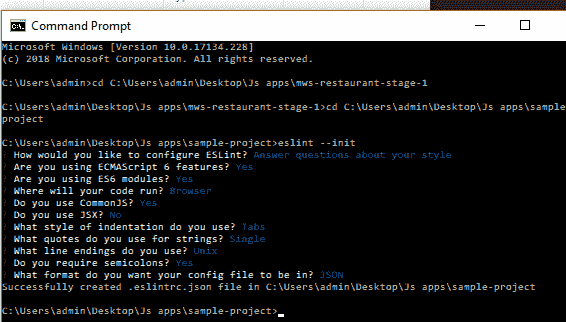
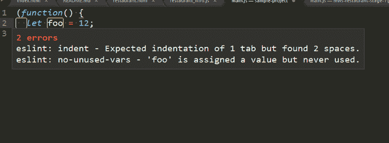

# 如何在崇高中摆脱你的烦恼

> 原文：<https://www.freecodecamp.org/news/how-to-lint-away-your-troubles-in-sublime-c448a8896cf7/>

阿卜杜勒·卡迪尔

# 如何在崇高中摆脱你的烦恼


Sublime!

Sublime 是一个轻量级文本编辑器，在许多 web 开发人员中非常流行。现在我知道市场上有许多复杂的 ide，包括智能感知、代码完成等等。但是这篇文章是写给那些忠于他们最喜欢的文本编辑器的人的！所以如果你在你的项目中使用 Sublime，那么你可能会享受到它提供的一些漂亮的特性。林挺是其中之一。

让我们从定义术语“林挺”开始。

> 林挺是检查代码中潜在错误的过程。这可能是语法或代码风格。

林挺过程可以在三个发展阶段完成:

1.  通过你的编辑(现场林挺)
2.  在构建过程中
3.  在版本控制中使用预提交挂钩

在本帖中，我们将在编辑器中探索真实的林挺。有很多流行的 JavaScript 代码，比如 JSHint、JSCS 和 ESLint。我将使用 ESLint，因为 ESLint 支持 ES6 代码，高度可扩展，并且非常易于使用。如果你感兴趣，你可以在这里查看不同棉绒的对比！

### 第一步

您需要首先安装 ESLint npm 软件包。该命令如下所示:

```
npm install -g eslint
```

'-g '选项用于在全局上安装软件包。如果尚未安装“npm ”,请安装它。Sublime 会打开一个文件，要求你下载另外两个插件。你需要使用 Sublime 的包控制来安装这些插件。

使用 command/ctrl + shift + P 打开包控件，并选择“包控件:安装包”选项。然后下载这两个插件。

1.  升华线-升华线
2.  上标-下标-下标

SublimeLinter 是提供林挺的框架。它不支持不同的语言。特定语言的 Linter 必须单独安装。

Sublime-contrib-eslint 插件充当 eslint 和 SublimeLinter 之间的接口。如果你在任何地方卡住了，你可以在他们的[主网站](http://www.sublimelinter.com/en/latest/installation.html)上检查安装程序。

成功安装插件后，您需要重置编辑器以使更改生效。现在我们将看到 ESLint 的实际应用！

### **第二步**

唷！那些是很多装置。现在，你终于可以感受一下林挺的魅力了！在 Sublime 中打开你的文件，看看它的威力…但是等一下，什么也没发生。这是为什么呢？不要烦恼。您已经正确地安装了所有的东西，但是 ESLint 本身并不做任何事情。您需要提供基本的配置，这是一个非常简单的过程。方法如下:

1.  启动项目主目录中的终端程序
2.  键入以下命令

```
eslint --init
```

会出现一个提示，询问您一些关于您的编码偏好和一个。“eslintrc”文件已为您生成。该文件包含您刚刚选择的规则。如果您愿意，可以添加额外的配置。



Before Starting ESLint



ESLint in Action

正如你所看到的，ESLint 抱怨缩进，抱怨 foo 变量没有在任何地方使用。你可以通过将鼠标悬停在代码突出显示的部分或者检查 Sublime 底部状态栏中的消息来检查任何错误或警告。

原来如此！我希望你能跟上。林挺是一个非常酷的检测代码错误的工具。它确保您始终遵循代码指南并编写干净的代码。我希望这篇文章对你有所帮助，一如既往，祝你编码愉快！